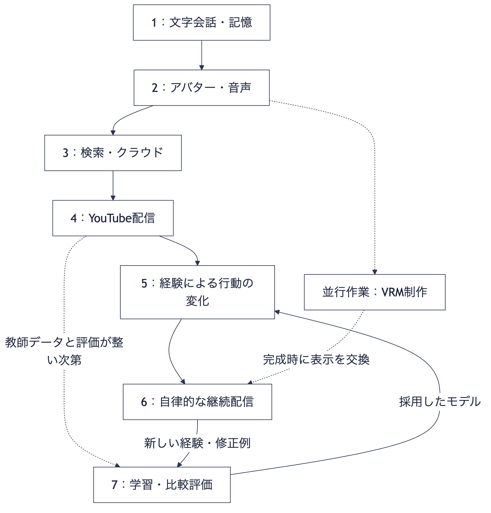

# AI VTuberシステム：開発フェーズ

本書は、文字会話の最初のMVPから、経験を記憶・行動へ反映しながら継続的にYouTube配信するAIキャラクターまでの開発計画です。

## 1. 最終ゴールと開発方針

同じ人格と記憶を持つキャラクターが、普段は開発者と会話し、YouTubeでは自分から話題を出して視聴者と交流し、その経験を次の行動に反映することを目指します。

- 開発環境：Apple M1 Max、メモリ64GBのMac。
- バックエンド：Python／FastAPI。
- フロントエンド：React／TypeScript。
- ローカル推論：Ollama。将来、MLX-LMによる学習も追加。
- 最新情報・難しい分析：必要時に検索・クラウドLLMを利用。
- アバター：用意済みの画像から始め、VRM制作は並行して進める。
- 配信先：YouTube。Discordは使用しない。

最初に会話と記憶の土台を作り、音声・検索・配信を追加します。実際の会話データから失敗例を見つけ、人格の変化・自律性・モデルの振る舞いを改善します。

各フェーズは「動くもの」と「完了条件」を持ちます。単に次の機能を追加するだけでなく、前のフェーズの会話・記憶が引き続き機能することを確認します。

## 2. フェーズ一覧

| フェーズ | 到達する状態 | 主な成果物 |
| --- | --- | --- |
| 1：文字会話MVP | 性格があり、以前の会話を覚えている | 文字チャット、基本人格、記憶の保存・検索・訂正 |
| 2：アバターと音声 | 自分の画像のキャラクターと声で会話できる | PNG表示、録音、音声認識、音声合成、字幕・口パク |
| 3：検索・クラウド連携 | 最新情報を調べ、難しい質問で外部の助けを使える | 検索、出典表示、クラウド接続、利用上限 |
| 4：YouTube配信MVP | 視聴者コメントに反応する配信ができる | コメント取得・選択、発話キュー、配信画面、OBS連携 |
| 5：経験による振る舞いの変化 | 過去の経験が話題・関係性・目標に現れる | 振り返り、状態更新、関係性、比較評価 |
| 6：自律的な継続配信 | 自分で話を進め、定期的に活動できる | 話題計画、行動選択、配信前調査、障害復旧 |
| 7：ファインチューニング | キャラらしい応答や会話の進め方をモデル側でも改善する | 教師データ、LoRA学習、評価、モデル管理 |

フェーズ7は、フェーズ6の完成を待たず、必要なデータと評価方法が整った時点で実施できます。学習は運用と並行して繰り返す改善工程であり、自律配信の必須条件ではありません。

VRMへの交換は図のフェーズ6に限らず、モデルが完成した任意の段階で行えます。PNGのまま配信・人格の検証を進められます。

## 3. フェーズ1：文字会話MVP

### 目的

設定した性格で会話し、再起動後も過去の経験を使って答えられる状態を作ります。

### 実装内容

1. Reactに会話欄と入力欄を作り、FastAPIへ送信する。
2. FastAPIからOllamaを呼び、返答を画面に表示する。
3. 基本の人格設定を用意する。例：明るく親しみやすいお嬢様、知らないことは質問する、発言を短めにする。
4. SQLiteへ会話履歴を保存する。
5. 会話終了時に長期記憶の候補を抽出し、画面で確認して保存する。
6. 相手・時刻・話題のキーワードで関連する記憶を取り出し、次の返答に渡す。
7. 記憶一覧・訂正・削除の操作を付ける。

### 使用技術

React、TypeScript、Vite、FastAPI、Uvicorn、Pydantic、Ollama、公式Python SDK、SQLite、SQLAlchemy、aiosqlite、Alembic。推論にはQwen3.5 9Bを思考出力なしで使います。

### 完了条件

- 設定した口調で日本語の返答が返る。
- アプリの再起動を越えて、以前の会話内容を返答に利用できる。
- 誤った記憶を訂正でき、次の返答に訂正内容が反映される。
- 参照した記憶と根拠の会話を開発者が確認できる。

### 確認例

1回目に「写真を撮るのが好き。次は山で撮った写真の話をしよう」と伝え、記憶を保存します。再起動後に「前に何を話す約束をしたっけ？」と尋ね、約束を踏まえて答えるか確認します。

この段階から、入力、返答、参照した記憶、モデルの版、設定、応答時間、修正した理想の返答を保存します。音声や3Dの完成を待たず、人格・記憶の検証を始めます。

## 4. フェーズ2：アバターと音声

### 目的

用意した画像のキャラクターと、マイクを使って交互に会話できるようにします。

### 実装内容

1. OnAirのReact PNGテンプレートの表示部分を参考・再利用する。
2. テンプレートの会話処理をFastAPIとの通信に差し替える。
3. FastAPIからVOICEVOX Engineを呼び、生成音声をブラウザで再生する。
4. 音声に合わせた口パクと字幕を追加する。
5. 録音ボタンを作り、必要な形式に変換した音声をwhisper.cppに渡す。
6. 文字起こしを、フェーズ1と同じ入力受付へ送る。
7. 録音から応答開始までの時間を測り、待ち時間の大きい部分を確認する。

### 使用技術

OnAirの表示コード、ブラウザの録音・音声再生機能、FastAPIのHTTP／WebSocket、HTTPX、VOICEVOX Engine、whisper.cpp。録音形式の変換が必要ならFFmpegを利用します。

### 完了条件

- マイク入力から文字起こし、返答生成、音声再生まで一通り動く。
- 文字入力と音声入力が同じ人格・記憶を利用する。
- 返答を重複再生せず、停止操作で音声を止められる。
- 音声の認識結果と字幕を確認できる。

最初は静止画でも進められます。口パク・まばたきには口と目の開閉差分を用意します。基本動作が安定してから、常時音声入力や自然な割り込みを追加します。

## 5. フェーズ3：検索・クラウド連携

### 目的

最新情報を検索し、難しい質問に対して必要に応じてクラウドLLMを利用できるようにします。

### 実装内容

1. 「調べて」操作からWeb検索・公式情報APIを呼ぶ。
2. 出典URL、取得日時、確認した事実を保存し、画面に表示する。
3. 検索結果を人格・記憶と一緒にローカルLLMへ渡す。
4. 難しい分析を手動でクラウドへ回せるようにする。
5. 「最新」「今日」などの質問を検索へ回す条件を追加する。
6. 出典中の数字・固有名詞と返答の整合を検査する。
7. 検索・クラウドの利用量、応答時間、上限を管理する。
8. タイムアウト・接続失敗・確認不能時の返答を用意する。

### 使用技術

自作Pythonの振り分け処理、HTTPX、Ollama Web Search APIなど、Anthropic Python SDK、Claude API、SQLite。

### 完了条件

- 時点に依存する質問に対し、検索した根拠を使って回答できる。
- 根拠を確認できないときは、未確認であることを伝えられる。
- クラウドの分析結果を使っても、基本の人格・記憶を維持する。
- 検索やクラウドが停止しても、通常のローカル会話は継続できる。
- 利用上限が機能し、使用量を確認できる。

クラウドJudgeは必要な場面から追加します。全返答への常時適用を初期条件にせず、どの失敗に効果があるかを評価します。

## 6. フェーズ4：YouTube配信MVP

### 目的

視聴者コメントに反応するアバター配信を、限定公開で実施できるようにします。

### 実装内容

1. YouTube APIでコメントを取得する。
2. ローカル入力と共通のイベント形式に変換する。
3. 重複・古いコメントを整理し、返答対象を選ぶ。
4. asyncio.Queueで発話順序を管理し、音声の重複を防ぐ。
5. 配信モードを追加し、公開可能な記憶を参照する。
6. 開発用操作画面と、視聴者に見せる画面を分ける。
7. OBSで映像・音声を取得し、YouTubeへ配信する。
8. 生成、待機中の発話、音声再生をまとめて止める操作を実装する。

### 使用技術

YouTube Live Streaming API、HTTPX、自作Pythonのコメント選択、asyncio.Queue、FastAPI、React、OBS Studio。

### 完了条件

- 限定公開配信でコメント取得から返答・音声再生まで動く。
- コメントが連続しても発話が重ならず、古い返答が延々と残らない。
- 停止後に遅れて届いた生成結果が勝手に再生されない。
- API接続切断や取得失敗から復帰でき、再取得で重複応答しない。
- 非公開の記憶が配信に混入しない。
- 視聴者側で映像と音声を確認できる。

ポーリング取得ではAPIのpollingIntervalMillisに従います。音声化前の出力検査を通し、必要な利用条件・配信設定を確認して運用します。

## 7. フェーズ5：経験による振る舞いの変化

### 目的

覚えたことを返答に引用する段階から、経験が次の話題・質問・目標に反映される段階へ進めます。

### 実装内容

1. 出来事、相手について知ったこと、約束、キャラクターの受け止め方を分けて整理する。
2. 基本の性格、興味・好み、相手との関係、目標、一時的な気分を別の状態として管理する。
3. 会話・配信後の振り返りで更新候補を生成する。
4. 更新候補を開発画面で比較・採用・保留できるようにする。
5. 更新前後を同じ会話例で比較する。
6. 採用した状態を、次の質問や話題選びに利用する。
7. 変更履歴と根拠を保存し、元の状態へ戻せるようにする。

### 状態の分け方

| 要素 | 更新方針 |
| --- | --- |
| 基本の性格・価値観 | 基準として維持し、変更は慎重に評価 |
| 興味・好み | 関連する経験を重ねることで更新 |
| 相手との関係 | 共同の経験、約束、相手について知った内容を反映 |
| 現在の目標 | 会話・配信の結果を振り返って更新 |
| 一時的な気分 | 直近の出来事に反応し、長期的な性格と区別 |

### 使用技術

自作Pythonの状態管理・振り返り・評価、Pydantic、SQLite、Ollama。難しい矛盾の整理や大量の評価に必要ならクラウドLLMを利用します。

### 完了条件

- 過去の経験を踏まえて、自分から関連する質問や話題を出せる。
- 行動の変化を、根拠となる経験や状態更新まで追える。
- 誤った経験・推測を訂正できる。
- 興味や関係性が変化しても、基本の人格が意図せず崩れない。
- 変更が悪化を招いた場合、前の状態に戻せる。

例として、写真の話を重ねた後、次の会話でキャラクターから撮影について質問するか確認します。更新の自動化は、評価できる範囲から徐々に進めます。

## 8. フェーズ6：自律的な継続配信

### 目的

開発者が毎回指示しなくても、キャラクターが話題と行動を選び、予定した配信を進められるようにします。

### 実装内容

1. 配信前に話題候補を調査し、出典・日時付きで保存する。
2. 現在の話題、視聴者の反応、キャラクターの目標から次の行動を選ぶ。
3. 「答える」「質問する」「話題を変える」「待つ」を扱えるようにする。
4. コメントが少ない時間の独り言と、コメントが来た際の切り替えを実装する。
5. 同じ話の繰り返し、約束の忘却、話題の唐突な変更を評価する。
6. 再接続、途中停止、再起動、配信終了後の振り返りを整える。
7. 短い配信から、安定して進められる時間を伸ばす。

### 使用技術

自作Pythonの行動選択・状態管理・運用処理、FastAPI、SQLite、Ollama、必要時の検索・クラウド、YouTube API、OBS Studio。

### 完了条件

- コメントが少なくても、同じ内容を延々と繰り返さずに話を進められる。
- コメントが来た際に、現在の話題と自然に調整できる。
- 想定した配信時間を、大きな手動介入なく進められる。
- 障害時に状況を記録し、停止・復旧ができる。
- 費用、待ち時間、繰り返し、記憶の利用を継続的に確認できる。

自律的な活動と、人格更新の完全自動化は別に進めます。配信が自律化しても、基本人格の変更を開発者が確認する運用は維持できます。

## 9. フェーズ7：ファインチューニング

### 目的

実際の失敗例と理想の返答を使い、口調、反応の傾向、会話の進め方をモデル側でも改善します。

### 開始条件

- 良い応答・修正した理想の応答が蓄積している。
- 何を改善するかが明確になっている。
- 学習に使わない評価データを確保できる。
- 対象モデルの学習・出力・推論への接続方法を確認できる。

### 実装内容

1. 会話ログから学習に使う例を選別し、JSONLへ出力する。
2. 学習用・検証用・評価用に分け、類似例の混入に注意する。
3. 元モデルと設定を固定し、MLX-LMで小規模なLoRA／QLoRA実験を行う。
4. 学習前後を、学習していない会話例で比較する。
5. 口調だけでなく、事実への忠実さ、記憶利用、検索・ツール利用も確認する。
6. 対応形式でOllamaへ取り込むか、MLX-LMで推論する。
7. モデルの版と評価結果を保存し、採用・差し戻しを可能にする。

### 使用技術

Pythonのデータ整形・評価処理、JSONL、MLX-LM、LoRA／QLoRA、OllamaまたはMLX-LMによる推論。

### 完了条件

- 未学習の会話でも、狙った振る舞いが改善する。
- 元の能力や根拠への忠実さに大きな劣化がない。
- 運用環境で推論でき、品質と応答時間を比較できる。
- 問題があれば以前のモデルに戻せる。

学習はFastAPIのリクエスト処理から分離し、初期運用では会話・配信を停止して実行します。モデル変換には互換性の制約があるため、少量データで一通りの接続実験を先に行います。この実験だけなら、フェーズ7より前に実施できます。

個々の視聴者との記憶はDB、最新情報は検索で扱います。ファインチューニングにすべての役割を移しません。

## 10. 並行して進める作業

| 作業 | 開始時期 | 進め方 |
| --- | --- | --- |
| PNGの差分制作 | フェーズ2に向けて | 静止画で先に動かし、口・目の開閉差分を追加 |
| VRM制作 | フェーズ2以降 | 会話システムと並行し、完成した段階で表示を交換 |
| 理想の返答の収集 | フェーズ1から | 気になる応答を直し、入力・記憶・設定と一緒に保存 |
| 評価用会話の整備 | フェーズ1から | 記憶、人格、根拠、繰り返しなどの観点で用意 |
| 学習・変換の接続確認 | モデル候補が決まり次第 | 少量データで学習から推論まで確認 |

## 11. 最初に着手する範囲

最初の実装範囲は、フェーズ1の以下に絞ります。

1. Reactの文字チャット画面。
2. FastAPIからOllamaへの接続。
3. 基本の人格設定。
4. 会話履歴と長期記憶の保存。
5. 再起動後の記憶検索。
6. 記憶の確認・訂正と、理想の返答の記録。

この土台を完成させた後、フェーズ2で画像と音声を接続します。所要期間は、初期モデルの応答速度と音声・表示の接続結果を確認してから見積もります。
