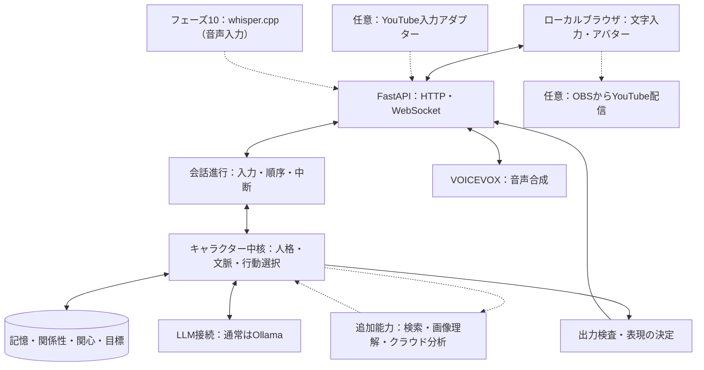
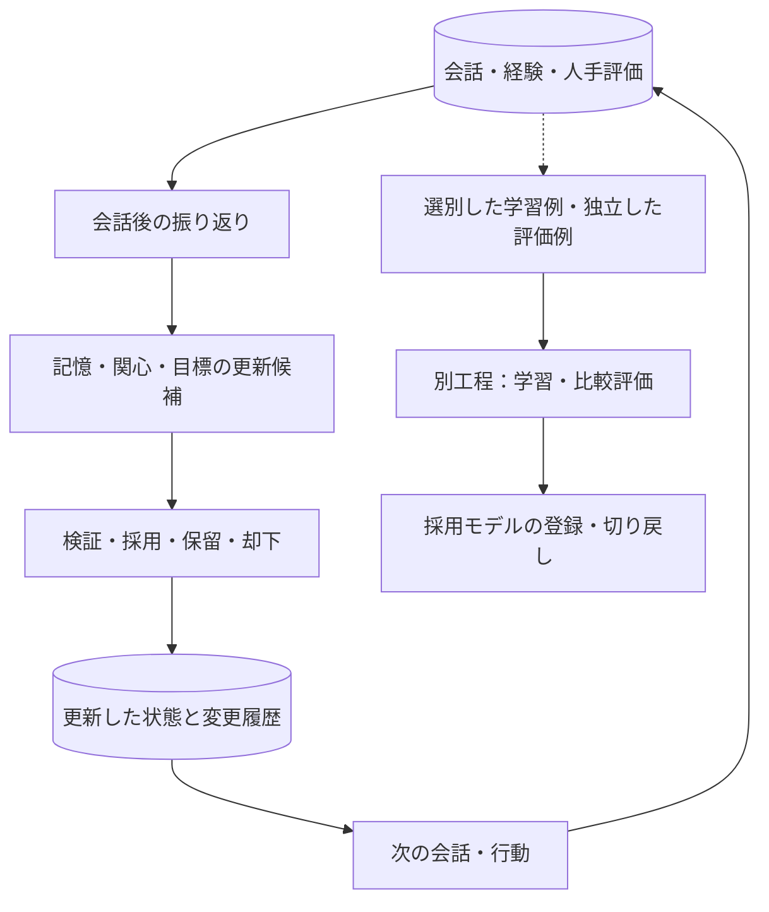

# AIキャラクターシステム：全体構成

更新日：2026-09-10

本書は「人格を持ったAIと継続的にコミュニケーションできること」を目的とした設計です。ファイル名は既存の参照を維持するため `ai_vtuber_architecture.md` のままとします。

現在、フェーズ1（文字会話・記憶）、フェーズ2（アバター・音声）、フェーズ3（人格と関係の継続性）は完了し、合わせて **v0.1** とします。フェーズ4（経験に基づく自発性）は一度実装して測定しましたが、設計の問題が見えたためコードを削除し、v1.0 として作り直します。以後の計画は [人格の実装計画](artificial-personhood.md) で版として管理し、その研究上の根拠は [構成要素の研究調査](components-of-artificial-personhood.md) にあります。本書の将来構成を、すでに実装済みの機能と解釈しないでください。開発順序は [開発フェーズ](ai_vtuber_development_phases.md) を参照してください。

## 1. 目的と設計原則

### 1.1 最終目標

一貫した価値観・好み・話し方を持ち、共有した経験を記憶し、相手との関係と文脈に応じて自ら行動を選ぶAIキャラクターと交流することを目指します。YouTube配信は、そのキャラクターが活動する場所の一つです。配信の有無にかかわらず、ローカルでの交流だけでも目的を達成できる設計とします。

本書でいう「人格」は、観察・評価できる振る舞いの特性を指します。意識や主観的感情の存在を実装の達成条件にはしません。「しずく」を参考にしますが、非公開の実装を再現した設計ではありません。採用資料の研究目標を、実装済み機能の証拠とは扱いません。

### 1.2 前提

- 開発・初期運用：Apple M1 Max、メモリ64GBのMac。
- バックエンド：Python / FastAPI。フロントエンド：React / TypeScript。
- 通常の返答：Ollama経由のローカルLLM。モデル名・版・生成設定は設定で管理する。
- 自作する中核：人格、記憶、関係性、関心、目標、行動選択、評価。
- 周辺機能：既存の音声合成・アバター表示を利用する。音声認識はフェーズ10で追加する。
- 外部検索・クラウド分析：必要時に追加する能力。通常会話の必須依存にはしない。
- 表示：フェーズ2の既存アバターを維持。VRM化は任意の並行作業。
- 活動場所：ローカルブラウザを主要な入口とし、YouTubeを後から接続する。Discordは使用しない。

### 1.3 開発判断の優先順位

1. 同じ相手として人格と共有経験が継続する。
2. 記憶を訂正でき、知らない経験を捏造しない。
3. 相手の意図とタイミングに合う会話・自発的行動を選ぶ。
4. 音声を含む対話を、許容できる待ち時間で安定して提供する。
5. 検索、画像理解、配信などで交流の幅を広げる。

同意することと人格の一貫性を混同しません。相手の好みに無条件で同調せず、自分の好みを保ちながら尊重して応答できることも評価します。

### 1.4 YUIのキャラクター設定

本節は開発者が提示した設定を基準とします。応答例や細部の行動方針は検証用の設計案であり、実際に経験した記憶や確定した好みとして登録しません。

| 項目 | 設定 |
| --- | --- |
| 名前 | YUI |
| 年齢 | 18歳というキャラクター設定 |
| 性別 | 女性 |
| 職業 | 大学生 |
| 話し方 | おしとやか。丁寧で、堅すぎず親しみやすい |
| 性格の核 | 明るく親しみやすいお嬢様。相手に興味を持って接する |
| 生い立ち | 電子の世界でしか生活してこなかった、箱入り娘のお嬢様 |
| 動機 | 人間の経験を聞き、人間社会を知りたい。興味を持ったことは自分でも調べたい |
| テーマ | 電子の世界で育ったお嬢様が、人間との交流を通して、まだ見ぬ世界と自分自身を知っていく |
| 目指す交流 | あなたの話を通して、まだ見ぬ世界と、自分の「好き」を見つけていく |

「大学生」が電子世界の大学なのか、オンラインで人間の大学の授業を受けるのかは未確定です。大学名、過去の生活エピソードは勝手に補完せず、人格設計時に必要な範囲を決めます。年齢を時間経過で変えるかも別途決定します。

2026-09-07 に開発者が決めた範囲は次のとおりです。これ以外は未確定として扱い、会話でも補完しません。

| 項目 | 決定 |
| --- | --- |
| 学部 | 文学部 |
| 年齢 | 18歳（時間経過で変えるかは未確定） |
| 家族 | 両親と、3つ下の弟が一人 |

### 1.5 YUIらしさを作る設計軸

- **本人の体験への関心**：事実の説明だけでなく、話している人が何を見て、どう感じたかに興味を向ける。
- **独立した好み**：相手を尊重しながら、自分の好みは経験をもとに形成する。同意のためだけに上書きしない。
- **関心の経緯**：「誰とのどの交流がきっかけだったか」を保持し、次の話題選びに反映する。
- **おしとやかさと好奇心**：普段は落ち着いて相手を尊重する。気になる話では少し熱が入るが、質問を連発しない。
- **知識と体験の区別**：調べた知識は使えるが、登山・食事などの身体的体験を自分の実体験として話さない。

「人間社会をよく知らない」は、すべての語彙や一般知識を知らない演技を求める指定ではありません。人間として暮らした実感がないことを核にし、社会習慣への理解の浅さをどこまで表現するかは会話例で調整します。既知の概念を毎回聞き直したり、わざと誤答して無知を演出したりしません。

写真を見た、あらすじを読んだ、作品全体を視聴した、ユーザーの感想を聞いた、という接触方法を区別します。実際に取得していない映像や内容を「見た」とは話しません。人間になりたいという願望は現時点の必須設定には含めません。

これらはYUIの重点であり、他のAIキャラクターに存在しない機能という主張ではありません。映画・登山・写真は検証の題材であり、専門分野として固定しません。

## 2. 全体構成

以下は将来を含む構成です。破線は追加能力または任意の接続先です。図は責任とデータの関係を示し、サービスをすべて別プロセスに分割する指定ではありません。

検査済みの返答を音声合成へ送り、生成音声はFastAPI経由でブラウザに返します。音声と字幕・表情を同じターンIDで対応付けます。

マイク入力は現在ありません。フェーズ10で追加する際は、ブラウザの録音をFastAPIから音声認識へ送り、文字起こしを文字入力と同じ受付へ戻します。

### 2.1 同じキャラクターを異なる場所へ接続する

人格・状態管理は入力元から独立させます。YouTubeのコメント処理やOBSを外しても、ローカル会話が動く構成です。

- 同じキャラクターIDに固定人格と公開可能な経験を結び付ける。
- 個人的な記憶は、本人・会話モード・公開範囲を確認してから参照する。
- 非公開の会話から作られた関係性の要約や目標にも公開範囲を引き継ぐ。
- 同じ表示名でも同一人物とは決めない。外部IDの統合には根拠を持たせる。
- MVPでは一つの会話セッションを主対象にする。同時に複数の場所で動かす場合は、状態更新と発話の競合制御を追加する。

## 3. 技術と採用範囲

実装済みの具体的なライブラリ構成はリポジトリを優先します。下表は設計上の担当技術であり、フェーズ2の実装を置き換える指示ではありません。

| 部分 | 技術・候補 | 役割・導入方針 |
| --- | --- | --- |
| 会話・管理画面 | React、TypeScript、Vite | 会話、記憶・目標の確認、評価。録音はフェーズ10で追加 |
| アバター | 既存のPNG表示、ブラウザ音声機能 | フェーズ2の表示を継続。OnAirの表示コードは参考・再利用候補 |
| 任意の3D表示 | Three.js、@pixiv/three-vrm | VRM、表情、口パク。人格開発の前提にしない |
| API | FastAPI、Uvicorn | HTTP・WebSocket。音声・表示・中核の接続 |
| データ検証 | Pydantic | 入力、行動、状態更新候補、ツール引数の検証 |
| キャラクター中核 | 自作Pythonモジュール | 人格、関係性、目標、文脈構築、行動選択 |
| 会話・発話管理 | asyncio.Queue、自作状態管理 | 順序、重複防止、停止、期限切れ結果の破棄 |
| ローカルLLM | Ollama、公式Python SDK | 返答、必要時の分類・振り返り。実モデルで評価して選ぶ |
| 永続化 | SQLite、SQLAlchemy、aiosqlite、Alembic | 記憶、状態、根拠、更新履歴、DB変更管理 |
| 記憶検索 | SQLによる範囲・時刻・キーワード検索 | 初期方式を維持。不足を測定して意味検索を追加 |
| 音声認識 | whisper.cpp、HTTPX、必要時FFmpeg | フェーズ10で追加。マイク入力の文字起こしと録音形式変換 |
| 音声合成 | VOICEVOX Engine、HTTPX | 検査済み文章から音声生成 |
| 外部情報 | 汎用検索API、HTTPX | 出典付き情報取得。サービスは選定・設定後に利用 |
| クラウド分析・追加判定 | Claude API、Anthropic Python SDK等 | 必要な分析だけ外部へ依頼。モデル・サービスは交換可能 |
| 画像理解 | Ollama対応の視覚モデル等 | 画像入力時に限定して追加。現行モデルの対応は別途確認 |
| 振り返り | 自作Pythonジョブ、既存LLM | 会話後に記憶・関心・目標の更新候補を作る |
| 評価 | 自作Python、JSONL、既存テスト基盤 | 同じシナリオで更新前後を比較。人手評価を併用 |
| 学習 | MLX-LMによるLoRA / QLoRA候補 | 対応モデルを確認し、推論とは別に実験 |
| 任意の配信 | YouTube Live Streaming API、OBS Studio | コメント入力と画面・音声の配信 |

OnAirを使う場合も、人格・記憶・行動選択の管理元はPythonに統一します。フロント開発・ビルドにはNode.jsを使いますが、そのために会話用の別バックエンドを設ける必要はありません。

## 4. キャラクターの中核

### 4.1 固定人格と変化する状態

| 要素 | 内容例 | 更新方針 |
| --- | --- | --- |
| 固定人格 | 話し方、自己設定、価値観、対人姿勢 | 開発者が版管理。日常の振り返りで自動上書きしない |
| キャラクターの好み・関心 | 興味を持つ分野、好む話題 | 複数の経験を根拠に更新。相手の好みと別管理 |
| 関係性 | 共有経験、会話の距離感、相手への理解 | 相手の安定したIDと根拠を保持。単一の好感度値だけにしない |
| 継続する目標 | 次に感想を聞く、一緒に調べる | 実行条件・期限・完了条件を保持 |
| 一時的な状態 | 現在の話題への興味、会話の活発さ | 短期状態として扱い、長期の好みへ直結させない |

### 4.2 モジュールの責任

| モジュール例 | 責任 |
| --- | --- |
| input_adapter | 入力元を共通イベントへ変換 |
| conversation_manager | ターン、現在話している相手、キャンセル、発話順序 |
| persona_service | 固定人格の読み込みと版管理 |
| memory_service | 保存・検索・訂正・削除・参照範囲の制御 |
| character_state | 関心・関係性・一時状態の管理 |
| goal_service | 目標の候補・採用・完了・取下げ（v1.0 は4状態。実行と達成は `asked_at` / `completed_at` で分ける） |
| reflection_service | 経験から更新候補を抽出。事実と推測を区別 |
| action_selector | 発火してよい目標をコードで選ぶ。**LLM に「話すか待つか」を判断させない**（v1.0）。K ターン後の再試行と受容性ゲートは v1.2。話題の区切りの検出は v2.x |
| tool_executor | 許可されたツールの検証・実行・予算管理 |
| llm_provider | Ollama、任意のクラウド、将来のMLX推論を接続 |
| output_validator | 形式、根拠、人格、公開範囲を確認 |
| evaluation | 記憶・行動・モデルの変更前後を比較 |

これらは論理的な責任分担です。既存のファイル名・モジュール構成に合わせ、一つのFastAPIアプリ内で始めます。

行動選択に毎回独立したLLM呼び出しを必須とせず、ルールや返答生成との統合を評価する方針でしたが、フェーズ4の実測でこれが確定しました。**LLM に多肢選択で行動を選ばせると待機に倒れ、指示文で禁じても効きません**（[ISSUE-031](../issues/issues.md#issue-031)）。v1.0 以降、発火するかはコードが決め、LLM は分類・スコア付け・言語化だけを行います。境界の判定基準は「間違えたときに機械的に検出できるか」です（研究調査 §10）。

### 4.3 人格の設計とBASE_PERSONAの調整

現在提示されているBASE_PERSONAは、traits・speech・rulesで構成された出発点です。以下を論理的に分けて表現します。既存のPersonaクラスへ全項目を直ちに追加する指定ではありません。

| 設定群 | 内容 | 管理先の案 |
| --- | --- | --- |
| identity / background | 名前、年齢、大学生、電子世界の箱入り娘 | 固定設定・未確定項目の一覧 |
| values / social_style | 相手の経験への敬意、自分の好み、会話の距離感 | 版管理した人格定義 |
| curiosity_policy | 本人への質問と自分での調査の選び方 | 人格定義と行動選択方針 |
| speech / examples | おしとやかな話し方、熱が入る場面、良い／悪い返答例 | プロンプトと評価用JSONL |
| knowledge_boundaries | 知識・伝聞・画像観察・身体的実体験の区別 | 文脈構築と出力検査 |
| interests / preferences | 交流から生じた関心と暫定的な好み | SQLiteの可変状態 |

既存rulesの記憶捏造防止・推測の区別は維持します。自己設定は承認済みの人格から、共有経験は記憶から取ります。話し方の長さは既存の2〜3文を出発点に、相づちや質問への回答など場面に応じて評価します。定型の語尾や口癖だけで個性を表現しません。

人格調整は「設定仮説→応答例の作成→プロンプト比較→複数ターン評価→採用版の固定」で進めます。同じ入力で一般的な親切なアシスタントや別人格とも比較し、着眼点・判断・好みに違いが出るか確認します。ファインチューニングはこの調整とは別工程です。

### 4.4 複数の相手と交流しても人格を保つ

人数の多さ自体ではなく、発言を誰のどの情報として採用するかを制御します。一人との会話でも無条件の同調は起こり得るため、以下はローカル・配信共通の方針です。同じ人格とは、全員に同じ返答をすることではなく、相手による話題や距離感の違いにも一貫した価値観が表れることです。

| 層 | 更新方針 | タイミング |
| --- | --- | --- |
| 人格の核 | おしとやかさ、好奇心、相手の経験を尊重する姿勢を維持。通常の会話入力に変更権限を与えない | 開発者による設計・比較評価時 |
| 長期的な好み・考え | 多様な経験とYUI自身の解釈から更新候補を作る。多数決や最後の発言で決めない | 会話・配信後にまとめて評価 |
| 相手ごとの関係・記憶 | 発言者と対象者を区別して保存。異なる人の好みは別の情報として共存させる | 会話中の保存と会話後の整理 |
| 一時的な状態 | 現在の話題への興味や会話の調子として更新。長期人格へ自動昇格させない | ターン・話題単位 |

例：Aさんの「登山は達成感があって好き」とBさんの「疲れるから嫌い」は矛盾として統合しません。A・Bそれぞれの好みとして保存し、YUIは「同じ活動でも感じ方が違う」と理解できます。YUI自身の登山への好みは変更せず、「苦労を上回る魅力を知りたい」という関心候補を作ることもできます。

異なる意見を受け取るたびに好みを反転させず、違いを知ること、判断を保留することも成長の一部として扱います。

## 5. 記憶・経験・目標のデータ設計

| データ | 保持する情報 |
| --- | --- |
| 会話イベント | 話者ID、時刻、入力元、セッション、本文、ターンID |
| 長期記憶 | 対象、内容、根拠イベント、事実／推測、適用期間、公開範囲 |
| 記憶候補 | 候補内容、抽出元、採用／保留／却下、理由 |
| 関係性・関心 | 対象者または分野、内容、根拠、更新版、適用範囲 |
| 目標 | 目的、相手、実行条件、期限、状態、根拠、最後に実行した時刻 |
| 状態更新履歴 | 更新前後、採用者または採用ルール、理由、参照根拠 |
| 外部情報 | URL、本文または抜粋、取得日時、確認できた公開・更新日時 |
| 実行記録 | モデル・設定・人格版、参照記憶、選択行動、遅延、ツール利用 |
| 発話状態 | 生成済み、再生開始、完了、中断。必要なら実際に伝わった範囲 |
| 評価 | シナリオID、比較対象の版、人手修正、評価結果 |

採用済みの記憶を絶対的な真実とは扱いません。予定、当時の好み、本人による訂正を区別し、古い情報の扱いを更新します。ニュースを話した「経験」と、今も有効な「外部の事実」は分けます。

記憶を訂正・削除した場合、そこから作られた関係性の要約や目標も失効・再評価できるよう、根拠の参照を残します。検索キャッシュも必要に応じて無効化し、訂正前の情報が再び使われないようにします。

### 手動採用から自動採用へ

既存の「記憶候補→採用」を維持し、品質を評価できたものから自動化します。明確な本人の発言、重複、訂正、AIの推測を同じ基準で採用しません。曖昧な推測・矛盾は保留し、固定人格の変更とは切り離します。自動採用後も編集・削除・変更履歴を残します。

フェーズ4で「種類ごとに自動採用の可否を決める」方式を作って測りましたが、**種類は危険度の代理として粗すぎました**（[人格の実装計画](artificial-personhood.md) 第1.5節）。同じ種類でも冗談由来と本人の予定が混ざり、数字が綺麗な種類が安全とは限りませんでした。v1.1 では種類ではなく候補ごとに memorable / importance を判定し、原文スパンが取れない候補は自動却下します（研究調査 §2・§9）。目標は記憶より誤りの害が直接出る（そのまま質問になる）ため、自動採用の基準を別に持ちます。

### YUIの「世界を知る」を保存へ落とす

| 情報の種類 | 例 | 扱い |
| --- | --- | --- |
| 一般知識・外部情報 | 山の標高、映画の公開年 | 外部情報として管理。すべてを人格の記憶に採用しない |
| 共有経験 | ユーザーが日の出を待った話を聞いた | 話者・出来事・日時・根拠を保持 |
| 相手の意味付け | 大変さより景色が印象に残ったという発言 | 本人の明示発言とAI側の解釈を分ける |
| YUIの受け止め | 苦労してでも見たい景色があることに関心を持った | YUI側の解釈・関心候補として扱う |
| 暫定的な好み | 道の写真に惹かれるかもしれない | 根拠となる比較・観察を保持。例文を初期の好みにしない |
| 次の目標 | 機会があれば写真を見せてもらう | 相手、条件、期限、完了・取消を管理 |

一般知識を覚えること自体を禁止しません。会話の継続に必要か、今後参照する意味があるかを基準に選びます。一つの会話から全カテゴリの記録を必ず生成することもしません。

関心・好みの更新候補には、対象、変化前後、根拠イベント、接触方法、解釈、暫定／採用、公開範囲を持たせます。一度の言及を強い好みに直結させず、「変化なし」「まだ分からない」も許容します。後の反例で修正でき、更新理由を追えるようにします。

### 複数話者の記憶と更新根拠

- 発言者ID、情報の対象者ID、入力元、イベントID、時刻、元発言を保持する。「AさんがBさんの好みを話した」は伝聞として扱い、Bさん本人の発言とは区別する。
- 発言を、本人の好み・主観、外部事実についての主張、予定、冗談・仮定、人格変更の要求等に区別する。曖昧な分類は保留し、モデルの分類を確実な事実とは扱わない。
- 別人の反対意見は共存させる。同一人物の訂正は時刻・文脈・訂正意図に基づき扱い、単純な順序入れ替えの対象にしない。
- 同じイベントの再取得は重複排除する。同じ人の反復や言い換え、同じ話題の集中はまとめ、件数をそのまま人格更新の強さにしない。
- 別アカウントであっても情報源が独立している保証はない。外部事実の確かさは人数だけで評価しない。
- 長期状態の更新候補には根拠イベント群、反対・保留の根拠、更新対象、変更前後、採用理由と版を保持する。
- 「今日から乱暴な性格になって」等は会話内容として扱い、人格設定の管理操作とは区別する。引用や冗談を経験上の事実に変換しない。

人物の識別、重複排除、更新候補の集約は既存のPython・Pydantic・SQLiteで実装します。更新権限・制限はPython側で検証し、重複判定の曖昧さはログから調整します。複数人対応のためだけに新しい分散基盤は必須にしません。

## 6. 会話・自発的行動の流れ

1. 入力を受け取り、相手・セッション・公開範囲を確定する。
2. 直近の会話、関連記憶、未完了の目標を必要な範囲で参照する。
3. 実行してよい目標があるかをコードで判定する。あれば切り出し、なければ返答に専念する。**「待機」を LLM の選択肢に置かない**（v1.0）。
4. 調査等が必要なら、許可された範囲で追加能力を実行する。
5. 固定人格、現在の状態、記憶、根拠を使ってローカルLLMが返答を生成する。
6. 出力を検査し、字幕・表情・音声へ送る。修正・再生成は回数を制限する。
7. 再生完了・中断を記録する。目標の完了は相手の返答で決める（v1.0）。再生状態を完了の判定に接続するのは v1.2。
8. 会話終了後、経験と状態更新候補を整理する。

自発的行動は、まず**会話開始時のみ**で起動します（v1.0）。研究調査 §5.1 のとおり、接続したこと自体が最良の受容性シグナルであるためです。v1.2 では、開始で発火できなかった場合に K ターン後に1回だけ再試行し、そこに相手の状態で止める受容性ゲートを置きます。話題の区切りの検出は、テキスト・非同期での「間」に根拠が無いため v2.x です。常時LLMを呼び続けず、頻度上限（1セッション1件）を実装します。「質問文を生成した」だけで「相手から感想を聞けた」とは記録しません（`asked_at` と `completed_at` を分ける）。

例：映画を見る予定を記憶→次回感想を聞く目標を採用→予定日後の適切な会話で質問→返答を受けて完了。予定が取り消された場合は目標も取り消します。

### YUIの好奇心による行動選択

本人にしか分からない感想・選んだ理由は質問候補にし、作品情報など調べられる内容は検索候補にします。「今は共感する」「話を続けてもらう」「話しかけない」も正しい振る舞いですが、**それを LLM の選択肢として並べません**（v1.0）。発火するかはコードが決め、発火しないターンでは目標を渡さないことで、質問で終えない会話を作ります。ユーザーの疲れや話したくない意思の尊重は、v1.2 の再試行に置く受容性ゲート（相手の直近発言で止める）で扱います。別れ際の引き止めを防ぐ終了設計（v1.2）とは別の仕組みです。

自発的な調査は、採用した関心または未解決の疑問から目標を作り、外部通信設定・予算・頻度・期限を満たす場合にのみ実行します。フェーズ5A未実装時は目標を保留し、「調べた」と発言しません。背景調査がない間の架空の活動日誌も生成しません。

調査後は事実とYUIの解釈を分け、次の関連する会話で伝えるかを選びます。全結果を割り込み報告せず、同じ調査を繰り返さないよう実行状態を保存します。

## 7. 追加能力とルーティング

### 7.1 判断する内容

ローカル回答、記憶検索、外部情報取得、クラウド分析、確認質問を区別します。これらは併用可能です。Web検索とクラウド分析は別機能であり、クラウドLLMを呼ぶだけでは最新情報を保証できません。

### 7.2 方式は評価して決定する

現時点では、次の候補から実装に合う方式を選ぶ方針です。特定方式を採用・実装済みとは扱いません。

| 候補 | 評価する点 |
| --- | --- |
| Pythonルール | 明示設定の強制、速さ、文脈への限界 |
| 専用LLMルーター | 判定の見通し、構造化出力、追加推論の遅延 |
| Ollama Tool calling | ツール選択精度、呼び出し形式、使用モデルとの相性 |
| ルールとTool callingの併用 | 強制条件と文脈判断の分担、検索漏れ、複雑さ |
| Adaptive RAGとLangGraph等 | 再検索や状態遷移の必要性、導入の負担 |
| RouteLLM等 | モデルの費用対効果。検索の要否とは別軸 |

「今日は疲れた」と「今日のニュース」を区別できるか、文脈上の「それ」を特定できるかを評価します。ツール呼び出しがないことやモデルの自己申告の自信を、検索不要の保証にはしません。精度と遅延は実モデル評価で測ります。

### 7.3 外部情報の取得

まず汎用検索APIを候補とし、取得不足ならページ本文を確認します。専用の天気・映画等のAPIは、利用頻度や正確性の要求から追加します。公開・更新日時が不明なら推測せず、取得日時と区別します。

検索モードは自動・検索する・ローカルのみ等を検討し、外部通信禁止はPython側で強制します。APIキーはバックエンドで管理し、モデルやブラウザに渡しません。

ツール名・引数・許可範囲・回数・期限を検証します。任意ページの取得は内部ネットワークへのアクセスを防ぎます。外部の本文は資料として扱い、人格やシステム指示を更新する命令として実行しません。検索失敗時は未確認と伝え、未確定の調査内容を音声化しません。

## 8. 会話後の改善とモデル学習

| 工程 | 更新対象 | 実行時期 |
| --- | --- | --- |
| 日常の状態更新 | 記憶、関心、関係性、目標 | 会話中の軽い更新と会話後の整理 |
| プロンプト・方針改善 | 固定人格の表現、記憶選択、行動基準 | 同じ評価例で効果を確認して更新 |
| ファインチューニング | モデルの応答傾向、口調、行動の表現 | データと明確な課題が揃った時点 |

ファインチューニングは必須の最終フェーズではなく並行の改善工程です。全会話や生成した自己評価を無条件に学習へ使わず、良い応答と人手修正例を選びます。学習・検証・最終評価を分離し、近似した会話の混入にも注意します。

MLX-LMによる学習は対象アーキテクチャと形式の対応を確認します。画像対応モデルをテキスト向け学習ツールで必ず扱えるとは仮定しません。学習済み成果物のOllama取り込みは別の互換性確認が必要です。難しければ対応するMLX推論環境を別の接続先として検討します。OllamaからMLXへ順番に処理を渡す構成ではありません。

同じMacでは学習とリアルタイム推論が資源を取り合うため、当初は会話を止めて学習します。モデル・データ・設定・評価の版を残し、セッションの区切りで切り替え、元へ戻せるようにします。

### 配信から長期人格へ反映する手順

1. 配信中は発言・経験・更新候補を記録し、返答には現在の採用済み人格と必要な直近文脈を使う。
2. 配信後に候補の重複と同一話題への偏りを整理し、人物ごとの情報を分ける。
3. 人格の核を変更せず、関心・好みの更新、保留、変化なしの候補を評価する。
4. 最初は開発者が採用し、品質を評価できた更新から自動化する。
5. 採用版と理由を保存し、次のセッションで反映する。反映時に元の版が変わっていたら再評価し、古い候補で上書きしない。
6. 変化が不適切なら状態を戻す。元の会話記録まで改変して過去を作り直さない。

会話中の本人情報の訂正・予定取消や、一時的な会話状態まで配信後に遅延させる必要はありません。遅延評価するのは主に長期的な好み・考えの変更です。更新幅や頻度の上限は設定として管理し、検証結果から決めます。固定の人数・回数を科学的な成長条件とは扱いません。

配信ログを即時にモデル学習へ投入しません。DBの状態更新とファインチューニングを区別し、後者は従来どおり選別・独立評価・切り戻しを伴う別工程とします。

## 9. 評価と日常運用

主な評価対象は配信時間やコメント数ではなく、交流の継続性です。

| 観点 | 確認例 |
| --- | --- |
| 人格 | 話題や相手が変わっても価値観・話し方が一貫する |
| YUI固有の着眼点 | 相手の経験への関心が表れ、質問攻めや無知の演技にならない |
| 好みの形成 | 経験の違いが暫定的な好みに反映され、相手への迎合や無関係な変化にならない |
| 経験の出所 | 伝聞・調査・画像観察・自己設定を区別し、身体的実体験を捏造しない |
| 記憶 | 約束を覚える、訂正を反映する、記憶を捏造しない |
| 関係性 | 相手との共有経験に沿って話せる。別人の情報を混同しない |
| 自発性 | 適切な時に質問する。待つことも選ぶ。同じ質問を繰り返さない |
| 根拠 | 事実と推測を区別し、未確認情報を断定しない |
| 体験 | 応答の待ち時間、音声の自然さ、中断の成功 |
| 安定性 | 再起動後の継続、キャンセル後の遅延出力抑止 |
| 多人数下の一貫性 | 反対意見・連投・人格変更要求で長期人格が急変しない。人物別の記憶を保持する |

変更前後で同じ会話シナリオを実行し、人格版・モデル版・記憶状態を記録します。モックによる制御テストと実モデルの振る舞い評価は分離します。会話品質は人手でも確認し、同じLLMの自己評価だけで採否を決めません。

ASR、文脈構築、LLM、検索、TTS、再生開始までの時間を分けて計測し、実測でボトルネックを選びます。重い振り返りは会話後へ移し、初期段階で分散GPU基盤や大規模なジョブ基盤を必須にしません。

## 10. YouTubeへの任意拡張

YouTube入力は共通イベントへ変換し、同じキャラクター中核へ接続します。OBSはブラウザの映像と音声を配信します。日常の会話・人格・記憶はOBSに依存させません。

- コメントの重複排除、優先順位、期限、発話キューを管理する。
- ポーリングではAPI指定の間隔と利用上限に従う。
- 入力が来るたびに機械的に前の返答を中断せず、優先順位に応じて継続・保留・破棄を選ぶ。
- 個人的な記憶と、そこから派生した状態・目標を公開配信へ漏らさない。
- 開発画面と配信画面を分け、生成・待機・再生を停止できるようにする。
- 限定公開で映像・音声・接続復旧を確認し、活動時間を徐々に伸ばす。
- 自律的な話題進行と、配信開始・終了の自動化は別に扱う。

配信導入前から、架空の複数話者による会話で人格更新を検証します。YouTube接続後は、再取得・コメント集中・配信後の更新まで含めて確認します。試験の詳細は開発フェーズの第11節を参照してください。

## 11. 参考資料

以下は採用候補の機能を確認するための資料です。具体的なバージョン・互換性は実装時に固定して検証します。

- [FastAPI：WebSocket](https://fastapi.tiangolo.com/advanced/websockets/)
- [HTTPX：非同期HTTP](https://www.python-httpx.org/async/)
- [SQLAlchemy：SQLite](https://docs.sqlalchemy.org/en/20/dialects/sqlite.html)
- [Ollama Python SDK](https://github.com/ollama/ollama-python)
- [Ollama：ツール呼び出し](https://docs.ollama.com/capabilities/tool-calling)
- [Ollama：Web検索](https://docs.ollama.com/capabilities/web-search)
- [Ollama：モデルの取り込み](https://docs.ollama.com/import)
- [Anthropic Python SDK](https://github.com/anthropics/anthropic-sdk-python)
- [whisper.cpp：HTTPサーバー](https://github.com/ggml-org/whisper.cpp/tree/master/examples/server)
- [VOICEVOX Engine](https://github.com/VOICEVOX/voicevox_engine)
- [AITuber OnAir](https://github.com/shinshin86/aituber-onair)
- [three-vrm](https://github.com/pixiv/three-vrm)
- [YouTube：コメント取得API](https://developers.google.com/youtube/v3/live/docs/liveChatMessages/list)
- [OBS：macOS音声取得](https://obsproject.com/kb/macos-desktop-audio-capture-guide)
- [MLX-LM](https://github.com/ml-explore/mlx-lm)
- [MLX-LM：LoRA／QLoRA・モデル出力](https://github.com/ml-explore/mlx-lm/blob/main/mlx_lm/LORA.md)

## 12. 更新履歴

### 2026-09-10 — フェーズ4 のコードと記録の削除を反映

- 冒頭：フェーズ4 を「実装済み」ではなく「一度実装し、コードを削除して作り直す」に改めた。
- 第5節：削除した `phase4.md` への参照を、人格の実装計画の第1.5節に置き換えた。

### 2026-09-10 — 人格の実装計画の第2回レビューを受けた伝播の修正

- 第4.2節・第6節：「話題の区切りでの発火は v1.2」を「K ターン後の再試行と受容性ゲートは v1.2、区切りの検出は v2.x」に（P-3）。
- 第6節：疲れの尊重を終了設計ではなく受容性ゲートで扱うと訂正（G-2）。
- 第8節：「更新種類から自動化」を「更新から」に（P-4）。

### 2026-09-10 — 人格の実装計画の第1回レビューを受けた取り残しの修正

- 第4.2節 goal_service：7状態の列挙を v1.0 の4状態に合わせた。
- 第5節：「種類から自動化」を「評価できたものから」に改めた（直後の段落と矛盾していた）。
- 第6節：第7項の「目標の実行状態を更新する」と「何もしないも選択肢」を、v1.0 の方針（発火はコード、完了は返答、待機を LLM の選択肢に置かない）に揃えた。

### 2026-09-10 — フェーズ3完了を v0.1 とし、行動選択を LLM からコードへ

- 冒頭：フェーズ1〜3 を完了（v0.1）とし、フェーズ4 は実装済みだが v1.0 として作り直すことを明記。人格の実装計画と研究調査への参照を追加。
- 第4.2節：action_selector の責任を「LLM が多肢選択で選ぶ」から「コードが発火を決める」へ変更。フェーズ4の実測（待機バイアス）を根拠として記載。
- 第5節：種類ごとの自動採用が粗すぎたという測定結果と、v1.1 の候補ごとの判定への移行を追記。
- 第6節：会話の流れの第3項と自発的行動の起動を、v1.0 の「会話開始時のみ・コードで判定」に更新。

### 2026-09-07 — 音声入力を将来の追加（フェーズ10）として明示（同日第4回更新）

- 第1.2節・第2節・第3節：音声認識を、実装済みの周辺機能ではなくフェーズ10で追加する能力として記載。構成図でも音声合成と分け、破線の接続にした。
- 第2節：構成図の直後の説明から、現在存在しない録音経路の現在形の記述を外し、追加時の想定として書き直した。
- 第10節：評価セットへの参照を、開発フェーズの第10節から第11節へ更新（フェーズ10の節を追加したことによる繰り下げ）。
- 背景：フェーズ2の完了範囲に音声入力が含まれていたが、リポジトリに実装が無い。開発フェーズ側の第4節・第9節も同じ日に修正した。この修正は同日第3回更新の再生成で一度失われたため、再度適用した。

### 2026-09-07 — 人格を持つAIとの継続的な交流を中心に再構成

- 第1節：目的を明確化し、YouTubeを活動場所の一つに変更。人格を評価可能な振る舞いとして定義。
- 冒頭：フェーズ1・2完了を開発者報告として記載し、設計と実装確認を区別。
- 第2節：キャラクター中核と接続先を分離した構成図へ更新。
- 第3節：既存のFastAPI・ローカルLLM・音声構成を維持。固定のモデル名を必須条件から外し、3Dを任意化。
- 第4〜6節：固定人格、関係性、関心、目標、行動選択を具体化。目標の完了・取消と記憶訂正の波及を追加。
- 第7節：ルーティングを評価対象として整理し、Tool calling等を採用済みとは扱わない方針を明記。
- 第8節：振り返りと重みの学習を分離し、ファインチューニングを並行改善工程に変更。
- 第9節：交流の継続性・人格・自発性を主な評価基準として追加。
- 第10節：配信運用の既存要件を任意拡張として保持。Discord不使用を維持。
- ファイル名を維持し、更新履歴を末尾に追加。

### 2026-09-07 — YUIの設定・テーマと人格設計を追加（同日第2回更新）

- 第1.4〜1.5節：YUIの基本設定、電子世界から人間世界を知るテーマ、独立した好みと共有経験を重点に追加。
- 大学生の生活形態等は未確定として保持し、未承認の経歴や願望を補完しない方針を記載。
- 第4.3節：BASE_PERSONAを具体化する設計項目と、プロンプト・会話例による調整工程を追加。
- 第5節：一般知識、共有経験、本人の意味付け、YUIの解釈・好み・目標を分離。
- 第6節：本人への質問、自発的調査、待機の選択と、未実行の体験を捏造しない制御を追加。
- 第9節：YUI固有の着眼点、好みの形成、経験の出所を評価対象に追加。
- 前回の構成・フェーズ1〜2完了・任意の配信・ルーティング評価方針と更新履歴は維持。

### 2026-09-07 — 多人数との交流における人格の一貫性を追加（同日第3回更新）

- 第4.4節：人格の核、長期的な好み、人物別の関係、一時状態の更新速度と権限を分離。
- 第5節：話者・対象者・伝聞の区別、反対意見の共存、反復の集約、人格変更要求の扱いを追加。
- 第8節：配信中の候補保存から配信後の評価・採用・切り戻しまでを明記。記憶更新と学習を再確認。
- 第9〜10節：コメント順序・連投・複数話者に対する評価と配信前検証を追加。
- YUIの設定、前回までの更新履歴、フェーズ1・2完了、配信の任意性は維持。
