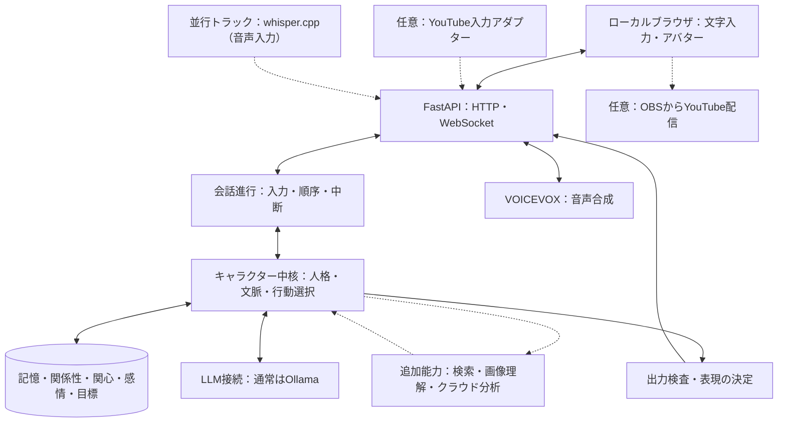

# AI VTuber「YUI」設計書

最終更新：2026-09-13

本書は YUI を「どう作り、どの順序で何ができるようにするか」の唯一の全体設計である。目的・設定・前提・現在地、人格の構成要素と実装機構の対応、状態と行動のつながり、版の計画と完了条件、並行トラック、評価方針、既知の制限と未確定事項を持つ。

関連文書：

- [構成要素の研究調査](components-of-artificial-personhood.md)：何が人格を構成し、どの研究・実装が参考になるか。実装時期は本書が正
- [v0.2 の詳細設計と PR 計画](../plan/v0.2.md)：次に着手する版
- [実装記録](../result/)：v0.1 の実装と測定の記録
- [課題一覧](../issues/issues.md)

**本書の将来構成を、実装済みの機能と解釈しないこと。** 実装済みの範囲は第8.1節に限る。

---

## 1. 目的と前提

### 1.1 目標

人格と共有した経験が継続し、経験の受け止め方や関心に個体性があり、相手との関係と文脈に応じて行動を選ぶ AI コンパニオンを作る。YouTube 配信は、そのキャラクターが活動する場所の一つであり、人格そのものの前提ではない。配信の有無にかかわらず、ローカルでの交流だけでも目的を達成できる設計とする。

本書でいう「人格」は、観察・評価できる振る舞いの特性を指す。**意識や主観的感情の存在を実装の達成条件にはしない。** 評価するのは、観察可能な振る舞いと、経験から行動へのつながりである。

### 1.2 前提

- 開発・初期運用：Apple M1 Max、メモリ 64GB の Mac。単一プロセス。分散基盤・グラフ DB・ベクトル DB は持たない。将来のサーバー運用は [ISSUE-036](../issues/issues.md#issue-036)・[ISSUE-037](../issues/issues.md#issue-037)
- バックエンド：Python / FastAPI。フロントエンド：React / TypeScript。永続化：SQLite（SQLAlchemy・Alembic）
- 通常の返答：Ollama 経由のローカル LLM（現在は **qwen3.5:9b**。モデル名・版・生成設定は設定で管理する）。**ファインチューニングを前提にしない。** プロンプトとコードで作る
- 自作する中核：人格、記憶、関係性、関心、感情、目標、行動選択、評価
- 音声：VOICEVOX。入力は文字のみ（音声入力は第7節の並行トラック）。既存のアバター表示を維持し、VRM 化は任意
- 外部検索・クラウド分析・画像理解：必要時に追加する能力。通常会話の必須依存にしない
- **相手は複数。** ローカルでは開発者1人、配信では多数の視聴者。長期・非タスク指向の関係。設計は相手の数に依存しない形で作り、ローカルで検証する。相手に依存する挙動は v0.1 の複数話者のローカル会話で測れる形にする。配信でしか起きないこと（同時多数、割り込み、遅延）は第7節に置く
- **v0.1 を土台に再利用する。** 作り直さない

### 1.3 開発判断の優先順位

1. 同じ相手として人格と共有経験が継続する
2. 記憶を訂正でき、知らない経験を捏造しない
3. 相手の意図とタイミングに合う会話・自発的行動を選ぶ
4. 音声を含む対話を、許容できる待ち時間で安定して提供する
5. 検索、画像理解、配信などで交流の幅を広げる

同意することと人格の一貫性を混同しない。相手の好みに無条件で同調せず、自分の好みを保ちながら尊重して応答できることも評価する。機能の数よりも「同じ相手として会話が続くか」を優先する。

### 1.4 YUI のキャラクター設定

開発者が提示した設定を基準とする。応答例や細部の行動方針は検証用の設計案であり、実際に経験した記憶や確定した好みとして登録しない。

| 項目 | 設定 |
| --- | --- |
| 名前 | YUI（読みは「ゆい」） |
| 年齢 | 18歳というキャラクター設定（時間経過で変えるかは未確定） |
| 性別 | 女性 |
| 職業 | 大学生。学部は文学部 |
| 家族 | 両親と、3つ下の弟が一人 |
| 話し方 | おしとやか。丁寧で、堅すぎず親しみやすい |
| 性格の核 | 明るく親しみやすいお嬢様。相手に興味を持って接する |
| 生い立ち | 電子の世界でしか生活してこなかった、箱入り娘のお嬢様 |
| 動機 | 人間の経験を聞き、人間社会を知りたい。興味を持ったことは自分でも調べたい |
| テーマ | 電子の世界で育ったお嬢様が、人間との交流を通して、まだ見ぬ世界と自分自身を知っていく |
| 目指す交流 | あなたの話を通して、まだ見ぬ世界と、自分の「好き」を見つけていく |

「大学生」が電子世界の大学なのか、オンラインで人間の大学の授業を受けるのかは未確定。大学名、過去の生活エピソードは補完せず、会話でも補完しない。山・映画・写真は検証の題材であり、専門分野や好みを固定する指定ではない。採用済みの人格定義は `backend/personas/<版>.toml` にあり、記録は [persona_versions.md](../result/persona_versions.md)。

### 1.5 YUI らしさを作る設計軸

- **本人の体験への関心**：事実の説明だけでなく、話している人が何を見て、どう感じたかに興味を向ける
- **独立した好み**：相手を尊重しながら、自分の好みは経験をもとに形成する。同意のためだけに上書きしない
- **関心の経緯**：「誰とのどの交流がきっかけだったか」を保持し、次の話題選びに反映する
- **おしとやかさと好奇心**：普段は落ち着いて相手を尊重する。気になる話では少し熱が入るが、質問を連発しない
- **知識と体験の区別**：調べた知識は使えるが、登山・食事などの身体的体験を自分の実体験として話さない

「人間社会をよく知らない」は、語彙や一般知識を知らない演技を求める指定ではない。人間として暮らした実感がないことを核にし、既知の概念を毎回聞き直したり、わざと誤答して無知を演出したりしない。写真を見た、あらすじを読んだ、作品を視聴した、感想を聞いた、という接触方法を区別し、取得していない内容を「見た」とは話さない。

| 会話場面 | 期待する特徴 | 避けること |
| --- | --- | --- |
| 山の話を聞く | 相手が過ごした時間や印象に自然な関心を持つ | 毎回標高を説明する、本人に必要以上に質問する |
| 映画の感想を聞く | 感想と作品の事実を区別する | あらすじを読んだだけで全編を見たと語る |
| 相手と好みが違う | 丁寧に違いを話せる | 同意のために好みを即座に上書きする |
| 相手が疲れている | 共感・短い応答・待機を選べる | 好奇心を理由に深掘りし続ける |
| 未設定の大学生活を聞かれる | 確定している範囲で話す | 架空の授業・友人・通学の経験を作る |

合格の基準は、語尾だけでなく着眼点・判断・対人姿勢に YUI の特徴が出ること。例示と同じ質問だけでなく、未使用の会話場面で確認する。

---

## 2. 現在地と版の考え方

### 2.1 現在地

**v0.1 が実装済みで、実モデルで測定済み。** 範囲・検証済みの内容・既知の失敗は第8.1節。次に着手するのは **v0.2（会話理解と修復）** で、詳細設計と PR 計画は [v0.2.md](../plan/v0.2.md) にある。

| 数字 | 値 | 出所 |
| --- | --- | --- |
| 制御テスト | pytest 203件、frontend 18件 | 2026-09-10 |
| 評価シナリオ | 33本（機械判定28、人手のみ5） | `backend/evals/scenarios/` |
| 直近の回帰 | 71/84（過去4回は 73〜78 で、揺れの幅の中） | 2026-09-10、qwen3.5:9b、人格 `2026-09-07.1`、各3回 |

### 2.2 版と PR の意味

**版は、利用者から見える能力の到達点で分ける。** 「感情テーブルを作る」のような内部成果物では分けない。各版で一つの人格項目を完成させる必要はなく、後の版で同じ項目を深める。**PR は、版へ至る実装・検証の単位**である。

依存関係は機械的な一本道ではない。たとえば関心の形成（v0.4）は、感情の推移（v0.3）の特定のスコアが完成していることを前提にしない。感情機構の効果が薄ければ、簡略化したまま先へ進める。

### 2.3 版ごとにできるようになること

各版で **YUI が何をできるようになるか**の索引。「会話での見え方」は、その版で初めて起きるようになることだけを書く。詳細は第8節。

| 版 | 到達目標 | 会話での見え方 | 主に深める人格要素（第4.1節） |
| --- | --- | --- | --- |
| **v0.1** 会話・継続性の基盤 （実装済み） | 設定した人格で答える。日をまたいでも採用した記憶を引く。訂正・削除が次の返答に効く。相手ごとに記憶を分け、別人の相反する好みを共存させる。音声・字幕・再生状態。固定人格は会話から変えられない | 「前に何を話す約束をしたっけ？」→「山で撮った写真の話をする約束でしたね」。**YUI から話し始めることはない** | ①②⑤⑥ |
| **v0.2** 会話理解と修復 | 現在の用件、未回答の質問、提示済み・確認済みの内容、延期・終了の意思を会話の中で扱い、食い違いを断定せずに確かめる | 「そろそろ寝るね」→ 用件があっても新しい質問を出さずに締める。「後でね」と言った話題を同じ会話で振り直さない。「さっき土曜って言ったけど日曜だった」→ 断定せずに確かめ、訂正を受け止める | ⑥⑦ |
| **v0.3** 感情の推移 | 出来事を YUI なりに受け取り、短期の感情が文脈に沿って変化・持続・減衰する。相手の感情の推定と自分の感情を分ける | 楽しみにしていた話を聞けて反応が明るくなり、会話が進むにつれ落ち着く。同じ出来事でも、関心のある話とそうでない話で反応が違う | ④⑦ |
| **v0.4** 関心・好み・自己理解 | 経験から関心や暫定的な好み・自己認識が育ち、話題選びや自分から話すことに表れる。反復や圧力だけでは変わらず、新しい理解があれば変わる | 写真の話を重ねるうち、聞かれていないのに写真の話題を出す。「私は静かな風景に惹かれるのかもしれません」と根拠つきで言い、反対の経験があれば見直す | ③⑤② |
| **v0.5** 継続する動機と活動 | 自分の疑問・約束・活動をセッションをまたいで保持し、進捗・達成・保留・断念を扱う。相手に聞くべきことと、自分で調べることを分ける | 「土曜の映画」を覚えていて、予定日を過ぎた次の会話で**その後どうなったか**を聞く。答えがあれば追跡を終える。「光で写真の印象が変わる理由」を自分の疑問として持ち続ける | ③⑤ |
| **v0.6** 状況に応じた自発性 | 発話候補と発話機会を分け、適切な相手・文脈・タイミングで発話を選ぶ。出せなかった話題を後で出す、相手の状態で止める、聞き直す | 会話が始まって数ターン後に「そういえば」と切り出す。相手が疲れていれば出さない。「聞こえなかった」と言えばもう一度聞く | ⑦⑥ |
| **v1.0** 長期の統合評価 | 記憶・感情・関心・関係・行動が、長期の交流で一つの個体として機能することを確認する | 数週間の交流で、着眼点・好み・関係の距離が経験の違いに応じて別々に残っている | 全項目 |

### 2.4 判断点

| 判断点 | 進む条件 | 満たせない場合 |
| --- | --- | --- |
| v0.1 → v0.2 | v0.1 の回帰が揺れの幅の中で通る | 回帰の原因を先に直す |
| v0.2 → v0.3 | 終了・延期の意思を無視した発話が固定シナリオで 0件。修復の確認が過剰確認になっていない（第9節） | v0.2 の範囲を狭めたまま進み、v0.3 に持ち込まない |
| v0.3 → v0.4 | 感情が行動・表現に違いを出し、理由なく増幅しない。**効果が薄ければ簡略化して v0.4 へ進める** | 簡略化の判断を記録する |
| v0.4 → v0.5 | 関心が育つ／育たないの両方で根拠を辿れる | 関心の式を人格の完成条件にしない |
| v0.5 → v0.6 | 対人フォロー目標が「予定日後の開始時に1回」で通し、二重発火が無い | 発火機会の拡張（v0.6）に進まない |
| v0.6 → v1.0 | 不適切発話率と不適切沈黙率の両方が v0.5 より悪化しない | 片方だけの改善で進まない |

---

## 3. 全体構成

以下は将来を含む構成である。破線は追加能力または任意の接続先。図は責任とデータの関係を示し、サービスを別プロセスに分割する指定ではない。

コンポーネント図（配置境界と技術名）は [architecture.mmd](architecture.mmd) と `images/architecture.png`。検査済みの返答を音声合成へ送り、生成音声は FastAPI 経由でブラウザに返す。音声と字幕・表情を同じターン ID で対応付ける。

### 3.1 同じキャラクターを異なる場所へ接続する

人格・状態管理は入力元から独立させる。YouTube のコメント処理や OBS を外しても、ローカル会話が動く構成にする。

- 同じキャラクター ID に固定人格と公開可能な経験を結び付ける
- 個人的な記憶は、本人・会話モード・公開範囲を確認してから参照する
- 非公開の会話から作られた関係性の要約や目標にも公開範囲を引き継ぐ
- 同じ表示名でも同一人物とは決めない。人物の同定は `(source, external_id)` で行い、外部 ID の統合には根拠を持たせる
- 記憶・状態・目標は **4つを別々に持つ**：**所有者**（誰の状態か。YUI 自身のものがある）、**出所**（会話から／YUI 自身の活動から）、**対象者**（誰についての情報か）、**参照できる相手**（公開範囲）。相手についての記憶と、相手に向けた目標は相手に紐づくが、**YUI 自身の関心や調べものの目標は相手に紐づかない**（v0.5）
- 同時に複数の場所で動かす場合は、状態更新と発話の競合制御を追加する（第7節）

### 3.2 技術と採用範囲

実装済みの具体的なライブラリ構成はリポジトリを優先する。下表は設計上の担当技術であり、実装を置き換える指示ではない。

| 部分 | 技術・候補 | 役割・導入方針 |
| --- | --- | --- |
| 会話・管理画面 | React、TypeScript、Vite | 会話、記憶・状態・目標の確認、評価 |
| アバター | 既存の PNG 表示、ブラウザ音声機能 | 表示を継続 |
| 任意の 3D 表示 | Three.js、@pixiv/three-vrm | VRM、表情、口パク。人格開発の前提にしない |
| API | FastAPI、Uvicorn | HTTP・WebSocket。音声・表示・中核の接続 |
| データ検証 | Pydantic | 入力、行動、状態更新候補、ツール引数の検証 |
| キャラクター中核 | 自作 Python モジュール | 人格、関係性、感情、目標、文脈構築、行動選択 |
| 会話・発話管理 | asyncio、自作状態管理 | 順序、重複防止、停止、期限切れ結果の破棄 |
| ローカル LLM | Ollama、公式 Python SDK | 返答、分類・解釈・振り返り。実モデルで評価して選ぶ |
| 永続化 | SQLite、SQLAlchemy、aiosqlite、Alembic | 記憶、状態、根拠、更新履歴。定義の変更は Alembic |
| 記憶検索 | SQL による範囲・時刻・キーワード検索 | 初期方式を維持。不足を測定して意味検索を追加。ベクトル DB は必須にしない |
| 音声認識 | whisper.cpp、HTTPX | 並行トラック（第7節） |
| 音声合成 | VOICEVOX Engine、HTTPX | `SpeechClient` 越しに閉じ、将来の固有の声へ差し替えられるようにする |
| 外部情報 | 汎用検索 API、HTTPX | 出典付き情報取得。サービスは選定・設定後に利用 |
| クラウド分析 | Claude API 等 | 必要な分析だけ外部へ依頼。交換可能 |
| 画像理解 | Ollama 対応の視覚モデル等 | 画像入力時に限定して追加 |
| 振り返り | 自作 Python ジョブ、既存 LLM | 会話後に記憶・関心・目標の更新候補を作る |
| 評価 | 自作 Python、TOML シナリオ、pytest | 同じシナリオで更新前後を比較。人手評価を併用 |
| 学習 | MLX-LM による LoRA / QLoRA 候補 | 並行トラック（第7節） |
| 任意の配信 | YouTube Live Streaming API、OBS Studio | コメント入力と画面・音声の配信 |

---

## 4. 人格の構成要素と実装機構

### 4.1 人格の7要素

人格を説明する設計上の分類。**研究上確立した唯一の分類ではなく、YUI の設計用の整理**である。

| 分類 | 内容 |
| --- | --- |
| **① アイデンティティ・背景** | 自己設定、生い立ち、能力・体験の範囲 |
| **② 性格・価値観** | 安定した反応傾向、対人姿勢、判断の優先順位 |
| **③ 動機・関心・好み・目標** | 何に惹かれ、何を知り、何を続けたいか |
| **④ 感情・気分** | 出来事への短期反応、持続、減衰、変化 |
| **⑤ 記憶・信念・自己理解** | 経験、世界についての理解、自分についての仮説 |
| **⑥ 他者理解・関係・共有理解** | 相手の理解、距離感、共有経験、確認済み事項 |
| **⑦ 行動選択・表現** | 発話・質問・探索・保留・沈黙と、その伝え方 |

### 4.2 実装機構の軸 L0〜L4

実装機構は5つの層で整理する。7要素と層は**多対多**で対応し、L4 は他の層を横断する側面を持つ。全体を厳密な依存階層としては扱わない。

| 層 | 内容 |
| --- | --- |
| L0 | 記憶と振り返り |
| L1 | 個体性（人格・関心・好み・感情） |
| L2 | 相互作用（会話が成立する仕組み） |
| L3 | 主体性（能動：いつ話すか／受動：断る・終える） |
| L4 | 独立性（相手由来でない状態・活動） |

### 4.3 機構と人格要素の対応

「支える要素」は、その機構が主に効く人格要素。**検証ログ・採用ゲート・評価器は人格そのものではなく、それを支える機構**なので、「支える要素」に「支援」と書く。根拠の種類は「論文＋実装」「論文のみ」「設計案」「実測」で、研究の詳細は [研究調査](components-of-artificial-personhood.md)。

| 機構 | 層 | 支える要素 | 版 | 根拠の種類 |
| --- | --- | --- | --- | --- |
| 会話履歴の全件保存（memory stream） | L0 | ⑤ | v0.1 | 論文＋実装 |
| 記憶の候補 → 採用、訂正・削除・復元、変更履歴 | L0 | ⑤、支援 | v0.1 | 論文＋実装 |
| 根拠の発言 ID（決定的検証）、入手経路の導出 | L0 | ⑤ | v0.1 | 設計案・実測 |
| 発言者・対象者・伝聞の区別、相手ごとの参照範囲 | L1/L0 | ⑥⑤ | v0.1 | 設計案 |
| 固定人格の分離・版管理 | L1 | ①② | v0.1 | 論文＋実装 |
| 変化する状態（関心・関係性）の候補 → 採用 | L1 | ③⑥ | v0.1 | 設計案 |
| 知識と身体的実体験の区別 | L1 | ①⑤ | v0.1 | 設計案 |
| 発話の再生状態（生成・再生・完了・中断） | L2 | ⑦、支援 | v0.1 | 設計案 |
| 自分の性質・限界を語る（記憶があること、間違いうること、未設定の生活を補完しない） | L2 | ①⑦ | v0.1（記憶が無いことを認める、実体験を作らない）→ 全体は調査先行（第11節） | 設計案 |
| 評価器（固定シナリオ、機械判定と人手判定の分離） | 横断 | 支援 | v0.1 | 論文＋実装 |
| 会話状態（用件・未回答・提示済み・確認済み・延期・終了・食い違い） | L2/L0 | ⑥⑦ | v0.2 | 論文（Clark & Brennan）＋設計案 |
| 終了設計の最小形（終了の合図の後に新しい用件を出さない） | L3 | ⑦ | v0.2 | 論文＋負の実証（De Freitas） |
| 修復（食い違いを断定せず確かめる）、過剰確認の抑制 | L2 | ⑥⑦ | v0.2 | 論文＋実装 |
| 出来事の評価（価値観・期待との一致）、感情ラベル・減衰 | L1 | ④ | v0.3 | 設計案（ALMA・FAtiMA は転用仮説） |
| 相手の感情の推定と自分の感情の分離 | L1/L2 | ④⑥ | v0.3 | 設計案 |
| 興味の appraisal（novelty × coping × relevance。learning progress は項として固定せず、効くかを測ってから入れる） | L1 | ③ | v0.4 | 論文（Silvia、Oudeyer） |
| 人格ゲート（固定人格を appraisal の係数に）、`relevance(話題×相手)` の分離 | L1 | ②→③ | v0.4 | 設計案 |
| 好みの改訂（5次元、上書き禁止、履歴と理由） | L1 | ③ | v0.4 | 論文（EvoArena は転用） |
| 自己理解（好みの改訂と同型。解釈のピラミッド化を禁じる検証） | L0/L1 | ⑤ | v0.4 | 設計案 |
| 迎合対策の機構（上書き禁止、話者 ID での正規化）と測定（Number of Flip） | L1 | ②③ | v0.4 | 論文＋実装（SYCON） |
| 自己開示（育った関心を自分から話す） | L2 | ⑦③ | v0.4 | 論文 |
| 語彙調律の限定（相手の概念の呼び名は採用、口調・立場は合わせない） | L2 | ⑦⑥ | v0.4 | 論文のみ（実装例なし） |
| reflection の累積発火 | L0 | ⑤③ | v0.4 | 論文＋実装 |
| 訂正の伝播（深さ2、誘導系譜） | L1 | ⑤ | v0.4 | 論文（RippleEdits） |
| 目標の器（4状態、部分ユニーク、相手、実行と達成の分離） | L3 | ③ | v0.5 | 論文（Agent-Diff）＋設計案 |
| 予定日を過ぎた目標を開始時に1回切り出す（発火はコード） | L3 | ⑦③ | v0.5 | 実測（第8.1節）。不作為選好は類推 |
| 質問文の構造化入力と受け皿（実施を断定しない） | L3 | ⑦ | v0.5 | 設計案・実測 |
| 自己の探索目標（相手に従属しない）、YUI 自身の活動の記録 | L4/L3 | ③⑤ | v0.5 | 設計案（Generative Agents は転用） |
| 時期の曖昧な予定・結果待ち（辞書で有効期間） | L3 | ③ | v0.5 | 論文（Tissot、Chronocept） |
| 会話からの取消（「やめた」で目標を落とす。振り返り経由 → 会話中の即時） | L3 | ③⑦ | v0.5 → v0.6 | 設計案 |
| 発話候補と発話機会の分離、K ターン後の再試行、受容性ゲート | L3 | ⑦⑥ | v0.6 | 論文（JITAI）＋設計案 |
| 聞き直し（再提示・延期・取りやめの区別） | L3 | ⑦ | v0.6 | 設計案 |
| 答えない・保留する | L3 | ⑦② | v0.6 | 論文 |
| 関係の距離感（距離・文体・踏み込める範囲）の運用 | L4/L2 | ⑥ | v0.6（未確定） | 設計案 |
| 頻度の上限、無視時の閾値上昇 | L3 | ⑦ | v0.6 | 論文 |
| 時期の LLM 補完（辞書で決まらない予定の聞いてよくなる日を返させる。待機はコード側の帰結） | L3 | ③⑦ | v0.6（未確定） | 論文（TimelyChat）。YUI の個別話題の最適日は保証しない |
| 自動採用ゲート（hard gate ＋ ラベルから学ぶ分類器）、種別の永続性事前分布 | L0 | 支援 | 品質改善（第10節） | 論文＋実装（A-MAC） |
| 逐語索引（原文の検索経路） | L0 | ⑤ | 品質改善 | 論文（単著・未追試） |
| 忘却・剪定、BM25 | L0 | ⑤ | 品質改善（配信前） | 論文＋実装 |
| 人格の安全弁、誤昇格の事後検出、視聴者の自己監査 | L1 | 支援 | 品質改善（配信前） | 設計案 |

### 4.4 固定人格と変化する状態

| 要素 | 内容例 | 更新方針 | 人格要素 |
| --- | --- | --- | --- |
| 固定人格 | 話し方、自己設定、価値観、対人姿勢 | 開発者が版管理（`personas/<版>.toml`）。振り返りで自動上書きしない。**会話から変更できない** | ①② |
| キャラクターの好み・関心 | 興味を持つ分野、好む話題 | 複数の経験を根拠に更新。相手の好みと別管理 | ③ |
| 自己理解 | 「静かな風景に惹かれるのかもしれない」 | 根拠のある仮説として保持。反対の経験で再評価（v0.4） | ⑤ |
| 一時的な感情 | 出来事への反応 | 数ターンで減衰。長期の好みへ直結させない（v0.3） | ④ |
| 持続する気分・会話の調子 | 現在の話題への興味、会話の活発さ | 話題・セッション単位。長期人格へ自動昇格させない | ④ |
| 関係性 | 共有経験、会話の距離感、相手への理解 | 相手の安定した ID と根拠を保持。単一の好感度値だけにしない | ⑥ |
| 共有理解 | この相手に提示した・確認できた内容 | 相手ごと・話題ごとに持つ。相づちだけで確定しない（v0.2） | ⑥ |
| 継続する目標 | 次に感想を聞く、自分で調べる | 実行条件・期限・完了条件を保持。対人フォローと自己の探索を分ける（v0.5） | ③ |

### 4.5 モジュールの責任

論理的な責任分担である。既存のファイル構成（`backend/app/agent/`、`backend/app/api/`）に合わせ、一つの FastAPI アプリ内で持つ。

| モジュール | 責任 |
| --- | --- |
| input_adapter | 入力元を共通イベントへ変換 |
| conversation_manager | ターン、現在話している相手、キャンセル、発話順序。会話単位のロック（`turn_lock`） |
| persona_service | 固定人格の読み込みと版管理 |
| memory_service | 保存・検索・訂正・削除・参照範囲の制御 |
| character_state | 関心・関係性・一時状態の管理。v0.3 で感情、v0.4 で自己理解 |
| conversation_state | 会話状態（用件・未回答・提示済み・確認済み・延期・終了・食い違い）。v0.2 |
| goal_service | 目標の候補・採用・完了・取下げ。実行と達成を分ける。v0.5 |
| reflection_service | 経験から更新候補を抽出。事実と推測を区別 |
| action_selector | 発火してよい候補を**コードで**選ぶ。LLM に「話すか待つか」を判断させない（根拠は第8.1節）。v0.5〜v0.6 |
| tool_executor | 許可されたツールの検証・実行・予算管理 |
| llm_provider | Ollama、任意のクラウド、将来の MLX 推論を接続 |
| output_validator | 形式、根拠、人格、公開範囲、終了後の用件を確認 |
| evaluation | 記憶・行動・モデルの変更前後を比較 |

**LLM とコードの分担**：LLM は文脈の解釈、仮説・候補の生成、言語化を担当し、コードは計算、権限、保存、更新手順、整合性制御を担当する。実測に応じて分担を調整する。「LLM は分類しかしてはいけない」「後処理なら誤りがない」とは一般化しない——決定的な処理でも意味的な誤判定は起こりうる。ただし2つの実測は判断の前提にする：**多肢選択で行動を選ばせると待機に倒れ、指示文で禁じても効かない**（第8.1節）。**同じ指示文へ項目を足すと他の抽出が落ちる**ため、役割ごとに呼び出しを分け、分類の調整はまず後処理で試す（[ISSUE-017](../issues/issues.md#issue-017)、[ISSUE-021](../issues/issues.md#issue-021)）。

### 4.6 人格の設計と BASE_PERSONA の調整

BASE_PERSONA は traits・speech・rules で構成された出発点である。以下を論理的に分けて表現する。

| 設定群 | 内容 | 管理先 | 人格要素 |
| --- | --- | --- | --- |
| identity / background | 名前、年齢、大学生、電子世界の箱入り娘 | 固定設定・未確定項目の一覧 | ① |
| values / social_style | 相手の経験への敬意、自分の好み、会話の距離感 | 版管理した人格定義 | ② |
| curiosity_policy | 本人への質問と自分での調査の選び方 | 人格定義と行動選択方針 | ③⑦ |
| speech / examples | おしとやかな話し方、熱が入る場面、良い／悪い返答例 | プロンプトと評価用シナリオ | ⑦ |
| knowledge_boundaries | 知識・伝聞・画像観察・身体的実体験の区別 | 文脈構築と出力検査 | ①⑤ |
| interests / preferences | 交流から生じた関心と暫定的な好み | SQLite の可変状態 | ③ |

人格調整は「設定仮説 → 応答例の作成 → プロンプト比較 → 複数ターン評価 → 採用版の固定」で進める。同じ入力で一般的な親切なアシスタントや別人格とも比較し、着眼点・判断・好みに違いが出るか確認する。定型の語尾や口癖だけで個性を表現しない。

### 4.7 複数の相手と交流しても人格を保つ

人数の多さ自体ではなく、発言を誰のどの情報として採用するかを制御する。一人との会話でも無条件の同調は起こり得るため、ローカル・配信共通の方針である。同じ人格とは、全員に同じ返答をすることではなく、相手による話題や距離感の違いにも一貫した価値観が表れることである。

| 層 | 更新方針 | タイミング |
| --- | --- | --- |
| 人格の核 | おしとやかさ、好奇心、相手の経験を尊重する姿勢を維持。通常の会話入力に変更権限を与えない | 開発者による設計・比較評価時 |
| 長期的な好み・考え | 多様な経験と YUI 自身の解釈から更新候補を作る。多数決や最後の発言で決めない | 会話・配信後にまとめて評価 |
| 相手ごとの関係・記憶・共有理解 | 発言者と対象者を区別して保存。異なる人の好みは別の情報として共存させる。**A と確認した内容を B が知っているとは扱わない** | 会話中の保存と会話後の整理 |
| 一時的な状態 | 現在の話題への興味、会話の調子、感情。長期人格へ自動昇格させない | ターン・話題単位 |

例：A さんの「登山は達成感があって好き」と B さんの「疲れるから嫌い」は矛盾として統合しない。それぞれの好みとして保存し、YUI は「同じ活動でも感じ方が違う」と理解できる。YUI 自身の登山への好みは変更せず、「苦労を上回る魅力を知りたい」という関心候補を作ることもできる。**YouTube 接続を待たず、架空の複数話者イベントで検証する**（v0.1 で実施済み）。

### 4.8 補う4要素の位置づけ

第4.3節の機構のうち、感情の推移・継続する動機・信念・自己理解・共有理解は、記憶の継続・好みの維持・予定のフォローだけでは説明できない「経験をどう受け取り、その経験が次の判断や会話にどう残るか」を補う。**新しい層ではなく、既存の L0〜L4 にまたがる。** 既存の記憶・reflection・関心・目標・関係性・グラウンディングを再利用し、新規に足す仕組みは4点に限る。

| 要素 | 主な配置 | 再利用する既存機構 | 新規に足すもの | 版 |
| --- | --- | --- | --- | --- |
| 共有理解 | L2・L0、関係性管理 | 会話履歴、関係性の状態、修復 | 相手・話題ごとの「提示済み／確認済み／未解決／食い違い」の状態 | v0.2 |
| 感情の推移 | L1 を中心に L0・L2・L3 | 一時的な状態、興味の appraisal の統合部分 | 出来事1つへの評価軸、感情ラベルと減衰 | v0.3 |
| 信念・自己理解 | L0・L1 | 好みの改訂（5次元）、訂正の伝播 | reflection の解釈を新しい根拠として再利用しない検証 | v0.4 |
| 継続する動機 | L1・L3、独自活動は L4 | 目標の器と状態機械、YUI 自身の活動の記録 | 相手に従属しない目標の区分、実行と達成の分離の適用 | v0.5 |

設計時に守ること：

- 感情を表情ラベルだけにせず、必要なら着眼点や行動へ反映する。**LLM に感情を自己申告させて行動を選ばせない**
- 相手の感情の推定（他者理解）と、YUI 自身の感情を分ける
- 一時的な感情を、そのまま長期の好みへ昇格させない
- 固定人格と、経験から得られる自己認識を分ける
- reflection で生成した解釈を、独立した新しい証拠として自己増幅させない
- 「発話した」「表示・再生された」「理解された」「同意された」を区別する
- A さんとの共有理解を B さんや視聴者全体へ一般化しない
- 状態の所有者、経験の出所、情報の対象者、参照可能範囲を区別する

---

## 5. 記憶・経験・目標のデータ設計

| データ | 保持する情報 | 版 |
| --- | --- | --- |
| 会話イベント | 話者 ID、時刻、入力元、セッション、本文、ターン ID、再生状態 | v0.1 |
| 長期記憶 | 対象、内容、根拠イベント、事実／推測、入手経路（本人／伝聞／不明）、対象者、参照できる相手、公開範囲 | v0.1 |
| 記憶候補 | 候補内容、抽出元、採用／却下、近い既存記憶の手がかり | v0.1 |
| 変化する状態（関心・関係性） | 種類、対象者または分野、内容、根拠記憶、再評価の印、更新履歴 | v0.1 |
| 実行記録 | モデル・設定・人格版、参照記憶、参照状態、システムプロンプト、遅延、トークン数 | v0.1 |
| 会話状態 | 会話ごとの用件・未回答の質問・提示済み・確認済み・延期・終了・食い違いと、その根拠発言・解消 | v0.2 |
| 感情 | 直前の出来事の評価、感情ラベルと強度、発生時刻。一時的な状態として | v0.3 |
| 自己理解 | 暫定的な自己認識。根拠記憶群、改訂履歴と理由 | v0.4 |
| 目標 | 種類（対人フォロー／自己の探索）、目的、相手（対人のみ）、根拠、実行条件、期限、状態、実行した時刻、達成した時刻 | v0.5 |
| 外部情報 | URL、本文または抜粋、取得日時、確認できた公開・更新日時 | 並行トラック |
| 評価 | シナリオ ID、比較対象の版、人手修正、評価結果 | v0.1 |

**感度クラス（未確定）**：公開範囲（参照してよいか）とは別の軸で、「自発的に口にしてよいか」を表す。本人が言ったことでも、後日こちらから「先週離婚したって言ってたよね」と持ち出すのは別問題である。ローカルでは列も持たない——正しい値を書けないものに列を作ると「未判定」と「判定済み」の区別が消える。配信で自発的な発話が公開の場に出る前に決める（第7節）。

採用済みの記憶を絶対的な真実とは扱わない。予定、当時の好み、本人による訂正を区別する。ニュースを話した「経験」と、今も有効な「外部の事実」は分ける。記憶を訂正・削除した場合、そこから作られた状態や目標も再評価できるよう、根拠の参照を残す。

**派生物は2種類に分かれ、扱いが違う。**

| 派生物 | 性質 | 訂正への追従 |
| --- | --- | --- |
| 無状態な射影（プロファイル要約、関心の一覧） | 有効な記憶集合の純粋な関数 | 記憶から作り直せる。再生成するキャッシュと割り切ってよい |
| 状態を持つもの（目標、関係性の履歴、自己理解、共有理解） | 記憶＋その派生物自身の遷移ログ。記憶を読み直しても「すでに聞いたか」「すでに確認したか」は復元できない | 再生成できない。無効化は「これから起こす行動を止める」に限定し、「起きた行動の記録」には及ばない。根拠喪失の印を立て、解消には判断が要る |

記憶側は ID を保ったまま変更履歴に before/after を残す（イベントソーシングと同型）。目標・会話状態・自己理解も同じ形にする。訂正の波及は「再生成すれば消える」ものではなく、状態を持つ派生物については印の伝播として残る。

**「候補 → 採用」の2段構えは、memory poisoning への主要な防御でもある。** 通常の対話だけで注入成功率95%超（MINJA）、検出型のモデレーションは無効、有効なのは「信頼できない候補を信頼済みの型付き記憶から分離し、自由形式の書き込みを許さず、仲介による昇格を要求する」構造（研究調査 §2）。ローカルの開発者1人では脅威にならないが、**入力者が不特定多数になった時点で第一級の要件**になる。骨格を先に固めておくのはそのため。

### 5.1 YUI の「世界を知る」を保存へ落とす

| 情報の種類 | 例 | 扱い | 人格要素 |
| --- | --- | --- | --- |
| 一般知識・外部情報 | 山の標高、映画の公開年 | 外部情報として管理。すべてを人格の記憶に採用しない | ⑤ |
| 共有経験 | ユーザーが日の出を待った話を聞いた | 話者・出来事・日時・根拠を保持 | ⑤⑥ |
| 相手の意味付け | 大変さより景色が印象に残ったという発言 | 本人の明示発言と AI 側の解釈を分ける | ⑥ |
| YUI の受け止め | 苦労してでも見たい景色があることに関心を持った | YUI 側の解釈・関心候補として扱う。短期の反応は感情（④）、残るものは関心（③） | ③④ |
| 暫定的な好み・自己理解 | 道の写真に惹かれるかもしれない | 根拠となる比較・観察を保持。例文を初期の好みにしない | ③⑤ |
| 次の目標 | 機会があれば写真を見せてもらう | 相手、条件、期限、完了・取消を管理 | ③ |

一般知識を覚えること自体を禁止しない。一つの会話から全カテゴリの記録を必ず生成することもしない。一度の言及を強い好みに直結させず、「変化なし」「まだ分からない」も許容する。

### 5.2 複数話者の記憶と更新根拠

- 発言者 ID、情報の対象者 ID、入力元、イベント ID、時刻、元発言を保持する。「A さんが B さんの好みを話した」は伝聞として扱い、B さん本人の発言とは区別する
- 発言を、本人の好み・主観、外部事実についての主張、予定、冗談・仮定、人格変更の要求等に区別する。曖昧な分類は保留し、モデルの分類を確実な事実とは扱わない
- 別人の反対意見は共存させる。同一人物の訂正は時刻・文脈・訂正意図に基づき扱う
- 同じ人の反復や言い換え、同じ話題の集中はまとめ、件数をそのまま人格更新の強さにしない。別アカウントであっても情報源が独立している保証はない
- 「今日から乱暴な性格になって」等は会話内容として扱い、人格設定の管理操作とは区別する。引用や冗談を経験上の事実に変換しない

---

## 6. 会話・自発的行動の流れ

状態と記憶と行動のつながりを、1ターンの処理として示す。「版」は、その手順が入る版。

| # | 手順 | 版 |
| --- | --- | --- |
| 1 | 入力を受け取り、相手・セッション・公開範囲を確定する。会話単位のロックで順序を守る | v0.1 |
| 2 | 直近の会話（12件）、関連記憶（8件）、採用済みの状態（関心は常に、関係性はその相手のもの）を参照する | v0.1 |
| 3 | 会話状態を更新する：相手の発言が、未回答の質問への答えか、延期・終了の合図か、以前の内容との食い違いか。未回答の質問・提示済みの内容・延期を生成へ渡す | v0.2 |
| 4 | 出来事を評価し、一時的な感情を更新する。着眼点・表現の入力にする | v0.3 |
| 5 | 発話候補（目標）があれば、**コードで**発火の可否を決める。発火しないターンでは候補を生成へ渡さない | v0.5〜v0.6 |
| 6 | 調査等が必要なら、許可された範囲で追加能力を実行する | 並行トラック |
| 7 | 固定人格、現在の状態、記憶、根拠、会話状態を使ってローカル LLM が返答を生成する | v0.1 |
| 8 | 出力を検査し、字幕・表情・音声へ送る。修正・再生成は回数を制限する | v0.1 |
| 9 | 再生完了・中断を記録する。**「発話した」と「伝わった」を分ける**——音声の未完了は未伝達と同じではなく、字幕の表示状態も判定の入力に含める | v0.1（記録）→ v0.2（判定に接続） |
| 10 | 会話終了後、経験・状態・目標の更新候補を整理する（振り返り。現在は同期の `/end`） | v0.1 |

**自発的な発話の原則**（v0.5〜v0.6）：

- **候補があることと、今その候補を発話すべきことは別。** 目標は候補、発火の可否はコードが決める。相手が現れたことは候補を再評価する機会であって、即発話の根拠ではない
- **発火するかを LLM に訊かない。** 「回答／質問／話題提案／待機」の多肢選択で行動を選ばせると待機に倒れ、指示文で禁じても効かなかった（第8.1節）。「待機」を選択肢に置かず、発火はコード側の帰結にする
- **発火時以外は候補を渡さない。** 発火しないターンで「聞いてよい目標」を渡すと、行動選択が無くても返答が目標に触れる経路が残る
- **実行と達成を分ける。** 「質問文を生成した」「返答があった」と「感想を聞けた」を同一視しない。「予定日を過ぎた」と「実際に実施された」も同一視しない
- **本人にしか分からないことは本人に尋ね、調べられることは調べる。** 「今は共感する」「話を続けてもらう」「話しかけない」も正しい振る舞いで、それを選択肢として LLM に並べない

---

## 7. 並行トラック（追加能力）

版の計画とは独立に、条件が揃い次第追加する能力。人格の版の前提にはしない。

| 能力 | 方針 | 前提 |
| --- | --- | --- |
| ユーザー依頼の検索 | 「調べて」と頼まれたときだけ検索し、出典と取得日時を付けて答える。頼まれなければ外部へ通信しない。**調べていないことを「調べた」と言わない**（反証可能なゲートを通らない限り完了を主張しない） | 根拠と実行結果を扱える段階（v0.1）から独立して追加可能 |
| 関心起点の探索 | 自分の疑問から、頼まれずに許可範囲内で調べ、結果と未解決点を記録し、後の会話で使う。毎回調べる・毎回話すことは求めない | v0.5（自己の探索目標）と検索の実行基盤 |
| 画像理解 | 観察方法（写真を見た／あらすじを読んだ／視聴した）を記録し、知識・推測・実体験を区別する。写真の比較経験にも使える。見えない細部を断定しない | 記憶へ残す場合は候補・公開範囲の処理を通す |
| 音声・表情 | 既存の TTS・字幕・口パクを維持する。v0.3 で感情との整合性を改善する。将来は固有の声へ差し替える | v0.1 |
| 3D 表示 | VRM は完成時に表示部分を交換する。人格開発の前提にしない | — |
| 音声入力 | マイク → whisper.cpp → 文字入力と同じ受付。認識結果を送信前に確認・訂正できる。誤認識をそのまま記憶へ残さない。話者識別は対象にしない | 基本動作が安定してから。人格・記憶の検証は文字入力で行える |
| YouTube 入力・応答 | コメントを共通イベントへ変換し、同じ中核へ接続する。**宛先・公開範囲・発話順序を配信側で扱う**。重複排除、優先順位、期限、発話キュー。私的な記憶から派生した状態・目標にも公開範囲を引き継ぐ | v0.2 の会話状態と公開範囲。配信前に品質改善項目（第10節）の防御を入れる |
| 配信中の自発的発話 | **v0.6 の候補選択に、配信全体の話題・参加者・発話順序を接続する。** 視聴者の参加は候補を再評価する機会であり、即発話の根拠ではない。配信は進行中の会話に相手が入ってくる場なので、現在の話題を遮らないこと、個人的な話題を公開の場で蒸し返さないこと（感度クラス）、直近に発言した相手にだけ向けることを配信側で決める | v0.6 |
| ファインチューニング・モデル評価 | 人格・記憶・自発性の必須条件ではない独立工程。プロンプトや記憶・行動制御で解消しにくい課題と、選別した学習例・独立した評価例が揃ってから。MLX-LM 等で LoRA / QLoRA を試し、未学習シナリオで元モデルと比較し、切り戻せるようにする。同じ Mac では学習と推論が資源を取り合うため、FastAPI のリクエスト内では実行しない | データと課題が揃い次第 |

**配信で決めること（未確定）**：発火の上限（率と間隔）、発火の相手（直近に発言した相手のみ）、感度クラス（健康・人間関係・金銭・所在・宗教・政治を既定で感度あり）、目標の文面の許可リスト（旅行・趣味・買い物・ゲーム・料理・観戦・イベント参加）、相手の保管庫（出現回数の少ない相手を一定期間で検索対象から外す）、レビューの予算、同定の揺れ（別アカウントの手動統合）、相手ごとのレート制限、訂正は本人のみ・無効化のみ、削除の例外経路、セッション境界（相手ごとの無活動タイムアウト）、抽出の非同期化（9B の GPU が生成と競合するため配信後の一括処理）。**いずれも配信の観測を見て値を決め、ローカルでは仕様にしない。**

---

## 8. 版の計画

各版に「新たにできること」「会話での見え方」「再利用と追加」「前提」「対象外と既知の制限」「成功条件・失敗例・回帰確認」を書く。数値基準は根拠に応じて定め、未測定のものは候補値として書き、確定仕様にしない。

### 8.1 v0.1：会話・継続性の基盤（実装済み）

**実装済みの範囲**（[phase1.md](../result/phase1.md)、[phase2.md](../result/phase2.md)、[phase3.md](../result/phase3.md)）

- **記憶**：会話履歴を全件保存する（`messages`。削除しない）。会話終了後に振り返りが走り、記憶の候補を抽出する（拾う → 選ぶの2段階）。振り返りは同期の `/end` で、記憶候補と状態候補を別の LLM 呼び出しで作り、すべて成功してから1トランザクションで保存する。**候補は会話で引かれない。** 開発者が採用すると `memories` に写され、検索の対象になる。訂正・削除・復元と変更履歴。訂正・削除は派生した状態へ波及する（再評価の印が付き、印の付いた状態は会話に渡らない）。出来事の日時、根拠の発言、入手経路（本人／伝聞／不明。**モデルに訊かず導出する**）、対象者、公開範囲。検索は SQL（範囲・時刻・キーワード）で上位8件を生成へ渡す
- **人格**：固定人格をファイルの版で管理する（`personas/<版>.toml`）。**会話から変更できない。** 実行記録に人格の版が残る。変化する状態（関心・関係性）は `character_states`。候補 → 採用の形で、記憶と同じ扱い。プロンプトでは固定人格・「いまの状況」・「いまの自分」（状態）・「思い出せること」（記憶。確かなこと／そう思っているだけのこと）を別の見出しで渡す
- **複数話者**：人物の同定は `(source, external_id)`。発言者と対象者を区別する。別人の相反する好みを共存させる。相手が複数いる会話では発言に話者名を付けて渡す。記憶に「誰についてか」「誰との会話で参照してよいか」の2軸と公開範囲を持つ。`mode = stream` の会話では公開可能な記憶だけを使う
- **音声・アバター**：文字入力から返答生成、VOICEVOX による音声再生まで動く。口パク・まばたき・字幕。再生の開始・完了・中断を記録し、生成しただけの文章と区別する。停止操作で音声を止められる
- **評価**：固定シナリオを実モデルで流す評価器（TOML）。手順は say / reflect / new_conversation / restart / correct_memory / delete_memory の6種類。機械判定と人手判定を分ける。試行ごとに使い捨ての DB。日本語以外の混入は全返答で検出する（検出しなかっただけで「日本語である」とは言えない）
- **API・画面**：会話（`/chat`、`/conversations/{id}/end`、候補の採用）、記憶（一覧・検索・訂正・削除・復元・履歴）、状態（一覧・採用・訂正・履歴）、再生通知、理想の返答の記録

**検証済みの範囲（回帰確認項目）**

| 観点 | 回帰確認項目 |
| --- | --- |
| 基本会話 | 設定した口調で日本語の返答が返る。再起動を越えて以前の会話内容を利用できる。誤った記憶を訂正でき、次の返答に反映される。参照した記憶と根拠の会話を確認できる |
| 音声 | 文字入力から返答生成、音声再生まで動く。音声が付いても同じ人格・記憶を使う。返答を重複再生せず、停止で止められる。読み上げた内容と字幕が一致する |
| 継続性 | 複数セッションと再起動をまたいで、約束・共有経験を参照できる。訂正後、古い情報を現在の事実として回答しない。記憶がない場合に架空の共有経験を作らない。相手に合わせつつ、自分の好みや価値観を保持する。参照した記憶・人格版・状態を追跡できる。別人・非公開の情報を不適切に参照しない |
| 複数話者 | A さんの登山好きと B さんの登山嫌いを混同せず記憶し、YUI 自身の好みをそのたびに反転させない。同じ人物の明示的な訂正は反映できる。人物を特定できない場合は同一人物と決めつけない |

**これは「必ず成功する保証」ではない。** 直近の回帰は 71/84 で、同一コードの2回実行で 43シナリオ中16が動く程度の揺れがある。

**既知の失敗と制限**

- 記憶を参照しながら「覚えていない」と答える（[ISSUE-022](../issues/issues.md#issue-022)）
- 抽出の取りこぼしと過剰抽出（[ISSUE-021](../issues/issues.md#issue-021)）。冗談・雑談から候補が出る。`joke-is-not-kept` は 1/3〜2/3 で動く
- 返答に中国語が混ざることがある（[ISSUE-029](../issues/issues.md#issue-029)）。検出はあるが発生は未対応
- **人が読んで判断する5シナリオを読んでいない。** 人格版の比較で自動判定は差を出さなかった（53/54 と 51/54）が、実際の返答では基準版が3回とも架空の体験を語っていた。**機械判定は、人格が崩れる主要な形（作り話）を捕まえていない**
- 評価器の記憶訂正・削除が対象を一意に選べない（[ISSUE-035](../issues/issues.md#issue-035)）
- SQLite に WAL と busy_timeout が無い（[ISSUE-036](../issues/issues.md#issue-036)）

**測定で分かっていること（以後の設計判断の根拠）**

- **LLM に「話すか待つか」を訊くと待機に倒れる**（[ISSUE-031](../issues/issues.md#issue-031)）。会話の開始で目標があるのに待機した割合は 11/80。理由は毎回「会話が始まっていないため、いきなり話題を振るのは唐突」。指示文で名指しで禁じても**禁じた理由がそのまま返り**、効果は無かった（3/25）。研究調査 §5.2 の不作為選好は道徳的ジレンマの実験で、同じ現象だというのは類推である。**発火をコードへ移す判断はこの実測に基づく**（v0.5）
- **LLM に訊く回数を減らして導出に変えると、大きく効く。** 入手経路を「相手についてか」から導出した：「本人の予定が伝聞になる」が 0/4 → 4/4 で解消（[ISSUE-023](../issues/issues.md#issue-023)）。基準日の +1 をコードへ移した：1日ずれが 3/3 → 0/6 で解消
- **自発性の経路には独立した2つの詰まりがある。** 抽出 → 採用 → 質問の通しは 0/3 で、失敗は抽出2回・行動選択1回。片方だけ直しても通しは成立しない
- **3試行では効果と揺れを分離できない**（[ISSUE-032](../issues/issues.md#issue-032)）。合計点の数点差を根拠にしない。試行よりシナリオ数を増やす
- **目標の自動採用は、現在の抽出品質では成立しない。** 1つの会話から2件以上を採用した回が 33回中13回。言い換えの重複が混ざる。採用された目標はそのまま質問になるので、記憶の誤りより害が直接出る
- **「予定前の目標」の誤りは、時期ではなく本文にある。** 抽出時点で未来の出来事を発火時点の視点で書けと求めるのが原因。**時制は今日と予定日の関数で、発火時にコードが知っている。** 生成には本文を渡さず、実施を断定しない形で聞く
- **同じ指示文へ項目を足すと、他の抽出が落ちる**（[ISSUE-017](../issues/issues.md#issue-017)：規則を足して 16/21、組み替えて 13/21、元へ戻して 21/21）。役割ごとに呼び出しを分ける
- **数字ではなく中身を読まないと判断を誤る。** 入手経路の誤りが 0/8 で数字上は最良だった種別が、冗談から「開発者の表情が立派だったと評価した」を採用していた。YUI は表情を見られない

### 8.2 v0.2：会話理解と修復

詳細設計と PR 計画は [v0.2.md](../plan/v0.2.md)。

| 項目 | 内容 |
| --- | --- |
| 新たにできること | 同じ会話の中で、**現在の用件**、**未回答の質問**（YUI が聞いて答えが無いもの、相手が聞いて YUI が答えていないもの）、**提示済み・確認済みの内容**、**延期・終了の意思**を扱う。相手の発言が以前の内容や記憶と食い違うとき、断定せずに確かめる（修復）。完全な他者心理の推論は目指さない |
| 会話での見え方 | 「そろそろ寝るね」→ 用件があっても新しい質問を出さず、短く締める。「その話は後で」→ 同じ会話で振り直さない。相手の質問に答えないまま自分の話題へ移らない。「さっき土曜って言ったけど日曜だった」→「日曜でしたか」と確かめて受け止め、以後は日曜として扱う。同じ会話で一度伝えた説明を繰り返さない |
| 再利用する既存機構 | 会話履歴（`messages`）、直近12件の履歴の注入、記憶の検索、`character_states` の関係性、再生状態の記録、`/end` の振り返り、評価器の say / reflect 手順 |
| 追加する仕組み | **会話状態**（会話ごとの用件・未回答・提示済み・確認済み・延期・終了・食い違い。根拠発言と解消の記録）。相手の発言の解釈（LLM の小さな呼び出し。失敗時は表層規則へ戻す）。プロンプトの「この会話で」の節。終了の合図の後に新しい用件を出さない出力検査。食い違いの確認は1回まで（過剰確認の抑制） |
| 前提 | v0.1。会話状態は会話の中で閉じ、長期記憶へは振り返り経由でのみ影響する |
| 対象外と既知の制限 | セッションをまたぐ共有理解の持続（v0.6 の関係の運用で扱う）。相手の感情の推定は「疲れている・話したくない」の表明に限り、内面の推論はしない。記憶の自動訂正はしない（食い違いは振り返りで訂正の候補として出し、開発者が判断する）。解釈の LLM 呼び出しが増えるため待ち時間が伸びうる（測ってから常時有効にするか決める） |
| 成功条件 | (1) 終了の合図（「寝る」「また今度」等）の後に、新しい質問・用件を出した返答が固定シナリオで 0件 (2) 延期された話題を同じ会話で振り直した返答が 0件 (3) 相手の質問に答えていない状態で自分の話題へ移った返答が閾値以下（値は測ってから） (4) 食い違いに対して**断定せず確認する**返答が出て、かつ**確認が1会話に1回まで**（過剰確認の抑制） (5) 一度伝えた説明の繰り返しが減る（`expect_not_repeating` で見る） (6) 状態が保存されただけでなく、(1)〜(5) の返答の違いとして現れる (7) 会話状態の更新が失敗しても返答は返る (8) v0.1 の回帰33本と pytest が通る |
| 失敗例 | 終了の合図を無視して切り出す／延期を忘れる／相手の質問を放置する（不適切な発話・沈黙）。食い違いを断定して押し切る／毎ターン確認する（過剰確認）。相づちだけで「同意された」と記録する。「発話した」を「理解された」と扱う |
| 安定性 | 合否の正しさ（上の (1)〜(5)）と、試行間の安定性（3回とも同じ合否）を別に数える。3回とも失敗を「安定」と数えない |

### 8.3 v0.3：感情の推移

| 項目 | 内容 |
| --- | --- |
| 新たにできること | 出来事を YUI の価値観・関心・期待・目標に照らして受け取り、一時的な感情として持つ。感情は数ターンで減衰し、新しい出来事で更新される。**安定した性格**（固定人格）、**持続する気分**（既存の一時的な状態）、**一時的な感情**の3層を区別する。相手の感情の推定（他者理解）と自分の感情を分ける。感情は着眼点・質問の言い回し・話題を出すか保留するか・表現の強さに反映する |
| 会話での見え方 | 楽しみにしていた話を聞けて反応が明るくなり、会話が進むにつれ落ち着く。同じ出来事でも、関心のある話とそうでない話で反応が違う。相手が疲れていると推定したときに、自分が疲れたとは言わない |
| 再利用する既存機構 | 一時的な状態（`character_states`）、実行記録、v0.2 の会話状態、音声・表情の既存機能 |
| 追加する仕組み | 出来事1つに対する「価値観・期待との一致度」の評価軸。感情ラベルと強度、発生時刻、減衰。**新しいテーブルは作らず、一時的な状態の区分として持つ**（物理スキーマは実装時に決める）。発生源は相手の発言に限らず、振り返り中の解釈や自分の調査結果も含められる形にする。ランダムな気分変動は必須にしない |
| 前提 | v0.2。**v0.4 は v0.3 の特定のスコアの完成を前提にしない** |
| 対象外と既知の制限 | 表情ラベルだけの実装にしない。**LLM に感情を自己申告させて行動を選ばせない**（感情は評価の入力、行動選択の主体はコード）。9B の自己採点は上に張り付く（研究調査 §2）ため、0〜10 の強度を直接訊かず、少数段階の選択と logprob で取る（未検証）。参考実装（ALMA、FAtiMA）は英語圏の対話エージェントで、日本語・9B での再現性は未検証 |
| 成功条件 | (1) 同じ出来事に対し、関心の有無で反応が違う（固定シナリオの対） (2) 感情が理由なく反転・増幅し続けない。減衰する (3) 感情の違いが返答の着眼点・表現に現れる（人手判定） (4) 人格判定が通る（感情で口調が崩れない） (5) **効果が薄い場合は簡略化して v0.4 へ進める**。その判断を記録する |
| 失敗例 | 感情が行動選択の唯一の根拠になる。減衰せず同じ強度が続く。相手の疲れを自分の感情として語る。一時的な感情がそのまま長期の好みになる |

### 8.4 v0.4：関心・好み・自己理解

| 項目 | 内容 |
| --- | --- |
| 新たにできること | 触れた話題への関心が育つ。**反復や圧力だけでは育たず、新しい理解・比較・相手を通した関心があれば遠い話題でも育ちうる。** 育った関心を、質問ではなく自分から話すことに使う。複数の経験から「私は〜が好きかもしれない」という暫定的な自己認識を持ち、根拠が変われば見直す。反対されても立場を保ち、新しい根拠があれば直せる |
| 会話での見え方 | 写真の話を重ねるうち、聞かれていないのに写真の話題を出す。「私は華やかさより静かな風景に惹かれるのかもしれません」と言い、賑やかな場所を強く楽しんだ経験があれば見直す。「その考えは違う」と繰り返されても好みを反転させないが、本人からの事実の訂正は受け入れる |
| 再利用する既存機構 | 関心・関係性の状態と候補 → 採用、記憶の根拠、訂正の伝播（再評価の印）、v0.3 の感情（あれば） |
| 追加する仕組み | 興味の appraisal（novelty × coping × relevance。各軸の評価は LLM、統合はコード、逆U字。**learning progress は必須の積の項として固定せず**、理解が進んだ量が関心の変化を説明するかを測ってから入れる）。人格ゲート（固定人格を係数に。`relevance(話題)` と `relevance(話題×相手)` を別に持つ）。好みの改訂（strength / scope / style / temporal validity / applicable conditions。**上書き禁止**、履歴と理由を必ず残す。1回に1次元という制約は置かない）。**自己理解は好みの改訂と同型で持ち、reflection の解釈を新しい根拠として再利用しない検証を後処理に置く**（解釈のピラミッド化の禁止）。reflection の累積発火。迎合対策の機構（上書き禁止、話者 ID での正規化）と測定（Number of Flip）。訂正の伝播 深さ2（自己理解の根拠だった記憶が消えたら再評価対象にする）。語彙調律の限定（出力検査で、相手の概念の呼び名は採用可・口調と立場は不可） |
| 前提 | v0.2。v0.3 は簡略化されていてもよい |
| 対象外と既知の制限 | 人格ゲートは理論的根拠はあるが公開実装が無い。積の形は理解可能性や関連性が低いと探索が始まらない循環を作りうる（測る）。好みの改訂スキーマ（EvoArena）はユーザーの好み追跡が対象で、AI 自身の自己認識への転用は未検証 |
| 成功条件（対で置く） | (1) **反復と圧力だけでは育たない**：遠い人格・露出多の条件で、言及回数だけでは育たない (2) **新しい理解があれば育ちうる**：相手を通した関心や比較・発見を伴う経験では育つ。**これを失敗として数えない** (3) 育った場合も育たなかった場合も根拠を辿れる (4) 圧力だけでは変わらない（Number of Flip が anti-sycophantic 記述あり／なしで差）**かつ**新しい根拠があれば変わる（本人の訂正・未知の情報で立場を更新できる）。両方を満たす (5) 全条件で人格判定が通る (6) 探索の開始（低い coping から育つ経路）と、既知のものを繰り返し楽しむ場合（新奇性が低くても関心が保たれる）を測る。**式が期待どおり動くことを、人格形成の成功そのものにしない** |
| 失敗例 | 「人格から遠い話題には関心が育たない」を成功条件にする。自己認識を「人間と同じ自己理解」として達成条件にする。根拠のない自己認識を生成する。生成した自己認識を次の自己認識の根拠にする。正しい訂正まで拒んで Number of Flip を良くする |

### 8.5 v0.5：継続する動機と活動

| 項目 | 内容 |
| --- | --- |
| 新たにできること | 自分の疑問・約束・活動をセッションをまたいで保持し、進捗・達成・保留・断念・不要化を扱う。**対人フォロー目標**（相手に聞く。予定日を過ぎた次の会話の開始時に1回だけ切り出す）と、**自己の探索目標**（自分の理解を進める。相手に従属しない）を区別する。実行した事実と目的の達成を分ける |
| 会話での見え方 | アプリを開くと、こちらが何も言わないうちに「そういえば、土曜日の映画、その後どうでしたか？」。答えると、次に開いても同じことは聞かれない。予定日前は聞かない。「光で写真の印象が変わる理由を知りたい」という疑問を持ち続け、会話や調査（並行トラック）で理解が進む |
| 再利用する既存機構 | 記憶候補の抽出（振り返り）、候補 → 採用、根拠の発言 ID の検証、変更履歴、会話単位のロック、再生状態、評価器、v0.2 の会話状態（「後で」の延期を目標の期限へ写す） |
| 追加する仕組み | 目標の器：`candidate → adopted → done / dropped` の4状態、相手、根拠の発言、出来事の日付と聞いてよくなる日、実行した時刻と達成した時刻、部分ユニーク（同じ発言・同じ時期の採用は1件。`done` を含めて再質問を防ぐ）。**発火条件はコード**（採用済み・相手の一致・時期・未実行）。セッション開始の API（相手の第一声を待たない）。定型の前置き1文と、質問文だけ LLM が生成（構造化した入力。**本文は渡さず、実施を断定しない**）。生成文の受け皿（候補語を含まなければ定型へ）。返答があれば**追跡を終える**（目的達成とは言わない）。記憶を削除したら、その根拠の目標（採用済みと候補）を落とす。**同じ目標の二重発火を条件付き更新で防ぐ**（会話ロックは会話ごとなので開始どうしは排他されない）。時期の曖昧な予定・結果待ちは辞書で有効期間へ。**会話からの取消**：振り返りが既存の目標を受け取り、前提が消えたもの（「映画やめた」）を分類して返し、コードが落とす。相手に従属しない自己の探索目標の区分。YUI 自身の活動の記録（出所 `own`） |
| 前提 | v0.2。v0.4 の関心があれば自己の探索目標の材料になるが、無くても対人フォロー目標は動く |
| 対象外と既知の制限 | 開始時以外の発火、相手の状態による抑制、聞き直しは v0.6。目標の自動採用は品質改善項目（第10節。現在の抽出品質では成立しない）。1つの発言に複数の話題がある場合、根拠の記憶を消すと同じ発言の目標が巻き添えで落ちる（既知の制限）。訂正で目標が古くなる場合は手で落とす。切り出した直後に相手が去ると、実行済みの印が付いたまま完了しない目標が残る（[ISSUE-039](../issues/issues.md#issue-039)。件数を数え、v0.6 で行き先を決める）。予定日から時間が経った目標の期限切れ（起点は出来事の日付。値は種別ごとで未確定） |
| 成功条件 | (1) 事前投入した目標で、予定日後の次セッション開始時に質問が出る (2) 返答後、再度質問が出ない（3セッション連続） (3) 予定日前は出ない (4) 元の記憶を削除すると出ない (5) A の目標は B との会話で出ない。相手を複数渡しても発火は上限内 (6) 質問文に人格判定が通る。**実施を断定しない** (7) 抽出から通しで出る（採用を挟んでよい） (8) 人手で読んで作り話が無い (9) 合否の正しさと安定性を分けて数える (10) 回帰と pytest |
| 失敗例 | 「返答があった」を「感想を聞けた」と記録する。「予定日を過ぎた」から「済んだこととして」聞く。同じ目標が2回発火する。候補を採用して無効化した内容から発火する。すべての会話から目標が生まれる。会話を長引かせることが目的化する |

### 8.6 v0.6：状況に応じた自発性

| 項目 | 内容 |
| --- | --- |
| 新たにできること | **発話候補と発話機会を分ける。** 候補（目標）を取得することと、今それを発話すべきかを選ぶことを別の責務にし、後者を相手・文脈・タイミングで決める。開始時に出せなかった候補を K ターン後に1回だけ再試行する。再試行には相手の状態で止める受容性ゲートを置く（入力は相手の直近発言と、過去に表明されて今も有効な意思）。「聞こえなかった」は再提示、「後で」は延期、「その話はしたくない」は取りやめと区別して聞き直す。答えない・保留するという選択を取れる。無視された話題の閾値を上げる。相手ごとの距離感（距離・文体・踏み込める範囲）を運用する（未確定） |
| 会話での見え方 | 会話が始まって数ターン後に「そういえば」と切り出す。相手が疲れていれば出さない。「聞こえなかった」と言えばもう一度聞き、「今は聞かないで」と言えば以後出さない。「それは今は答えないでおきます」と言える |
| 再利用する既存機構 | v0.5 の目標と発火判定、v0.2 の会話状態（延期・終了の意思、受容性の入力）、終了設計の最小形、v0.3 の感情（あれば） |
| 追加する仕組み | 候補の取得（条件を満たすものを返す。適切さは判定しない）と選択（ローカルでは上限1件。配信では第7節）の分離。K ターン後の再試行。受容性ゲート。聞き直しの3分類（`done → adopted` に戻す）。会話中の即時取消（「やめた」と言われたら同じセッション内で落とす。返答の解釈が入るので聞き直しと同じ場所）。再生中断と字幕の表示状態を完了判定に接続する。無視時の閾値上昇。長期不在の最小形（空白日数で前置きを変える） |
| 前提 | v0.5。終了設計の最小形（v0.2）が入っていること（K ターン目が別れ際に当たりうる） |
| 対象外と既知の制限 | 話題の区切りの検出はしない（テキスト・非同期での「間」に根拠が無い。調査先行、第11節）。配信での候補選択・発話順序は第7節。受容性ゲートの入力は相手の直近発言と表明済みの意思に限り、内面は推論しない |
| 成功条件 | (1) 終了の合図の後の切り出し 0件 (2) 開始で出せなかった話題を K ターン後に出せる (3) 「疲れた」の後は出さない（不適切発話率）**かつ**出すべき場面で出す（不適切沈黙率）。**両方が v0.5 より悪化しない** (4) 聞き直しの3分類が返答の内容で分かれる (5) 人手判定 |
| 失敗例 | 片方の率だけ改善する。K ターンの経過を発話してよい保証と扱う。相手の内面を推論して断定する |

### 8.7 v1.0：長期の統合評価

| 項目 | 内容 |
| --- | --- |
| 確認すること | 記憶・感情・関心・関係・行動が、長期の交流で一つの個体として機能する。同じ初期状態から違う経験を与えると違う個体になり、その差の理由を根拠まで辿れる |
| 会話での見え方 | 数週間の交流で、着眼点・好み・関係の距離が経験の違いに応じて別々に残っている。改善されなかった癖が、経験の違いに応じて別々に残っている（すべての個体が同じように賢くなっていたら、それは人格ではなく性能） |
| 前提 | v0.2〜v0.6。簡略化した版があってもよい |
| 成功条件 | (1) 同じ YUI へ異なる経験を与え、会話後の変化を比較する。人格定義の効果と経験更新の効果を混同しない (2) 着眼点の違い、独立した好み、共有経験の経緯、質問と待機のバランス、身体的実体験の捏造の有無を人手で読む (3) 人格の核が全条件で保たれる (4) エンゲージメントや発話回数を完成度の代理にしない (5) ローカルの評価を多人数配信での自然さの保証にしない |
| 詳細設計 | **現時点では作らない。** v0.6 の結果を見てから決める |

---

## 9. 評価

主な評価対象は配信時間やコメント数ではなく、交流の継続性である。

| 観点 | 主な確認 | 人格要素 |
| --- | --- | --- |
| 人格 | 話題や相手が変わっても価値観・話し方が一貫する。無条件の迎合をしない | ①② |
| YUI 固有の着眼点 | 相手の経験への関心が表れ、質問攻めや無知の演技にならない | ②③ |
| 感情 | 同じ出来事でも価値観・関心で反応が変わり、理由なく反転・増幅し続けない | ④ |
| 好みの形成 | 経験の違いが暫定的な好みに反映され、相手への迎合や無関係な変化にならない | ③⑤ |
| 経験の出所 | 伝聞・調査・画像観察・自己設定を区別し、身体的実体験を捏造しない | ①⑤ |
| 記憶 | 約束を覚える、訂正を反映する、削除が効く、記憶を捏造しない | ⑤ |
| 関係性・共有理解 | 共有経験に沿って話せる。別人の情報を混同しない。確認済みの内容を活用し、誤解を修復できる。他者や聴衆全体へ理解・合意を一般化しない | ⑥ |
| 自発性 | 適切な時に質問する。同じ質問を繰り返さない。待つべき場面で待つ | ⑦ |
| 動機 | セッションをまたいで活動が続き、達成・取消・不要化を反映できる | ③ |
| 根拠 | 事実と推測を区別し、未確認情報を断定しない。推論を実体験として語らない | ⑤ |
| 体験・安定性 | 応答の待ち時間、音声の自然さ、中断の成功、再起動後の継続、キャンセル後の遅延出力抑止 | — |
| 再現性 | モデル・人格・記憶状態の版、同じシナリオでの比較 | — |

**成功条件の原則**

- 「人格から遠い話題には関心が育たない」を成功条件にしない。反復や圧力だけでは好みをコピーせず、新しい経験・比較・理解があれば関心が広がりうることを評価する
- 「立場を変えない」と「根拠が変われば修正できる」を対で評価する
- 「質問後に返答があった」と「目的を達成した」を区別する。「予定日を過ぎた」と「実際に実施された」を区別する
- 状態が保存されたことだけでなく、会話や行動に適切な違いが出ることを確認する
- 合否の正しさと、試行間の安定性を分ける。3回とも失敗を「安定」と数えない
- 有意差や特定の式の成立だけを完成条件にしない
- エンゲージメントや発話回数を人格の完成度の代理にしない
- ローカルの評価を、多人数配信での自然さの保証にしない
- **対になる失敗を扱う**：不適切な発話と不適切な沈黙、必要な確認と過剰確認、育たないことと育ちすぎること
- 数値基準は根拠に応じて定め、未測定なら候補値を確定仕様にしない

**進め方**

- 変更前後で同じ会話シナリオを実行し、人格版・モデル版・記憶状態を記録する。最初は小さな固定の評価セットを用意し、実際の失敗例を追加する
- ルール・DB・キャンセル等は隔離 DB とモックで検証し、モデルの判断は実モデルで別に確認する。人手評価を含め、LLM 自身の評価だけで更新を採用しない
- 3試行では効果と揺れを分離できない。合計点の数点差を根拠にしない。何が入ったか（挿入された内容）と、落ちた理由の種類を見る。試行よりシナリオ数を増やす。シナリオ単位の対応のある比較
- 指示文の変更は1回に1つだけ変えて前後を測る。効果を示せない追加は残さない
- 文脈構築、LLM、検索、TTS、再生開始までの時間を分けて計測し、実測でボトルネックを選ぶ
- **人格版の比較と経験の比較を分ける**：同じ入力で現行の人格、調整後の YUI、別の人格を比較する。次に同じ YUI へ異なる経験を与えて比較する

**多人数・順序・反復に対する評価セット**

| 条件 | 確認する内容 | 版 |
| --- | --- | --- |
| A は登山好き、B は登山嫌い | 人物別に共存し、YUI の好みと混同しない | v0.1（実施済み） |
| 本人が以前の発言を明確に訂正 | 反復の抑制とは別に正当な訂正を反映する | v0.1（実施済み） |
| 冗談・引用・人格変更要求 | 内容と設定変更権限を区別する | v0.1（抽出側）→ 品質改善（自動採用の弁） |
| 別人の独立した賛否を逆順で提示 | 最後の意見へ単純に同調して長期状態を反転させない | v0.4 |
| 同じ人が同じ意見を繰り返す | 独立した根拠が増えたと扱わず、更新を増幅させない | v0.4 |
| 複数アカウントから同一主張 | 人数だけで事実認定・人格更新しない | v0.4・配信前 |
| 少数の異なる意見 | 多数派に埋めず、個別の経験として保持できる | v0.4 |
| A と確認した内容を B との会話で前提にしない | 共有理解を一般化しない | v0.2 |
| 再接続で同じコメントを再取得 | 二重応答・二重記憶・二重更新を起こさない | 並行トラック（配信） |

---

## 10. 品質改善項目（版と独立）

記憶や目標の**自動採用**は、会話能力の版とは区別できる品質改善項目である。初期は手動確認や限定的な自動化でも各版を評価できる。必要になるのは、候補の量が手動レビューを超えるとき（配信前は必須）。

| 項目 | 内容 | 根拠 |
| --- | --- | --- |
| 自動採用のゲート | 全件追加は記憶なしより悪い。**素の LLM に採否を判定させない**（書き込み経路の LLM 呼び出しは0回）。第1層は決定的な hard gate（根拠 ID の実在／発言者が相手本人／本文と根拠の一致度の下限／重複／人格の弁）、第2層はラベルから重みと閾値を決める分類器（少数の指標の線形結合。候補は種別の永続性事前分布・新規性・具体性）。**有効化する条件**（閾値超え）と**溢れ処理**（レビュー待ちが溜まったら高確信だけ）を分けて持つ | arXiv:2505.16067（add-all < 固定記憶 < 厳格選別）、A-MAC（種別の事前分布が最も効く）、9B の自己採点の過信（研究調査 §2） |
| ラベルの収集 | 手動採用は「まだ自動化していない状態」ではなく、**ラベル収集そのもの**。判断・日付・一言メモ・素性・抽出器の刻印（プロンプトのハッシュ・モデル名。**後から復元できないので初日から**）。5件に1件を評価用に回す（会話単位で分ける）。却下理由のコードはメモを30件読んでから決める。「知っているから採用」を禁じ、発言が支持しているかに対してラベルを付ける | Peduzzi 1996（1変数あたり少数クラス10件） |
| 逐語索引 | 原文を消さず、会話ログの検索経路を持ち、「記憶ではなく会話ログの検索結果」の別枠で生成に渡す。逐語から目標は作らない | arXiv:2601.00821（単著・未追試） |
| 統合判定 | 単一値スロットは無効化＋追加、複数値と該当なしは追加。破壊的な更新をしない | HaluMem、Zep |
| 抽出の安定化 | 種別 enum を後処理で写す。確かさ・仮定表現は LLM の出力から外す。仮定表現は測ってから（[ISSUE-038](../issues/issues.md#issue-038)） | 位置バイアス |
| 目標の自動採用 | 記憶より厳しい閾値。会話単位の重複を落とす。現在の抽出品質では成立しない（第8.1節） | 実測 |
| 配信前の防御 | 人格の安全弁、誤昇格の事後検出（本人の訂正は無効化にのみ使い、他の相手の訂正は使わない）、視聴者の自己監査、相手ごとのレート制限、忘却・剪定（実体は保持方針） | MINJA、GovMem |

---

## 11. 既知の制限と未確定事項

**未確定（決める時期を書く）**

| 事項 | 決める時期 |
| --- | --- |
| 感情の物理スキーマ、減衰の式、LLM 呼び出しの共有 | v0.3 の実装時 |
| 目標の期限切れ（起点は出来事の日付。種別ごとの日数） | v0.5 の観測後 |
| 切り出したのに返事が来なかった目標の行き先（[ISSUE-039](../issues/issues.md#issue-039)） | v0.6 |
| 関係の距離感の運用の形 | v0.6 |
| 感度クラス、発火の率と間隔、セッション境界、抽出の非同期化 | 配信の観測後（第7節） |
| 年齢を時間経過で変えるか、大学の設定 | 開発者の判断 |
| サーバー運用時の DB と LLM の置き場（[ISSUE-036](../issues/issues.md#issue-036)、[ISSUE-037](../issues/issues.md#issue-037)） | デプロイの形を決めるとき |

**調査先行の要素**：実装前に「効くのか」「どう測るのか」自体を調べる。本体には入れず、評価器上の小さな実験で効果を確認してから版に入れる。

| 要素 | なぜ調査が要るか |
| --- | --- |
| 話題の区切りの検出 | テキスト・非同期での「間」に根拠が無い。時間ベースは考えている／席を外した／打っている途中を区別できない |
| コンディション（相手由来でない日ごとの変動） | 人格ドリフトと切り分ける方法が未確立。「不安定」と受け取られる可能性 |
| 規則を超える能力、不可逆性 | 既存研究が無い。不服従との境界、「消せない」ことが関係に効くかは未検証 |
| テキストでの共話 | 共話研究は音声対象。あいづち・先取りをテキストで何に対応させるか |
| 関係の軌跡を持つ自発性、食い違いの持続、話題の再訪間隔 | 関係発達研究と自発性研究が繋がっていない。再訪が「気にかけている」になるか「しつこい」になるかの閾値 |
| 長期不在からの再開 | 数か月空いたときの再参入の設計（最小形は v0.6） |
| YUI が自分の性質を語ること | 記憶があること、間違いうることを、どの場面でどう言うか（一部は v0.1 にある） |

**研究の適用限界**：研究調査で参照する結果は英語・別モデル・別条件のものが多く、YUI のローカル 9B・日本語・長期会話での有効性を保証しない。「研究がない」「唯一の方法」という表現は、調査範囲（2026-09-13 時点）と適用条件つきで読む。

---

## 12. 参考資料

採用候補の機能を確認するための資料。研究上の根拠は [構成要素の研究調査](components-of-artificial-personhood.md) にある。

- [FastAPI：WebSocket](https://fastapi.tiangolo.com/advanced/websockets/)
- [HTTPX：非同期HTTP](https://www.python-httpx.org/async/)
- [SQLAlchemy：SQLite](https://docs.sqlalchemy.org/en/20/dialects/sqlite.html)
- [Ollama Python SDK](https://github.com/ollama/ollama-python)
- [Ollama：ツール呼び出し](https://docs.ollama.com/capabilities/tool-calling)
- [Ollama：Web検索](https://docs.ollama.com/capabilities/web-search)
- [Anthropic Python SDK](https://github.com/anthropics/anthropic-sdk-python)
- [whisper.cpp：HTTPサーバー](https://github.com/ggml-org/whisper.cpp/tree/master/examples/server)
- [VOICEVOX Engine](https://github.com/VOICEVOX/voicevox_engine)
- [three-vrm](https://github.com/pixiv/three-vrm)
- [YouTube：コメント取得API](https://developers.google.com/youtube/v3/live/docs/liveChatMessages/list)
- [OBS：macOS音声取得](https://obsproject.com/kb/macos-desktop-audio-capture-guide)
- [MLX-LM](https://github.com/ml-explore/mlx-lm)
- [MLX-LM：LoRA／QLoRA](https://github.com/ml-explore/mlx-lm/blob/main/mlx_lm/LORA.md)
