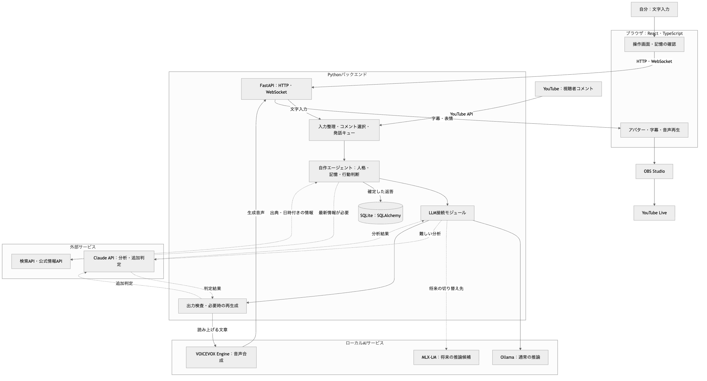
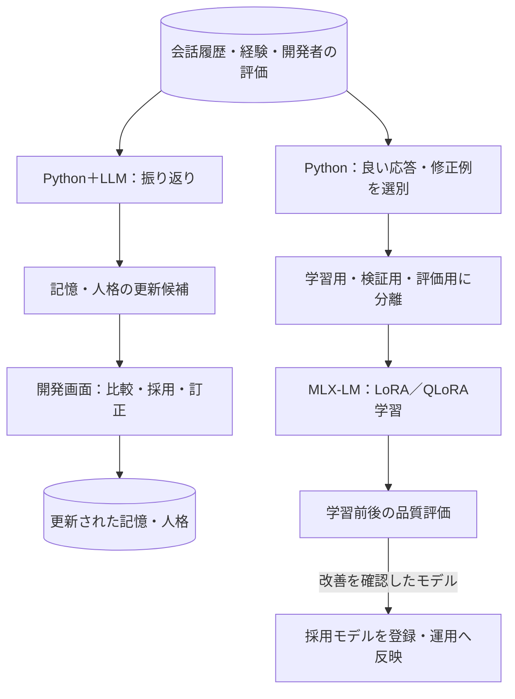

# AI VTuberシステム：全体構成

本書は、ローカル会話とYouTube配信を行い、経験を記憶・振る舞いへ反映するAIキャラクターの設計案をまとめたものです。実装・性能検証済みの仕様ではありません。

## 1. 目的と前提

最終目標は、同じ人格と記憶を持つキャラクターが、普段は開発者と会話し、YouTubeでは視聴者と交流し、その経験を次の話題選びや行動に反映することです。

- 開発・初期運用環境：MacBook Pro、Apple M1 Max、メモリ64GB。
- バックエンド：Python／FastAPI。
- フロントエンド：React／TypeScript。
- 通常の推論：OllamaでローカルLLMを実行。
- 最新情報：検索・公式情報APIから取得。
- 難しい分析・追加判定：必要時だけクラウドLLMを利用。
- 学習：将来、MLX-LMでLoRA／QLoRAを実験。
- アバター：用意済みの画像から始め、後からVRMへ移行。
- 配信先：YouTube。Discord連携は設けない。

自作する中心は、人格・記憶・行動判断・評価です。音声合成、アバター表示、配信には既存技術を利用します。「しずく」の非公開実装を再現した図ではありません。

## 2. 会話・配信中の構成

外部サービス以外は、初期段階ではMac上で実行します。破線は必要時だけ利用する経路です。

図の元データは [architecture.mmd](architecture.mmd) にあります。更新手順はファイル冒頭のコメントに書いています。

クラウドの分析結果は必要に応じてローカルLLMに渡し、共通の人格で返答を作ります。モデルの呼び出し順序や回数は、自作エージェントが管理します。

検査に通過した文章だけを読み上げます。検査で問題が見つかった場合は、上限回数を設けて修正・再生成し、解決できなければ確認できなかった旨を返します。クラウドJudgeだけで事実の正確さを保証できるとは考えません。

## 3. 技術の採用一覧

| 部分 | 採用技術 | 役割・採用範囲 |
| --- | --- | --- |
| 操作画面 | React＋TypeScript＋Vite | 文字入力、字幕、設定、記憶・評価の確認 |
| PNGアバター | AITuber OnAirのReact PNGテンプレートの表示部分 | 画像表示、口パク、まばたき。会話処理はFastAPIへ差し替える |
| 将来の3D表示 | Three.js＋@pixiv/three-vrm | VRM表示、表情、口パク、モーション |
| APIサーバー | FastAPI＋Uvicorn | HTTP API、WebSocket、フロントとの通信 |
| データ検証 | Pydantic | 入出力、記憶、表情などの構造を定義・検証 |
| エージェント | 自作Pythonモジュール | 人格適用、記憶選択、処理の振り分け、行動判断 |
| 発話管理 | asyncio.Queue＋自作Python処理 | 発話の重複防止、順序管理、中断・停止。MVPは単一プロセス |
| ローカル推論 | Ollama＋公式Python SDK | 通常の返答生成。Qwen3.5 9Bを思考出力なしで使用 |
| クラウド推論 | Anthropic Python SDK＋Claude API | 難しい分析、必要時の追加判定。モデルは交換可能にする |
| 最新情報 | Ollama Web Search APIなど＋HTTPX | 検索、公式情報の取得、出典と取得日時の保存 |
| 音声合成 | VOICEVOX Engine＋HTTPX | 音声合成用データを作り、読み上げ音声を生成。話者は猫使ビィ／おちつき |
| DB | SQLite＋SQLAlchemy＋aiosqlite | 会話、経験、人格、評価、利用量の永続化 |
| DB変更管理 | Alembic | テーブル定義の変更履歴を管理 |
| YouTube入力 | YouTube Live Streaming API＋HTTPX | コメント・配信情報の取得 |
| コメント選択 | 自作Python処理 | 重複排除、返答対象の選択、古いコメントの破棄 |
| 配信 | OBS Studio | アバター画面と音声をYouTubeへ送信 |
| 学習 | MLX-LM | LoRA／QLoRAによるファインチューニング |
| 評価 | 自作Python評価処理 | 人格更新・モデル学習の前後を比較 |

### 推論モデル

通常の返答生成にはQwen3.5 9Bを使います。記憶に答えがある質問を同じプロンプトで繰り返し試し、渡した記憶を使って答えることを確認して選びました。別のモデルでは、記憶をプロンプトに渡していても半数程度は「知らない」と答えたため、ここはモデルによる差が大きい部分です。

思考出力は切ります。切っても記憶を使う正確さは変わらず、応答時間だけが大きく縮みました。会話では応答時間がそのまま体験になるため、思考が必要な処理が出てきた段階で、その用途にだけ有効にします。

モデルは交換できるようにしておき、人格・記憶の実装を変えずに比較できる状態を保ちます。比較には、実行記録に残したモデルの版・生成設定・参照した記憶を使います。

### OnAirの利用範囲

OnAirはTypeScript製のため、今回はブラウザ側の表示コードを参考・再利用します。テンプレートの既存会話処理を、FastAPIとの通信に接続し直す実装が必要です。

会話・人格・記憶・コメント選択の管理元はPython側に統一します。OnAirのcoreやcomment-intelligenceを動かすためだけに、バックエンド用Node.jsサーバーを追加する設計にはしません。フロントエンドの開発・ビルドにはNode.jsを利用します。

### ローカル・クラウドの使い分け

通常の会話はローカルで処理します。最新情報には検索を使い、複雑な分析や追加の品質判定だけクラウドに回します。クラウドLLMも検索なしでは最新情報を保証できません。

Ollama経由のWeb検索は外部サービスへのアクセスです。ローカル推論とは別に、APIキー・利用条件・費用・上限を確認します。

## 4. Pythonバックエンドの責任分担

| モジュール | 責任 |
| --- | --- |
| 入力アダプター | ローカル文字、YouTubeコメントを共通形式へ変換 |
| 会話進行 | 誰に答えるか、いつ話すか、中断するかを管理 |
| 人格管理 | 基本の性格、口調、興味、目標、一時的な状態を管理 |
| 記憶管理 | 経験の保存・検索・訂正、相手と公開範囲の管理 |
| 情報取得 | 検索や公式APIを実行し、根拠を整理 |
| LLM接続 | Ollama・Claude・将来のMLX推論を共通の窓口で利用 |
| 出力検査 | 形式、表現、根拠、人格との整合を確認 |
| 振り返り・評価 | 記憶・人格の更新候補を作り、変更前後を比較 |
| 実行記録 | モデル・設定・遅延・外部API利用量を記録 |

初期段階では1つのFastAPIアプリ内に整理します。重い学習処理は別プロセスで実行し、HTTPリクエスト内で学習を完了させる実装にはしません。

## 5. 1回の会話の流れ

1. 発言者、入力元、会話モード、発言内容を受け取る。
2. 配信コメントの場合は返答対象を選び、発話キューに入れる。
3. 相手・話題・公開範囲に合う長期記憶を検索する。
4. 最新情報が必要なら検索し、難しい分析が必要ならクラウドを利用する。
5. 基本の人格、現在の状態、関連する記憶、直近の会話、取得した根拠をLLMへ渡す。
6. 返答と表情を生成し、検査する。
7. 確定した返答を保存し、音声合成・表示へ送る。
8. 再生開始・完了・中断を記録する。生成しただけの文章を、実際に話し終えた内容と混同しない。
9. 会話終了後に、長期的に残す経験や改善候補を整理する。

## 6. 保存するデータ

| データ | 主な内容 |
| --- | --- |
| 会話履歴 | 発言者、時刻、入力元、発言内容、生成・再生の状態 |
| 長期記憶 | 経験、相手について知ったこと、約束、根拠の会話、更新日時 |
| 人格の状態 | 基本の性格、現在の興味・目標、一時的な気分 |
| 関係性 | 相手の識別子、共同の経験、相手への印象 |
| 外部情報 | 事実、出典URL、発表・発生日時、取得日時、再確認条件 |
| 評価・変更履歴 | 改善メモ、理想の返答、更新候補、採用結果、更新前の状態 |
| 実行記録 | モデルの版、生成設定、参照した記憶、応答時間、API利用量 |

会話履歴と長期記憶は分けます。事実と推測も区別し、記憶には根拠を残して訂正可能にします。

ローカルの非公開会話は、その会話で参照する範囲に制限します。配信では公開可能な記憶を利用します。人物の識別には表示名だけを使わず、入力元の識別子を保持します。

ニュースについては「当時そのニュースを話した経験」と「現在も有効な事実」を分けます。RAGは関連情報を検索して生成へ渡す仕組みであり、要約やモデル学習そのものではありません。初期の記憶検索は相手・時刻・キーワードで始め、必要になった段階で意味検索を追加します。

## 7. 会話後の改善・学習経路

| 更新方法 | 更新対象 | タイミング |
| --- | --- | --- |
| 記憶・人格の状態更新 | DB上の経験、興味、目標、関係性 | 会話・配信の終了後 |
| ファインチューニング | モデルの口調、返答の傾向、会話の進め方 | 良質な教師データが集まった段階 |

最初は更新候補を開発者が確認して採用します。評価できる範囲から徐々に自動化します。長期記憶が増えることと、モデルの重みを更新することは別の処理です。

学習には全ログをそのまま投入せず、良い応答や修正した応答を選びます。元モデル・データ・設定・評価結果を版として記録し、前のモデルに戻せるようにします。

学習済みモデルは互換性を確認したうえでOllamaへ取り込みます。MLXからの出力形式やOllamaの取り込みにはモデルごとの制約があるため、Qwen3.5を含めて小さな一通りの実験が必要です。取り込みが難しい場合はMLX-LMで推論します。どちらの場合もエージェントは共通のLLM接続モジュールを使います。

同じMacで学習と推論を動かすと計算資源を取り合うため、初期運用では会話・配信を停止して学習します。モデルの切り替えは評価後、セッションの区切りで実施します。

## 8. 配信と運用

- YouTubeコメントは重複排除し、返答対象を選択する。
- ポーリング取得ではAPIのpollingIntervalMillisに従い、割り当て上限も管理する。
- 発話が重ならないようキューを管理し、古い発言や停止後の結果を破棄する。
- 配信中の検査は読み上げ前に行う。全体的な品質評価は配信後に実施する。
- 検索・クラウドのタイムアウト、利用上限、接続失敗時の応答を用意する。
- 確認できなかった最新情報は断定せず、通常のローカル会話は継続できるようにする。
- 外部サービスの検索回数、トークン利用量、費用、応答時間を記録する。
- 開発用の操作画面と、OBSで視聴者に見せる画面を分ける。
- 音声を公開する場では「VOICEVOX:猫使ビィ」のクレジットを表示する。話者を変えるときは、その話者の利用規約と表記の条件を確認する。

## 9. 公式資料

以下は採用候補の機能を確認するための資料です。具体的なバージョン・互換性は実装時に固定して検証します。

- [FastAPI：WebSocket](https://fastapi.tiangolo.com/advanced/websockets/)
- [HTTPX：非同期HTTP](https://www.python-httpx.org/async/)
- [SQLAlchemy：SQLite](https://docs.sqlalchemy.org/en/20/dialects/sqlite.html)
- [Ollama Python SDK](https://github.com/ollama/ollama-python)
- [Ollama：ツール呼び出し](https://docs.ollama.com/capabilities/tool-calling)
- [Ollama：Web検索](https://docs.ollama.com/capabilities/web-search)
- [Ollama：モデルの取り込み](https://docs.ollama.com/import)
- [Anthropic Python SDK](https://github.com/anthropics/anthropic-sdk-python)
- [VOICEVOX Engine](https://github.com/VOICEVOX/voicevox_engine)
- [AITuber OnAir](https://github.com/shinshin86/aituber-onair)
- [three-vrm](https://github.com/pixiv/three-vrm)
- [YouTube：コメント取得API](https://developers.google.com/youtube/v3/live/docs/liveChatMessages/list)
- [OBS：macOS音声取得](https://obsproject.com/kb/macos-desktop-audio-capture-guide)
- [MLX-LM](https://github.com/ml-explore/mlx-lm)
- [MLX-LM：LoRA／QLoRA・モデル出力](https://github.com/ml-explore/mlx-lm/blob/main/mlx_lm/LORA.md)
