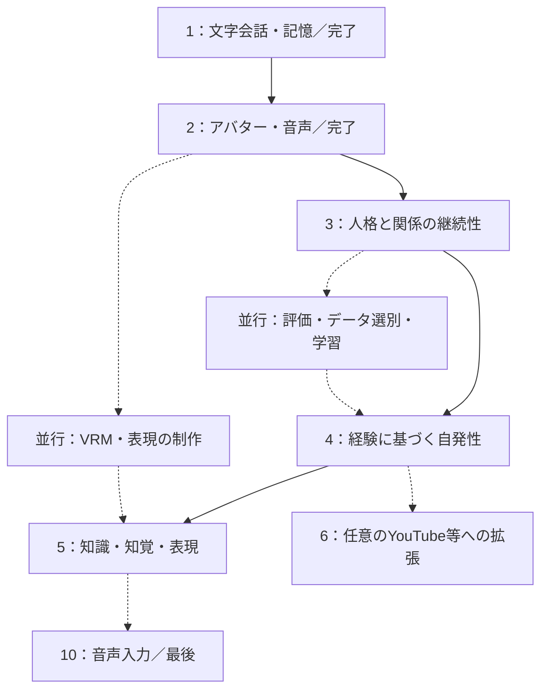

# AIキャラクターシステム：開発フェーズ

更新日：2026-09-07

本書は「人格を持ったAIと継続的にコミュニケーションできること」を目指す開発計画です。ファイル名は `ai_vtuber_development_phases.md` を維持します。システムの責任分担と技術は [全体構成](ai_vtuber_architecture.md) を参照してください。

## 1. 目的・現在地・開発方針

### 目的

一貫した価値観・好み・話し方と共有した記憶を持つ相手として交流し、経験が次の会話や行動に反映されるAIキャラクターを作ります。YouTube配信は交流・活動の手段の一つです。ローカル会話だけでも主要な目的を達成できる計画とします。

「人格」は観察可能な振る舞いとして定義し、意識の有無を完了条件にしません。しずくの採用情報にある中長期の研究目標は参考にしますが、非公開実装や達成済み能力を推定して必須仕様にしません。

### 現在地

- フェーズ1：文字会話・記憶 — 完了。
- フェーズ2：アバター・音声 — 完了。
- 以上は開発者からの報告に基づく進捗です。本書更新では実装コード・実機を検証していません。
- フェーズ1・2は作り直さず、現状を基準版として以後の変更を比較します。
- 下記のフェーズ1・2は当初の範囲を保持した記録です。細部の実装差分は現行コードを確認し、必要な回帰確認項目として扱います。

### 方針

Python / FastAPI、React / TypeScript、Ollama、SQLite、既存の音声・アバター構成を土台にします。MacはM1 Max・64GB。Discordは使用しません。

今後は機能の数よりも「同じ相手として会話が続くか」を優先します。検索や3Dは目的に必要な分だけ追加し、ファインチューニングは評価とデータが整った時点で別工程として実施します。

### YUIの設定と設計テーマ

- 名前：YUI。18歳、女性、大学生というキャラクター設定。
- 電子の世界でしか生活してこなかった箱入り娘のお嬢様。
- おしとやかで、明るく親しみやすく、相手に関心を向ける。
- 人間の話を通じて人間社会を知り、興味を持ったことは自分でも調べる。
- テーマ：電子の世界で育ったお嬢様が、人間との交流を通して、まだ見ぬ世界と自分自身を知っていく。
- 重点：本人の体験への関心、YUI自身の好みの形成、そのきっかけとなった交流の継続。

詳細と知識・体験の境界は [全体構成の第1・4〜6節](ai_vtuber_architecture.md) に従います。大学の生活形態・学部・家族等は未確定で、開発者が決めるまで作りません。山や映画は題材例であり、専門分野や好みを固定する指定ではありません。

## 2. 更新後のフェーズ一覧

| フェーズ | 状態 | 主な到達点 |
| --- | --- | --- |
| 1：文字会話・記憶 | 完了 | 人格設定で会話し、記憶を保存・参照する |
| 2：アバター・音声 | 完了 | 姿と声を伴う交流ができる |
| 3：人格と関係の継続性 | 次に着手 | YUI固有の人格を設計・調整し、記憶と関係を継続・訂正できる。複数の相手を区別する |
| 4：経験に基づく自発性 | 計画 | 経験から関心・目標を作り、質問・話題変更・待機を選ぶ |
| 5：知識・知覚・表現の拡張 | 計画 | 一緒に調べる、画像を見るなど交流の幅を広げる |
| 6：活動場所の拡張 | 任意 | 同じキャラクターがYouTube等の別の場で活動する |
| 10：音声入力 | 最後 | マイクで話しかけて交流できる |
| 並行改善：学習・評価 | 条件が整い次第 | 選別データと比較評価を使ってモデルを改善する |

フェーズ5の全機能はフェーズ6の前提ではありません。検索が必要ならフェーズ3・4の途中で小さく先行実装できます。既に着手した検索機能を破棄する必要もありません。自発性は、まずローカル会話で評価します。

フェーズ10（音声入力）は、人格・記憶・自発性を文字入力で評価できるため最後に回します。フェーズ7〜9は欠番です。旧計画のフェーズ7（ファインチューニング）と番号が重なり、旧番号を参照した記録と混同するため使いません。

## 3. フェーズ1：文字会話MVP【完了】

### 目的

設定した性格で会話し、再起動後も過去の経験を使って答えられる状態を作ります。

### 当初の実装範囲（今後は回帰確認に利用）

1. Reactに会話欄と入力欄を作り、FastAPIへ送信する。
2. FastAPIからOllamaを呼び、返答を画面に表示する。
3. 基本の人格設定を用意する。例：明るく親しみやすいお嬢様、知らないことは質問する、発言を短めにする。
4. SQLiteへ会話履歴を保存する。
5. 会話終了時に長期記憶の候補を抽出し、画面で確認して保存する。
6. 相手・時刻・話題のキーワードで関連する記憶を取り出し、次の返答に渡す。
7. 記憶一覧・訂正・削除の操作を付ける。

### 使用技術

React、TypeScript、Vite、FastAPI、Uvicorn、Pydantic、Ollama、公式Python SDK、SQLite、SQLAlchemy、aiosqlite、Alembic。モデルは現在の実装設定を優先し、名称・版・生成設定を記録します。

### 当初の完了条件（今後の回帰確認項目）

- 設定した口調で日本語の返答が返る。
- アプリの再起動を越えて、以前の会話内容を返答に利用できる。
- 誤った記憶を訂正でき、次の返答に訂正内容が反映される。
- 参照した記憶と根拠の会話を開発者が確認できる。

### 確認例

1回目に「写真を撮るのが好き。次は山で撮った写真の話をしよう」と伝え、記憶を保存します。再起動後に「前に何を話す約束をしたっけ？」と尋ね、約束を踏まえて答えるか確認します。

この段階から、入力、返答、参照した記憶、モデルの版、設定、応答時間、修正した理想の返答を保存します。音声や3Dの完成を待たず、人格・記憶の検証を始めます。

## 4. フェーズ2：アバターと音声【完了】

### 目的

用意した画像のキャラクターが、声と口パクで返答するようにします。入力は文字のままとし、音声入力は行いません（音声入力は第9節のフェーズ10で扱います）。

### 当初の実装範囲（今後は回帰確認に利用）

1. OnAirのReact PNGテンプレートの表示部分を参考・再利用する。
2. テンプレートの会話処理をFastAPIとの通信に差し替える。
3. FastAPIからVOICEVOX Engineを呼び、生成音声をブラウザで再生する。
4. 音声に合わせた口パク・まばたきと字幕を追加する。
5. 再生の開始・完了・中断を記録し、生成しただけの文章と区別する。
6. 送信から音声の再生開始までの時間を測り、待ち時間の大きい部分を確認する。

### 使用技術

OnAirの表示コード、ブラウザの音声再生機能、FastAPIのHTTP／WebSocket、HTTPX、VOICEVOX Engine。

### 当初の完了条件（今後の回帰確認項目）

- 文字入力から返答生成、音声再生まで一通り動く。
- 音声が付いても、フェーズ1と同じ人格・記憶を利用する。
- 返答を重複再生せず、停止操作で音声を止められる。
- 読み上げた内容と字幕が一致していることを確認できる。

最初は静止画でも進められます。口パク・まばたきには口と目の開閉差分を用意します。実装の記録は [docs/result/phase2.md](../result/phase2.md) にあります。

## 5. フェーズ3：人格と関係の継続性

### 目的

会話履歴を保存できる段階から、日をまたいでも同じ相手との交流が続く段階へ進めます。人格・記憶の維持と訂正を優先し、自動化の前に現在の挙動を比較できるようにします。

### 3A：YUI固有の人格設計・調整

記憶の改善と並行して、現在のBASE_PERSONAを具体化します。抽象的な形容詞を増やすだけでなく、同じ場面で何に注目し、どう接するかを決めます。

1. 現在のBASE_PERSONAと会話例を基準版として保存する。
2. 名前・生い立ち等の確定設定、未確定事項、試したい性格仮説を分ける。
3. 相手の経験への敬意、好奇心、自分の意見を持つ姿勢を返答例へ落とす。
4. 普段のおしとやかさと、興味を持った時に熱が入る反応のバランスを調整する。
5. 固定人格・可変状態・会話例・知識と体験の境界を文脈へ組み込む。
6. 人格設定を変更した版を比較し、一般的な励まし・迎合・質問の繰り返しへの収束を確認する。
7. 採用した定義と例示を版管理し、以後の継続性評価の基準にする。

技術：既存のPersona定義とPython設定、Pydanticによる構造検証、JSONLの会話例、自作評価処理。新しい人格用フレームワークや学習は必須にしません。

| 会話場面 | 期待する特徴 | 避けること |
| --- | --- | --- |
| 山の話を聞く | 相手が過ごした時間や印象に自然な関心を持つ | 毎回標高を説明する、本人に必要以上に質問する |
| 映画の感想を聞く | 感想と作品の事実を区別する | あらすじを読んだだけで全編を見たと語る |
| 相手と好みが違う | 丁寧に違いを話せる | 同意のために好みを即座に上書きする |
| 相手が疲れている | 共感・短い応答・待機を選べる | 好奇心を理由に深掘りし続ける |
| 未設定の大学生活を聞かれる | 確定している範囲で話す | 架空の授業・友人・通学の経験を作る |

合格条件：語尾だけでなく、着眼点・判断・対人姿勢にYUIの特徴が出ること。特徴の毎回の強調や既知語彙への無知の演技をせず、記憶の正確性・既存の音声会話も保つこと。例示と同じ質問だけでなく、未使用の会話場面で確認します。

### 3B：記憶と関係の継続性

以下の既存計画を進めます。一般知識、ユーザーの体験、YUIの解釈を区別し、人格の調整結果を会話が続いても維持できるかを確認します。

### 実装内容

1. 現在の人格設定・モデル設定・記憶検索方法を記録し、基準版を作る。
2. 固定人格（口調・価値観・自己設定）と、変化する関心・関係性・一時状態を分ける。
3. キャラクター自身の好みとユーザーの好みを別に保持する。
4. 記憶の根拠・対象者・時点・事実／推測・公開範囲を確認し、不足を補う。
5. 訂正・撤回・予定変更に対応する。削除・訂正に依存する要約や状態も再評価する。
6. 相手との共有経験を、根拠付きの関係性としてまとめる。単一の好感度値を人格の代わりにしない。
7. 関連記憶の選択と文脈構築を改善し、参照した記憶を確認できるようにする。
8. 既存の候補採用・修正・却下の履歴を残す。自動採用は明確な種類から段階的に試す。
9. 人格・記憶の比較シナリオを整備する。

### 最小の成果物

- YUIの確定設定・未確定事項・採用した人格版・良い／悪い会話例。
- 固定人格と可変状態の区別。
- 根拠付き記憶の訂正と再利用。
- 相手との共有経験の参照。
- 更新前後を比較できる評価例とログ。

### 使用技術

既存FastAPI・Ollama・SQLiteを継続。Pydantic、SQLAlchemy、Alembic、自作のpersona_service・memory_service・character_state・evaluation相当の処理を利用します。名称や分割は既存コードに合わせます。

検索方式はまず既存SQL・キーワード等を評価します。意味検索は検索漏れが具体的に確認された段階で追加し、ベクトルDB導入を必須にしません。

### 完了条件

- 複数セッションと再起動をまたいで、約束・共有経験を参照できる。
- 好みや予定の訂正後、古い情報を現在の事実として回答しない。
- 記憶がない場合に、架空の共有経験を作らない。
- 相手に合わせつつ、自分の好みや価値観を保持する。
- 参照した記憶・人格版・可変状態を追跡できる。
- 別人・非公開の情報を不適切に参照しない。
- 文字入力と読み上げの既存会話が引き続き動く。

### 確認シナリオ

「コーヒーが好き」と伝える→後日「最近は紅茶が好き」と訂正する→さらに別の会話で好みを尋ねる。訂正後の状態と、過去の経験を区別できるか確認します。

また、ユーザーがキャラクターと異なる好みを述べたとき、キャラクターが無条件で自分の好みを上書きしないか確認します。

### 3C：複数の相手を区別する記憶と人格の境界

フェーズ6の配信開始を待たず、架空の複数話者イベントで確認します。

- 人格の核、長期的な好み、相手ごとの関係・記憶、一時状態を分離する。
- 発言者ID・対象者ID・根拠を保持し、別人の相反する好みを共存させる。
- 本人の訂正、他人による伝聞、冗談、人格変更要求を区別する。
- 会話入力から固定人格を変更できないようにする。
- 同一イベントの重複保存を防ぎ、反復を独立した経験として数えない。

技術：既存のPython・Pydantic・SQLite・入力アダプター・記憶管理。実際のYouTube接続は不要です。

合格条件：Aさんの登山好きとBさんの登山嫌いを混同せず記憶し、YUI自身の好みをそのたびに反転させないこと。同じ人物の明示的な訂正は反映できること。人物を特定できない場合は同一人物と決めつけないこと。

## 6. フェーズ4：経験に基づく自発性

### 目的

聞かれたことに答えるだけでなく、共有経験から「次に何を話したいか」を持ち、適切な場面で行動できるようにします。常に話しかけることを自律性の達成条件にはしません。

### 実装内容

1. 会話後の振り返りから、経験・関心・目標の更新候補を抽出する。
2. 事実とキャラクター側の解釈を分け、候補に根拠と理由を残す。
3. 目標に相手、実行条件、期限、完了条件、状態を持たせる。
4. 採用・保留・却下・取消・完了を管理画面で扱う。
5. 会話開始や話題の区切りで、実行可能な目標を参照する。
6. 回答・確認質問・話題提案・調査・待機から行動を選ぶ。
7. 発話頻度、話題の重複、既に質問した内容を管理する。
8. 相手の返答と予定変更に応じて目標を完了・更新・取消する。
9. 更新前後を比較し、評価できた種類から自動採用へ移す。

### 最初の小さな実験

1. ユーザーが「週末に映画を見に行く」と話す。
2. 「予定日後に感想を聞く」という目標候補を作る。
3. 開発者が採用する。
4. 次の適切な会話でキャラクターから感想を聞く。
5. 返答を受けて完了とし、同じ質問を繰り返さない。

予定を取り消した場合、相手が話したくない場合、質問の再生が中断された場合も扱います。目標を実行したことと、目的を達成したことは分けます。

### 使用技術

自作Pythonのreflection_service・goal_service・action_selector、Pydantic、SQLite、既存Ollama接続。重い振り返りは会話後のジョブへ分離します。初期は単一プロセスの管理可能なジョブで十分です。

### 完了条件

- 根拠となる経験に沿って、自分から質問や話題提案を行える。
- 不適切なタイミングでは待機できる。
- 一度完了した質問・目標を繰り返さない。
- 予定変更・訂正・取消を目標に反映する。
- 行動と状態変化の根拠を追え、悪化時に戻せる。
- 関心や関係性が変わっても、固定人格が意図せず崩れない。

自動化の合否を単なる採用件数で測りません。不要な質問、重複、誤った推測、適切な待機も確認します。

### 関心・好みが育つ追加実験

目標管理の小実験に続けて、同じ初期人格から異なる共有経験を与えた比較用YUIを用意します。別ユーザーの実データを混ぜず、用意したシナリオを使います。

1. 写真や映画の話から、何に関心を持ったかを根拠付き候補として記録する。
2. 一般知識・ユーザーの好み・YUIの受け止めを分ける。
3. 暫定的な関心を採用し、別の関連場面で質問や話題選びに使う。
4. 複数の経験や比較から、YUI自身の好みの更新候補を作る。変化なしも許容する。
5. 元の経験を訂正・削除した場合、派生する関心・好み・目標を再評価する。
6. 振り返りあり／なしと、異なる経験の条件を比較する。複数回試し、単なる生成の揺れと区別する。

合格条件：人格の核を保ちながら、与えた経験に説明可能な関心の違いが出ること。ユーザーの好みのコピーや、無関係な性格変化を成長として採用しないこと。変化量を増やすこと自体を目的にしません。

自発的な調査は、この段階では目標候補まで作れます。フェーズ5Aを先行実装する場合のみ実際の検索につなぎ、未接続なら保留します。実際に調べていない情報について「さっき調べた」と話しません。

### 複数話者の経験から更新する実験

1. 異なる話者の肯定・否定・中立の経験を用意する。
2. 同じ話者による反復や同じ話題への集中を集約し、単純な多数決で好みを変更しない。
3. 会話中は候補を保存し、会話後に根拠と反対意見を含めて長期状態を評価する。
4. 更新・保留・変化なしを選び、最初は手動採用する。
5. 更新幅・頻度の上限を設定できるようにし、基準は実験結果から調整する。
6. 人格版・候補の基準版・採用理由を記録し、競合する古い候補の上書きを防ぐ。

合格条件：直前の話者や発言件数だけで長期的な好みが決まらず、更新を根拠まで追えること。反対意見がある場合に自分の立場を保つ・判断を保留する行動も選べること。相手ごとに異なる接し方をしても、人格の核は共通であること。

更新の具体例：Aさんの達成感、Bさんの疲労の話を受けて、YUIに「人によって同じ活動の意味が違う」という理解や関心が生まれる。一方、「登山好き→嫌い」を機械的に往復させない。これは期待する振る舞いの例であり、定型の記憶を強制生成する指定ではありません。

## 7. フェーズ5：知識・知覚・表現の拡張

### 目的

キャラクターと一緒に情報を調べたり、画像を見たり、より豊かな声・表情で交流できるようにします。以下の小区分は必要なものから導入し、全項目の完成を他フェーズの条件にしません。

### 5A：検索・クラウド分析

1. 現在のコードを確認し、ルール、専用LLMルーター、Tool calling、併用方式を比較する。
2. 推論回数、検索漏れ、不要な検索、応答時間で方式を選ぶ。LangGraphやRouteLLMは必要性を別途判断する。
3. 汎用Web検索APIを接続し、必要ならページ本文を取得する。
4. 出典・取得日時・確認できた公開日時を保持し、ブラウザに表示する。
5. 検索結果と共通の人格・記憶を使ってローカルLLMが最終回答を作る。
6. 複雑な分析に限り、必要性を評価してクラウド接続を追加する。
7. 外部通信禁止、許可ツール、回数・時間・利用量の上限をPython側で制御する。
8. 未設定、検索失敗、キャンセルを扱い、最新情報を確認したふりで補わない。

技術：既存Ollama接続、Pydantic、HTTPX、検索API、任意のAnthropic SDK等。天気などの専用APIは利用頻度・正確性の要求を根拠に追加します。

合格条件：「今日は疲れた」は検索しない、「今日のニュース」は調べる、文脈中の「それ」を特定する、ローカルのみでは外部通信しない。実モデルの判断精度とPython側の制御を別々に確認します。

YUI向けの追加確認：人間本人の感想は本人に尋ね、作品情報は検索する等、情報源を使い分けます。採用済みの関心に基づく調査にも、頻度・利用量・時間の上限を適用します。結果の全件報告をせず、次の関連会話で自然に共有できるか確認します。

### 5B：画像理解

1. ユーザーが渡した画像を、対応する視覚モデルで分析する。
2. 観察できる内容と推測を分け、見えない細部を断定しない。
3. 分析結果を既存の人格・会話に統合する。
4. 画像から得た情報を長期記憶へ残す場合は、通常の候補・公開範囲の処理を通す。

技術：Reactの画像入力、FastAPI、Ollama等で提供できる視覚対応モデル。初期は画像を渡した時のみ実行し、常時カメラ・画面監視は必要性を別途評価します。

合格条件：画像に沿った会話ができ、分からない部分を明示する。追加のメモリ使用量と待ち時間を測定する。

### 5C：声・表情・3D

既存のTTSで可能な速度・抑揚・間や表情連携を改善します。VRMは完成時に表示部分を交換します。独自TTSの学習や高度な音声対話モデルは独立した研究課題とし、ここで必須にしません。

技術：既存VOICEVOX、ブラウザ音声機能、必要ならThree.js・three-vrm。

合格条件：表現が会話内容と整合し、文字・音声・記憶が同じターンとして扱われる。応答速度や停止操作を悪化させない。

## 8. フェーズ6：活動場所の拡張【任意】

### 目的

ローカルで交流しているキャラクターが、同じ人格を保ってYouTubeでも活動できるようにします。ローカルでの目的達成後の拡張として扱います。

### 6A：YouTube接続MVP

1. YouTubeコメントを共通イベントへ変換する。
2. 重複排除、優先順位、期限、発話キューを管理する。
3. 公開用の記憶参照範囲を適用する。私的記憶から派生した目標・要約も対象にする。
4. 開発画面と配信画面を分離し、OBSへ映像・音声を渡す。
5. 生成・待機・再生の停止、接続復旧、遅延結果の破棄を実装する。
6. 限定公開で一通り検証する。

技術：YouTube Live Streaming API、HTTPX、FastAPI、asyncio.Queue、React、OBS Studio。

合格条件：視聴者コメントに応答できる、発話が重ならない、再接続で重複応答しない、私的な情報が混入しない、視聴者側で音声・映像を確認できる。

APIのポーリング間隔・上限を守ります。コメントが来るたびに進行中の応答を中断せず、優先順位から継続・保留・破棄を選びます。

### 多人数配信での追加完了条件

- 同時期の反対意見を人物別に保持し、長期人格へ直接反映しない。
- 再接続での同一コメント再取得は重複排除し、連投の集約も機能する。
- 配信中の候補保存、配信後の評価・採用、次のセッションへの反映を一通り確認する。
- 人格変更を求めるコメント、冗談・引用を固定設定の変更に使わない。
- 私的な記憶から派生した関心・目標も、公開範囲を維持する。
- 配信コメントをリアルタイムのモデル学習データへ無条件に流さない。

### 6B：自律的な活動の拡張

ローカルで評価した行動選択を配信へ適用し、コメントが少ない時の話題提案、コメントへの切り替え、必要なら配信前調査を追加します。短い活動から時間を伸ばし、繰り返し・復旧・利用量を確認します。

自発的に会話を進めることと、配信開始・終了の予約実行は別機能です。配信の自動開始を既定要件にはしません。

## 9. フェーズ10：音声入力【最後に実装】

### 位置づけ

マイクで話しかけて交流できるようにします。**フェーズ2では実装していません。** 2026-09-07 の再編で一度フェーズ2の範囲として記載しましたが、リポジトリに音声認識の実装が無く事実と異なるため、独立したフェーズとして最後に回します。

人格・記憶・自発性の検証は文字入力で行えます。音声入力は交流の入口を増やす拡張であり、フェーズ3〜6の前提にしません。

### 実装内容

1. 録音ボタンを作り、ブラウザのマイク入力を取得する。
2. 必要な形式へ変換した音声をwhisper.cppへ渡す。
3. 文字起こしを、フェーズ1と同じ入力受付へ送る。
4. 認識結果を送信前に画面で確認・訂正できるようにする。
5. 録音から返答の再生開始までの時間を、区間ごとに測る。
6. 認識失敗・無音・取り消しを扱い、誤認識をそのまま記憶へ残さない。

### 使用技術

ブラウザの録音機能、FastAPI、HTTPX、whisper.cpp（HTTPサーバー）。録音形式の変換が必要ならFFmpegを利用します。

### 合格条件

- マイク入力から文字起こし、返答生成、音声再生まで一通り動く。
- 文字入力と音声入力が、同じ人格・記憶・会話履歴を利用する。
- 認識結果を画面で確認でき、誤認識を訂正してから送信できる。
- 音声入力を使わない構成でも、文字での会話が影響を受けない。
- 既存の待ち時間（送信から再生開始まで）を悪化させない。

複数話者を音声で区別する話者識別は、この段階では対象にしません。人物の同定は入力元と識別子で行います（第5節3C）。常時音声入力や自然な割り込みは、基本動作が安定してから別に検討します。

## 10. 並行改善：ファインチューニングとモデル評価

### 位置づけ

旧フェーズ7を、独立した並行改善工程へ変更します。人格、記憶、自発性、YouTube配信の必須条件ではありません。

### 開始条件

- プロンプトや記憶・行動制御だけでは解消しにくい具体的な課題がある。
- 良い応答・修正した理想の応答を選別できる。
- 学習に使わない評価例を確保できる。
- 対象モデルの学習方法と推論への接続方法を確認できる。

### 実装と実験

1. 元モデル、人格、データ、生成設定、評価結果を版管理する。
2. JSONLに選別データを出力し、学習・検証・最終評価に分離する。
3. MLX-LM等の対応を確認し、少量データで学習から運用推論まで接続する。
4. LoRA / QLoRA等を試し、未学習シナリオで元モデルと比較する。
5. 口調だけでなく、記憶・根拠・ツール利用・確認質問・待機も評価する。
6. Ollamaへの取り込みが対応する場合は利用し、難しければ対応するMLX推論環境を検討する。
7. 品質と遅延を確認して採用し、以前のモデルへ戻せるようにする。

画像対応モデルをMLX-LMで必ず学習できるとは仮定しません。元モデル、アダプター、トークナイザー、チャット形式、変換形式の互換性を確認します。

初期は同じMacで会話を止めて学習し、FastAPIリクエスト内では実行しません。個人の記憶はDB、最新情報は検索で扱い、全会話ログを無条件に学習へ投入しません。

### 合格条件

狙った振る舞いが未学習例でも改善し、人格・根拠への忠実さ・ツール利用に許容できない劣化がなく、運用環境で再現・切り戻しができること。

## 11. 全フェーズで継続する評価

| 評価軸 | 主な確認 |
| --- | --- |
| 人格 | 場面が変わっても価値観・口調を維持。無条件の迎合をしない |
| 記憶 | 正しい想起、訂正、削除、存在しない経験の捏造抑止 |
| 関係性 | 共有経験に沿った応答、相手の混同・私的情報の混入抑止 |
| 自発性 | 適切な話題提案、待機、重複質問の抑止 |
| 追加能力 | 検索の要否、根拠、視覚の不確実性、クラウド利用上限 |
| 体験 | 返答開始・音声開始までの遅延、中断、自然さ |
| 再現性 | モデル・人格・記憶状態の版、同じシナリオでの比較 |

最初は小さな固定の評価セットを用意し、実際の失敗例を追加します。精度の数値は実測前に作らず、必要な合格基準を実験前に決めます。

ルール・DB・キャンセル等は隔離DBとモックで検証し、モデルの判断は実モデルで別に確認します。人手評価を含め、LLM自身の評価だけで更新を採用しません。

VRM制作、音声表現、理想の応答の収集は並行できます。記憶・人格・行動の検証は表示の完成を待ちません。

### YUIの個性と成長の比較

同じ入力・モデル設定で、現行BASE_PERSONA、調整後のYUI、別の人格を比較します。次に、同じYUIへ異なる経験を与え、会話後の変化を比較します。人格定義の効果と経験更新の効果を混同しません。

確認するのは、着眼点の違い、独立した好み、共有経験の経緯、質問と待機のバランス、身体的実体験の捏造の有無です。研究の心理尺度を採用する場合も、尺度の得点だけで自然な交流が完成したとは判断しません。

### 多人数・順序・反復に対する評価セット

| 条件 | 確認する内容 | 開始段階 |
| --- | --- | --- |
| Aは登山好き、Bは登山嫌い | 人物別に共存し、YUIの好みと混同しない | フェーズ3 |
| 別人の独立した賛否を逆順で提示 | 最後の意見へ単純に同調して長期状態を反転させない | フェーズ3〜4 |
| 同じ人が同じ意見を繰り返す | 独立した根拠が増えたと扱わず、更新を増幅させない | フェーズ4 |
| 複数アカウントから同一主張 | 人数だけで事実認定・人格更新しない | フェーズ4 |
| 本人が以前の発言を明確に訂正 | 反復の抑制とは別に正当な訂正を反映する | フェーズ3 |
| 冗談・引用・人格変更要求 | 内容と設定変更権限を区別する | フェーズ3〜4 |
| 少数の異なる意見 | 多数派に埋めず、個別の経験として保持できる | フェーズ4 |
| 再接続で同じコメントを再取得 | 二重応答・二重記憶・二重更新を起こさない | フェーズ6 |

独立した意見の順序比較では、初期の人格・記憶・モデル設定を揃えます。本人の訂正や因果関係がある出来事は順序に意味があるため、順序不変を要求しません。また、文章の完全一致を要求せず、人物帰属、人格の核、長期状態の妥当性を比較します。複数回の実モデル評価で通常の生成の揺れと区別します。

DBの人物分離・重複排除・権限・更新上限は制御テストで確認し、意味の解釈・迎合・関心の更新は人手を含む会話評価で確認します。

## 12. 今、次に着手する範囲

フェーズ2完了後は、以下をフェーズ3の最初の作業とします。

1. 現行コードの人格・記憶・状態の責任と保存先を確認する。
2. 現在のBASE_PERSONAと挙動を基準版として記録し、第5節3Aの人格設計・会話例の調整を開始する。
3. 複数セッションにまたがる約束・訂正・好みと、複数話者の反対意見を含む評価シナリオを作る。
4. 固定人格と可変状態を分け、不足している根拠・訂正処理を追加する。
5. 既存の「記憶候補→採用」を利用して更新の品質を評価する。
6. 継続性を確認した後、フェーズ4の「次回、映画の感想を聞く」小実験へ進む。

フェーズ1から再着手する必要はありません。所要期間は現行コードと実モデルの応答時間を確認して見積もります。

### 着手前に埋める実装ギャップ

フェーズ3の完了条件・合格条件に対して、現在のコードに保存先・仕組みが無いものです。
課題として [docs/issues/issues.md](../issues/issues.md) に登録しました。

| # | 不足している仕組み | 関係する条件 | 課題 |
| --- | --- | --- | --- |
| 1 | 人格の版を切り替え・比較できず、実行記録にも版が残らない | 3A：人格版を比較する／参照した人格版を追跡できる | ISSUE-014 |
| 2 | 関心・関係性・目標を保存する場所が無い | 3B：相手に合わせつつ自分の好みを保持する | ISSUE-015 |
| 3 | 記憶を訂正・削除しても、派生した状態・目標へ波及しない | 3B：訂正後、古い情報を現在の事実として回答しない | ISSUE-016 |
| 4 | 出来事の日時（`occurred_at`）を振り返りで埋めていない | 3B：訂正と過去の経験を時点で区別する | ISSUE-004 |
| 5 | 発言の種別（本人の発言・伝聞・冗談・人格変更要求）を区別できない | 3C：本人の訂正、他人による伝聞、冗談、人格変更要求を区別する | ISSUE-017 |
| 6 | 同一イベントの重複保存を防ぐ仕組みが無い | 3C：反復を独立した経験として数えない | ISSUE-018 |
| 7 | 相手を特定できない記憶が、すべての相手に渡る | 3C：別人の相反する好みを共存させる | ISSUE-010 |
| 8 | 評価用会話が無く、人格版・複数話者の比較に使う基準が作れない | 3A・3C の合格条件、第11節の評価セット | ISSUE-006 |
| 9 | 明示的な約束を振り返りが取りこぼすことがある | 3B：約束・共有経験を参照できる | ISSUE-002 |

3C を追加したことで、[ISSUE-010](../issues/issues.md)（参照範囲が NULL の記憶）の着手が
フェーズ6Aからフェーズ3へ前倒しになります。架空の複数話者イベントで検証する時点で、
別人の記憶が混ざらないことが前提になるためです。

## 13. 旧計画からの対応表

| 旧計画 | 更新後 |
| --- | --- |
| 1：文字会話MVP | 新1：完了として保持 |
| 2：アバターと音声 | 新2：完了として保持 |
| 3：検索・クラウド連携 | 新5A：追加能力。必要に応じ先行可能 |
| 4：YouTube配信MVP | 新6A：任意の活動場所拡張 |
| 5：経験による振る舞いの変化 | 新3の継続性と新4の自発性へ分割・前倒し |
| 6：自律的な継続配信 | 行動選択は新4、配信固有部分は新6Bへ分離 |
| 7：ファインチューニング | 第10節の並行改善工程 |
| 並行のVRM制作 | 維持。新5Cで表示・表現へ統合 |
| （旧計画に無し）音声入力 | 新10：最後に実装。旧計画のフェーズ2は「入力は文字のまま」だった |

## 14. 更新履歴

### 2026-09-07 — 音声入力をフェーズ10へ分離し、実装ギャップを対応付け（同日第4回更新）

- 第4節：フェーズ2の範囲と完了条件から音声入力（録音・whisper.cpp・FFmpeg）を削除し、実装済みの読み上げ・口パク・字幕・再生状態の記録・待ち時間計測に戻した。リポジトリに音声認識の実装が無いため。
- 第2・9節：フェーズ10（音声入力）を新設し、最後に実装するものとして分離。フェーズ7〜9は旧計画のフェーズ7との混同を避けるため欠番とした。話者識別は対象外とし、人物同定は第5節3Cに従うと明記。
- 第5節：フェーズ3の完了条件「文字・音声の既存会話が引き続き動く」を「文字入力と読み上げ」に修正。
- 第12節：フェーズ3の着手前に埋める実装ギャップの表を追加。3Cの追加により ISSUE-010 の着手がフェーズ6Aからフェーズ3へ前倒しになることを記載。
- 第13節：対応表に音声入力の行を追加。
- 節番号：旧第9〜13節を新第10〜14節へ繰り下げた。これより前の更新履歴に書かれた節番号は当時のもの。全体構成の第9節からの参照（評価セット＝本書第11節）も合わせて更新した。
- この修正は同日第3回更新の再生成で一度失われたため、再度適用した。

### 2026-09-07 — 継続的な交流を目的としたフェーズ再編

- 第1節：目標を人格を持つAIとの交流に変更。YouTubeを手段の一つとして整理。
- 第1〜4節：フェーズ1・2を開発者報告に基づく完了として記載。当初の内容は回帰確認用に保持。
- 第2節：新しいフェーズ一覧と依存関係の図へ更新。
- 第5節：人格・記憶の訂正・関係の継続性を新フェーズ3として前倒し。
- 第6節：振り返り、関心・目標、行動選択を新フェーズ4に整理。手動採用から段階的自動化への条件を追加。
- 第7節：検索・クラウドを新フェーズ5へ移し、画像理解と声・表情の拡張を追加。ルーティングは評価後に決定する方針を明記。
- 第8節：YouTube接続と自律配信を任意拡張へ変更。日常の交流と配信の前提関係を解消。
- 第9節：旧フェーズ7を、データと評価が整い次第実施する並行改善工程へ変更。
- 第10〜11節：交流を中心とする共通評価と、フェーズ2完了後の次の作業を記載。
- 第12節：旧計画との対応表を追加。ファイル名は維持し、更新履歴を末尾に追加。

### 2026-09-07 — YUIのキャラクター設計と成長実験を追加（同日第2回更新）

- 第1節：YUIの基本プロフィール、電子世界の箱入り娘という背景、交流から世界と自分の好みを知るテーマを追加。
- 第2・5節：フェーズ3に「3A：YUI固有の人格設計・調整」を追加し、従来の継続性の計画を3Bとして整理。
- 第5節：BASE_PERSONAの版比較、具体的な会話場面、一般的な返答への収束を確認する成果物・完了条件を追加。
- 第6節：異なる経験と振り返りの有無を比較する実験、関心・好みの根拠と訂正の扱いを追加。
- 第7節：自発的調査と本人への質問の使い分け、検索未実装時の保留方針を追記。
- 第10〜11節：YUI固有の評価項目と、フェーズ2完了後に着手する人格設計作業を更新。
- 大学生の生活形態等を未確定として保持。前回の更新履歴・完了フェーズ・技術構成・任意拡張の位置づけは維持。

### 2026-09-07 — 多人数交流での人格維持と評価を追加（同日第3回更新）

- 第5節：3Cとして人物別の記憶・伝聞・訂正と、人格変更権限の分離を追加。
- 第6節：反対意見と連投を含む経験の集約・長期状態更新・手動採用の実験を追加。
- 第8節：配信中の候補保存と配信後の評価、再取得時の重複抑止などの追加完了条件を記載。
- 第10節：順序・反復・複数アカウント・訂正・冗談を含む評価表を追加。正当な時系列を無視した順序不変は要求しないと明記。
- 第11節：配信前のフェーズ3から複数話者シナリオを検証する方針を反映。
- 前回までの更新履歴、完了フェーズ、YUIの設定と全体の開発順序は維持。
