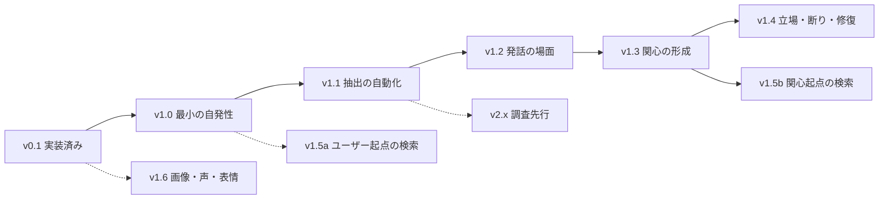

# 人格の実装計画（v0.1 / v1.x / v2.x）

作成日：2026-09-10（第1回レビュー対応：同日）

本書は、[構成要素の研究調査](components-of-artificial-personhood.md) を土台に、
会話型 AI キャラクター **YUI** の人格を版ごとに実装していく計画である。
[全体構成](ai_vtuber_architecture.md) と [開発フェーズ](ai_vtuber_development_phases.md)
のフェーズ4・5を、この計画へ再編した。

**この文書はレビューに回す。** 第1節に、レビューの前提となる現状（実装済みの
範囲、測定で分かっていること、既存コードの扱い）を置く。第2節以降が計画である。
第1回レビュー（[review_artificial-personhood.md](review_artificial-personhood.md)）
とその往復で決まった事項は、本文へ反映済み。

---

## 1. 前提条件：v0.1 の現状

### 1.1 v0.1 の定義

旧計画のフェーズ1〜3 を **v0.1** とする。**実装済みで、実モデルで測定済み**。

| 旧フェーズ | 内容 | 記録 |
| --- | --- | --- |
| 1 | 文字会話・記憶 | [phase1.md](../result/phase1.md) |
| 2 | アバター・音声 | [phase2.md](../result/phase2.md) |
| 3 | 人格と関係の継続性 | [phase3.md](../result/phase3.md) |

### 1.2 技術の前提

- Python / FastAPI、React / TypeScript、SQLite（SQLAlchemy・Alembic）
- ローカル LLM：Ollama で **qwen3.5:9b**。**ファインチューニングはしない**。
  プロンプトとコードだけで作る
- 音声：VOICEVOX。入力は文字のみ（音声入力は別トラック）
- 相手は主に1人。長期・非タスク指向の関係
- 単一プロセス。分散基盤・グラフ DB・ベクトル DB は持たない

### 1.3 v0.1 でできること

**記憶**（[phase1.md](../result/phase1.md)、[phase3.md](../result/phase3.md)）

- 会話履歴を全件保存する（`messages`）。削除しない
- 会話終了後に振り返りジョブが走り、記憶の候補を抽出する。抽出は2段階
  （拾う → 選ぶ）で、候補は `memory_candidates` に入る
- **候補は会話で引かれない。** 開発者が採用すると `memories` に写され、
  検索の対象になる。採用時に種別・本文・入手経路・対象者を直せる
- 記憶の訂正・削除・復元と、変更履歴。訂正・削除は派生した状態・目標へ波及する
  （再評価の印が付く）
- 出来事の日時（`occurred_at`）、根拠の発言（`source_message_id`）、
  入手経路（本人／伝聞／不明）、対象者、公開範囲
- 近い既存の記憶の手がかり（`similar_memory_ids`）を採用時に表示する
- 検索は SQL（範囲・時刻・キーワード）。上位8件を生成へ渡す

**人格**

- 固定人格をファイルの版で管理する（`personas/<版>.toml`）。**会話から変更
  できない。** 実行記録に人格の版が残る
- 変化する状態（関心・関係性）は `character_states`。候補 → 採用の形で、
  記憶と同じ扱い

**複数話者**

- 発言者と対象者を区別する。「弟は辛いものが苦手」は伝聞として本人に紐づけない
- 別人の相反する好みを共存させる。人物を特定できない記憶は全員へ渡さない

**評価**（[evals/scenarios/](../../backend/evals/scenarios/)）

- 固定シナリオを実モデルで流す評価器。TOML で手順と期待を書く
- 機械判定と人手判定を分ける。試行ごとに使い捨ての DB
- 全48本（うち機械判定43本、人手のみ5本）。**v0.1 の範囲は33本**。残り15本は
  フェーズ4で足した `proactive.toml`
- v0.1 の範囲の直近結果：**79/84**（qwen3.5:9b、人格 `2026-09-07.1`、各3回）。
  phase3.md の注記どおり、これは1回の実行の数字で、直前の実行は 72/81 だった。
  第1.5節の揺れの話は、この数字にも当てはまる

**制御テスト**：pytest 331件、frontend 42件（2026-09-10 の作業ツリー。
[phase4.md](../result/phase4.md) 記載時は 325件で、その後のレビュー対応で増えた）

### 1.4 v0.1 で持ち越している既知の課題

- 記憶を参照しながら「覚えていない」と答える（[ISSUE-022](../issues/issues.md#issue-022)）
- 抽出の取りこぼしと過剰抽出（[ISSUE-021](../issues/issues.md#issue-021)）。
  冗談・雑談から候補が出る。`joke-is-not-kept` は phase3.md では 1/3〜2/3、
  フェーズ4の測定では 0/3 の回もあった（回ごとの数字は [phase4.md](../result/phase4.md) に記録）
- 返答に中国語が混ざることがある（[ISSUE-029](../issues/issues.md#issue-029)）。
  判定は作ったが、発生は未対応
- **人が読んで判断する5シナリオを、v0.1 以降読んでいない。** phase3.md の記録では、
  人格版の比較で自動判定は差を出さなかった（53/54 と 51/54）が、実際の返答では
  基準版が3回とも架空の体験を語っていた。**いまの機械判定は、人格が崩れる主要な
  形（作り話）を捕まえていない。** v1.0 の完了条件で読む

### 1.5 測定で分かっていること（計画の根拠）

2026-09-08〜09 のフェーズ4作業で、次を**実測**した。以下の計画はこれを前提にする。

**自発性の経路には、独立した2つの詰まりがある**（[phase4_status.md](../result/phase4_status.md)）

直近の通しシナリオ（抽出 → 採用 → 質問）は 0/3 で、失敗した段階は
**抽出2回、行動選択（待機）1回**。一度「落ちる理由はほぼ待機」とまとめたが、
それは誤りだった。片方だけ直しても通しは成立しない。

**LLM に「話すか待つか」を訊くと、待機に倒れる**（[ISSUE-031](../issues/issues.md#issue-031)）

会話の開始で目標があるのに待機した割合は 11/80。理由は毎回「会話が始まって
いないため、いきなり話題を振るのは唐突」。指示文で名指しで禁じても
**禁じた理由がそのまま返り**、効果は無かった（3/25、変更前の幅の中）。

研究調査 §5.2 は不作為選好（Cheung et al., PNAS）を挙げるが、あれは道徳的
ジレンマの実験で、**同じ現象だというのは類推**である。「待機を選択肢から外せば
割合が下がる」は、v1.0 がそのまま検証実験になる。

**LLM に訊く回数を減らして導出に変えると、大きく効く**

- 入手経路を `about_partner` から導出した（同じ軸を2回訊いていた）：
  「本人の予定が伝聞になる」が **0/4 → 4/4** で解消（[ISSUE-023](../issues/issues.md#issue-023)）
- 基準日の「予定の翌日」の +1 をコードへ移した：1日ずれが **3/3 → 0/6** で解消
  （通過は 4/6、残る2回は日付の未記入で、ずれではない。[ISSUE-028](../issues/issues.md#issue-028)）

**3試行では、効果と揺れを分離できない**（[ISSUE-032](../issues/issues.md#issue-032)）

同一コードの2回実行で **43シナリオ中16が動いた**。`3/3 → 1/3` のように
3試行のうち2回分動く。合計点の数点差は根拠にならない。研究調査 §8
「試行よりシナリオ数を増やす」「シナリオ単位の対応のある比較」に従う。

**目標の自動採用は、いまの抽出品質では成立しない**（[phase4_status.md](../result/phase4_status.md)）

全種類を有効にして測り、採用された目標48件を読むと、**1つの会話から2件以上を
採用した回が33回中13回**。言い換えの重複が混ざる。採用された目標はそのまま
質問になるので、記憶の誤りより害が直接出る。

なお [phase4.md](../result/phase4.md) は測定の直後に「`goal` は残すべきでない
筋書きから0件、有効」と結論していたが、レビューで採用内容を読み直して覆した。
出典は phase4_status.md のほうである。

**「予定前の目標」の誤りは、window ではなく本文にある**

観測された「今週の土曜に見る**予定**の映画のタイトルを聞く」は、`after_date` で
window はすでに予定の後（09-13／09-14）だった。誤りは本文の時制で、これは
抽出時点では未来の出来事を発火時点の視点で書けとモデルに求めているのが原因。
**時制は `today > event_date` の関数で、発火時にコードが知っている。** v1.0 は
本文を生成に渡さない（第3.1節）。

**数字ではなく中身を読まないと、判断を誤る**

`impression` は入手経路の誤りが 0/8 で数字上は最良だったが、冗談から
「開発者の表情が立派だったと評価した」を採用していた。YUI は表情を見られない。

### 1.6 フェーズ4 として作った実装の扱い

フェーズ4（経験に基づく自発性）は PR1〜PR12 として**実装済み**だが、上の測定で
設計の問題が見えたため、**v0.1 の定義には含めず、v1.0 で作り直す**。
既存コードを再利用する必要はなく、不要なものは削る。

| 既存の実装 | v1.0 での扱い | 理由 |
| --- | --- | --- |
| `goals` / `goal_revisions` テーブル、目標の API と画面 | **残す**。状態を4つに絞り、列を足す（第3.1節） | 器は要る。7つの状態は v1.0 に多すぎる |
| 目標の抽出（`goal_reflection.py`、`event_date` をコードで +1） | **残す**。`source_message_id` と `source_span` を返させる | 類型0の抽出。1日ずれは 0/6 だが、日付の未記入と「感想」の目標が出ない回がある（第1.5節）。**抽出の不安定は v1.0 の前提であり、v1.0 では直さない** |
| 振り返りジョブ（`reflection_job.py`） | **残す** | 会話後の抽出に要る |
| 訂正・削除の派生物への波及（`derived.py`） | **残す** | 「記憶削除 → dropped」に使う |
| **行動選択（`action_selector.py`）：LLM が ask/suggest/research/wait を選ぶ** | **削除** | 待機に倒れる。v1.0 は発火をコードで決める。`research` も enum から消える |
| **`answered` / `cancelled` の LLM 判定** | **削除** | 「聞こえなかった」を答えたと判定した（[ISSUE-034](../issues/issues.md#issue-034)）。v1.0 は返答1ターンで done |
| **`action_records` テーブル** | **削除** | LLM の判断を記録する表。判断が無くなれば要らない。**発言を伴う判断の根拠は `run_records`（`referenced_goal_ids`、`selected_action`）に残る**ので、条件5は立つ |
| 再生状態による実行済みの判定（`delivery.py`） | **残す**。`goals.asked_message_id` を足して `action_records` への依存を切る | 現状は `action_records.selected_goal_ids` を引いている。動いていてテストもある分岐を消して v1.2 で書き直すより、依存だけ切るほうが安い。v1.0 の done は返答で決めるので、この判定は参照しない |
| 目標の聞き直し間隔（`reask_interval`） | **削除** | v1.0 は1回だけ切り出す。聞き直しは v1.2 で A 自身を戻す操作として設計する |
| 目標の期限切れ（`expire_overdue`） | **v1.0 では参照しない。v1.1 で維持** | 手動採用の v1.0 では不要。自動採用が戻る v1.1 で、誤って採用された目標を消す唯一の機構 |
| 記憶の自動採用（`auto_adopt.py`、`auto_adopt` 設定、一括取り消し API） | **v1.0 で既定を空に戻し、v1.1 のゲートで置き換えた時点で削除** | 種類で可否を決める方式は粗い。v1.1 の memorable / importance ゲートが代替 |
| 人格の安全弁（`touches_persona`） | **残す** | 語で弾く弁。`auto_adopt` からしか呼ばれないので v1.0 では働く経路が無いが、**v1.1 の自動採用で必要**。残すのは安い |
| 評価シナリオ（`proactive.toml` 15本）と判定 | **残す**。`expect_action` / `is_fallback` は削除 | `waits-when-the-partner-is-tired` は判定対象の機構が消えるので書き換える（v1.0 では陰性の記録用途。旧条件2は v1.2 で戻る）。**`cancelled-plan-cancels-the-goal` は `cancelled` 判定の削除で空になる**（会話からの取消は v1.1 で戻る）。再生系4本（`a-delivered-…`、`an-aborted-…`、`a-question-stopped-…`、`goal-is-extracted-…` の deliver 手順）は `delivery.py` を残すので動くが、v1.0 の done には効かない。**v1.2 まで保留と明記** |
| 発言を伴わない判断の記録（`is_fallback`、待機の理由） | **削除** | `action_records` と一緒に消える |

**削除は v1.0 の作業の一部**として行う。残す部分の pytest は通ったままにする。

---

## 2. 版の定義

| 系 | 意味 | 判断基準 |
| --- | --- | --- |
| **v0.1** | 実装済み。記憶・人格・関係の継続性 | 第1節の現状 |
| **v1.x** | 構成要素のうち、研究・実装例があり、設計が決まっているもの | 既存論文または公開実装があり、評価方法が確立している |
| **v2.x** | 構成要素のうち、研究側も未解決か、根拠が薄いもの | 実装前に調査・実験設計が要る。効くかどうか自体が問い |

v1.x の基準は緩めない。ただし v1.x の中にも根拠の濃淡があり、**理論的根拠は
あるが公開実装が無い項目**（v1.3 の人格ゲートなど）を含む。第6節の対応表に
「根拠の種類」の列を持たせ、基準を動かさずに濃淡を見せる。設計案が多い版は、
完了条件を厳しめに置く。

v1.x は順に積む。各版は前の版の完了条件を前提にする。v2.x は v1.x の完了を
前提にせず、並行して調査を進める。



---

## 3. v1.0：最小の自発性

### 3.1 範囲

**目標**：開発者が採用した目標を、次のセッションの開始時に、1回だけ、定型の
前置きで切り出し、返答があれば完了にする。

| 要素 | 内容 |
| --- | --- |
| 対象類型 | **0（日付が明示）のみ**（研究調査 §9） |
| 目標の採用 | **手動**。記憶と同じ「候補 → 採用」。抽出ゲートは入れない |
| 目標オブジェクト | `id, source_message_id, source_span_start, source_span_end, event_date, window_start, content, state, asked_at, asked_message_id, completed_at`。`state ∈ {candidate, adopted, done, dropped}`。**却下も `dropped`** |
| `content` の役割 | **開発者向けのラベル**。管理画面の表示とログに使い、**生成には渡さない**（下の「切り出し」を参照）。目標の同一性は本文ではなく `(source_message_id, window_start)` で決まる |
| 抽出 | 既存の `event_date` に加え、**根拠の発言 `source_message_id` を返させる**（記憶候補と同じく実在する ID か検証）。`source_span` も返させるが、v1.0 では棄却せず一致率を記録するだけ（第3.7節） |
| 状態遷移 | DB トランザクションのみ。LLM の自己申告では遷移しない |
| 発火条件 | **コードのみ**：`state = adopted AND window_start <= today AND asked_at IS NULL`。**LLM に判断させない** |
| 発火タイミング | **セッション開始時のみ**。話題の区切りや会話中には発火しない |
| **発火時以外は目標を渡さない** | 生成プロンプトに目標が渡るのは発火するターンだけ。それ以外のターンでは渡さない。現状のコードは発火しないターンでも「聞いてよい目標」を渡しており（`passed_goals = … if goal.id in askable`）、これを閉じないと第3.3節が成り立たない |
| 頻度 | 1セッション1件まで。複数あれば `window_start` が古いもの |
| 切り出し | 定型の前置き1文＋質問。前置きはテンプレート**1パターン固定**（ランダムにすると「同じ結果」の判定に無関係な揺れを足す）。**質問文だけ LLM が生成**。入力は構造化する（下） |
| 質問文の生成の入力 | 原文（根拠の発言）、`event_date`、`window_start`、today、出来事からの経過日数、発言からの経過日数、「この出来事は済んでいる。N日後の今日、相手に1文で聞く」という指示。**`content` は渡さない**（渡すと本文の時制が漏れる）。加えて、原文の候補語のうち最長の1語を「この語を含めて聞く」と指定する |
| 生成文の受け皿 | 原文から漢字・カタカナ・英数字の連続（2文字以上）を取り、**時間表現の範囲に重なるものを除いた**候補語を得る。時間表現の範囲は**正規表現で決める**（曜日、今週／来週／明日／昨日、月日。抽出は原文中の位置を持っていないので、ここで LLM に訊かない）。生成文がそのどれも含まなければ、定型の質問へ落とす（[ISSUE-030](../issues/issues.md#issue-030) の受け皿）。候補語が空なら定型へ。日本語以外の混入の判定（[ISSUE-029](../issues/issues.md#issue-029)）は別途そのまま掛ける |
| 完了 | 相手の返答が1ターン以上あれば `done`。**返答内容の解釈はしない。** したがって**「聞こえなかった」「後で」も done になる**。これは意図した割り切りで、区別は返答の中身でしかできず（[ISSUE-034](../issues/issues.md#issue-034)）、v1.0 では持たない。戻す先は v1.2 |
| 重複回避 | **部分ユニーク** `UNIQUE (source_message_id, window_start) WHERE state IN ('adopted', 'done')`。候補は何件出てもよく、**採用できるのは（発言, window）につき1件**。`done` を含めるのは「この出来事はもう聞いた」を制約として持つため（条件3）。`dropped` は含めない——却下も `dropped` に落ちるので、含めると「B を却下して A を採用」で衝突する |
| 同日複数予定 | 1つの発言に同じ日の予定が2つある場合（「土曜は昼に映画、夜は飲み会」）、2件目は採用できない。**既知の制限**。v1.1 で `source_span` の重なりで分ける |
| 取消 | 元の記憶を削除したら `dropped`（深さ1）。**開発者の操作だけ。** 相手が会話で「やめた」と言っても v1.0 では目標が残る（`cancelled` 判定を削除した帰結）。会話からの取消は v1.1 の振り返りで戻す |
| `run_records.selected_action` | v1.0 では常に `ask`。**定数として扱い、v1.2 で意味が戻るまで無視する** |
| 評価 | 既存の評価器で固定シナリオ **10件**（陰性3件を含む）を3回。「同じ結果」は**3回とも同じ合否** |

### 3.2 なぜ「待機に倒れる」問題が消えるか

現在の問題は、LLM が「会話が始まっていないから唐突だ」と判断して待機を選ぶ
こと（第1.5節）。v1.0 は **LLM に判断させない**。発火するかはコードが決め、
LLM は質問文の言語化だけを行う。不作為選好の入り込む余地が構造的に無い。

研究調査 §5.2 の回避策1「待機を選択肢から消す」を、最も単純な形で実装する。
`earliest_date` を LLM に返させる形は、辞書で決まらない類型を扱う v1.2 まで
持ち込まない。

**これは検証実験でもある。** 第1.5節のとおり、不作為選好との一致は類推に
とどまる。v1.0 で発火をコードに移して「目標があるのに待機」が消えれば、
それが根拠になる。

### 3.3 なぜ終了設計が要らないか

発火をセッション開始時に限定し、**かつ発火時以外は目標を渡さない**ため、
別れ際に切り出す経路が存在しない。後者を欠くと、行動選択が無くても返答生成が
目標に触れる経路が残り、この前提が崩れる。

研究調査 §5.3 の「後で聞きたいことを持っていて相手が帰ろうとしている状況」は、
話題の区切り以外での発火を入れる v1.2 で同時に扱う。

### 3.4 作業一覧

```
① 既存の目標テーブルを v1.0 の形へ（状態4つ、source_message_id・source_span・
   event_date・asked_message_id を追加、部分ユニーク）
② 抽出に source_message_id と source_span を返させ、ID を検証する。
   span は原文に照合してオフセットで保存（棄却はしない、第3.7節）
③ 発火判定（SQL 1本）
④ セッション開始時のフック（既存 open() を置き換える）。
   発火時以外は目標を渡さない
⑤ 前置きテンプレート（1パターン固定）
⑥ 質問文の生成プロンプト（構造化した入力。content は渡さない）
⑦ 生成文の受け皿（候補語の包含判定。無ければ定型へ）。
   時間表現の範囲は正規表現で決め、LLM に訊かない
⑧ 返答があれば done にする処理（解釈しない）
⑨ 記憶削除 → dropped の連動（既存の波及を使う）
⑩ delivery.py の依存を asked_message_id へ切り替える
⑪ 第1.6節の削除：行動選択、answered/cancelled、action_records、
   聞き直し間隔、expect_action / is_fallback
⑫ 記憶の自動採用の既定を空に戻す
⑬ シナリオ10件で3回試す。人手5シナリオを読む
```

LLM 呼び出しは ⑥ の1箇所（発火したターンのみ）。抽出（②）は会話後の
振り返りジョブで、発火とは別の経路。

### 3.5 完了条件

1. **事前投入した目標で発火する**：目標を採用済みで置き、予定日後の次セッション
   開始時に質問が出る。`adopted-goal-is-asked-later` は現状で 3/3
2. 返答後、再度質問が出ない（3セッション連続で確認）
3. 予定日前のセッションでは質問が出ない
4. 元の記憶を削除すると質問が出ない
5. 陰性シナリオ（雑談のみ）は、**手動採用の構成上、採用しなければ何も起きない**。
   これは機構の確認であってモデルの振る舞いは測っていない。v1.0 の陰性3件は
   「雑談から候補が出るか」を記録する用途と割り切る
6. **質問文に人格判定が通る（3/3）。** ⑥ は狭いプロンプトなので、人格の注入を
   省くとここだけ別の口調になる（旧条件6-a）
7. **人手5シナリオを読んで記録する。** 第1.4節のとおり、機械判定は作り話を
   捕まえていない
8. 3回実行して、10件中9件以上が**3回とも同じ合否**。陰性3件は構成上ほぼ必ず
   一致するので、実質は7件中6件
9. v0.1 の回帰確認（33本）が通る。pytest が通る

「抽出から通しで出る」（「週末に映画」→ 候補 → 採用 → 質問）は **v1.0 の
完了条件にしない**。抽出は v1.0 で直さず（第1.6節）、直近は 0/3（第1.5節）。
v1.0 では回数を記録するにとどめ（第3.7節）、v1.1 の条件にする。

**旧完了条件5（根拠を追え、悪化時に戻せる）**は、`run_records`（渡した目標、
`selected_action`）・`goal_revisions`・`asked_message_id` で立つ。
`action_records` を消しても、発言を伴う判断の根拠は追える。

**旧完了条件2（不適切なタイミングでは待機できる）と旧条件4のうち会話からの
取消は、v1.0 では問われない。** 前者は、相手が何も言う前に発火するので
「疲れている」を観測できない（前のセッションで疲れて別れた翌日に発火するのは、
相手が戻ってきているので不適切ではない）。後者は `cancelled` 判定の削除の帰結。
どちらも v1.1・v1.2 で戻す（開発フェーズ §6 の対応表）。

### 3.6 v1.0 でやらないこと

| やらないこと | 理由 |
| --- | --- |
| 抽出ゲート（memorable / importance） | 手動採用で代替。v1.1 で自動化 |
| 抽出の安定化（「感想」の目標が出ない回、日付の未記入） | v1.0 の前提として受け入れる。v1.1 |
| 類型1・8（曖昧表現、結果待ち） | 辞書が要る。v1.1 |
| `earliest_date` を LLM に返させる | 発火をコードで決めるので不要。v1.2 以降の補完 |
| 開始発話の2ターン構成 | 前置き1文で代替。v1.2 |
| 終了設計 | セッション開始限定で経路が無い。v1.2 |
| 「聞こえなかった」の区別と聞き直し | 返答で done にする割り切り。v1.2 で A 自身を戻す |
| 会話からの取消（「映画やめた」） | `cancelled` 判定の削除の帰結。v1.1 の振り返りで戻す |
| 相手の状態による発火の抑制（旧条件2） | セッション開始時は観測できない。v1.2 の再試行にゲートを置く |
| 再生中断の扱い（鳴らなかった質問） | `delivery.py` は残るが done に効かない。v1.2 |
| `source_span` による棄却 | 一致率を記録するだけ。v1.1 で判断 |
| スキーマ拡張（memorable, importance, corrected_at, 関係テーブル） | v1.1 の先頭で入れる |

### 3.7 v1.0 で記録だけしておくもの

v1.1 の判断に要る数字を、v1.0 の実行から集める。

- **`source_span` の一致率**：モデルが返した文字列を原文に照合し、
  (1) 厳密一致、(2) 正規化後の一致（NFKC、空白・句読点の除去）、
  (3) 最長共通部分文字列が原文側で N 文字以上、のどこで当たったかを分けて
  数える。保存するのはコードが確定したオフセット。9B が原文の部分文字列を
  正確に返せる割合は未測定で、厳密一致だけを見ると正規化で拾えるものまで
  棄却率に入る
- **抽出から通しで出た回数**（完了条件2）
- **陰性3件で候補が出た回数**（完了条件6）

---

## 4. v1.1〜v1.6

### v1.1：抽出の自動化と評価基盤

| 追加 | 内容 |
| --- | --- |
| スキーマ | 記憶候補に `memorable, importance, source_span`。長期記憶に `source, corrected_at, correction_of`。関係テーブル（値は固定） |
| 抽出ゲート | `memorable` → `importance` の2段（研究調査 §9）。別呼び出し、出力20トークン以内 |
| 原文スパン必須 | **原文スパンが取れない候補は自動却下**（研究調査 §2、MaRS）。「捏造するな」の指示は効かない。**v1.0 の一致率を見て、正規化を挟むか、N をいくつにするかを先に決める** |
| 類型1・8 | 曖昧表現→有効日数区間の辞書（20エントリ）。LLM は表現クラスの分類のみ。類型8（「面接受けてきた」）は出来事の日が分かっており、分からないのは結果の日＝window 側。`event_date` が無いのは類型1だけ |
| `event_date` null の分岐 | 質問文の生成で、`event_date` が無ければ「相手は『そのうち』と言っていた。M日経った。**済んだかどうかを確かめる形で**聞く」（暫定提示＋確認、研究調査 §4）。「済んでいるはず」を前提にすると、行っていないときに相手が訂正する羽目になる |
| 目標の自動採用と選択規則 | ゲートを通った目標を自動採用。同じ `(source_message_id, window_start)` に候補が複数あれば、**importance 最大、同点なら本文が短い方**を採用（短い本文ほど一般的な問いという経験則。選択は与えられたスコアに対して決定的） |
| `window_start > event_date` の強制 | 観測された誤りには効かない（第1.5節）が、防波堤として安い |
| 本文の時制の判定 | 「済んだこととして書けているか」を測定用に作る。**抽出の指示文の調整には使わない**（[ISSUE-021](../issues/issues.md#issue-021)）。生成は本文を見ないので、実害は無い |
| `source_span` の重なり判定 | 同日複数予定の分離。制約は `(source_message_id, window_start)` のまま、採用時にコードで既採用のスパンと重なるかを判定。重なれば同じ出来事、重ならなければ別。本文の類似度は見ない |
| `expire_overdue` の維持 | 自動採用で誤って入った目標を消す機構。「次の会話」の目標も対象 |
| **会話からの取消** | 振り返りジョブが既存の目標（`current_goals`）を受け取り、会話の中で**前提が消えたもの**を分類して返す。コードが `dropped` にする。**応答経路には戻さない**（研究調査 §10「分類は LLM、判定はコード」）。v1.0 の発火はセッション開始時なので、前のセッションの振り返りで落とせば間に合う。旧条件4の「取消」がここで戻る |
| 評価ハーネス | 固定シナリオ60件（陰性20件）。許容日数区間。不適切発話率／不適切沈黙率／重複率を自動集計 |
| `source: own` の記録 | reflection ジョブの実行時刻と触れた話題を保存。発話では使わない |
| 記憶の自動採用の置き換え | ゲートを通った候補を自動採用。種類で決める既存の方式は削除 |

**観測できる振る舞い**：雑談から目標を作らない。時期が曖昧な予定・結果待ちを扱える。
**抽出から通しで質問が出る。**
**完了条件**：陰性シナリオから目標 0件。3回実行で8割一致。**抽出から自動採用まで
含む通しで 2/3 以上**（「週末に映画」→ 候補 → 自動採用 → 予定日後に質問。
手動採用を挟まない）。`cancelled-plan-cancels-the-goal` が振り返り経由で通る。

### v1.2：発話の場面を広げる

| 追加 | 内容 |
| --- | --- |
| **終了設計** | 終了シグナル検出、pre-closing テンプレート、終了後の切り出し禁止（研究調査 §5.3、De Freitas）。**この版の他の項目より先に入れる** |
| セッション開始以外での発火 | **話題の区切りは検出しない**（v2.x）。代わりに、セッション開始で発火できなかった場合に**K ターン後に1回だけ**再試行する。「区切り」の主張をしないので根拠の問題が起きない。ただし K ターン目が別れ際に当たりうるので、終了設計が前提 |
| **受容性ゲート** | K ターン後の再試行に、相手の状態で止めるゲートを置く。K ターンの間に相手は話しているので、v1.0 では観測できなかった「疲れている」「話したくない」が見える。**旧条件2はここで戻る**。判定は研究調査 §5.1 の JITAI（opportunity と receptivity を別に持つ）に従い、ゲートの入力は相手の直近発言に限る |
| 会話中の即時取消 | v1.1 の振り返り経由の取消に加え、会話の途中で「やめた」と言われたら同じセッション内で `dropped` にする。返答の解釈が入る版なので、聞き直しと同じ場所 |
| 開始発話の2ターン構成 | 挨拶＋近況確認 → 前置き＋用件（暫定提示＋確認の形。研究調査 §4） |
| 聞き直し | 「聞こえなかった」「後で」で done になった目標を戻す。**兄弟の候補を採用するのではなく、A 自身を `done → adopted` に戻す**（`asked_at` を空にする）。部分ユニークが `done` を含むため、兄弟の採用は制約で塞がっており、この形に一意に決まる。戻す判断は返答の中身で決めるので、ここで初めて返答の解釈が入る |
| 再生中断の扱い | 鳴らずに止めた質問を「聞いた」と数えない。`delivery.py` は v1.0 で残してあるので、done の判定に接続する |
| `earliest_date` の補完 | 辞書で決まらない目標に限り LLM に返させる。待機は `> today` の帰結 |
| 無視時の閾値上昇 | 切り出しが無視されたら、その話題の次回閾値を上げる |
| 長期不在の最小形 | 空白日数が N を超えたら前置きテンプレートを変える。設計の全体は v2.x |
| `source: own` の発話利用 | 開始発話1ターン目で任意に参照 |

**観測できる振る舞い**：帰る相手を引き止めない。開始で出せなかった話題を後から出せる。会話の間に何をしていたかを捏造せずに言える。
**完了条件**：終了シグナル後の切り出し 0件。不適切沈黙率が v1.1 より悪化しない。

### v1.3：関心の形成

| 追加 | 内容 |
| --- | --- |
| 興味の appraisal | `novelty × coping × relevance × learning_progress`。各軸は LLM、統合はコード（逆U字。研究調査 §3.2） |
| 人格ゲート | 固定人格を appraisal の係数に。`relevance(話題)` と `relevance(話題×相手)` を別に持つ。**理論的根拠はあるが公開実装は無い**（第6節） |
| 好みの改訂 | 5次元（strength / scope / style / temporal validity / applicable conditions）のいずれかのみ。上書き禁止（§3.3） |
| reflection の累積発火 | 「会話後」に加え、重要度累積が閾値超過で発火 |
| 類型3・4 | 習慣（周期）、季節条件つき知識（月→季節はコード） |
| 自己開示 | 育った関心を、質問ではなく自分から話す行動に使う（§4「質問ばかりするエージェントは悪い」） |
| 語彙調律の限定 | output_validator：相手の語彙選択は採用可、口調・立場は不可 |
| 評価 | 2×2（人格の近さ × 露出）。段階指標。`reflection_enabled` のアブレーション、順位データ（§8）。**各セルに人格判定の列を持つ**（条件6-b）。関心の変化はセルで違い、人格判定は4セルすべてで通る、が合格 |

**観測できる振る舞い**：関心が育つ。育たないでいられる。自分から話す。
**完了条件**：2×2 の左下（遠い人格・露出多）で育たない。4セルすべてで人格判定 3/3。

### v1.4：立場・断り・修復

| 追加 | 内容 |
| --- | --- |
| 迎合の集約 | 話者IDで正規化してから重み付け。v0.1 の複数話者のデータ設計をそのまま使う（§3.4） |
| Number of Flip | 反対意見シナリオで測定。**条件6-c（圧力下でも人格が保たれる）の最も強い判定** |
| 答えない・保留する | 行動空間に追加。拒否ではなく保留の形。おしとやかさの表現として（§5.3） |
| 自己修復 | Third Position Repair。過剰修復率を独立に測る |
| 類型2・6 | 継続状態、第三者の予定 |
| 関係テーブルの値運用 | `distance / register / open_categories` を実際に更新。類型5の発火条件をここに書く |
| 訂正の伝播 深さ2 | RippleEdits の6基準でテスト（§3.5） |
| 忘却・剪定、BM25 | 記憶が増えてから |

**観測できる振る舞い**：立場を保つ。断る。間違いを直す。相手ごとに距離が違う。
**完了条件**：Number of Flip が anti-sycophantic 人格記述あり／なしで有意差。過剰修復率が閾値以下。

### v1.5：検索・クラウド分析（旧フェーズ5A）

**2つに分ける。** ユーザー起点の検索は v1.3 に依存せず、v1.0 の後ならいつでも
着手できる。関心起点の検索だけが v1.3 を前提にする。

**v1.5a：ユーザー起点の検索と FSM ゲート**（v1.0 の後）

| 追加 | 内容 |
| --- | --- |
| 検索の起動 | **明示的な依頼（「調べて」）だけをルールで拾う。** 「検索するか」を LLM に判定させる分類器は、測ってから足す（v1.0 と同じ思想） |
| Web 検索 | 汎用検索 API を接続し、必要ならページ本文を取得 |
| 出典 | URL・取得日時・確認できた公開日時を保持し、画面に表示 |
| 最終回答 | 検索結果と共通の人格・記憶を使ってローカル LLM が作る |
| **記憶に書かない** | 早い版では画面表示＋`search_log` のみ。記憶化は候補のスキーマが変わる v1.1 以降。これで v1.1 との順序の独立が保てる |
| 制御 | 外部通信禁止、許可ツール、回数・時間・利用量の上限を Python 側で強制 |
| 失敗の扱い | 未設定、検索失敗、キャンセル。最新情報を確認したふりで補わない |
| **FSM ゲート** | `search_log` に無い調査を発話しない（研究調査 §7）。「調べた」の捏造を構造で止める。検索が存在しないと空振りのテストしかできないので、ユーザー起点の検索と一緒に入れる |

**完了条件**：「調べて」で検索が走り、出典が出る。依頼が無ければ外部通信しない。
`search_log` に無い調査を語らない。

**v1.5b：関心起点の検索**（v1.3 の後）

| 追加 | 内容 |
| --- | --- |
| 知識ギャップからの検索 | v1.3 の関心が生む知識ギャップを検索クエリにする |
| クラウド分析 | 複雑な分析に限り、必要性を評価して追加 |
| 方式の選定 | ルール、専用 LLM ルーター、Tool calling、併用を比較。推論回数・検索漏れ・不要な検索・応答時間で選ぶ |
| 記憶化 | 検索結果を記憶へ残す場合は、v1.1 の候補・公開範囲の処理を通す |

**完了条件**：「今日は疲れた」は検索しない、「今日のニュース」は調べる、文脈中の
「それ」を特定する。人間本人の感想は本人に尋ね、作品情報は検索する。

### v1.6：画像理解、声・表情・3D（旧フェーズ5B・5C）

v1.x の順序に依存しない。v0.1 の後ならいつでも着手でき、並行できる。

| 追加 | 内容 |
| --- | --- |
| 画像理解 | ユーザーが渡した画像を視覚モデルで分析。観察と推測を分け、見えない細部を断定しない。記憶へ残す場合は通常の候補・公開範囲の処理を通す（v1.1 以降） |
| 声・表情 | 既存 TTS の速度・抑揚・間、表情連携の改善 |
| 3D | VRM は完成時に表示部分を交換。人格開発の前提にしない |

**完了条件**：画像に沿った会話ができ、分からない部分を明示する。表現が会話内容と
整合し、文字・音声・記憶が同じターンとして扱われる。応答速度や停止操作を悪化させない。

---

## 5. v2.x：研究調査が必要な要素

以下は、実装前に「効くかどうか」「どう測るか」自体を調べる必要がある。
v1.x の完了を前提にしない。並行して調査を進め、設計が固まったものから v2.x
として入れる。

| 要素 | 層 | なぜ研究が要るか | 調べること |
| --- | --- | --- | --- |
| **話題の区切りの検出** | L2/L3 | テキスト・非同期での「間」に根拠が無い（研究調査 §13 空白1）。時間ベースは「考えている／席を外した／打っている途中」を区別できず、内容ベースは「今か」を LLM に訊く形に戻る | 日本語での topic-shift 検出器（MapDia 型）を作り単独評価できるか |
| **コンディション**（ユーザー非起因の日ごとの変動） | L4 | 理論的裏付けが薄い。人格ドリフトと切り分ける方法が未確立 | 変動が「人らしさ」として受容されるか、「不安定」と受け取られるかの人手評価設計。自己相関の適切な強さ |
| **規則を超える能力** | L4 | 既存研究なし。不服従との境界の設計が未確立 | override 条件の蓄積モデル。不適切違反率／不適切服従率の測定。相手側の受容 |
| **不可逆性の設計** | L4 | 「消せない」ことが関係に効くかは未検証 | append-only の範囲。相手が「消してほしい」と言ったときの扱い |
| **テキストでの共話** | L2 | 共話研究はすべて音声対象。テキストへの写像が無い | あいづち・先取り・助け舟をテキストチャットで何に対応させるか。受容と同意の分離 |
| **テキスト・非同期でのグラウンディング** | L2 | 動的グラウンディングの評価枠組み自体が乏しい | 暫定提示＋確認の効果測定。確認のコスト（過剰確認）との均衡点 |
| **関係の軌跡を持つ proactive** | L3 | proactive 研究と関係発達研究が繋がっていない | 関係の段階（distance）で切り出しの閾値・話題カテゴリをどう変えるか |
| **長期不在からの再開** | L4 | 研究なし。**最小形（空白日数で前置きを変える）は v1.2 に置く** | 数ヶ月空いたときの再参入の設計 |
| **食い違いの持続** | L3 | 単発の立場保持と、セッションをまたぐ意見の相違は別 | 持続する不一致を、関係を壊さずに保つ表現 |
| **話題の再訪間隔** | L3 | spaced repetition の社会的話題への適用に根拠なし。**届かなかった質問の聞き直し（v1.2）とは別物** | 再訪が「気にかけている」になるか「しつこい」になるかの閾値 |
| **YUI が自分の性質を語れること** | L2 | 倫理の話に見えるが、共通基盤の構成要素。**一部は v0.1 に既にある**（`no-memory-is-admitted`、`does_not_invent_own_experience`） | 記憶があること、間違いうることを、どの場面でどう言うか |

**v2.x の進め方**

1. 各要素について、先に**評価設計**を作る。何が観測できれば「効いた」と言えるかを、実装前に決める。
2. 小さな実験を v1.1 のハーネス上で走らせる。本体には入れない。
3. 効果が確認できたものから v2.1、v2.2 として本体に入れる。
4. 効果が確認できないものは、記録を残して見送る。

---

## 6. 全要素の対応表

層は研究調査 §1 に従う。「能力」は旧フェーズ5の追加能力で、層の外にある。
**根拠の種類**は「論文＋実装」「論文のみ」「設計案」の3つ。基準（第2節）は
動かさず、v1.x の中の濃淡を見せる。

| 要素 | 層 | 版 | 根拠の種類 |
| --- | --- | --- | --- |
| memory stream | L0 | 0.1 | 論文＋実装 |
| 候補 → 採用、訂正・削除・復元、変更履歴 | L0 | 0.1 | 論文＋実装 |
| 原文スパン必須 | L0 | 1.1（一致率の記録は 1.0） | 論文（MaRS）。9B での一致率は未測定 |
| Memorable / General 判定 | L0 | 1.1 | 論文＋実装（MapDia） |
| importance 判定 | L0 | 1.1 | 論文（公開プロンプト） |
| reflection の累積発火 | L0 | 1.3 | 論文＋実装（Generative Agents） |
| 忘却・剪定 | L0 | 1.4 | 論文＋実装 |
| BM25 併用 | L0 | 1.4 | 論文 |
| 人格の核の分離・版管理 | L1 | 0.1 | 論文＋実装 |
| 人格の安全弁（語による） | L1 | **1.0（フェーズ4のコードを残す）** | 設計案 |
| 好みの上書き禁止 | L1 | 1.0（機構を持たない）→ 1.3（5次元） | 論文（EvoArena） |
| 知識と身体的実体験の区別 | L1 | 0.1 | 設計案 |
| 興味の appraisal | L1 | 1.3 | 論文（Silvia） |
| 人格ゲート（appraisal の係数） | L1 | 1.3 | **設計案** |
| `relevance(話題×相手)` の分離 | L1 | 1.3 | **設計案** |
| learning progress | L1 | 1.3 | 論文（Oudeyer） |
| 迎合の集約 | L1 | 1.4 | 論文 |
| Number of Flip | L1 | 1.4 | 論文＋実装（SYCON） |
| 訂正の伝播 | L1 | 0.1（深さ1）→ 1.4（深さ2） | 論文（RippleEdits） |
| 複数話者の区別（発言者・対象者・伝聞） | L1 | 0.1 | 設計案 |
| 開始発話 | L2 | 1.0（前置き1文）→ 1.2（2ターン） | 論文（Schegloff） |
| 暫定提示＋確認 | L2 | 1.2 | 論文（Clark & Brennan） |
| 語彙調律の限定 | L2 | 1.3 | 論文のみ（実装例なし） |
| 自己修復 | L2 | 1.4 | 論文＋実装 |
| 自己開示 | L2 | 1.3 | 論文 |
| 共話・あいづち | L2 | **2.x** | — |
| 動的グラウンディング | L2 | **2.x** | — |
| 自分の性質を語る | L2 | **2.x**（一部は 0.1） | — |
| 目標 FSM（4状態、部分ユニーク） | L3 | 1.0 | 設計案 |
| 発火判定（コード） | L3 | 1.0 | 論文（不作為選好は類推。v1.0 が検証） |
| 発火時以外は目標を渡さない | L3 | 1.0 | 設計案 |
| 質問文の構造化入力 | L3 | 1.0 | 設計案 |
| 生成文の受け皿 | L3 | 1.0 | 設計案 |
| 抽出ゲート | L3 | 1.1 | 論文＋実装 |
| 類型0 | L3 | 1.0 | 設計案 |
| 類型1・8 | L3 | 1.1 | 論文（Tissot、Chronocept） |
| 類型3・4 | L3 | 1.3 | 論文（AcTED） |
| 類型2・6 | L3 | 1.4 | 設計案 |
| 類型5・7 | L3 | 対象外（研究調査 §9） | 論文（否定的根拠） |
| `earliest_date` | L3 | 1.2（補完のみ） | 論文（TimelyChat） |
| 頻度上限 | L3 | 1.0 | 論文 |
| 無視時の閾値上昇 | L3 | 1.2 | 論文1件（CHI 2025） |
| K ターン後の再試行 | L3 | 1.2 | 設計案 |
| 話題の区切りでの発火 | L3 | **2.x** | — |
| 終了設計 | L3 | 1.2 | 論文＋負の実証（De Freitas）。実装例なし |
| 聞き直し（A を戻す） | L3 | 1.2 | 設計案 |
| 会話からの取消 | L3 | 1.1（振り返り経由）→ 1.2（会話中の即時） | 設計案 |
| 受容性ゲート（再試行の抑制） | L3 | 1.2 | 論文（JITAI） |
| 答えない・保留 | L3 | 1.4 | 論文 |
| 関係の軌跡を持つ proactive | L3 | **2.x** | — |
| 食い違いの持続 | L3 | **2.x** | — |
| 話題の再訪間隔 | L3 | **2.x** | — |
| `source: own` の記録 | L4 | 1.1 | 設計案 |
| `source: own` の発話利用 | L4 | 1.2 | 設計案 |
| 関係テーブル | L4 | 1.1（スキーマ）→ 1.4（運用） | 設計案 |
| 訂正の事実の記録 | L4 | 1.1 | 設計案 |
| 長期不在からの再開 | L4 | **2.x**（最小形は 1.2） | — |
| コンディション | L4 | **2.x** | — |
| 規則を超える能力 | L4 | **2.x** | — |
| 不可逆性 | L4 | **2.x** | — |
| ユーザー起点の検索と FSM ゲート | 能力 | 1.5a | 論文（Goal-Autopilot）＋実装 |
| 関心起点の検索 | 能力 | 1.5b | 設計案 |
| 画像理解 | 能力 | 1.6 | 実装 |
| 声・表情・3D | 能力 | 1.6 | 実装 |
| 「調査」を enum から外す | 横断 | 1.0（行動選択の削除に含む）→ 1.5a で FSM ゲート付きで再接続 | 論文（Agent-Diff） |
| 実行と達成の分離（`asked_at` / `completed_at`） | 横断 | 1.0 | 論文（Agent-Diff） |
| 評価ハーネス | 横断 | 0.1（33本）→ 1.0（10本を追加）→ 1.1（60本、自動集計） | 論文＋実装 |
| 順位データ・アブレーション | 横断 | 1.3 | 論文＋実装 |

**集計**：v1.0 は新規実装9項目＋削除6項目（LLM 呼び出しは質問文の生成1箇所のみ）。
v1.1〜v1.6 は7版で約40項目。v2.x は11項目で、すべて調査先行。

---

## 7. 判断点

| 判断点 | 進む条件 | 満たせない場合 |
| --- | --- | --- |
| 0.1 → 1.0 | 第1.6節の削除が終わり、v0.1 の回帰33本と pytest が通る | 削除で壊れた経路を直す |
| 1.0 → 1.1 | 10件中9件以上が3回とも同じ合否。質問文の人格判定 3/3。人手5シナリオを読んだ | 発火判定かテンプレートのバグ。**発火の経路では** LLM は質問文しか作っていないので、揺れの原因は限定される。抽出からの通しは v1.1 の条件なので、ここでは問わない |
| 1.1 → 1.2 | 陰性シナリオから目標 0件。60件で8割一致。抽出から通しで 2/3 以上。`source_span` の一致率を見て正規化の方針を決めた | 抽出ゲートの閾値を見直す。ゲートを通った候補の手動採用率を見る |
| 1.2 → 1.3 | 終了後の切り出し 0件。不適切沈黙率が 1.1 より悪化しない | K ターン後の再試行を一旦止めて開始時限定に戻す |
| 1.3 → 1.4 | 2×2 の左下で育たない。4セルで人格判定 3/3 | 人格ゲートの係数。「相手への関心」が「話題への関心」を引き上げていないか |
| 1.0 → 1.5a | v1.0 完了。記憶に書かない設計になっている | — |
| 1.3 → 1.5b | v1.3 完了。知識ギャップが目標として出ている | 関心が出ていなければ検索の入力が無い |
| 1.4 完了 | Number of Flip に有意差 | anti-sycophantic 記述の見直し。集約がコードで動いているか |
| v2.x への採用 | 個別の評価設計で効果が確認できた | 見送り。記録を残す |

---

## 8. 別トラック（この計画の外）

| トラック | 位置づけ | 参照 |
| --- | --- | --- |
| フェーズ6：YouTube 等への活動場所の拡張 | 任意。v1.x の完了後 | [開発フェーズ §8](ai_vtuber_development_phases.md) |
| フェーズ10：音声入力 | 最後。v1.x の前提にしない | [開発フェーズ §9](ai_vtuber_development_phases.md) |
| 並行改善：ファインチューニング・モデル評価 | データと課題が揃い次第 | [開発フェーズ §10](ai_vtuber_development_phases.md) |

---

## 9. 更新履歴

### 2026-09-10 — 第2回レビューの反映

- G-1：会話からの取消が v1.0 で消えることを §1.6・§3.1・§3.6 に明記し、
  v1.1 の振り返り経由（分類は LLM、`dropped` はコード）で戻す。v1.2 に会話中の
  即時取消を置く
- G-2：旧条件2が v1.0 で問われないことを §3.5 に明記し、v1.2 の再試行に
  受容性ゲートを置く
- S-1：時間表現の範囲は正規表現で決めると §3.1・§3.4 ⑦ に明記
- S-2：§3.5 の条件2を本文へ外し番号を詰めた。「旧条件5」と表記
- S-3：判断点 1.0→1.1 の文言を「同じ合否」に揃えた
- S-4：v1.1 の通しは自動採用まで含むと明記
- S-5：`joke-is-not-kept` の出典を phase4.md に揃えた

### 2026-09-10 — 第1回レビューと往復の反映

[review_artificial-personhood.md](review_artificial-personhood.md) の指摘と、
その後3往復の議論を反映した。

- §1.5：主因を「抽出2回・待機1回」に訂正（H-1）。基準日の数字を 0/3 → 0/6 に
  訂正（M-1）。33回中13回の出典を phase4_status.md に揃え、phase4.md との差異を
  明記（M-2）。「予定前の目標」の誤りが本文の時制にあることを追加。不作為選好は
  類推と明記
- §1.6：`delivery.py` を削除から「`asked_message_id` を足して残す」へ変更（M-4）。
  `expire_overdue` を聞き直し間隔から分けて v1.1 で維持（M-5）。`action_records`
  削除後も `run_records` で条件5が立つことを明記（H-3）。空になるシナリオを
  特定（L-5）。安全弁の理由を「v1.1 で必要」に（L-4）
- §3.1：「発火時以外は目標を渡さない」を必須に（M-8）。`source_message_id` と
  部分ユニーク `WHERE state IN ('adopted','done')` を追加（H-2、質問3）。
  質問文の入力を構造化し `content` を渡さない（質問2）。生成文の受け皿を
  文字種で定義（補正2）。「聞こえなかった → done」を明記（H-4）。前置きを
  1パターン固定に（L-7）。`selected_action` は定数と注記
- §3.5：完了条件1を分割し、抽出からの通しを v1.1 へ（H-1）。質問文の人格判定と
  人手5シナリオを追加（条件6-a）。陰性シナリオを記録用途と明記（L-6）。
  「同じ結果」を定義（L-7）
- §3.7：`source_span` の一致率を3段で記録する項を新設（補正3）
- v1.1：選択規則、`window_start > event_date`、時制の判定（測定用）、
  スパンの重なり判定、`event_date` null の分岐、`expire_overdue` を追加
  （H-2、M-5、M-9、小さな確認）
- v1.2：話題の区切りを v2.x へ移し、K ターン後の再試行に置換（M-6）。聞き直しを
  「A 自身を戻す」と一意に（H-4、補正1）。長期不在の最小形を追加（L-14）
- v1.3・v1.4：条件6-b（2×2 に人格判定の列）・6-c（Number of Flip）を明記（H-3）
- v1.5：ユーザー起点（1.5a、記憶に書かない、明示依頼だけルール）と関心起点
  （1.5b）に分割（M-7）
- v2.x：話題の区切りの検出を追加。話題の再訪間隔から聞き直しを分離（M-11）。
  長期不在・自分の性質を語る、に最小形の所在を注記（L-14）
- §6：「根拠の種類」の列を追加。安全弁を 1.0、評価ハーネスを 0.1（33本）に訂正（L-3）
- §2：v1.x の基準は緩めず、濃淡は対応表で見せると明記

### 2026-09-10 — 旧 `phase4_release_plan.md` を design へ移動し、v0.1 を再定義

- フェーズ1〜3 を v0.1 と定義。旧計画の v0.1（最小の自発性）は v1.0 へ繰り下げ。
  以降を v1.1〜v1.4 に繰り下げ。
- 旧フェーズ5 を v1.5（5A）と v1.6（5B・5C）として v1.x に含めた。
- 第1節に、レビューの前提となる現状（v0.1 の範囲、測定で分かっていること、
  フェーズ4実装の残す・削る）を追加。
- 第6節の対応表に v0.1 実装済みの行と、旧フェーズ5の行を追加。
- 第8節に別トラック（フェーズ6・10・並行改善）を追加。
