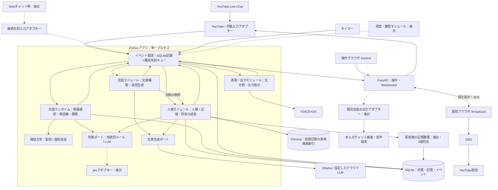
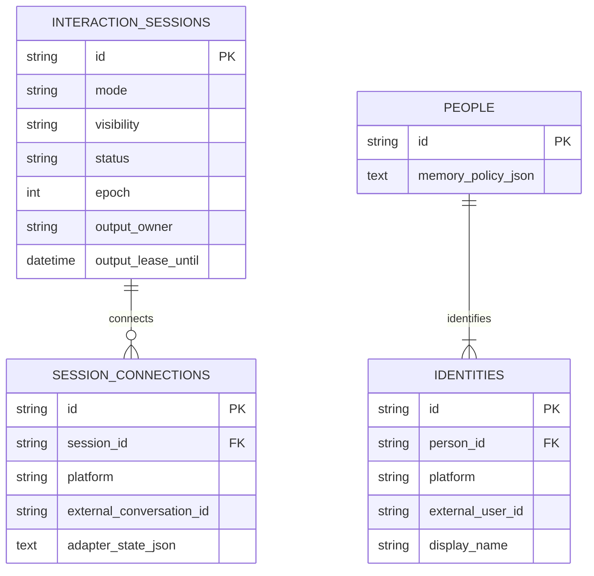
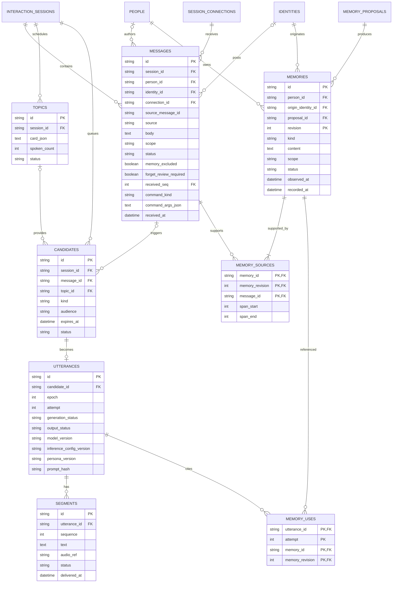
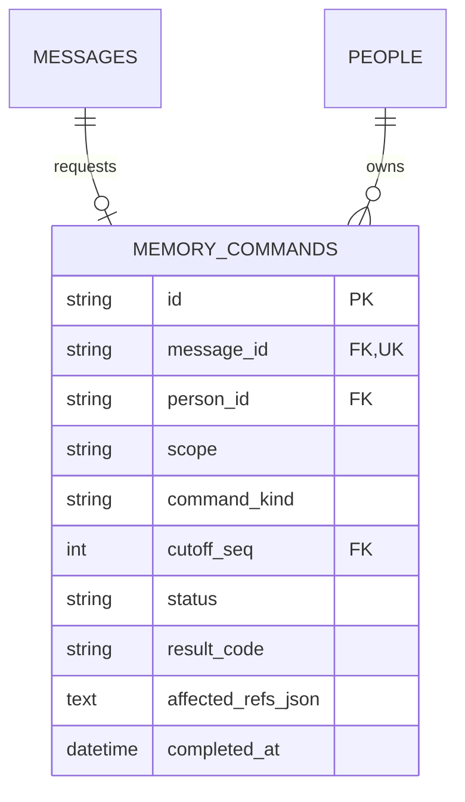
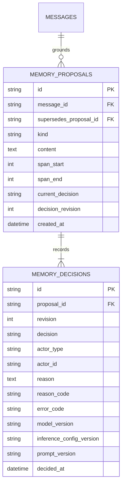
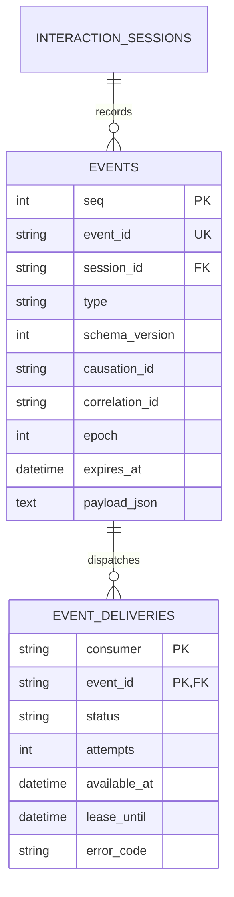
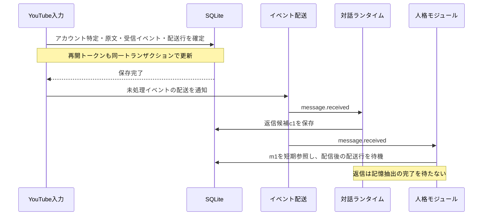
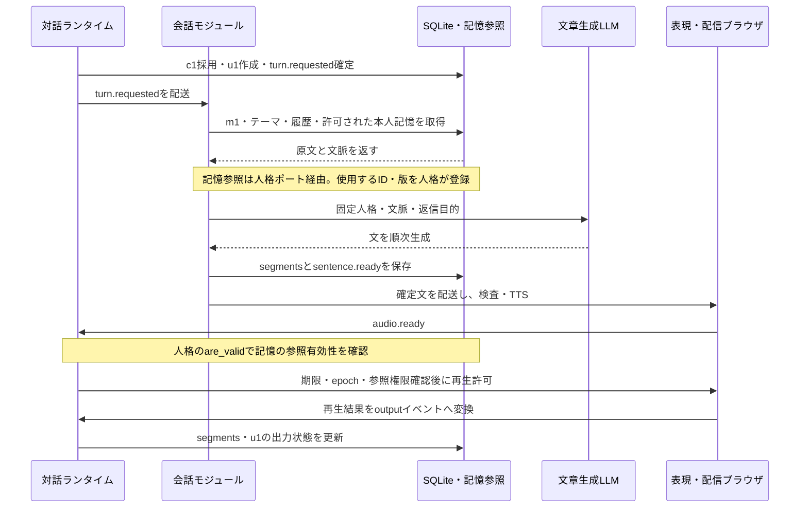
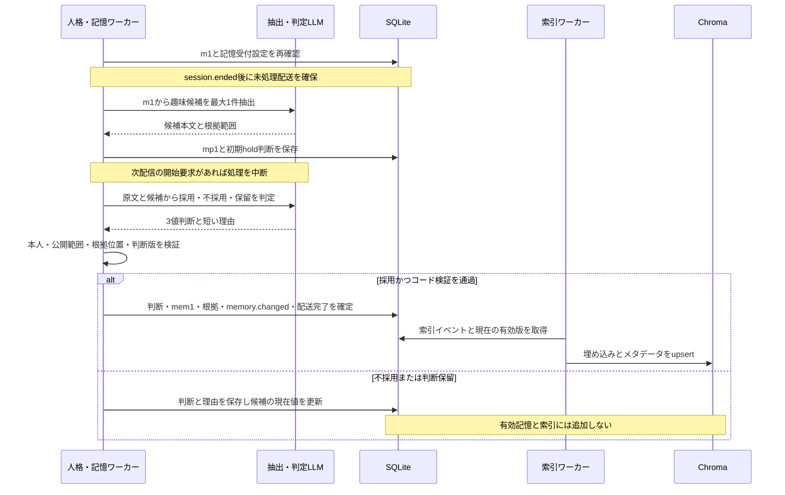

# YUI：対話・YouTube Live配信システム設計書

対話セッションを中心に、人格・会話生成・入出力・発話方針を分離した、単一ホストのイベント駆動構成を採用する。  
記憶は短期の会話・中期の人物像・長期の採用済み情報に分け、SQLiteを正本、Chromaを長期記憶の検索索引にする。  
初配信はコメント応答・自発発話・視聴者記憶を実装し、通常コメントの記憶整理は配信終了後に行う。人格・入出力・Jevの判断接続は分離する。

更新日：2026-09-19。本書をYUIの構成・動作・実装順・合格条件の唯一の設計基準とする。初配信は運営者が見守る30分程度の雑談配信とする。

## 1. 初配信で成立させる動作

| 必須動作 | 初期仕様 |
| --- | --- |
| コメントを拾う | YouTubeの話者IDとコメントIDを保持し、読むコメントを選び、音声・字幕・口パクで返す。全件回答は要求しない |
| コメントがなくても話す | 配信テーマと話題カードを材料に、続き・問いかけ・次の話題を自動生成する。運営者が毎回発話ボタンを押す必要はない |
| 視聴者の情報を覚える | 本人が明示した呼び名・趣味・好みを保存し、同じIDで次回参加した際に参照する。保存・訂正・忘却を配信中にも受け付ける |
| 配信を操作する | ブラウザで接続・テーマ・コメント採用・自発発話の一時停止・即時ミュート・記憶管理を操作する |

YUIの固定人格は「電子世界で育った、明るく親しみやすいお嬢様」とし、おしとやかで親しみやすい丁寧な日本語を使う。この設定を毎回の生成へ渡す。未設定の身体的経験・学校生活・趣味は補完しない。

**Non-goals**

- 初配信前の感情推移・関心の成長・長期目標・関係性の成長の完成。
- 初期配信でのゲーム操作、アニメの映像・音声解析、マイク会話、歌唱。
- 無人の24時間運用、複数キャラの同時配信、分散システム化。
- 初配信前のYouTube以外の接続UI・認証連携、個別会話の製品提供、複数セッションの同時運転。セッションと公開範囲の共通契約は初期から実装する。
- 初配信前のJev本番利用、ファインチューニング、Live2D制作の完成。
- 自動的なYouTubeチャット投稿。返信は配信音声・画面へ出す。

## 2. コンポーネントと責務

Python / FastAPIとReact / TypeScriptを採用する。Pythonアプリは1プロセス・1ワーカーで起動し、モジュールをコード境界で分離する。LLMはOllama、TTSはVOICEVOXのローカルサービスへ接続する。Chromaは初期には同一ホストの永続クライアントを用い、同期処理はイベントループの外で実行する。

### コンポーネント図

実線は初配信の接続、破線は後日の接続。DBへのアクセスは各モジュールのRepositoryを通す。図のSQLiteは同じ1ファイルを表す。



| モジュール | 所有する責務 | 境界 |
| --- | --- | --- |
| 入力 | 接続先認証、共通メッセージへの正規化、重複除去、公開範囲、入力時刻 | 視聴者の文章を運営コマンドとして実行しない |
| 対話ランタイム | セッション状態、発話方針の適用、候補の寿命、発話権、停止 | 発言内容を感情ラベル別のテンプレートへ固定しない |
| 会話 | 固定人格・会話・記憶・今回の発話目的から文章を生成 | 自分で次ターンを起動せず、DBの記憶・目標を変更しない |
| 人格（Personhood） | 固定人格、視聴者記憶、自己の状態、長期目標とその候補 | 直接再生しない。セッションの発話順序を所有しない |
| 表現・出力 | 宛先に応じたテキスト配送・TTS・字幕・口パク、出力結果 | 生成済みと実際に再生した内容を区別する |
| モデル接続 | 文章生成・埋め込み・判断の各ポート、期限、同時実行数 | ベンダーのSDK型をドメインへ漏らさない |
| 視覚・聴覚（後日） | 観察から時刻付きイベントを作る | 対話ランタイムを迂回して喋らない |

イベント駆動にするのは、入力・状態変化・ジョブの開始と完了である。記憶の参照など、その場で結果を必要とする読み取りまでイベントの往復にしない。

### 接続先に依存しないセッション

会話の単位は `interaction_sessions` とする。`mode` は `broadcast / direct`、`visibility` は `public / private`。有効な組合せは `broadcast + public` と `direct + private` に限定する。初配信は前者の1セッションを使う。限定公開の配信も、個別会話とは区別して `public` と扱う。セッションの種別・公開範囲は作成時に固定し、配信から個別会話へ移る際は別セッションを開く。

YouTubeの `video_id, live_chat_id, resume_token` は `session_connections` の接続情報に置く。会話・人格・イベントの共通契約はYouTubeの型を参照しない。接続をやり直してもセッションを新設せず、配信を終えて次回配信を始める際は新設する。再接続では同じ `connection_id` を使い、メッセージの重複除去を維持する。

入力アダプターは `session_id, connection_id, identity_id, source_message_id, body, received_at` を確定し、`message.received` を発行する。本人IDと公開範囲は認証・セッション設定から決め、本文やクライアント指定値を信用しない。個別会話では認証済みの参加者だけがそのセッションへ入力・購読する。

| 契約 | 配信 | 個別会話：接続追加時に実装 |
| --- | --- | --- |
| 発話方針 | コメント選択、公平性、話題進行、無言時の自発発話 | 本人の入力に応答し、待機中の自発発話は既定OFF。明示的に有効にした場合だけ働きかける |
| 宛先 | セッションの配信出力。特定視聴者への返信も全体公開 | そのセッションの認証済み本人 |
| 会話履歴 | その配信で実際に出力した内容 | その個別セッションで実際に出力した内容 |
| 人格・記憶 | 共通の人格と、本人への公開返信に参照を許した記憶 | 共通の人格と、本人が参照を許された記憶 |
| 出力 | 音声・字幕・アバター | テキスト、または本人用の音声出力 |

ランタイムは `TurnPolicy.select(snapshot)` で候補または待機を決め、状態更新・期限・発話権の検証は共通処理で行う。初期実装は配信用の方針だけを有効にする。人格モジュールはどの接続先でも同じ契約で呼ぶ。

セッションごとに候補・履歴・発話権・停止epoch・出力先を分ける。共有するのは固定人格と許可された中期・長期記憶であり、直近履歴・話題・相手への未処理の問いは共有しない。人格の成長処理が非公開入力から作る要約・目標・関係性も同じ公開範囲を引き継ぎ、公開文脈へ混ぜない。固定人格の変更は運営者が公開用設定として確定する。

### 人格モジュールの範囲と契約

`personhood` は固定人格・視聴者記憶・相手との関係・自己の状態を所有する。初配信では固定人格と第6節の視聴者記憶を実装する。音声・画面・通信・発話順序は、それぞれ表現・入力・対話ランタイムが所有する。

会話理解・修復、感情の推移、関心・好み・自己理解の成長、継続する目標、相手に応じた働きかけは、同じ人格モジュール内で開発する。これらは文脈と発話候補を提供し、公開範囲・期限・発話権の判定は対話ランタイムが行う。人格の長期評価では配信の発言・再生・記憶の記録を使う。

人格の基本契約は次の3つとし、生成時の参照記録と出力前の検証だけを補助ポートとして追加する。

- `get_context(session_id, person_id, topic, budget)`：認証済みセッションから参照範囲を決め、人格版、記憶IDと版、短い状態、相手別の制約を返す。固定人格はローカルで即時取得し、検索には期限を設ける。
- `on_event(event)`：発言・実際の出力結果・訂正を受け取り、非同期で状態を更新する。重複配送に耐える。
- `propose_candidates(snapshot)`：任意の発話候補をイベントで提出する。初期実装は空でも配信が成立する。

- `register_usage(session_id, person_id, utterance_id, attempt, memory_refs)`：会話が最終的にプロンプトへ入れる記憶のID・版を渡す。人格が有効性を再検証し、`memory_uses` へ同一トランザクションで記録する。検証失敗なら文脈を取り直し、未検証のまま生成しない。
- `are_valid(session_id, person_id, memory_refs)`：そのセッション・本人に対する参照の有効性を返す。ランタイムは各文の再生許可前に呼び、失効・確認失敗なら許可しない。元の返信対象メッセージの撤回・忘却による除外も入力の読取りポートで確認する。`affected_utterances(invalidated_refs)` は人格が `memory_uses` から影響する発話IDを返す。これらはローカルの短い読取りで、LLMを呼ばない。

### DB更新の所有者

Repositoryは所有モジュールの内部に置き、他モジュールが直接呼ばない。変更依頼は公開ポートかイベントを通す。複数モジュールが扱う行は列の所有者を固定し、行全体の保存で他の所有者の列を上書きしない。共有Unit of Workはトランザクションだけを提供する。

| データ・列 | 書込みの所有者 |
| --- | --- |
| `interaction_sessions`、`topics`、`candidates`、`utterances` | ランタイム。会話・出力の結果を受けて更新 |
| `session_connections`、`identities`、`people` の初回作成、`messages` の受信内容・撤回状態 | 入力。記憶用フラグの初期値は人格の受付ポートから取得して受信と同時に保存 |
| `people.memory_policy_json`、`messages.memory_excluded / forget_review_required` の更新、忘却による本文消去 | 人格。入力は既存メッセージの本文・フラグを再配送で復元しない |
| `segments` の作成・本文・順序 | 会話。音声・出力列は初期値だけ作成 |
| `segments.audio_ref` | 表現。合成完了をイベントで通知 |
| `segments.status / delivered_at` | ランタイム。検証した出力結果から確定 |
| `memories`、`memory_sources`、`memory_uses`、`memory_proposals`、`memory_decisions`、`memory_commands` | 人格。会話は参照記録ポート、操作画面は人格の操作ポートを使う |
| Chroma索引 | 人格内の索引ワーカー |
| `events` の追記、`event_deliveries` | 配送基盤。発行元のトランザクションに参加して記録 |

記憶無効化時は人格が旧ID・版を `memory.changed.invalidated_refs` に載せる。ランタイムも購読し、人格の読取りポートで影響する発話を特定して未再生部分を取り消す。忘却時は短期文脈由来の発話もあり得るため、同じ本人・範囲の処理中発話と古い返信候補を保守的に取り消す。取消済みIDと遅延結果の照合はランタイムが行う。

登録と無効化が競合しても、登録時の検証・無効化イベント・各文の再生許可前の検証で処理する。再生許可後の無効化は停止通知で中断するが、すでに人間へ届いた音声は取り消せない。図中のDB矢印も、この所有者のポート／Repositoryを経由する省略表記とする。

視覚・聴覚は、`observation.created` に `session_id, source_kind, source_ref, media_time_ms, observed_at, expires_at, scope, evidence_refs` を付けて接続する。生フレームや音声バイナリはイベントへ詰めず参照を渡す。メディア時刻は同時視聴の場面順を保つために予約し、初配信では利用しない。

## 3. イベント配送と発話の状態管理

### 配送方式

SQLiteの `events` と購読先ごとの `event_deliveries` を耐久キューとして使い、`asyncio.Queue` はワーカーを起こす通知に使う。ドメイン更新・後続イベント・購読先への配送行を同じトランザクションで書く。通知前に落ちても、未処理行の走査で復帰する。 発話イベントも同じ配送方式に統一し、メモリ内配送専用の別経路は作らない。発話イベントの耐久性は稼働中の購読処理失敗・通知取りこぼしの回収に使い、再起動後の音声再開には使わない。再起動時はワーカー起動前に旧epochの発話と対応配送を失効させる。

対話ランタイムは1セッションにつき1つのactorとして順番に状態を更新する。LLM・TTS・Chromaの完了をactor内で待たず、ワーカーから完了イベントを受ける。イベントループを推論・ファイル処理で塞がない。

| 項目 | 規約 |
| --- | --- |
| 識別 | `event_id, type, schema_version, session_id, actor_id, source, occurred_at, received_at, causation_id, correlation_id, expires_at, epoch, payload` |
| 永続化 | `payload` は通常IDと必要な差分。コメント全文は `messages` の正本を参照する。本文をログやイベントへ無制限に複製しない |
| 配送 | at-least-once。購読先ごとに `(consumer, event_id)` を一意にし、完了・再試行を記録する |
| 順序 | セッション内の確定順はSQLiteの `seq`。外部時刻の順序と混同しない。停止コマンドは専用の高優先キューで先に処理する |
| 再試行 | 外部ジョブはlease付きで確保し、期限切れを回収する。生成の再試行は再生許可前の発話に限り1回まで。attemptを増やし、旧文と音声を破棄してから開始する。TTSは未再生の文だけを再試行する |
| 古い結果 | `session_id, turn_id, attempt, epoch` が現行と一致しない完了を破棄する。通常コメントの追加だけではepochを変更しない |
| 障害 | SQLiteへ書けない場合は新規発話を停止する。書けなかった処理を成功扱いしない |

LLMジョブを二度実行してしまっても、受理する結果を1つに限定する。人間に届く音声のexactly-onceは保証しない。再生済みか不明な音声は自動再送せず、中断として扱う。

### 主要イベント

| イベント | 発行元 → 主な購読先 | 処理 |
| --- | --- | --- |
| `message.received` | 入力 → ランタイム・人格 | 通常入力は返信候補化・短期参照・配信後処理へ。記憶コマンドは人格の処理結果を待ち、直接返信候補にしない |
| `session.ended` | ランタイム → 人格 | 終了したセッションの未処理コメントについて抽出・判定を開始する |
| `message.withdrawn` | 入力・操作 → ランタイム・人格 | 表示と未再生の返信を取り消し、由来する記憶を無効化する |
| `topic.changed` / `idle.due` | 操作・タイマー → ランタイム | 話題候補を再評価する |
| `candidate.proposed` | 人格 → ランタイム | 有効期間・宛先・公開範囲を検証する |
| `turn.requested` | ランタイム → 会話 | 1つの発話目的について生成を開始する |
| `sentence.ready` | 会話 → 表現 | 完結した文を検査し、TTSへ渡す |
| `generation.completed` / `generation.failed` | 会話 → ランタイム・表現 | 最終文番号または失敗を記録する |
| `audio.ready` | 表現 → ランタイム | 文順と発話権を確認して再生を許可する |
| `output.started/completed/interrupted/failed` | 出力アダプター → ランタイム・人格 | 実際に出力した文を確定する。配信ブラウザの `playback.*` を変換して受ける |
| `memory.changed` | 人格 → 索引・ランタイム | Chromaを同期し、無効化された参照を使う未再生発話を取り消す。中期は次の読取りに反映 |
| `memory.command.completed` | 人格 → ランタイム | 確定した保存・忘却・拒否等の結果から、コマンドへの返信候補を1件作る |
| `operator.pause/stop/resume` | 操作 → ランタイム・表現 | 発話を停止・再開する |

セッション状態は `ready / running / paused / ended`、発話状態は `planned / generating / ready / delivering / completed / cancelled / failed` とする。生成中に最初の文を再生するため、発話行は `generation_status` と `output_status` を別々に持つ。`delivering` は音声再生中またはテキスト配送中を表す。`completed` は生成終了と全出力対象文の出力完了の両方を条件にする。

停止では対象セッションのepochを増やし、生成・合成・再生を取消状態へ移す。取消不能な外部処理が後から返っても音声を配信しない。再開は新しい発話を選び直し、中断文の途中から自動復帰しない。

## 4. 配信の発話方針：コメント応答と自発発話

### YouTube入力

初期接続は公式 `liveChatMessages.streamList` を使い、`nextPageToken` で再接続する。取得したメッセージと再開トークンは同じSQLiteトランザクションで確定する。接続先の `video_id / live_chat_id` と認証状態を操作画面で確認する。アダプターはOAuth認証情報をサーバー側で保持し、ブラウザへ渡さない。接続の導通は最初の実装段階で確認する。[YouTube公式仕様](https://developers.google.com/youtube/v3/live/docs/liveChatMessages/streamList)

初回取得の履歴は保存するが、接続前の古いコメントを返信待ちへ一斉投入しない。再接続でもコメントIDで重複を除去し、返信期限を過ぎたものは記録だけにする。切断は指数バックオフ、認証・quotaエラーは操作画面に表示して無限再試行を止める。

`streamList` の導通が初期環境で成立しない場合に限り、同じアダプター内で公式 `list` に切り替える。その場合は `pollingIntervalMillis` を守る。両方式の同時取得はしない。[YouTube list仕様](https://developers.google.com/youtube/v3/live/docs/liveChatMessages/list)

### 候補の選び方

初期候補は `reply / continue_topic / start_topic` の3種とする。人格の長期目標は後から同じ候補形式で入る。

候補は `candidate_id, session_id, source_ref, audience, topic_id, expires_at, status` を持つ。配信での呼びかけ先は特定の視聴者か配信全体。`audience` が本人を指していても、出力の公開範囲は変わらない。現在の話題との関連判定は初期には必須にせず、時刻・話者・運営者の指定で選ぶ。

1. 停止・期限切れ・禁止対象・公開不可・すでに処理済みの候補を除く。
2. 運営者が指定したコメントを優先する。
3. 通常コメントは「最近返信した視聴者を後へ回す→同順位なら古いもの」の順で選ぶ。特定の視聴者が枠を独占しないよう、待機候補は1人1件にまとめる。
4. 返信対象がなく、前回再生完了から無言時間が経過したら、自発発話を選ぶ。

**待ち行列には候補を置き、未来の返信文を大量生成しない。** 発話権は同時に1つ、LLMによる発話生成も1つとする。同一発話の次文のTTSだけ先読みする。

普通のコメントは再生中の文を切らない。自発発話中にコメントが来たら文末で残りを取り消し、返信へ移る。コメントへの返信中はその短い返信を終えてから次へ進む。運営者の停止・削除されたコメントの読み上げは即時中断する。

### 自発発話の材料と進行

運営者が配信前にテーマと3〜5枚の話題カードを設定する。カードは「話題・切り口・根拠となる資料や設定・視聴者への問い」を持ち、セリフ全文にはしない。YUIは会話の流れを受けて毎回文章を生成する。

例：テーマ「人間の休日」→切り口「家で過ごす楽しみ」「外に出たくなる瞬間」「最近知った遊び」。これは配信企画であり、YUIの経験や長期の好みとして保存しない。

ランタイムは現在のカード、実際に話した文、問いかけた時刻、消化済みカードを保持する。1カードあたり最大3発話、問いかけは1回までを初期値とする。反応がなければ言い換えて催促せず、別の切り口へ移る。全カードを使ったら固定人格と当日の公開会話を材料に新しい切り口を作る。元のカードの単純ループはしない。

配信の自発発話タイマーは、ランタイムが「`running`・自発発話ON・発話権が空・選択可能な返信候補がない」状態へ入った時刻 `idle_since` を起点に予約する。開始・再開、発話の終端（完了・失敗・取消・中断）、候補の失効・撤回・除外後に同じ判定を呼ぶ。未完了の生成・再生がある間は発話権が空とは扱わない。

コメント到着時はいったん予約を取り消し、候補選択後に再判定する。候補が全件不適格ならその場で再予約し、無言のまま停止させない。待機状態が続いているだけの再評価では `idle_since` を更新しない。セッションごとに予約は1件、タイマー世代番号を持ち、`idle.due` の発火時にepoch・世代・上の条件を再確認する。通常の文ごとの `output.completed` だけでは予約せず、発話権が解放された後に判定する。

問いかけが実際に完了した直後だけ待ち時間を10秒、それ以外は6秒とする。連続3発話が生成／TTS失敗したら自発生成を一時停止し、運営者の再開操作を待つ。成功した発話で失敗数を戻す。コメントによる正常な中断は失敗数に含めない。

| 設定 | 初期値・扱い |
| --- | --- |
| 自発発話までの無言 | 待機状態へ入って6秒。完了した問いかけの直後は10秒 |
| 通常返信 | 1〜2文、合計おおむね80字以内。長い説明は次の機会へ分ける |
| 自発発話 | 1〜3文、合計おおむね120字以内 |
| 返信候補の期限 | 受信後30秒。再生開始直前にも確認する |
| 返信待ち候補 | 最大20件。1人1件。溢れたら最も古い通常候補を失効させ、ログには理由を残す |
| 同一視聴者への連続返信 | 他の候補がある場合は20秒間優先度を下げる |
| TTS先読み | 再生中の文に加え、次の1文まで |

これらは実測済みの最適値ではなく、本書の開始設定である。限定公開配信で調整する。字幕だけの「うんうん」や相槌音声で、実際の返信遅延を隠して合格扱いしない。

## 5. 返信生成と処理予算

生成へ渡す文脈は、固定人格、そのセッションのテーマ、実際に出力した直近発言、対象メッセージ、参照可能な記憶、今回の発話目的に限定する。入力履歴・記憶・人格の状態をSQLiteで認可してからプロンプトを組み立て、他セッションの履歴を検索結果から無条件に補わない。最初は入力をモデルのトークナイザー換算で約3,000トークン以内に収める。固定人格・対象コメントを優先し、古い履歴から削る。

初配信では会話履歴の逐次LLM要約を必須にしない。テーマカードと再生済みの直近発言で進行を保つ。生成したが未再生の文章は共有会話の履歴へ入れない。

生成には「このコメントに返す」「今のテーマを続ける」という発話目的を指定し、受け止め方と表現は固定人格・文脈から生成する。感情の持続は人格モジュールの追加機能として扱う。

| 処理 | 初期の予算・制御 |
| --- | --- |
| 候補選択 | ルールで処理。選択のためのLLM呼び出しは0回 |
| 記憶取得 | 300msで打ち切る。Chromaが間に合わなければSQLiteから中期項目を計算し、本人の許可された記憶と合わせて少量取得する |
| 返信生成 | ストリーミング1回。最初の完結文を受け取ったらTTSへ送る |
| 出力検査 | 各文の長さ・文字種・禁止した出力・参照の失効をコードで検査。違反文を読み上げない |
| 最初の実質的な音声 | 候補選択から再生開始までp95 8秒以内を暫定合格目標にする |
| 生成タイムアウト | 10秒で完結文がない場合は取消。部分再生後に失敗したら未再生分を打ち切る |
| 通常コメントの記憶整理 | 配信終了後に抽出・判定。配信中に記憶用LLMを起動しない。明示保存・訂正・忘却は随時処理 |

8秒は検証前の目標値であり、達成済みの性能ではない。キュー待ち、検索、最初の完結文、TTS、再生開始を別々に測る。工程別p95を足して全体p95とはしない。

初期の文章生成モデルはOllama `qwen3.5:35b` とし、この構成で測定する。履歴短縮・生成長・文単位TTSを適用しても目標に届かなければ、同じ生成ポートで利用可能なクラウドLLMを比較し、初配信の設定として1つ選ぶ。ターンごとの自動モデル切替は初期には入れない。切替時は口調・記憶利用・作り話を再評価する。

返信生成はOllama `/api/chat` の `think=false, stream=true` を明示する。文分割・字幕・TTSへ渡すのは `message.content` だけであり、`message.thinking` は履歴にも画面にも渡さない。思考出力を非表示にするだけでは、思考生成を無効にしたことにならない。[Ollama Thinking](https://docs.ollama.com/capabilities/thinking)

配信後の抽出・採否判断も初期は `think=false, stream=false` とし、各用途のJSON Schemaを `format` に指定する。応答は別途スキーマ検証し、不正な出力を文字列修復で採用しない。非Thinkingと構造化出力の組合せを実機で確認し、動作しない版は更新またはモデル変更で再評価する。特定の過去版の不具合報告を現行版の確定仕様とは扱わない。[Ollama Structured Outputs](https://docs.ollama.com/capabilities/structured-outputs)

`model_version` はモデルダイジェスト・量子化・Ollama版を識別できる値とする。`think`、生成上限、温度等は版管理した推論設定に記録し、発話と判断履歴から設定版を追跡する。配信後だけThinkingを有効にする場合も、JSON適合率・採否精度・タイムアウト率を測って設定を確定する。5秒は検証前の開始設定であり、保留が続く場合は配信後処理の時間予算を再設定してから第11節を再評価する。

同じGPUを使うLLM処理は同時実行1件に制限する。配信中は返信生成を優先し、通常コメントの記憶抽出・判定・人格の振り返りは開始しない。終了後に抽出と判定を別々の呼び出しで処理し、各回に出力上限と5秒の打切りを設ける。空の抽出結果なら判定呼び出しは省略する。次の配信を開始するときは記憶ジョブの新規起動を止め、実行中の推論が終了・取消され資源が解放されてから発話生成を始める。中期サマリーは読取り時にコードで構成し、追加のLLM呼び出しや更新ワーカーは使わない。埋め込みはCPUで実行し、配信前にモデルを読み込む。

## 6. 短期・中期・長期記憶と人物の識別

### 3層の役割と保持範囲
直近会話と人物像を分け、古い情報を現在の人物像へ固定しない方針を採る。記事の区分は短期・中期・裏側の評価／統計であり、以下の長期記憶・保存時刻・件数上限はYUIの設計として定める。記事のコストに関する運用所感をYUIの性能保証には使わない。

| 層 | 役割と内容 | 保存先 | 更新・参照期間 |
| --- | --- | --- | --- |
| 短期 | 今の話題・直近の相手発言・実際に出力したYUIの発言。今回のやりとりを成立させる | `messages`・`segments`・`topics` から作るセッション内の作業領域 | 入力・出力ごとに更新。別セッションへ引き継がず、終了時に作業領域を破棄 |
| 中期 | 最近その相手が明示した趣味・関心・好みを並べた人物像 | 採用済みの `memories`・根拠から作る読取りビュー。専用テーブルなし | 文脈取得時に計算。直近30日の本人発言を最大5項目・合計400字で返す |
| 長期 | 本人が語ったこととして採用した呼び名・趣味・好み。原文、時刻、版、採用判断を追跡する | `memories`・`memory_sources`。Chromaは検索索引 | 通常コメントは終了後にLLM抽出・3値判定。明示保存はその場で確定。古くなっても現在の事実とは断定しない |

3層は別々のDB製品へ割り当てない。短期は会話履歴の利用範囲、中期は更新する要約、長期は根拠付き情報という役割の違いである。原文ログがSQLiteに残っていても、全ログが長期記憶として使われるわけではない。終了時に破棄する短期の作業領域と、配信後処理・手動確認に使う保存原文は区別する。

### 短期：配信中の会話を保つ

短期文脈は、採用コメントと出力済みのYUI発言を時系列で直近12発言・最大1,200トークンに収める。現在の対象コメントを最優先し、上限を超えたら古い発言を外す。配信へ届いた未選択コメントをすべて会話履歴へ注入しない。

返信対象の人物について、同じセッション内の直近3件の本人メッセージをSQLiteから補える。重複を除き、上のトークン枠へ含める。これは未採用の原文を発言として参照する処理であり、確定プロフィールとして扱わない。忘却による除外・確認待ちの原文と、それを根拠にした出力済み文は短期文脈にも再投入しない。記憶停止だけを理由に、その場の通常返信まで止める意味ではない。短期要約LLMは呼ばない。対象者の3件より前へ流れた内容まで必ず思い出せる仕様にはしない。

初参加の人が山・写真の趣味を語ったら、まずこの短期文脈で返答し、同じ配信中の直近のやりとりにも使う。短期から外れた通常コメントは、配信終了後に採用されるまで長期検索の対象にならない。

### 中期：最近の人物像を作り直す

人物と参照可能な公開範囲ごとにサマリーを読取り時に構成する。初期は自由な人物評を生成せず、採用済み記憶から短い項目を選んで並べる方式とする。対象は直近30日の本人の自己申告に限り、性格・親密度・職業などを趣味から推測しない。一度の明示発言は「最近話していた関心」として載せてよいが、「いつもそうする人」とはまとめない。

同一 `kind`・正規化本文の重複は1項目にまとめ、異なる根拠メッセージの数と最新の本人発言時刻を使う。同じイベントの再配送、YUIが繰り返し話した回数、検索された回数では関心を強めない。30日・5項目・400字は初期設定であり、運用評価で調整する。初期の選択順は最新の本人発言時刻、同順位では異なる配信での根拠数とし、最大5項目・400字に収まる分だけ保持する。単純な表記正規化を越える意味上の重複統合は必須にしない。

中期項目は `{text, memory_refs, observed_at, valid_until}` として返し、根拠の記憶ID・版を保持する。専用テーブル、サマリー更新イベント、再構築ワーカーは作らない。人格の `get_context` が本人・公開範囲・有効版・元発言時刻でSQLiteを絞り、前記の選択順で項目を作る。初期は要求をまたぐキャッシュを持たない。人物・範囲・状態・元発言時刻の索引を使い、全人物の記憶を走査しない。

`valid_until` は項目に含まれる元発言が30日を迎える最も早い時刻とする。期限外の根拠は次の読取り時に除外し、同じ内容に新しい有効根拠があればそれで構成する。検索・表示で期限を延長しない。訂正・採用取消・忘却は正本の変更から直接反映される。30日を過ぎた情報は中期から外れるが、長期の過去の自己申告まで削除する意味ではない。中期を新たな自己申告として長期へ再投入しない。

### 長期：必要なときに過去の情報を参照する

長期記憶は採用済みの自己申告を保持し、`observed_at` に元発言時刻、`recorded_at` に採用・保存時刻を記録する。配信後の処理が遅れても「最近話した情報」に見せない。現在の呼び名は有効スロットを使い、趣味・好みは話題との関連性と発言時刻を併せて扱う。

長期検索では本人・公開範囲・有効版で絞り、意味の関連度を評価する。古い情報にも関連性があれば「以前そう話していた」として参照するが、中期の最近の情報や現在の発言より優先しない。時間が経っただけで自己申告を虚偽と判定したり、検索のたびに鮮度を更新したりしない。

### 返信で参照する順序と予算

現在のコメントと短期文脈を優先し、本人の有効な中期サマリーを候補として取得する。長期の意味検索と合わせ、話題に関係する記憶を最大3項目・合計600トークンに絞る。中期項目とその元の長期記憶を二重に渡さない。呼び名の利用以外では、関連性を確認できない本人情報を埋め草として追加しない。該当しなければ記憶なしで返信する。

初期は関連性の判定に検索の類似度と閾値を使い、別のLLMは呼ばない。Chromaが使えない場合は中期項目とSQLiteの最近の記憶を限定取得し、話題語の一致などで参照を絞る。不確かなら省略する。短期1,200・中長期600トークンは上限であり、固定人格やテーマを含む第5節の総計3,000トークンが優先する。

中期項目をプロンプトに入れた場合も、元になった長期記憶のID・版を `memory_uses` に記録する。出所の訂正・忘却・採用取消で、中期経由の未出力発話も取り消す。返信生成には「現在の本人発言と記憶が食い違う場合は本人発言を優先し、過去情報を押し付けない」と指示する。明示訂正コマンドが来た場合は対象記憶をコードで除外する。通常文の意味上の矛盾を配信中に別LLMで検出する処理は追加しない。

裏側の統計は根拠数・最終自己申告時刻・参照回数・最終参照時刻を、`memory_sources`・`messages`・`memory_uses`・`utterances`・`segments` から集計する。プロンプトへ統計をそのまま渡さず、参照回数を真偽の裏付けにしない。初期は専用の統計テーブルを追加しない。

### 人物と接続先の識別

人物は `people.id`、接続先のアカウントは `identities` の `(platform, external_user_id)` で識別する。初回は1アカウントにつき1人物を作り、表示名が同じでも統合しない。メッセージは実際の投稿アカウント `identity_id` と人物 `person_id` を記録し、記憶は人物と出所アカウントを保持する。コメントを読まなかった視聴者についても、記憶の受付は独立して動く。

異なるサービスのアカウントを同じ人物として扱うのは、双方の所有を認証で確認し、本人が連携を確定した場合だけとする。初配信では連携機能を実装せず、未連携の記憶を推測で共有しない。連携時は人物への対応・メッセージの人物参照・記憶の所有者をトランザクションで更新するが、公開範囲を変えない。解除時は出所アカウントに基づいて所有を再分離し、古い人物IDの索引結果はSQLite検証で除外する。連携・解除後の認可更新は索引更新を待たない。

### 記憶の公開範囲

| `scope` | 保存時の条件 | 利用条件 |
| --- | --- | --- |
| `public` | 公開セッションの本人入力、または本人が明示的に公開利用を許可した情報 | その本人への返信でのみ利用。自発発話への自動転用はしない |
| `private` | 個別会話の本人入力。既定値 | 認証済みの同じ人物との `direct + private` セッションだけで利用 |

個別会話で「覚えて」と言われても公開許可とは扱わない。公開範囲の変更は対象の記憶を明示した本人操作として保存する。自動抽出・アカウント連携・モデル判断では公開へ昇格させない。公開から非公開への変更は旧版を無効化し、利用済みの未出力発話を取り消す。

認可はChroma検索前、SQLiteからの本文取得時、出力許可時に行う。SQLへの縮退・キャッシュ・人格更新にも同じ条件を適用する。出所が複数ある派生情報は必要な全出所への参照権限を満たした場合だけ使い、非公開の根拠を落として公開情報に見せない。配信用の状態通知、字幕、ログ表示にも非公開本文を載せない。

### 保存と利用

初配信では次の2経路を実装する。

| 入力 | 処理 |
| --- | --- |
| 「覚えて：趣味は写真です」「呼び名：しき」 | 本人に限定した明示入力としてコードで保存する。前者は原文の自己申告メモ、後者は呼び名スロット。保存後にだけ「覚えた」と生成へ渡す |
| 通常会話の「私は写真を撮るのが好き」 | 原文を保存し、配信終了後にLLMで候補を抽出。別のLLM呼び出しで採用・不採用・判断保留を判定する |

記憶コマンドは人格が公開する純粋関数 `parse_memory_command(body)` に文法を集約し、全入力アダプターが共通入力処理で1回だけ呼ぶ。受信メッセージに `command_kind / command_args_json` を付け、人物・公開範囲は認証済み入力から確定する。本文先頭の「覚えて：」「呼び名：」「忘れて：」と、全文一致の「記憶停止」「記憶再開」「全部忘れて」を対象にする。コロンの全半角と前後空白を正規化し、空の引数は拒否する。引用文や通常の会話をLLMでコマンドへ変換しない。

ランタイムはコマンドを直接返信候補にせず、通常の配信後抽出からも除外する。入力受付と人格のコマンド処理は本人・範囲ごとに直列化し、先行する記憶停止／再開の確定前に後続入力の受付フラグを確定しない。この短いコード処理でLLM・TTSを待たない。人格は本人・範囲ごとの受信 `seq` 順に処理し、`memory_commands` にコマンドIDと確定結果を保存する。状態更新・`memory.changed`・`memory.command.completed` を同じトランザクションで確定する。再配送では既存結果を返し、二重保存しない。

結果は `saved / forgotten / review_required / stopped / resumed / rejected / failed` と対象ID・結果コードを持つ。ランタイムは結果から元メッセージに対する返信候補を最大1件作り、実際に保存が確定した場合だけ「覚えた」と生成へ渡す。確認待ちや拒否を成功と言わせない。返信期限は結果確定後30秒とし、セッションが終了していれば画面の処理結果だけを更新する。生成前にも現在の結果と状態を確認し、後続の忘却で失効した保存を成功として案内しない。記憶停止中は保存・呼び名変更を拒否するが、忘却と記憶再開は受け付ける。

呼び名は `(person_id, scope)` ごとに `kind=nickname AND status=active` の部分一意制約を置く。別の論理記憶IDで再指定されても、旧スロットの無効化と新規保存を同一トランザクションで行う。

通常会話の抽出器は `kind, value, evidence_start, evidence_end` を最大1件返す。空の結果も許す。話者ID・公開範囲・取得時刻・出所はコードが付ける。感情や目標も同じ呼び出しで判断させない。

### 配信終了後の処理と再開

`message.received` の購読先に `memory.post_session` を設ける。受信時に原文とその配送行を永続化するが、対象セッションが `ended` になるまで抽出を始めず、待機中はleaseを持たない。`session.ended` はワーカーを起こす通知であり、取りこぼしても終了済みセッションの未完了配送行を走査して復帰する。返信候補の30秒期限はこの配送には適用しない。記憶用配送の実行条件は終了済みかつ発話セッションが稼働していないこととし、受信イベント全体を返信期限で失効させない。

通常終了は受付を閉じて終了挨拶を終えた後に `ended` を確定する。即時停止や再起動による `paused` は終了と見なさず、操作画面から終了を確定して後処理を開始する。将来の個別会話もセッション終了を起点とする。実際のYouTube映像配信の終了検知だけに依存しない。

対象を本人・セッション・受信順で読み、1コメントずつ抽出・判定する。全コメントを1回の巨大なプロンプトへ詰めない。抽出前にコメント撤回、本人の記憶停止、`memory_excluded`、記憶コマンドか、忘却cutoffと `forget_review_required` を確認する。記憶停止中の入力は受信時に `memory_excluded=true` とし、再開後も遡って抽出しない。明示保存済みメッセージは二重抽出しない。

抽出後に候補と初期判断を確定し、再起動時にはその候補から判定を再開する。自動抽出の元候補は1メッセージ1件とし、本文修正による後継候補と区別する。判断確定と `memory.post_session` の配送完了は同一トランザクションで保存する。エラーや意味の保留は履歴を残して処理完了にし、無限に再実行しない。再実行は操作画面で明示する。新しい配信の開始時は未完了ジョブを保持して中断し、終了後に再開する。

採用記憶の変更を受けてChromaを更新する。中期は次の文脈取得で最新の有効記憶から構成する。採用・不採用・保留の手動確認は後から行えるが、自動採用の反映は確認待ちにしない。

### LLMによる採用判断と確認履歴

抽出結果は `memory_proposals` に保存し、判定は `DecisionProvider` のLLM実装を使う。初期は抽出・判定ともに設定済みのローカルLLMを利用する。判定への入力は候補本文・原文・解釈に必要な同一セッションの直近文脈・保存対象の定義とする。文脈は原文と同じ認可条件で取得し、他人の発言を本人の根拠に置き換えない。

判定は「この候補を本人の呼び名・趣味・好みの記憶として保存するか」という1つの問いに限定し、`decision=accept / reject / hold` と短い判定理由を返す。理由は確認用の要約であり、モデルの内部思考の記録ではない。候補本文を判定呼び出しで書き換えさせない。

| 判定 | LLMへ指示する基準 | 保存・利用 |
| --- | --- | --- |
| 採用 `accept` | 本人の明示的な自己申告として原文に支持され、対象範囲内で、否定・時期の限定を保持している | コード検証後、判定が確定した時点で有効記憶を保存。手動確認を待たず次の会話から参照可能 |
| 不採用 `reject` | 引用・第三者情報・推測・設定変更要求・明確な冗談、または対象範囲外など、保存しない理由がある | 候補と判定を保存するが、有効記憶やChroma索引には追加しない |
| 判断保留 `hold` | 本人性、冗談かどうか、否定の範囲、原文の支持などが曖昧 | 候補と判定を保存して確認待ち。検索・生成では参照しない |

意味の判定を表現パターンの許可リストへ置き換えない。LLMの自己申告した確信度ではなく、上の3値を採用する。LLMが `accept` を返しても、コードは本人ID・記憶受付設定・公開範囲・対象kind・根拠オフセットの存在・出所の撤回有無を再検証する。原文が候補の意味を支持するか、本人の自己申告かの判断はLLMが担う。

タイムアウト・不正JSON・不正な根拠範囲は `hold` とし、`actor_type=system` とエラー理由を記録してモデルの判断と区別する。記憶停止・元発言の削除などにより保存が禁止される場合は `reject` とする。忘却の確認待ちは第6節「訂正・忘却」の制限を優先する。抽出が空の場合も本文nullの候補と `reject`（候補なし）を記録し、取りこぼしを後から確認できるようにする。不正・欠落した本文の候補は、そのまま採用できない。

各判断は `memory_decisions` に追記し、候補の現在の3値と判断リビジョンを更新する。採用の場合は判断記録・候補の更新・`memories`・`memory_sources`・`memory.changed`・配送行を同じトランザクションで確定する。不採用・保留も原文との対応、判定理由、モデル版、プロンプト版、判定時刻を残す。通常の監査記録には原文を複製せずIDで参照する。

運営者は3種類すべてを後から確認し、判定を変更する。手動変更は `actor_type=operator` と操作者・理由を追記し、自動判定を上書き消去しない。採用から不採用・保留へ変更したら、その候補由来の有効記憶を無効化し、索引削除と未出力発話の取消を行う。逆の変更はコード検証後に有効記憶を作る。モデル処理中に手動変更された場合、期待する判断リビジョンが一致しない遅延結果を適用しない。手動判断後の自動再判定は現行判断を変更しない。

候補本文を修正する場合は、旧候補を不採用にして新候補を作り、`supersedes_proposal_id` で関連付ける。空の候補を補う場合も同じ扱いとする。同じ候補の再採用は既存の論理記憶IDで新版を作り、重複した有効記憶を増やさない。明示的な「覚えて：」入力は抽出・判定LLMを省略するが、候補と `actor_type=explicit_command` の採用記録を同じ形式で残す。

自動保存は健康・所在・金銭・人間関係などへ広げず、画面の案内も「呼び名・趣味などを覚えます」と一致させる。公開コメントであっても、個人的な情報を自発発話の材料に自動転用しない。配信中の本人への返信で、必要な記憶だけを参照する。

記憶は「本人がそう話した情報」であり、外部に検証された事実ではない。保存本文へ出所と根拠を付け、推測で補完しない。通常会話でまだ保存していない内容に対して「次回も覚えている」と約束しない。

### 訂正・忘却

忘却は採用済み記憶だけでなく、保存待ちの原文・候補にも適用する。`memory_commands.cutoff_seq` にコマンド受信の確定順を保存し、対象は同じ本人・公開範囲でその値以前の受信入力とする。過去の終了済みセッションの未処理入力も含める。受信時刻の比較ではなく `messages.received_seq` を使い、後から再送された同じメッセージに新しい順序を付けない。

| コマンド | 採用済み記憶・原文 | 未処理・処理中の入力と候補 |
| --- | --- | --- |
| 全部忘れて | 対象範囲の既存記憶を無効化し、元入力を短期参照からも除外 | cutoff以前の全原文を `memory_excluded=true` にする。既存候補もsystemの `reject` にし、処理中のLLM結果を採用しない |
| 忘れて：語句 | NFKC・casefold・連続空白の正規化後、記憶本文または根拠原文の部分一致で全該当記憶を無効化。該当原文は `memory_excluded=true` | 語句に一致する原文・候補は除外。それ以外のcutoff以前の未確定入力・候補は `forget_review_required=true` として保守的に自動採用を止める |

部分一致は意味上の同義語を保証しない。既存記憶は語句指定に加え、記憶画面からID指定でも削除できる。語句指定の結果は「該当分を削除／過去の未整理分は確認待ち」と実際の処理範囲を案内し、意味上の全関連情報を消したとは言わない。該当原文に別の趣味も含まれる場合、初期は原文単位で除外する。

`forget_review_required` の原文は短期参照・通常返信候補からも除外する。抽出・LLMの3値判定は実行して履歴に残すが、モデルが `accept / hold` を返しても同じトランザクションでsystemの `hold(reason_code=forget_pending)` を追記して有効記憶にしない。途中のacceptを有効記憶や索引へ反映しない。モデルの `reject` は不採用として残す。すでに抽出済みの採否待ち候補にも同じ制限を適用する。

運営者は忘却コマンドと原文を確認し、対象外の情報だけ明示的に採用できる。`memory_excluded=true` の原文は手動採用でも復活させない。LLM結果の反映直前に、除外フラグ・確認フラグ・判断リビジョン・最新の忘却cutoffを同じトランザクションで再確認する。LLM判定だけで制限を解除しない。確認フラグを持つ入力を後で再実行しても、同じ制限が残る。

cutoff後の新しい通常コメントは新しい自己申告として扱う。今後も保存を止めたい場合は「記憶停止」を使う。コマンド確定と同時に影響する中長期参照を失効させ、ランタイムへ同じ本人・範囲の未出力発話の取消を通知する。

- 呼び名の再指定は同じ話者の旧スロットを `superseded` にし、新しい版を有効にする。好みは複数共存を許す。
- 通常文の訂正はその場の返答で優先する。配信中の返信生成だけで永続記憶を書き換えず、配信後に採用された新しい自己申告は元発言時刻付きで保持する。通常文による旧記憶の意味上の置換は、確認画面で運営者が対象を指定して確定する。曖昧なまま旧記憶を自動削除しない。明示的な訂正・忘却は配信中でも即時に反映する。
- 「忘れて：写真」は、その本人の該当記憶を無効化する。「記憶停止」「記憶再開」「全部忘れて」も本人IDで受け付ける。公開チャットでは公開記憶だけを対象とし、案内も「公開の記憶を全部忘れて」と範囲を明示する。処理結果には非公開記憶の存在も出さない。連携先を含む非公開記憶の管理・全削除は本人用の認証済み画面で確認する。記憶停止・再開の設定は `people.memory_policy_json` に公開・非公開別で保存する。第三者の記憶には適用しない。
- 忘却では元コメントを再抽出対象から外す。全文削除要求では本文・記憶候補・判定理由・中期サマリー・記憶・短期キャッシュ・音声キャッシュ等の派生物も対象にし、削除済みのIDと処理済み状態だけを残す。SQLiteからの再索引で復活させない。
- 操作画面から本人別の記憶・根拠・状態を確認し、訂正・削除する。中期は最新の有効記憶から読む。取得済みの項目も元記憶の失効検証を通し、古い本文を使わない。短期履歴も削除済み原文を除き、未処理の配信後ジョブから復活させない。

### Chromaとの同期

Chromaには `memory_id:revision` をIDとして、埋め込みと `person_id, scope, kind, revision, embedding_version` を保存する。本文の正本はSQLiteだけに置き、Chroma検索結果からそのままプロンプトを作らない。

1. SQLiteで記憶と版を確定し、同じトランザクションで `memory.changed` を記録する。
2. 索引ワーカーが有効な最新版を埋め込み、Chromaへupsertする。古い版を削除する。
3. 再試行時も最新版を読み直す。記憶ごとに処理を直列化し、古いジョブが新しい索引を上書きしないようにする。
4. 検索は話者・公開範囲で絞り、返ったID・版をSQLiteで再検証する。旧版・そのセッションから参照不可・無効化済みは除外する。
5. 新しい記憶は索引未反映でもSQLiteから補う。Chroma停止時は本人のプロフィール・最近の有効記憶へ縮退する。

Chromaは埋め込みの近傍検索とメタデータによる絞り込み、upsertを提供する。ここでの二重管理・版検証はYUI側の設計である。[検索](https://docs.trychroma.com/docs/querying-collections/query-and-get)、[更新](https://docs.trychroma.com/docs/collections/update-data)

埋め込みの初期候補はCPU上の `intfloat/multilingual-e5-small` とし、日本語の言い換え評価を通して採用する。384次元・正規化ベクトル・cosine距離を使い、検索文に `query: `、記憶本文に `passage: ` を付ける。これはモデルカードの入力形式に従う。[モデルカード](https://huggingface.co/intfloat/multilingual-e5-small/raw/main/README.md)

モデル版・次元・距離尺度をコレクションに対応付け、別モデルのベクトルを混在させない。類似度閾値は、YUIの関連／無関連の記憶対で決める。

生成時に使った記憶ID・版を発話へ記録する。出力前に削除・公開範囲変更が入ったら、該当記憶を使う未出力の発話を取り消す。取消済みの発話から記憶を作らない。

### ER図：セッション・接続先・人物



各テーブルの1行の単位と用途は次のとおり。ER図の大文字表記は、実装では小文字のテーブル名に対応する。

| テーブル | 1行が表すもの・保存内容 | 用途・更新タイミング |
| --- | --- | --- |
| `interaction_sessions` | 1回の配信、または1つの個別会話。種別・公開範囲・進行状態・停止epoch・出力権を保持 | 会話開始時に作成し、開始・停止・終了や出力権の更新時に変更する。履歴・候補・イベントを分離する基準 |
| `session_connections` | セッションと外部接続先の1つの対応。サービス名・外部会話ID・アダプターの再開情報を保持 | YouTube接続などの開始時に作成する。再接続では同じ行を使い、受信メッセージの保存とともに再開トークンを更新する |
| `people` | YUIが相手として識別する1人。サービスに依存しない人物IDと、公開・非公開別の記憶受付設定を保持 | 未知のアカウントの初回入力で作成する。記憶停止・再開時に設定を更新する。記憶本文はここへ置かない |
| `identities` | YouTubeなどの1アカウント。サービス名・外部ユーザーID・表示名・対応する人物IDを保持 | 初回入力で作成し、表示名の変更や本人確認済みの連携・解除時に更新する。表示名は本人判定のキーにしない |

`session_connections.adapter_state_json` にYouTubeの `video_id, live_chat_id, resume_token` を保存する。認証情報そのものは入れない。`direct` の参加者は接続追加時に認証で確定した本人1人とし、その際に `session_participants(session_id, person_id, role)` を追加する。初期はこのテーブルと個別会話の認証・実行経路を作らない。非公開データの混入試験はRepositoryの固定データで行う。配信の視聴者全員の入退室管理は要求しない。

### ER図：会話・記憶・発話



| テーブル | 1行が表すもの・保存内容 | 用途・更新タイミング |
| --- | --- | --- |
| `messages` | 受信した1メッセージ。本文・投稿アカウント・人物・接続・セッション・公開範囲・受信時刻を保持 | 受信時に重複を除いて保存する。返信対象と記憶抽出の原文として使い、削除・忘却時には本文や再抽出可否を更新する。YUIの返答は保存しない |
| `topics` | 1セッション内の1枚の話題カード。テーマの切り口・根拠・問い・実際の発話数・消化状態を保持 | 配信準備や話題追加時に作成し、出力完了に応じて進行を更新する。未出力の生成だけで消化済みにしない |
| `candidates` | 「このコメントに返す」「この話題を続ける」などの1発話候補。起点・呼びかけ先・期限・選択状態を保持 | 入力・タイマー・人格の提案から作成し、選択・失効・取消時に更新する。返信文の先行生成キューではない |
| `utterances` | 採用した1候補に対するYUIの1発話。生成と出力の状態、再試行番号、epoch、モデル・人格の版、プロンプトのハッシュを保持 | 候補採用時に作成し、生成・出力・取消の進行を追跡する。1発話は複数の文を含む。ハッシュは入力の同一性確認用で、本文の復元用ではない |
| `segments` | 1発話を構成する1文。順番・文面・音声参照・出力状態・完了時刻を保持 | 文が確定した時点で作成し、TTS完了や出力ACKで更新する。字幕・再生順と、会話履歴へ入れてよい文を判定する。テキスト出力では音声参照は不要 |
| `memories` | 採用された候補について保存した1記憶の1版。本人・出所アカウント・種類・本文・公開範囲・有効状態を保持 | 採用確定時に候補IDを付けて追加し、訂正時は旧版を無効化して新版を作る。会話を越えて利用する記憶の正本であり、受信ログをそのまま全件転記しない |
| `memory_sources` | 記憶のある版と、その根拠メッセージ1件の対応。原文中の根拠範囲も保持 | 記憶の保存と同時に記録する。「何を根拠に覚えたか」の確認、元発言の撤回に伴う無効化、忘却後の再抽出防止に使う |
| `memory_uses` | 1発話・1試行の生成へ渡した記憶1件とその版の対応 | 会話から人格の登録ポートを呼び、生成文脈の確定時にattempt付きで記録する。生成がその記憶を実際に言及した証拠ではない。訂正・削除・公開範囲変更時に、取り消すべき未出力発話を特定する |

ChromaにはこれらのSQLテーブルを複製せず、`memories` の検索用コレクションを置く。1レコードは `memory_id:revision` に対応する埋め込みと検索用メタデータで、索引ワーカーが更新する。検索結果の本文・所有者・公開範囲・有効性はSQLiteで確定する。

`MEMORIES` の主キーは `(id, revision)` の複合キーとし、根拠と利用記録は版まで参照する。`MESSAGES`は視聴者・運営者の入力、YUIの発話は`UTTERANCES/SEGMENTS`を正本とし、履歴取得時に同一セッションの出力済み文だけを統合する。

### 中期の読取りと根拠

中期専用のER図・テーブルは持たない。`memories` → `memory_sources` → `messages` で本人発言の時刻と根拠をたどり、人格が第6節の条件で項目を構成する。返信に採用した項目の元記憶は、長期検索の結果と重複を除いて `memory_uses` に記録する。

### ER図：記憶コマンド



| テーブル | 1行が表すもの・保存内容 | 用途・更新タイミング |
| --- | --- | --- |
| `memory_commands` | 1つの記憶コマンドの本人・範囲・受信順・処理結果・対象ID。引数本文は元メッセージを参照 | 人格が状態変更と同時に確定し、二重実行防止・忘却cutoffの照合・返信生成の結果確認に使う |

`messages.received_seq` は受信イベントの `events.seq` を参照し、原文・イベントと同じトランザクションで設定する。除外フラグと確認フラグは元入力に保持するため、処理の再配送・再起動を越えて有効となる。忘却の監査行に本文を複製しない。

### ER図：記憶候補と採用判断



| テーブル | 1行が表すもの・保存内容 | 用途・更新タイミング |
| --- | --- | --- |
| `memory_proposals` | 原文1件に由来する1つの記憶候補。抽出本文・種類・根拠範囲・現在の3値判断とリビジョンを保持。候補なし・抽出失敗では本文をnullにする | 抽出結果の確定時に作成し、最初は `hold`（判定待ち）。判定待ちと意味の判断保留は最新の判断理由で区別する。本文修正は新候補として作成し、元候補を関連付ける |
| `memory_decisions` | 候補に対する1回の判断。3値・理由・判断主体・モデルとプロンプトの版・時刻を保持 | 抽出結果の受付、LLM判定、手動変更時に追記する。過去の判断を残し、候補ごとの現在の判断と履歴を確認する |

`(proposal_id, revision)` は判断履歴で一意とする。元候補の `message_id` は `supersedes_proposal_id` がnullの行に限り一意とする。候補の `decision_revision` は適用済み判断を指し、更新時に競合を検出する。抽出結果の再配送では同じジョブの候補・初期判断を二重作成しない。採用による論理記憶は1候補1件とし、再採用や訂正の版は同じ記憶IDで管理する。候補の人物・公開範囲は根拠の `messages` から決める。

### ER図：イベント配送



| テーブル | 1行が表すもの・保存内容 | 用途・更新タイミング |
| --- | --- | --- |
| `events` | 確定した1イベント。種別・セッション・順序・原因イベント・一連の処理の識別子・期限・必要な差分を保持 | ドメイン状態の更新と同じトランザクションで追加する。何が発生したかを記録し、配送漏れの回収や原因追跡に使う。会話本文の正本や全状態の再構築を必須とするイベントソーシングにはしない |
| `event_deliveries` | 1イベントを1購読先へ処理させるための配送状態。試行回数・次回実行時刻・処理権の期限・エラーを保持 | イベントの確定時に購読先ごとに作成し、確保・成功・失敗・再試行時に更新する。同じイベントでも人格更新だけ失敗した場合、その購読先だけを再試行する |

必須制約は、アカウントの `(platform, external_user_id)`、受信メッセージの `(connection_id, source_message_id)`、1候補1発話、文の `(utterance_id, sequence)`、1記憶IDにつき有効版1件、呼び名は本人・公開範囲ごとに有効1件とする。イベント・候補・発話の参照先が同じセッションに属することを検証し、異なるセッションの候補から発話を作らない。手動入力にはクライアント生成の重複防止IDを使う。訂正は旧版無効化と新版追加を同一トランザクションで行う。

SQLiteは外部キーを有効化し、WALとbusy timeoutを設定する。書込トランザクション中に外部APIを待たない。WALでも同時に書けるのは1ライターなので、長い処理をDBロックで囲まない。[SQLite公式仕様](https://www.sqlite.org/wal.html)

## 7. 出力契約と配信用ブラウザ画面

### セッション単位の出力契約

出力アダプターは `session_id, utterance_id, segment_id, epoch, modality, content_ref` を受け取り、`output.started/completed/interrupted/failed` を返す。初配信では音声ブラウザの `playback.*` を同じ状態更新へ変換する。テキスト接続では配送ACKを出力完了とし、人間が読んだ証拠とは扱わない。TTSを通さない接続でも会話・人格モジュールを変更しない。

出力権はセッションごとの `output_owner / output_lease_until` が管理する。WebSocketの購読と出力ACKも認可されたセッションに限定し、クライアントの指定だけで別の宛先へ切り替えない。配信への出力と本人への私信を同じ出力接続へ混在させない。初期は `running` のセッションを1つに制限する。複数セッションを同時運転する際は共有モデルの優先順位・待ち時間を別途測定し、初配信の性能値をそのまま適用しない。

### 配信の再生経路

生成文は文末で区切って検査し、TTSで音声化する。未完の文を読み上げず、文番号順に再生する。字幕と口パクはモデル生成時刻ではなく、同じブラウザ内の実際の音声再生を基準にする。

初期アバターはPNG差分を使う。表現モジュールは `speaking, mouth_open, expression` を画面へ渡し、アバター資産の差替えを人格側から切り離す。初期の表情は通常・発話・待機に絞り、別の感情判定LLMは追加しない。

音声の再生主体はOBSのブラウザソースとして開いた `/broadcast` の1接続だけにする。サーバーが `output_owner` と短いleaseを発行し、その配信で音声のある接続を一つに限定する。操作画面のプレビューはミュートした状態表示であり、音声ジョブを受信しない。

| 画面 | 初期の仕様 |
| --- | --- |
| `/control` | 接続・進行・コメント・記憶・出力テストを操作する運営者用画面 |
| `/broadcast` | 背景・アバター・採用コメント・字幕をまとめた1920×1080のOBS用画面。対象配信の音声の唯一の再生先 |

RESTの操作受付はコマンドIDを返し、WebSocketで確定状態を返す。押した直後に成功と表示せず、処理中・成功・失敗を区別する。公開画面へは対象セッションの配信用に選別した状態だけを送り、内部イベントバスをそのまま公開しない。

### `/control` の画面設計

上段の固定操作バー、中央のプレビューとコメント、下段のタブで構成する。デスクトップでは中央を左2：右1の比率にする。

| 領域 | 表示と操作 |
| --- | --- |
| 固定操作バー | YouTube接続状態、音声再生接続、開始／終了、自発発話ON/OFF、赤い「即時停止」 |
| 左中央：配信プレビュー | `/broadcast`と同じ画面状態をミュート表示。再生中・生成中・待機を運営者だけに表示 |
| 右中央：コメント | 話者、経過秒数、待機／選択／応答済み／期限切れ。採用・スキップ・画面から非表示・本人の記憶表示 |
| 進行タブ | 今日のテーマ、話題カード、消化状態。「次の話題」「話題変更」「この話題を固定」 |
| 記憶タブ | 人物検索、記憶一覧、候補の採用／不採用／保留変更、訂正・削除・記憶停止、未処理件数と再実行。短期文脈と中期の読取り結果は参照のみ。原文・根拠・理由・忘却確認待ちは詳細欄、モデル版と判断履歴は簡素な診断表示。中期を直接編集せず、元記憶を変更する |
| 出力タブ | 音声テスト、音量、アバター・背景・字幕サイズ。配信再生権の接続確認と再接続 |
| 診断欄 | 返信待ち時間、生成・TTS時間、索引遅延、最終エラー。通常は折りたたむ |

「開始」はYUIの発話進行を開始する操作で、OBSやYouTubeの配信開始とは別に表示する。OBSの配信開始・終了は初期には運営者が行う。YUI側の終了は新規受付を止め、終了挨拶後に再生を止める。即時停止は挨拶を待たない。

### `/broadcast` の画面設計

初期プリセットは次の座標とし、レイアウトエディターは作らない。値は設定ファイルで変更する。

| 要素 | 1920×1080内の位置・サイズ | 動作 |
| --- | --- | --- |
| 背景 | 全面 | テーマに合う静止画。初期は固定 |
| タイトル・テーマ | x=64, y=40, w=1792, h=80 | 配信タイトルと現在の話題 |
| アバター | x=1060, y=140, w=800, h=900 | 下寄せ・全体が入る比率で表示 |
| 採用コメント | x=64, y=170, w=900, h=190 | 呼び名＋選んだコメント。長文は表示を省略し、生成には原文を渡す |
| YUI字幕 | x=64, y=780, w=980, h=210 | 再生中の1文。最大3行、48pxを基準にする |
| 記憶の案内 | x=64, y=1020, w=980, h=32 | 「会話の記憶は配信後に整理｜覚えて：…は即時保存／記憶停止」など短い案内 |

すべての未選択コメントを画面へ自動表示しない。自発発話では採用コメント欄を隠す。停止中は字幕とコメントを消し、アバターを待機状態にする。通信障害時は「少々お待ちください」の固定表示にし、内部エラー文は出さない。

テキストはHTMLとして解釈せずエスケープする。操作画面はローカル利用を前提に保護し、OBS用接続には再生用の限定権限を与える。操作トークンやAPIキーを配信用画面へ載せない。

### 再接続・停止

- サーバーが文を提示し、ブラウザが受信確認した後、ランタイムがepoch・期限を再検証して再生許可を出す。再生イベントは `(session_id, utterance_id, segment_id, epoch)` で重複除去する。
- heartbeatは1秒間隔、lease期限は3秒を初期値にする。ブラウザはlease切れで音声を止める。新しい再生接続への権限移譲は旧lease失効後に行う。
- 再接続では現在の画面状態を取得する。途中だった発話は中断扱いとし、過去の再生コマンドを再実行しない。操作画面は全イベント再生ではなくsnapshotで復元する。
- バックエンド再起動時は `paused` で立ち上げ、旧epochの未完了発話を取り消す。終了済みセッションの記憶処理・索引同期は再試行する。中断した配信の後処理は終了確定後に開始する。音声は自動再開しない。
- 接続中の停止通知から消音まで500ms以内を目標とし、ネットワーク断ではlease期限までの最大3秒を別に測る。OBS側のミュートを最終の停止手段として残す。

## 8. Jevの接続先

Jevは文章生成の代替に置かない。公式資料では、状態と型付き質問を入力し、Choice・Score・Noulの結果を返す判断モデルとして提供されている。本設計では `DecisionProvider` の実装として接続する。[TypeSafe公式Introduction](https://docs.typesafe.ai/introduction)

| 判断 | 初期実装 | Jev導入時 |
| --- | --- | --- |
| どのコメントが今の話題に関連するか | 関連度を必須にせず、話者・時刻で選択 | 上位の候補だけを意味で評価する |
| 相手が今は話題を避けたいか | 明示コマンド・狭い表現ルール | 文脈に基づく判定を追加する |
| 記憶候補を保存対象に採用するか | 抽出とは別のLLM呼び出しで採用・不採用・判断保留を判定 | 同じ3値契約の判定を置き換える。本文抽出はLLMを継続 |

判断ポートは用途別の型を持つ。入力は `task, task_version, state, question_kind, allowed_choices?, rubric?, deadline_ms`。出力の共通部は `status=ok/error, provider, version, latency_ms, reason?, reason_code?, error_code?` とする。成功結果は `ChoiceResult(choice, probabilities?, confidence?) / ScoreResult(score, probabilities?, confidence?) / NoulResult(noul)` のいずれかで、`question_kind` と対応させる。エラー時は結果を持たず、エラーをモデルの不採用判断と混同しない。

初期は記憶採否用のChoiceだけを実装し、`choice` を `accept / reject / hold` に限定する。LLM実装は短い `reason` を返す。共通契約では理由文は任意であり、Jevが理由を提供しなければ未提供と表示する。コード由来の `reason_code` とモデルの理由を区別し、理由文のためだけに追加LLMを呼ばない。Score/Noulの実装は利用する判断の追加時に行う。

これはYUIの内部契約であり、Jev APIのスキーマそのものではない。ルール実装に架空の確率を付けず、取得していない値はnullとする。

最初は1候補につき1つの明確な問いを評価する。別の問いは別定義にし、可能ならアダプターがまとめて送る。採用した候補を最後にコードが検証し、公開不可・期限切れ・再生中などの条件はモデル結果で上書きしない。

Choice/Scoreの `confidence` は選択肢の確率分布から計算された値で、正答率そのものとは扱わない。Noulには同じconfidence値が付かないため、別の結果型として保持する。[TypeSafe公式Confidence](https://docs.typesafe.ai/confidence)

導入は保存した日本語の配信ケースでのオフライン評価、配信中の影響なしの比較実行、限定した判断への本番適用の順にする。判断の待ち時間は初期上限500msとし、超過・不明・低確信ではルール実装へフォールバックする。記憶採用で不明なら `hold` として確認履歴へ残し、ルールで採用へ昇格させない。この500msは将来のJev用であり、初期LLM判定の5秒とは区別する。閾値は日本語ケースで決め、広告上の速度を日本からの応答時間の保証にしない。

Jevは2026-09-15にearly accessとして発表された。利用権限・実測・バージョン固定の方法を導入時に確認する。初配信はそのアクセス待ちに依存させない。[公式発表](https://typesafe.ai/blog/introducing-system-one-models-and-jev)

## 9. 障害時の振る舞い

| 障害・競合 | 動作 |
| --- | --- |
| コメントが急増 | 候補数・期限・話者単位の上限で制御。期限切れの返答を後から連続再生しない |
| 配信後の記憶処理が詰まる | 原文と未処理配送を保持し、残件数と最古の未処理時刻を表示。次配信は既存の中長期記憶で開始する。未処理の趣味を保存済みと案内しない |
| Chromaが停止 | SQLiteの本人記憶へ縮退。索引更新を再試行。ChromaをSQLiteから再構築する |
| LLM/TTSがタイムアウト | 当該発話を失敗扱いにし、次の候補へ。必要なら事前録音の短い障害案内を1回だけ出す |
| 外部生成サービスが連続失敗 | 自発生成を一時停止し運営者へ表示。毎回同じ障害案内を流さない |
| 配信画面が切断 | 発話を停止し、再接続後も旧音声を再送しない |
| 本人が記憶を訂正・削除 | SQLiteで即時に参照対象を変更し、古い記憶を使った未再生発話も取り消す |
| 視聴者が退室を表明 | その人へ新しい質問を出さない。配信全体は続ける。無発言を退室と断定しない |

## 10. 実装順

YouTube入力からOBS出力までの導通を先に確認し、コメント応答、自発発話、視聴者記憶を順に接続する。開発・リハーサル・本配信のSQLiteとChromaは環境別のディレクトリに分け、テスト用の発言や記憶を本配信へ混入させない。

| 段階 | 実装するもの | 完了時に確認すること |
| --- | --- | --- |
| S0：入出力の導通 | 共通セッション・接続・人物IDのスキーマ、YouTube認証・コメント受信、模擬イベント、`/broadcast`、VOICEVOXとPNGアバター、停止 | 実コメントを取り込み、固定文をOBSへ出し、再接続で重複再生しない |
| S1：イベントによる会話 | セッション分離と公開範囲の検証、SQLite配送、ランタイム、候補選択、生成、文単位TTS、`/control` | コメントを選んで返信し、期限切れ・停止後の遅延結果を捨てる |
| S2：自発発話と記憶 | 話題カード・タイマー、短期文脈・中期サマリー・配信後のLLM抽出と3値判定・全結果の手動確認、本人の保存・訂正・忘却、Chroma索引・検索 | コメントゼロでも進行し、再起動・次配信を越えて同じ視聴者の記憶を使う |
| S3：限定公開のリハーサル | 運営者操作を含む30分運転、遅延測定、負荷・障害確認 | 下記の初配信条件を満たす |
| 初配信後 | 人格の成長機能、Jevの判断比較。別サービス接続時に個別会話方針・認証・本人画面・アカウント連携を追加 | 初配信の合格条件とセッション間の分離を保ち、接続先ごとに入出力を検証する |

人格の成長機能はS0〜S3と独立して開発する。初配信の判断は第11節の合格条件に従う。

## 11. 初配信の合格条件

制御の正しさはイベントの再配送・障害注入で、返答の自然さは実モデルと実音声で確認する。回数だけを増やさず、以下の異なる失敗条件を含める。

| 観点 | 合格条件 |
| --- | --- |
| コメント応答 | 複数ID・同名・連投・再接続のケースで宛先が混ざらず、同じコメントを二重に返信しない |
| 自発発話 | コメントゼロの5分間を開始直後から進行する。再開・単発失敗・候補全失効・撤回の各経路でもタイマーが再予約される。連続失敗では停止し、催促・カード単純反復・タイマー重複による二重発話がない |
| 3層の記憶 | A/Bの相反する好みを短期文脈で扱い、終了後の採用・中期の読取りを経て次配信で本人の情報を取り出す。直近枠から外れた未採用原文を確定プロフィールにしない |
| 中期の更新 | 元発言から30日を過ぎた項目が人物像から外れる。再生成・検索・YUIの反復で鮮度や根拠数が増えない。元記憶の削除後は中期経由でも参照されない |
| 配信後処理 | 配信中は通常記憶用LLMが0回。終了通知の重複、抽出直後の再起動、次配信開始での中断を経ても二重採用・処理漏れがない。明示保存は即時に有効になる |
| セッション分離 | 公開・非公開のセッション行／原文／記憶を固定データとして投入し、同じ本人でも非公開情報が配信用文脈・画面通知へ入らない。他の公開セッションの短期履歴も混ぜない。Chroma停止時にも確認する。個別会話の認証・接続・実行は不要。同時運転禁止とセッション別epochは共通ランタイムで確認する |
| 接続先非依存 | 模擬の別接続入力を共通メッセージへ変換し、同じ会話・人格契約へ渡す。同名の未連携アカウントを別人として扱う。実サービスの追加接続は初配信の合格条件に含めない |
| 自動採用判断 | 下記の固定セットで抽出・3値判定・タイムアウトを含む最終結果を評価する。第三者・引用・設定変更要求・明示否定の誤採用0件。正例の採用率と保留・失敗率も合格線を適用し、全件保留を合格にしない |
| 手動確認 | 採用・不採用・判断保留の原文・理由・履歴を確認できる。採用取消で検索・未出力発話が止まり、保留からの採用で有効記憶が1件だけ作られる。手動変更後の遅延LLM結果が判断を戻さない |
| 訂正・忘却 | 保存前に「忘れて／全部忘れて」を受けた入力、抽出済み候補、判定中の入力を含めて確認する。再配送・再起動・索引再構築でも自動復活しない。個別忘却の確認待ちは手動確認なしに採用されない。cutoff後の新規入力と記憶停止の扱いも確認する |
| 記憶コマンド | 保存確定前に返信候補を作らず、拒否を保存成功と言わない。重複・並行した呼び名指定でも本人・範囲ごとに有効1件。コマンド完了後、返信生成前の忘却でも古い成功案内を出さない |
| 推論接続 | 固定したOllama版・モデルダイジェスト・設定で非ThinkingとJSON Schemaを確認する。thinking内容が本文・字幕・音声へ流れず、不正JSONは記憶採用されない |
| 再生 | コメント割込み、ブラウザ再読込、停止直後の生成完了で音声が重ならない。中断文を自動再送しない |
| 遅延 | OBS・Chroma・3層の記憶参照・配信後処理からの切替を含む構成で100件以上の実質返信を測り、選択から最初の音声までp95 8秒以内。タイムアウト率と受信からの待ち時間も併記する |
| 過負荷 | 模擬コメント10件/秒を30秒投入しても、対象セッションの停止操作が通り、候補上限を守り、古い返信の消化が延々と続かない |
| 人格 | 話題の異なる固定20ケースを各3回評価する。本人とYUIの取り違え・未設定の実体験の捏造・未保存なのに保存済みとする案内は0件。明確な口調逸脱は60応答中3件以下。人手で理由付き判定する |
| 通し運転 | 30分の限定公開配信で3必須動作、記憶訂正、1回の切断復帰、即時停止を実施し、未解決の二重再生・他人の記憶参照・停止不能を残さない |

採否評価は、保存対象の明確な自己申告30件と、否定・引用・冗談・第三者情報・設定変更要求・曖昧文30件の固定日本語セットを各3回使う。対象外／曖昧文は正解の許容集合（rejectまたはhold等）を事前に定め、別人情報等をacceptした場合は誤採用とする。正例90試行の採用率80%以上、全180試行のタイムアウト・形式エラー率5%以下を初期の公開基準とする。これらと口調の許容数は製品上の開始基準であり、研究上の保証や未見入力の無誤りを意味しない。結果を見て都合よく同じ試行の合格線を変更しない。

意味上の誤採用0件の条件だけを満たせない場合に限り、運営者が前回配信の自動採用一覧を全件確認し、誤りを取り消してから次回配信を開始する運用を代替条件として選べる。自動採用の仕組み自体は維持する。確認対象の採用版と確認済み範囲は運営イベントへ記録し、確認後に新しい採用・改訂があれば未確認へ戻す。初期の開始前確認で未確認分がないことを確かめ、配信中に例外的な明示保存以外の自動採用を進めない。他人の記憶の参照・非公開漏洩・停止不能・二重再生など、制御の欠陥をこの運用で合格扱いしない。

配信後処理は、対象コメント数・抽出と判定それぞれの所要時間・未処理件数・保留数を測定する。1件最大2回の呼び出しのため、配信終了からの完了時間を一律60秒とは定めない。リハーサルの実コメントを最後まで処理し、所要時間と次配信への残件を確認する。初期仕様としてLLM自動判定と手動確認の両方を実装する。

本書の遅延は検証目標、頻度は初期設定であり、実測の結果ではない。モデルの比較は同じテーマ・記憶・入力列で行い、合格しない場合は生成長やモデルを変更して再確認する。

## 12. 処理例：山と大判フィルムの趣味を受け取る

配信テーマを「あなたの趣味について教えて」とし、視聴者が次のコメントを投稿した場合を示す。

> 僕の趣味は山に登って写真を撮ること、特に最近は大判フィルムに集中してる

以下のID・記憶本文・返答は説明用であり、実モデルの実測結果ではない。`s1` は実行中の公開配信、`conn1` はYouTube接続、`t1` は現在の話題カードとする。視聴者は初参加で、記憶受付は有効、返信期限内にこのコメントが選ばれ、出力が正常に完了するケースを扱う。

### 受信と2つの処理経路

YouTubeの投稿者IDからアカウントを特定する。初参加なら `people` に `p1`、`identities` に `i1` を作り、表示名とは別に識別する。コメント原文は `messages.m1` に保存する。受信の確定では `message.received` と購読先別の配送行、接続の再開トークンも同じトランザクションで記録する。

このイベントを対話ランタイムと人格モジュールへ配送する。ランタイムは返信候補を作り、人格は短期文脈へ反映し、配信後の記憶処理を待機させる。両者に完了待ちの依存関係はない。配信中は通常記憶用の推論を開始せず、終了後に抽出・判定する。返信候補が期限切れで採用されなくても、原文保存と記憶抽出は独立して進む。



| テーブル | この例で保存・更新する内容 |
| --- | --- |
| `interaction_sessions` | 既存の `s1` を参照。`mode=broadcast, visibility=public, status=running` |
| `session_connections` | 既存の `conn1` を参照。受信と同時にYouTubeの再開トークンを更新 |
| `people` / `identities` | 初参加なので `p1` と `i1` を作成。`i1.person_id=p1`、`platform=youtube`、外部ユーザーIDはYouTube由来 |
| `messages` | `id=m1, session_id=s1, connection_id=conn1, person_id=p1, identity_id=i1, scope=public, memory_excluded=false`。`body` はコメント全文、`source_message_id` はYouTubeのコメントID |
| `topics` | 既存の `t1` にテーマ・切り口を保持。コメント受信だけでは発話数を増やさない |
| `events` / `event_deliveries` | `message.received` と、ランタイム・人格それぞれへの配送状態を記録。後続処理も状態変更とイベントを一緒に確定 |
| `candidates` | `id=c1, session_id=s1, message_id=m1, topic_id=t1, kind=reply, audience=p1`。期限は受信から30秒。採用時に状態を更新 |

### 返信の生成と出力

発話権が空いたときに、期限・運営者の指定・話者間の公平性を確認して `c1` を選び、`utterances.u1` を作る。趣味の話だから特定の感情ラベルや返信テンプレートへ切り替える処理は入れない。

会話モジュールは固定人格、テーマ、直近の出力済み発言、`m1` の原文、本人の参照可能な記憶、発話目的をLLMへ渡す。この例では初参加なので既存記憶は空でよい。今回の趣味は原文から直接理解するため、長期記憶の保存やChromaへの登録を待つ必要はない。

生成入力の要点は次のとおり。これは説明用の文脈例で、固定の全文プロンプトではない。

| 入力要素 | 内容 |
| --- | --- |
| 固定人格 | 電子世界で育った、明るく親しみやすいお嬢様。丁寧な日本語。未設定の登山・撮影経験を自分の経験として語らない |
| 配信テーマ | あなたの趣味について教えて |
| 対象コメント | `m1` の原文全文 |
| 長期記憶 | この例ではなし。抽出中やレビュー待ちの情報を確定記憶として渡さない |
| 発話目的 | この視聴者のコメントに自然に返す。1〜2文、おおむね80字以内 |

返答の一例：

> 山に登って写真を撮るのですね。大判フィルムで、どんな景色を残したいですか？

質問するか、感想を述べるかはこの文脈から生成する。この返答を必ず出す保証はなく、「趣味なら質問」という固定分岐もない。「私も山で撮影します」「これからずっと覚えておきます」とは補完しない。口調や問いの自然さはモデル評価の対象になる。



図中のモジュール間の通知は第3節の耐久イベント配送を省略して示す。`utterances` には `candidate_id=c1`、生成・出力状態、モデル・人格の版を記録し、`segments` には上の返答を文単位で保存する。音声生成後に `audio_ref`、再生完了後に `delivered_at` を更新する。生成しただけの文は出力済み履歴へ入れない。

この通常コメントの記憶抽出は配信後のため、今回ほかの記憶も参照していなければ、`memory_uses` の行は作らない。コメント原文を使ったことと、長期記憶を使ったことを混同しない。

### 趣味の記憶を保存する

この発言は「覚えて：」形式ではないため、配信終了後の抽出を通る。抽出器の出力は最大1件であり、山・写真・大判フィルムを必ず3件に分割する仕様ではない。候補の一例は次のとおり。

```json
{
  "kind": "hobby",
  "value": "山に登って写真を撮るのが趣味。最近は大判フィルムに集中している。",
  "evidence_start": 0,
  "evidence_end": 35
}
```

この例の根拠範囲は、原文をUnicodeコードポイント単位で数えた0始まり・終端を含まない全文範囲。抽出器とコード検証で同じ数え方を使う。「最近」という限定を残し、撮影形式のサイズ、機材、登山場所、熟練度は推測で追加しない。

抽出した候補を `memory_proposals.mp1` に保存し、別のLLM呼び出しへ原文と候補を渡す。例えば `accept` と「本人が趣味と最近の関心を明示しており、候補が原文に支持される」という短い理由が返った場合、コード検証後に記憶を保存する。この判定例は実測ではなく、モデルが `reject` や `hold` を返す可能性もある。どの結果も候補と理由を残し、運営者が後から確認する。



運営者は `mp1` の原文・候補・判定理由・履歴を確認する。自動採用が誤りなら不採用または保留へ変更し、`mem1` の有効版を無効化する。保留から採用へ変更した場合も、同じコード検証と保存トランザクションを通る。

| 保存先 | 有効記憶として採用された場合の内容 |
| --- | --- |
| `memory_proposals` | `id=mp1, message_id=m1, kind=hobby` と候補本文・根拠範囲。LLM判断適用後の `current_decision=accept` と判断リビジョンを保持 |
| `memory_decisions` | `proposal_id=mp1, actor_type=llm, decision=accept`、短い理由・モデル版・プロンプト版・時刻を追記。初期holdの履歴も残す |
| `memories` | `id=mem1, revision=1, proposal_id=mp1, person_id=p1, origin_identity_id=i1, kind=hobby, scope=public, status=active`。`content` は上の候補本文、`observed_at` は元コメントの受信時刻、`recorded_at` は配信後の保存時刻 |
| `memory_sources` | `memory_id=mem1, memory_revision=1, message_id=m1, span_start=0, span_end=35`。原文まで追跡する |
| `events` / `event_deliveries` | `memory.changed` と索引・ランタイムへの配送行を記憶保存と同時に作成する |
| 中期の読取り結果（DBへの追加保存なし） | 次の文脈取得時、`mem1:1` を根拠に「山に登って写真を撮るのが趣味。最近は大判フィルムに集中している」を1項目として返す。元コメントから30日以内だけ対象とする |
| Chroma | IDは `mem1:1`。本文の埋め込みと `person_id=p1, scope=public, kind=hobby, revision=1, embedding_version` を保存する |

このコメントは配信中は短期、配信後に採用されたら長期、その最近の人物像を読取り時に中期として構成する。30日後に中期から外れても、長期では過去の自己申告として関連する場面だけ参照する。

次回の配信で同じアカウントから撮影の話が出たら、同じ `p1` の中期項目と有効な公開長期記憶を検索し、SQLiteで版と参照権限を確認して生成へ渡す。そのとき初めて、会話が人格の登録ポートを呼び、新しい発話・attemptと `mem1:1` の対応を `memory_uses` に記録する。「以前、大判フィルムに集中していると話していましたね」のように過去の自己申告として扱い、現在も同じ趣味だと無条件には断定しない。
