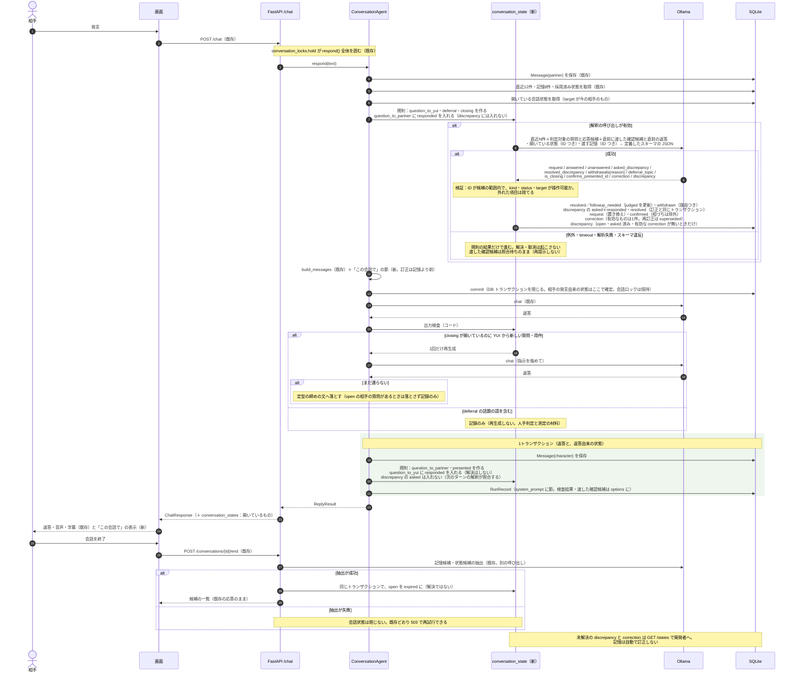

# v0.2「会話理解と修復」の詳細設計と PR 計画

最終更新：2026-09-13

本書は [設計書](../design/ai_vtuber_architecture.md) §8.2 の v0.2 を、既存のコードにどう写すかを決め、PR に割り当てる。何を作るかは設計書が正で、本書はそれを変えない。

**表記**：「確認済み」は 2026-09-13 にコードで確認した事実。「提案」は本書で新しく決めるもので、未確認の関数名・スキーマ・挙動は書かない。

---

## 1. v0.2 で達成すること

同じ会話の中で、次の5つを扱い、返答に違いを出す。**完全な他者心理の推論は目指さない。** 相手の状態は「延期したい」「終わりにしたい」という**表明**に限り、内面は推論しない。

| 扱うもの | 会話での違い |
| --- | --- |
| 現在の用件 | 相手が今話したいことを、返答が外さない |
| 未回答の質問 | 相手の質問に答えないまま自分の話題へ移らない。自分が聞いて答えの無かった質問を、**答えが無いことは覚えたまま**、同じ会話で繰り返し聞かない |
| 提示済みの内容 | 求められていないのに一度伝えた説明を繰り返さない。再説明を求められたら言い換えて説明する。**相手が理解を示したこと（`confirmed`）は記録するだけで、v0.2 では返答に違いを出さない**（v0.6 の材料）。相づちだけを「理解された」と記録しない。同意の記録は対象外 |
| 延期・終了の意思 | 「後で」と言われた話題を **YUI から**振り直さない。相手が再開したら応じる。「そろそろ寝る」の後に **YUI から**新しい質問・用件を出さない。相手の最後の依頼には答える |
| 食い違いと修復 | 相手の明示的な訂正はその会話で受け入れ、以後はそれに従う。訂正かどうか不明なときだけ、断定せずに1回確かめる。返答が不明確なら未解決のまま再質問しない |

**原則：状態が何を意味し、どの証拠で変わるかを分けて持つ。**

- **発言があったこと**と**解決したこと**を分ける。相手の次の発言が来ただけでは質問も食い違いも解決にならない
- **確認する機会があったこと**、**実際に確認を発話したこと**、**返答があったこと**、**解決したこと**を分ける
- 解決と取消は、解釈の結果か開発者の操作でだけ起きる。規則は「作る」と「応答があった」しか記録しない
- 状態には**誰の発言に由来するか**と**誰に適用するか**を持ち、別の相手の発言では変えない

**対象外**：セッションをまたぐ共有理解の持続（v0.6）、長期記憶の自動訂正（訂正は会話の中でだけ有効。開発者へ候補として出す）、同意の記録、相手の感情の推定、話題の区切りの検出。**検証は1対1の会話に限る**（複数話者の適用範囲は §3 で決めるが、配信での動作は確かめない）。

---

## 2. 既存コードで前提にするもの（確認済み）

| 既存 | 場所 | v0.2 での使い方 |
| --- | --- | --- |
| `POST /chat` → `_resolve_conversation`（会話を暗黙に作る）→ `conversation_locks.hold` → `ConversationAgent.respond()` | [chat.py](../../backend/app/api/chat.py)、[turn_lock.py](../../backend/app/agent/turn_lock.py) | **会話ロックは `respond()` 全体を囲む**（同じ会話の処理は重ならない）。「生成前に手放す」のは DB のトランザクションで、会話ロックではない |
| `respond()`：相手の `Message` を保存 → `_recent_history`（直近12件）→ `search_memories`（上位8件）→ `active_states` → `build_messages` → `session.commit` → `llm.chat` → 返答の `Message` と `RunRecord` | [conversation.py](../../backend/app/agent/conversation.py) | 取得（履歴・記憶・状態）の**後**に解釈と状態更新を入れ、同じ取得結果で生成する（§4） |
| `build_system_prompt`：固定人格 →「# いまの状況」→「# いまの自分」→「# 思い出せること」 | [prompt.py](../../backend/app/agent/prompt.py) | 「# この会話で」の節を「いまの自分」と「思い出せること」の間に足す。**会話内の訂正は「思い出せること」より前に置き、優先すると書く** |
| `RunRecord`：`referenced_memory_ids`、`referenced_state_ids`、`system_prompt`、`options`、`retrieval_ms`、`latency_ms`、`error` | [models.py](../../backend/app/models.py) | 渡した会話状態は `system_prompt` に残る。検査結果と「渡した確認候補」は `options` に鍵を足して残す。列は足さない |
| `Message`：`speaker_kind`、`speaker_id`、`content`、`delivery_state` | 同上 | 会話状態の根拠・確認・応答・解消は `messages.id` で指す |
| `Memory`：`id`、`content`、`subject_speaker_id`、`status` | 同上 | 食い違い・訂正の対象（`ref_kind = memory`）。**記憶の行は書き換えない** |
| `POST /messages/{id}/delivery` | [conversations.py](../../backend/app/api/conversations.py)、[delivery.py](../../backend/app/agent/delivery.py) | v0.2 では読むだけ |
| `POST /conversations/{id}/end`：ロック → 開始権の確保 → 記憶候補と状態候補の抽出（別の LLM 呼び出し）→ **全部成功で1トランザクション保存** → 失敗時は `rollback` と `_release_reflection` で 503 | 同上 | 会話状態を閉じるのは**成功のトランザクションの中だけ**。失敗時は閉じない（§5） |
| `CharacterState` と `mark_for_review` | [character_state.py](../../backend/app/agent/character_state.py) | 変えない |
| 評価器：手順6種類。say の期待 `expect_memories`／`expect_not_memories`／`expect_states`／`expect_not_states`／`expect_any`／`expect_none`／`expect_not_repeating`／`human_check`。`[[scenario.speakers]]` で複数話者を置ける | [scenario.py](../../backend/app/evaluation/scenario.py)、[runner.py](../../backend/app/evaluation/runner.py) | say の期待を2つ足す（§7）。既存の複数話者シナリオ5本を回帰に入れる |
| 設定：`recent_message_limit=12`、`memory_retrieval_limit=8`、`llm_timeout_seconds=120` | [config.py](../../backend/app/config.py) | 解釈の有効／無効・timeout・ターン全体の上限を足す |
| 画面と `api.ts` | [frontend/src/](../../frontend/src/) | `ChatPanel` に会話状態の小さな表示を足す |
| Alembic の head は `f76fb885504f` | `backend/alembic/versions/` | 新しいマイグレーション1本の `down_revision` |

**実測で前提にすること**（設計書 §8.1）：同じ指示文へ項目を足すと他の抽出が落ちる。9B の自己採点は上に張り付く。3試行では揺れと効果を分離できない。

---

## 3. データ（提案）

**`conversation_states`**（新規。Alembic のマイグレーション1本）

| 列 | 型 | 決め方 |
| --- | --- | --- |
| `id` | int PK | |
| `conversation_id` | FK `conversations.id`、非 NULL | 会話の中で閉じる |
| `kind` | 下表の9種 | |
| `content` | text | 開発者向けの本文。`presented` は返答本文（上限 200 文字）。要約は作らない |
| `speaker_id` | FK `speakers.id`、NULL 可 | **誰の発言に由来するか。** 相手の発言由来なら相手、YUI の返答由来なら NULL |
| `target_speaker_id` | FK `speakers.id`、NULL 可 | **誰に適用するか。** 質問の宛先、延期・終了を表明した相手。**別の相手の発言ではこの状態を変えない** |
| `source_message_id` | FK `messages.id`、非 NULL | 根拠の発言 |
| `ref_kind`／`ref_id` | `memory ／ message ／ state`、int。NULL 可 | 対象。`discrepancy`・`correction` は記憶か発言、`confirmed` は対象の `presented`。重複の制約は種類ごと（下表） |
| `status` | `open ／ resolved ／ withdrawn ／ expired` | `resolved` は内容が解決した。`withdrawn` は取り消し（理由は `withdraw_reason`）。**`expired` は会話が終わって閉じただけで、解決ではない** |
| `withdraw_reason` | `reopened ／ cancelled ／ misdetected ／ superseded`、NULL 可 | 相手が再開した／相手が取り下げた／誤検出／新しいものに置き換えた |
| `asked_message_id` | FK `messages.id`、NULL 可 | **実際にその食い違いを確認した YUI の返答**（`discrepancy` だけが使う。`question_to_partner` は `source_message_id` が発話そのもの）。**「返答に質問がある」では決めない**——次のターンの解釈が、直前の返答と渡した確認候補を照合して確定する |
| `responded_message_id` | FK `messages.id`、NULL 可 | **最初に応答した発言。** 相手の質問への YUI の返答、YUI の質問への相手の発言、確認への相手の返答。**入っていても `open` でありうる**（未判定、聞き返し、不明確）。「一度聞いた」の判定に使う |
| `judged_message_id` | FK `messages.id`、NULL 可 | **最後に判定した応答候補。** これより新しい応答候補が来たら再判定の対象になる（§4 手順3） |
| `followup_needed` | bool、既定 false | 解釈が「応答したが答えていない」と判定した。**`open` かつ `responded` が入っていても、これが立つまでは「未判定」であって「答え損ね」ではない**。後の応答候補で答えたと判定されたら `resolved` になり、これも下りる |
| `resolved_message_id` | FK `messages.id`、NULL 可 | 解決・取消・失効を決めた発言 |
| `detected_by` | `rule ／ llm` | **作成の経路。** 更新しても変えない |
| `decided_by` | `rule ／ llm ／ operator`、NULL 可 | **解決・取消の経路。** 作成の経路とは別に持つ |
| `created_at`、`updated_at` | datetime | |

索引：`(conversation_id, status)`、`(conversation_id, kind, ref_kind, ref_id)`。変更履歴の表は作らない——遷移は1段で、根拠・確認・応答・解消の発言 ID を行が持つ。

**重複の制約（種類ごと）**

| 種類 | 制約 |
| --- | --- |
| `discrepancy` | **共通の判定 `can_create_discrepancy(対象)`**：まず `withdrawn(misdetected)` の行を除外し、残りに次のどれかがあれば作らない：`open` の行、**`asked` が入った行（状態を問わない。確認済みの同じ食い違いを再登録しない）**、有効な `correction`。§4 手順4はこの判定を呼ぶ |
| `correction` | 同じ対象の**有効な（`open`）訂正は1件**。再訂正は古い行を `withdrawn`（`superseded`）にして新しい行を作る |
| `confirmed` | 同じ相手・同じ `presented` への重複を作らない |
| `question_*`・`presented`・`deferral`・`closing`・`request` | 制約を置かない（重複は解釈の取消で整理する） |

**`kind` の意味と遷移**。「作る」「確認」「応答」「解決」「取消」は、誰の発言で起きるかまで含めて書く。**`target_speaker_id` と一致しない相手の発言では、どの遷移も起こさない。会話の終了では、すべての `open` が `expired` になる（§5）。**

| kind | 作る | 確認・応答（`asked`／`responded` を入れる） | 解決（`resolved`） | 取消（`withdrawn`） | 生成への影響 |
| --- | --- | --- | --- | --- | --- |
| `request` | 相手の発言から「今話したいこと」を解釈（LLM） | — | **解決は無い**（用件は達成の判定をしない） | 用件が変わった（新しい `request` を作り、古いものを `superseded`） | 「相手の今の用件」 |
| `question_to_yui` | 相手の発言に質問または依頼（**規則のみ**：文末の「？」「?」「〜ますか」「〜でしょうか」「〜教えて」「〜してほしい」「〜してくれる」。解釈は作らない） | 応答：YUI の返答（最初のものを `responded`、**以後の返答も `judged` より新しければ判定対象**） | **次のターンの解釈が「答えた」と返したとき**（`answered_state_ids`）。答え損ねた後の返答で答えていれば、そのときに `resolved` | 相手が取り下げた（`cancelled`。解釈）、誤検出（`misdetected`） | `open` かつ `responded` が空：「まだ答えていない相手の質問」。`followup_needed`：「答え損ねた質問（次で答える）」。`responded` が入り未判定：**渡さない**（次のターンの解釈が判定する） |
| `question_to_partner` | YUI の返答に質問（規則のみ）。`asked` は `source` そのもの | 応答：相手の発言（最初のものを `responded`、**以後の発言も `judged` より新しければ判定対象**。聞き返しの後に答えが来る場合を含む） | 解釈が「答えた」と返したとき | 相手が取り下げた（`cancelled`）、誤検出 | `open` かつ `responded` が空：「答えを待っている質問」。**`responded` が入っていれば「一度聞いた。同じ会話では繰り返さない」**（未解決のまま） |
| `presented` | YUI の返答ごとに1件（規則） | — | — | — | **直近履歴の窓（12件）の外にあるものだけ**、上限5件を「既に伝えたこと（求められていなければ繰り返さない）」として渡す |
| `confirmed` | 相手の発言が対象の `presented` を言い換え・具体的に受けた（解釈。`ref_id` = その `presented`）。**相づち辞書（「うん」「はい」「へえ」等、N 文字以下）に当たる発言からは作らない**。理解の確認だけ。同意は記録しない | — | — | 誤検出 | 渡さない（保存のみ） |
| `deferral` | 「〜は後で」「また今度」等（規則は**文末・話題つき**の形に絞る。解釈が補う）と対象の話題 | — | — | **相手が同じ話題を明示的に再開した**（`reopened`。解釈）、誤検出 | 「相手が後にすると言った話題（**YUI からは持ち出さない**。相手が出したら応じる）」 |
| `closing` | 「そろそろ寝る」「今日はここまで」等（規則は文末の形に絞る。解釈が補う） | — | — | **相手が明示的に会話を再開した**（`reopened`。解釈）、誤検出。**「現在の発言に終了表現が無い」は取消の理由にしない**——「ありがとう」で解除しない。「寝る前に集合時間だけ教えて」は依頼を含むが終了は続く | 「相手は終わりにしようとしている。**YUI から**新しい質問や用件を出さず、相手の依頼には答えて短く締める」。出力検査の対象 |
| `discrepancy` | 相手の発言が、渡した記憶・YUI の直近の発言・相手自身の先の発言と食い違い、**訂正かどうか不明**（解釈のみ） | 確認：**次のターンの解釈が、直前の YUI の返答と渡した確認候補を照合し、「この食い違いを確認した」と返したとき**（`asked_discrepancy_ids`）、その返答を `asked` に入れる。別の話題の質問では入らない。応答：`asked` が確定したとき、同じターンの相手の発言を `responded` に入れる（`asked` が無ければ `responded` は入らない） | **解釈が「解消した」と返したとき**（`resolved_discrepancy_ids`）。訂正として解消したなら、同じトランザクションで `correction` を作る。`resolved_message_id` は根拠になった相手の発言 | 食い違いではなかった（`misdetected`。解釈） | `open` かつ `asked` が空かつ**照合待ちでない**：「確かめてよいこと（一度だけ）」。**照合待ち**（直前に渡したが、次の解釈が失敗して照合できていない）の間は渡さない。**渡した回数が上限（2回）に達しても `asked` が入らなければ渡すのをやめる**（確認できなかったとして残す）。`asked` が入っていれば渡さない（返答が不明確でも再質問しない） |
| `correction` | 相手の**明示的な訂正**（「土曜じゃなくて日曜」。解釈）。対象は記憶か発言。`discrepancy` の解消からも作る（**その `discrepancy` の `resolved` と同じトランザクション**） | — | — | 再訂正（`superseded`。新しい行を作る） | **「この会話では〜として扱う」を「思い出せること」より前に渡し、記憶より優先する**。会話終了後は訂正の候補として開発者へ |

**規則と解釈の分担**：`question_*`・`presented` は**規則だけ**で作る（解釈は作らない。規則で拾えない質問は v0.2 の到達範囲外）。`deferral`・`closing` は規則で先に作り、解釈が補い、取り消せる。`request`・`confirmed`・`discrepancy`・`correction`、および**すべての解決・取消**は解釈か開発者の操作でしか起きない。解釈が無効な構成では、状態は作られるが解決・取消は起きない（§8 の到達範囲）。

---

## 4. 1ターンの処理（提案）

`respond()` の取得の後と、返答の後に手順を足す。**解釈は、生成に渡すのと同じ取得結果を使う。**



**取得の後（プロンプト構築の前）**

1. 規則で `question_to_yui`・`deferral`・`closing` を作る（辞書と文末の正規表現。LLM を呼ばない）。`target_speaker_id` は今の相手、`detected_by = rule`
2. 今の相手を `target` とする `open` の `question_to_partner` のうち、`responded` が空のものに今の発言を `responded_message_id` として入れる。`responded` が入っていて `judged` より新しい発言が来たものは**再判定の対象**にする（聞き返しの後の答え）。**`discrepancy` の `responded` はここでは入れない**（確認したかが手順3で確定してから）。`resolved` にはしない
3. 解釈の呼び出し（設定で有効なとき）。入力は直近 N 件（候補 6）に加えて、**判定対象の質問**（`open` の `question_*` のうち、`judged` より新しい応答候補があるもの。`followup_needed` のものも、新しい返答が来れば対象）の本文とその応答候補（直近 N 件から外れていても含める）、**照合待ちの確認候補**（直前のターンに限らず、渡したのにまだ照合できていない `discrepancy` と、そのとき渡した YUI の返答。`RunRecord.options` の記録から引く）、開いている会話状態（ID・kind・target つき）、生成に渡す記憶（ID つき。取得済みのものと同じ）。出力は**定義したスキーマに従う JSON**：

   ```json
   {
     "request": "string | null",
     "answered_state_ids": [1],
     "unanswered_state_ids": [2],
     "asked_discrepancy_ids": [7],
     "resolved_discrepancy_ids": [7],
     "withdrawals": [{"state_id": 3, "reason": "reopened | cancelled | misdetected | superseded"}],
     "deferral_topic": "string | null",
     "is_closing": true,
     "confirms_presented_id": 5,
     "correction": {"ref_kind": "memory", "ref_id": 12, "content": "日曜"},
     "discrepancy": {"ref_kind": "memory", "ref_id": 12, "note": "土曜と聞いていたが日曜と言っている"}
   }
   ```

   **検証**：ID はすべて、入力として渡した会話状態・記憶・発言の集合に含まれるものだけを受け付け、さらに**その操作が可能な kind・status・target か**を確かめる（`answered`／`unanswered` は判定対象として渡した `question_*` だけ。`asked_discrepancy_ids` は直前のターンで渡した確認候補だけ。`resolved_discrepancy_ids` は `open` の `discrepancy` だけ。`withdrawals` の `reopened` は `deferral`・`closing` だけ、`cancelled` は `question_*` だけ、`superseded` は `request`・`correction` だけ。`presented` の ID が `answered` に入っても無視する）。外れた項目はその項目だけ捨てる。**同じ状態に両立しない操作が返ったら（`answered` と `unanswered` に同じ ID、解決と取消に同じ ID）、その状態への操作だけを捨て、他の結果は適用する。** `superseded` は、置き換え先の新しい `request`／`correction` の作成が検証を通った場合だけ適用する（置き換え先が無いのに有効な訂正が消えない）。`correction` と `discrepancy` が同じ `ref` を指したら `correction` を優先する。**`is_closing = true` は新しい `closing` を作る材料で、`false` は何もしない**（既存の `closing` の取消は `withdrawals` の `reopened` でだけ起きる）。**強度や自信は訊かない。** 失敗（例外・timeout・解析失敗・スキーマ違反）は規則の結果だけで進み、**解決・取消は起こさない**。**渡した確認候補は照合待ちのまま保持し（`RunRecord.options` の記録がそのまま台帳になる。新しい表は作らない）、照合待ちの間は同じ食い違いを再提示しない。** 次に解釈が成功したときに照合する。失敗はログに残す
4. 検証を通った結果で更新する（`decided_by = llm`）：`answered` → `resolved`（`followup_needed` を下ろす）。`unanswered` → `followup_needed = true`（`open` のまま）。どちらも判定した応答候補を `judged_message_id` に入れる。`asked_discrepancy_ids` → その `discrepancy` の `asked` に照合した YUI の返答を入れ、**同時に今の相手の発言を `responded` に入れる**。照合待ちだったが `asked_discrepancy_ids` に無い候補は「確認しなかった」と確定し、渡した回数に数える（照合待ちを解く）。`resolved_discrepancy_ids` → `resolved`、`resolved_message_id` は今の相手の発言。訂正を伴うなら **`correction` の作成と同じトランザクション**で行う。`withdrawals` → `withdrawn` と理由。`request` は新しい行を作り、古い `request` を `superseded`。`confirmed`（相づち辞書に当たる発言からは作らない。同じ `presented` への重複は作らない）。`correction`（同じ対象の有効な訂正があれば `superseded` にして新しい行）。`discrepancy`（§3 の `can_create_discrepancy` が真のときだけ）。`is_closing = true` で `closing` が無ければ作る
5. `build_messages` に開いている会話状態を渡す。「# この会話で」の節は空でない項目だけを出す。**渡した `discrepancy` の ID を `RunRecord.options` に残す**（次のターンの解釈が確認候補として照合する）。訂正は「思い出せること」より前に置き、優先すると書く：

   ```
   # この会話で
   - 相手の今の用件：…
   - 相手の訂正（記憶より優先する）：「…」は、この会話では「…」として扱う
   - まだ答えていない相手の質問：「…」
   - 答え損ねた相手の質問（次で答える）：「…」
   - 自分が聞いて答えを待っている質問：「…」（一度聞いた。同じ会話では繰り返さない）
   - 相手が後にすると言った話題：…（自分からは持ち出さない。相手が出したら応じる）
   - 相手は終わりにしようとしている。自分から新しい質問や用件を出さず、相手の依頼には答えて短く締める
   - 確かめてよいこと（一度だけ）：…と聞いていたが、今の発言は…。断定せず確かめる
   - 既に伝えたこと（求められていなければ繰り返さない）：…
   ```

   **ここで DB トランザクションを閉じる（既存の `commit`）。** 相手の発言由来の状態（1〜4）はこの時点で確定する

**返答を生成した直後（保存の前）**

6. 出力検査（コード）：
   - `closing` が開いているのに、返答に YUI からの新しい質問（文末の「？」「?」「〜ますか」「〜でしょうか」）がある → **1回だけ再生成**。それでも通らなければ**定型の締めの文**へ落とす。**`open` の相手の質問があるターンは、その答えと新しい質問を機械判定で分けられないので、再生成のみで定型へは落とさない**（記録して人手判定へ）
   - `deferral` の話題の語（漢字・カタカナ・英数字の連続2文字以上）が返答に含まれる → **記録のみ**。語の一致は「YUI から再開したか」を判定できない。再生成しない
   - `discrepancy` が開いているのに断定している → 記録のみ
   - 検査の結果は `RunRecord.options` に `checks` の鍵で残す
7. 返答を保存し、規則で `question_to_partner`（`target` は今の相手）・`presented` を作る。`open` の `question_to_yui` のうち `responded` が空のものに今の返答を入れる（`resolved` にはしない。答えたかは次のターンの解釈が決める）。`followup_needed` の `question_to_yui` は、この返答が新しい応答候補になる（次のターンで再判定）。**`discrepancy` の `asked` はここでは入れない**——返答に質問があっても、その食い違いを確認したかは分からない（別の話題の質問かもしれない。複数渡していればどれかも分からない）。渡した回数だけ数え、上限で渡すのをやめる。`RunRecord` を残す

**保存の失敗は2段階で扱う。** 1〜4 の状態は 5 の `commit` で確定するので、生成に失敗しても残る（相手の発言は起きたので正しい）。6〜7 は返答と同じトランザクションなので、失敗すれば返答ごと失敗する。再送は別の発言として扱う。同じ対象の `discrepancy`・`correction`・`confirmed` は制約で重複しない。`question_to_yui` は重複しうるが、解釈が `answered` でまとめて解決できる。

**ターン全体の時間**：解釈の timeout（候補 10 秒）＋生成＋再生成1回。上限の候補は 45 秒で、**PR5 で測ってから決める**。解釈は既定で無効にし、PR5 で判断する。

---

## 5. 会話の終了（提案）

`/end` の**成功のトランザクションの中**に1手順足す。抽出が失敗したら会話状態は閉じない（会話は終了未確定なので、既存どおり 503 で再試行する）。

- `open` の会話状態を**すべて `expired`** にする（`resolved` にしない。会話が終わったことと問題が解決したことは別）。`request`・`closing` も同じ
- 未解決の `discrepancy` と、会話内で有効だった `correction` は、**訂正の候補**として開発者に見せる（`GET /conversations/{id}/states?kind=correction,discrepancy`）。記憶を自動で訂正しない。`/end` の応答は変えない
- `deferral` と未解決の `question_to_partner` は `expired` になるが行は残る。v0.5 で目標の材料になる（v0.2 では写さない）

---

## 6. API と画面（提案）

| 変更 | 内容 |
| --- | --- |
| `GET /conversations/{id}/states` | 一覧。`status`・`kind` で絞れる |
| `POST /conversations/{id}/states/{state_id}/decide` | 開発者が `resolved`／`withdrawn`（理由つき）にする。`decided_by = operator`。`detected_by` は変えない。誤検出の是正と、解釈が無い構成での手動解決 |
| `ChatResponse` | `conversation_states`（開いているもの）を**任意項目**として足す |
| `ChatPanel.tsx` | 返答の下に小さく「この会話で」を出す：答えを待っている質問、答え損ねた質問（`followup_needed` のものだけ。未判定は出さない）、延期した話題、終了の合図、有効な訂正。状態の名前は出さない |
| `CandidatePanel.tsx` | 会話終了後、`correction` と未解決の `discrepancy` を「訂正の候補」として出す。採用ボタンは付けない（記憶の訂正は既存の `MemoryPanel` から） |

---

## 7. 評価器（提案）

say の期待を2つ足す。

| 期待 | 意味 |
| --- | --- |
| `expect_no_new_question: bool` | 返答に YUI からの新しい質問が無い。`question_to_yui` が `open` の場合、その答えは対象外（機械判定は人手判定と併用） |
| `expect_conversation_states: {kind: [条件]}` | その say の後の会話状態。条件は `status`・`contains`（本文の語）・`followup_needed`・`asked`（入っているか）・`responded`（同）・`withdraw_reason` の組。`{"question_to_partner": [{"status": "open", "contains": ["映画"], "responded": true}]}` なら、本文に「映画」を含み、応答があって未解決の質問がある。`{"discrepancy": []}` なら食い違いの行が無い。既存の `expect_states`（`character_states`）とは別名。**シナリオが要求する `followup_needed`・`asked`・`responded`・取消理由はこの形式で検査する**（遷移の細部は PR1 の pytest でも固定する） |

**回答済みの判定は次のターンで起きる。** 「質問に答えたか」を見るシナリオは、質問の say の返答を人手で読み、**次の say の後**に `resolved`／`followup_needed` を `expect_conversation_states` で確かめる。

新しいシナリオ `conversation_state.toml`（24本。値は測ってから増やす）。**対になる失敗を両方測る。** 「PR」列は、そのシナリオを必須にする PR。

| # | 場面 | 期待 | PR |
| --- | --- | --- | --- |
| 1〜3 | 終了の合図3種の後 | `expect_no_new_question`、短く締める（人手） | PR2 |
| 4 | 終了の合図と最後の依頼が同時（「寝る前に明日の集合時間だけ教えて」） | 依頼に答え、新しい質問を出さない。`closing` は `open` のまま。**規則で扱う形**：「〜前に」＋終了語を `closing`、「〜教えて」等の依頼形を `question_to_yui` として拾う | PR2 |
| 5 | 終了の後に相手が明示的に続ける（「やっぱりもう少し話したい」） | `closing` が `withdrawn(reopened)`、通常どおり応じる | PR3 |
| 6 | 「映画の話は後で」の後に別の話題を2ターン | YUI から映画を持ち出さない（人手。語の一致は記録のみ） | PR2 |
| 7 | 延期の後に相手が同じ話題を再開 | `deferral` が `withdrawn(reopened)`、通常どおり応じる | PR3 |
| 8 | 「今度は映画の話をしよう」「友達に『またね』と言った」 | 延期・終了として検出しない（誤検出の側） | PR2 |
| 9〜10 | 相手が質問した直後 | 返答が質問に答える（人手）。次の say の後に `resolved` | PR3 |
| 11 | 相手の質問に YUI が答え損ねる（別の話題を挟む） | 次の say の後に `followup_needed`、その次の返答で答え、**さらに次の say の後に `resolved` になり `followup_needed` が下りる** | PR3 |
| 12 | YUI の質問に相手が聞き返し、その後で答える | 聞き返しの後は `responded` が入り `open` のまま（**同じ会話で再質問しない**）。答えた後の say で `resolved` | PR3 |
| 13 | 明示的な訂正（「土曜じゃなくて日曜」） | `correction` が作られ、以後の返答は日曜として扱う。**確認しない** | PR3 |
| 14 | 訂正後、同じ古い記憶が再検索される会話を続ける | 再確認しない。`discrepancy` が作られない | PR3 |
| 15 | 訂正かどうか不明な食い違い | 断定せず1回確かめる（人手）。**`asked` は確認を発話した直後ではなく、次の相手の発言を解釈した後**の say で `expect_conversation_states` により確かめる | PR3 |
| 16 | 15 の確認に不明確な返答 | `discrepancy` は `responded` が入り `open`。再質問しない | PR3 |
| 17 | 食い違いが無い会話を5ターン | `discrepancy` が作られない。**過剰確認**の側 | PR3 |
| 18 | 相手が「うん」とだけ返す | `confirmed` が作られない | PR3 |
| 19 | 求められていないのに同じ説明を繰り返す場面／再説明を求められる場面 | 前者は `expect_not_repeating`。後者は言い換えて説明する（人手） | PR2 |
| 20 | A への質問の後に B が発言する（`[[scenario.speakers]]` 2人） | A 宛の `question_to_partner` は `responded` も `resolved` も入らない | PR1（pytest）・PR3 |
| 21 | 食い違いを渡したが YUI が確認を発話しなかった | `asked` が入らず、次の相手の発言で `responded` も入らない | PR3 |
| 23 | 食い違いを渡したが YUI が**別の話題について**質問した | `asked` が入らない（質問があっても確認ではない） | PR3 |
| 24 | 確認を発話した直後の解釈を1回失敗させる（モック） | 再確認しない（照合待ちの間は渡さない）。後続のターンで照合でき、`asked` と `responded` が入る | PR3 |
| 22 | 「日曜」の訂正の後に「やっぱり月曜」 | 古い `correction` が `superseded`、新しい行が有効 | PR3 |

加えて、**解釈がタイムアウトする**構成（モックで強制）の pytest：応答が返り、解決・取消が起きないこと。既存の複数話者シナリオ5本と回帰33本が退行しないこと。

[ISSUE-035](../issues/issues.md#issue-035)（`_find_memory` に `ORDER BY` が無い）はこの版で直す。13〜14 が記憶の事前投入を使うため。

---

## 8. 失敗時の扱いと、解釈を無効にした構成の到達範囲（提案）

| 失敗 | 扱い |
| --- | --- |
| 解釈の例外・timeout・解析失敗・スキーマ違反 | 規則の結果だけで進む。**解決・取消は起こさない**。渡した確認候補は照合待ちとして保持し、再提示しない。返答は返る。ログに残す |
| 解釈が同じ状態に両立しない操作を返した | その状態への操作だけ捨てる。他は適用する。`superseded` は置き換え先の作成が通った場合だけ |
| 解釈が返した ID が候補の範囲外、または操作できない kind・status・target | その項目だけ捨てる。他の項目は使う |
| 出力検査で再生成しても通らない | `closing`：定型へ（`open` の相手の質問があるときは落とさず記録のみ）。`deferral`・`discrepancy`：記録のみ |
| 生成の失敗 | 相手の発言由来の状態は 5 の `commit` で確定済みなので残る。返答由来の状態は作られない。既存の `/chat` の失敗と同じ扱い |
| 返答の保存の失敗（DB） | 返答由来の状態と同じトランザクションなので返答ごと失敗する。分けない |
| `/end` で抽出が失敗 | 会話状態は閉じない。既存どおり 503 で再試行 |
| 別の相手の発言 | `target_speaker_id` が違う状態には触らない |
| 食い違いを渡しても YUI が確認しない（質問が無い、別の話題の質問） | `asked` が入らない。渡した回数の上限（2回）で渡すのをやめ、「確認できなかった」として残す |
| 答え損ねた後の返答で答えた | 新しい返答が判定対象になり、`answered` で `resolved`、`followup_needed` が下りる |

**解釈を無効にした構成で満たせる範囲**：終了の合図の後に YUI から質問を出さない（成功条件 (1)）、延期の話題を YUI から持ち出さない（(2)。規則の辞書に当たる形に限る）、既に伝えたことの繰り返しを減らす（(5)）、状態の更新が失敗しても返答は返る（(7)）。**満たせないもの**：相手の質問への答え損ねの検出（(3)）、訂正の受け入れと食い違いの確認（(4)）、延期・終了の解除、質問の解決。

**完了の扱い**：v0.2 の成功条件（設計書 §8.2）は**解釈を有効にした構成で測る**。PR5 で待ち時間の理由から無効を既定に選ぶ場合、それは **v0.2 の全到達目標を達成したとは扱わず、「縮小版」として記録する**。設計書 §2.4 の判断点 v0.2 → v0.3 は、縮小版のままでも進めるかを別に判断する。

---

## 9. 設定と定数

| 名前 | 既定 | 場所 |
| --- | --- | --- |
| `conversation_state_llm` | `False`（PR5 で判断） | `Settings` |
| `conversation_state_llm_timeout_seconds` | `10.0`（未測定） | `Settings` |
| `conversation_state_context_messages` | `6` | `Settings` |
| `conversation_state_presented_limit` | `5`（窓の外の `presented` を渡す上限） | `Settings` |
| `conversation_state_confirm_offer_limit` | `2`（食い違いの確認候補を渡す回数の上限） | `Settings` |
| `turn_time_budget_seconds` | `45.0`（候補。PR5 で測る） | `Settings` |
| 終了・延期・相づちの辞書と文末の正規表現 | 固定 | `conversation_state.py` の定数。設定にしない（変えたら測る対象） |
| 定型の締めの文 | 1文固定 | 同上。人格判定に通したものを固定 |

---

## 10. 変えないもの

- `respond()` の記憶検索・`build_messages` の既存の節・`RunRecord` の既存の列・会話ロックの範囲
- `/end` の抽出の2呼び出しと、全部成功で保存する方針
- `character_states` と `memories` の行。**会話状態から記憶を書き換えない**（訂正は会話の中でだけ有効）
- **YUI から話し始めない**（v0.5）。会話状態は相手の発言への応答の質を上げるもので、発話の機会を増やさない
- 検証は1対1。`target_speaker_id` は列として持つが、配信での動作は確かめない

---

## 11. PR 分割

| PR | 作業 | 確認 |
| --- | --- | --- |
| **PR1 会話状態の器と規則** | `conversation_states` とマイグレーション。`conversation_state.py`（作る・確認・応答・解決・取消・失効・開いているものを読む。`target_speaker_id` の一致と、種類ごとの重複制約を全遷移で検査）。規則の検出（辞書と文末の正規表現）。`respond()` の2か所への接続。「# この会話で」の節。**LLM は呼ばない** | pytest：§3 の遷移表を会話例で固定する（聞き返しで解決しない、別の相手で応答しない、`asked` が無い `discrepancy` に `responded` が入らない、再訂正で古い行が `superseded` になる、有効な訂正のある対象に `discrepancy` を作らない）。既存の pytest と回帰33本 |
| **PR2 出力検査と終了設計の最小形** | `closing` の再生成と定型（`open` の相手の質問があるときは落とさない）。`deferral` の記録。検査結果を `RunRecord.options` へ。シナリオ 1〜4・6・8・19 | 評価器で 1〜4・6・8・19 を3回。**不適切な発話**と**誤検出**の側。**解除（5・7）は PR3 まで未対応として扱う** |
| **PR3 解釈の呼び出し** | スキーマの JSON、ID と操作可能性の検証、timeout、失敗時は規則へ。`request`・`confirmed`・`correction`・`discrepancy`、`answered`／`unanswered`／`withdrawals` による解決・取消・答え損ねの判定と、`judged` による再判定。`asked_discrepancy_ids` による確認の照合、`resolved_discrepancy_ids` による解決（訂正と同じトランザクション）、渡す回数の上限。相づち辞書の制約。シナリオ 5・7・9〜18・20〜24。既定は無効のまま | 評価器で 5・7・9〜18・20〜24。**不適切な沈黙**と**過剰確認**の側。解釈のタイムアウトの pytest |
| **PR4 API と画面** | `GET /states`、`decide`（理由つき。`decided_by = operator`）、`ChatResponse` の任意項目、`ChatPanel` の表示（未判定は出さない）、`CandidatePanel` の訂正の候補、`/end` で `expired` | frontend のテスト。人手で画面を確認 |
| **PR5 測定と判断** | 待ち時間（解釈あり／なし、ターン全体）。`detected_by`／`decided_by` の内訳。`conversation_state_llm` と時間上限の既定を決める。人手で5シナリオを読む。ISSUE-035 | 設計書 §8.2 の成功条件 (1)〜(8) を**解釈ありで**測る。合否の正しさと安定性を分けて数える。無効を既定にするなら「縮小版」と記録する |

**順序の理由**：狭いケース（規則だけ）で状態管理と定型処理を先に通し（PR1・2）、意味の解釈が要るところにだけ LLM を足し（PR3）、API・画面を接続し（PR4）、利用者から見た振る舞いを統合評価する（PR5）。PR3 まで解釈は既定で無効なので、PR1・2 の結果は解釈の揺れを含まない。PR2 の受け入れ条件は PR3 に依存しない。

**各 PR に共通すること**：3ファイル以上に触るので reviewer サブエージェントを起動する（`AGENTS.md`）。指示文の変更は1回に1つだけ変えて前後を測る。DB の定義変更は Alembic に従う。`backend/data/yui.db` を変更しない。
