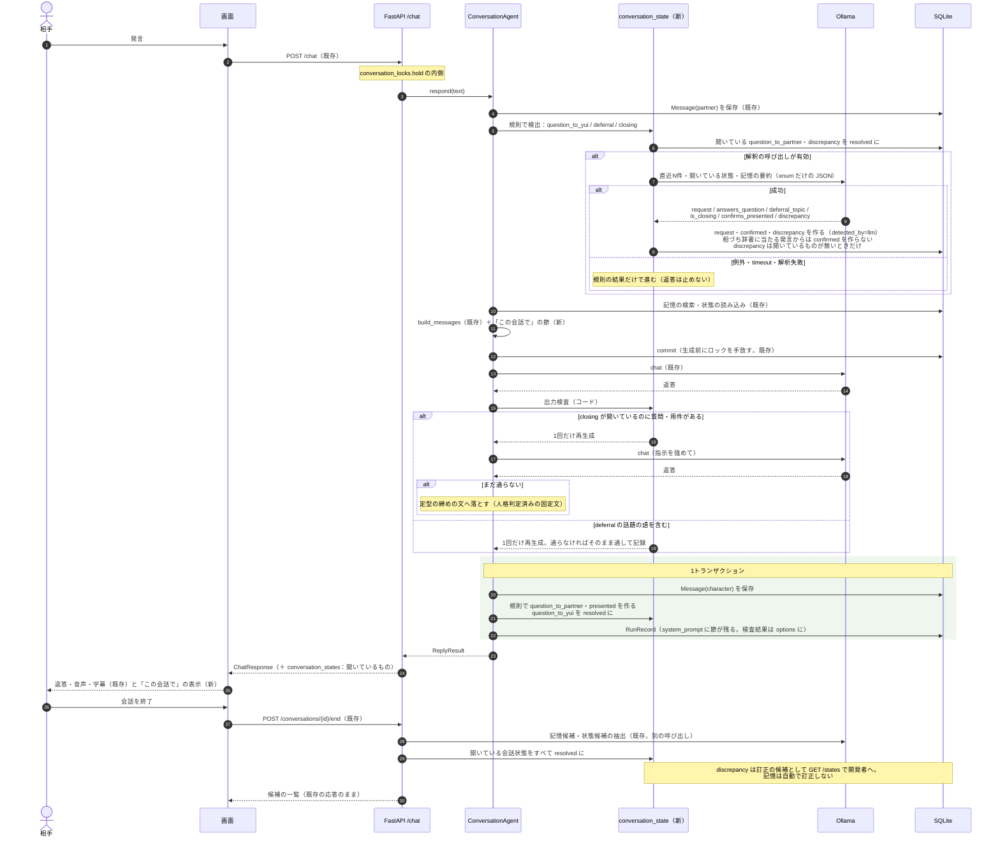

# v0.2「会話理解と修復」の詳細設計と PR 計画

最終更新：2026-09-13

本書は [設計書](../design/ai_vtuber_architecture.md) §8.2 の v0.2 を、既存のコードにどう写すかを決め、PR に割り当てる。何を作るかは設計書が正で、本書はそれを変えない。

**表記**：「確認済み」は 2026-09-13 にコードで確認した事実。「提案」は本書で新しく決めるもので、未確認の関数名・スキーマ・挙動は書かない。

---

## 1. v0.2 で達成すること

同じ会話の中で、次の5つを扱い、返答に違いを出す。**完全な他者心理の推論は目指さない。** 相手の状態は「延期したい」「終わりにしたい」という**表明**に限り、内面は推論しない。

| 扱うもの | 会話での違い |
| --- | --- |
| 現在の用件 | 相手が今話したいことを、返答が外さない |
| 未回答の質問 | 相手の質問に答えないまま自分の話題へ移らない。自分が聞いて答えの無かった質問を、同じ会話で繰り返さない |
| 提示済み・確認済みの内容 | 一度伝えた説明を同じ会話で繰り返さない。相づちだけを「同意された」と記録しない |
| 延期・終了の意思 | 「後で」と言われた話題を同じ会話で振り直さない。「そろそろ寝る」の後に新しい質問・用件を出さない |
| 食い違いと修復 | 相手の発言が以前の内容や記憶と食い違うとき、断定せずに1回だけ確かめる。訂正を受け止め、以後はそれに従う |

**対象外**：セッションをまたぐ共有理解の持続（v0.6）、記憶の自動訂正（食い違いは開発者へ出す）、相手の感情の推定、話題の区切りの検出。

---

## 2. 既存コードで前提にするもの（確認済み）

| 既存 | 場所 | v0.2 での使い方 |
| --- | --- | --- |
| `POST /chat` → `_resolve_conversation`（会話を暗黙に作る）→ `conversation_locks.hold` → `ConversationAgent.respond()` | [chat.py](../../backend/app/api/chat.py)、[turn_lock.py](../../backend/app/agent/turn_lock.py) | 会話状態の更新はこのロックの内側で行う。同じ会話の処理が重ならない |
| `respond()`：相手の `Message` を保存 → `_recent_history`（直近12件）→ `search_memories`（上位8件）→ `active_states` → `build_messages` → commit → `llm.chat` → 返答の `Message` と `RunRecord` | [conversation.py](../../backend/app/agent/conversation.py) | 会話状態の更新を「相手の発言の保存後・プロンプト構築前」と「返答の保存後」の2か所に足す |
| `build_system_prompt`：固定人格 →「# いまの状況」→「# いまの自分」（状態）→「# 思い出せること」（記憶） | [prompt.py](../../backend/app/agent/prompt.py) | 「# この会話で」の節を「いまの自分」と「思い出せること」の間に足す |
| `RunRecord`：`referenced_memory_ids`、`referenced_state_ids`、`system_prompt`、`retrieval_ms`、`latency_ms`、`error` | [models.py](../../backend/app/models.py) | 渡した会話状態は `system_prompt` に残る。列は足さない（§4） |
| `Message`：`speaker_kind`（user／character）、`speaker_id`、`content`、`delivery_state`、`delivery_started_at`／`finished_at` | 同上 | 会話状態の根拠と解消は `messages.id` で指す |
| `POST /messages/{id}/delivery`（再生の開始・完了・中断の通知） | [conversations.py](../../backend/app/api/conversations.py)、[delivery.py](../../backend/app/agent/delivery.py) | 「発話した」と「伝わった」を分ける材料。v0.2 では記録を読むだけ |
| `POST /conversations/{id}/end`：ロック → 開始権の確保（`reflection_started_at`、期限 180 秒）→ `extract_candidates` と `propose_state_candidates`（別の LLM 呼び出し）→ 全部成功で1トランザクション保存 → `ended_at` | [conversations.py](../../backend/app/api/conversations.py) | 会話の終了時に、開いたままの会話状態を閉じ、食い違いを開発者へ出す |
| `CharacterState`（`interest`／`relationship`、`needs_review`、`basis_memory_ids`、`visible_to_speaker_id`）と `mark_for_review` | [character_state.py](../../backend/app/agent/character_state.py) | 変えない。会話状態は別の表で持つ（§3） |
| 評価器：手順 say／reflect／new_conversation／restart／correct_memory／delete_memory。say の期待は `expect_memories`／`expect_not_memories`／`expect_states`／`expect_not_states`／`expect_any`／`expect_none`／`expect_not_repeating`／`human_check`。全返答で日本語以外を検出 | [scenario.py](../../backend/app/evaluation/scenario.py)、[runner.py](../../backend/app/evaluation/runner.py) | say の期待を2つ足す（§7） |
| 設定：`recent_message_limit=12`、`memory_retrieval_limit=8`、`llm_timeout_seconds=120`、`speech_enabled` | [config.py](../../backend/app/config.py) | 解釈の呼び出しの有効／無効と timeout を足す |
| 画面：`ChatPanel`、`HistoryPanel`、`MemoryPanel`、`StatePanel`、`CandidatePanel`、`SourceMessage`。`api.ts` の `chat`／`endConversation`／`candidates`／`decideCandidate` | [frontend/src/](../../frontend/src/) | `ChatPanel` に会話状態の小さな表示を足す |
| Alembic の head は `f76fb885504f` | `backend/alembic/versions/` | 新しいマイグレーション1本の `down_revision` |

**実測で前提にすること**（設計書 §8.1）：同じ指示文へ項目を足すと他の抽出が落ちる（役割ごとに呼び出しを分ける）。9B の自己採点は上に張り付く（強度は訊かず、少数の enum を選ばせる）。3試行では揺れと効果を分離できない（合計点で判断しない）。

---

## 3. データ（提案）

**`conversation_states`**（新規。Alembic のマイグレーション1本）

| 列 | 型 | 決め方 |
| --- | --- | --- |
| `id` | int PK | |
| `conversation_id` | FK `conversations.id`、非 NULL | 会話の中で閉じる |
| `kind` | 下表の8種 | |
| `content` | text | 短い要約（開発者向け。生成には根拠の発言の原文を優先して渡す） |
| `speaker_id` | FK `speakers.id`、NULL 可 | 相手の意思・質問なら相手。YUI 側の提示・質問なら NULL |
| `source_message_id` | FK `messages.id`、非 NULL | 根拠の発言 |
| `status` | `open ／ resolved ／ withdrawn` | |
| `resolved_message_id` | FK `messages.id`、NULL 可 | 解消した発言（相手の返答、YUI の返答） |
| `detected_by` | `rule ／ llm` | 表層規則で作ったか、解釈の呼び出しで作ったか。**どちらが効いているかを後で数えるため** |
| `created_at`、`updated_at` | datetime | |

索引：`(conversation_id, status)`。変更履歴の表は作らない——遷移は `open → resolved／withdrawn` の1段で、根拠と解消の発言 ID を行が持つので、後から辿れる。

**`kind` の意味と、開閉の規則**

| kind | 作る契機 | 閉じる契機 | 生成への影響 |
| --- | --- | --- | --- |
| `request` | 相手の発言から「今話したいこと」を解釈（LLM）。無ければ作らない | 終了の合図、または新しい `request` | 「相手の今の用件」として渡す |
| `question_to_yui` | 相手の発言に質問がある（規則：「？」「?」、または解釈） | YUI の次の返答で `resolved`（**答えたかの判定はしない**。追跡の終了） | 「まだ答えていない相手の質問」として渡す。この1ターンで答えることを促す |
| `question_to_partner` | YUI の返答に質問がある（規則） | 相手の次の発言で `resolved`（同上） | 「自分が聞いて答えの無かった質問」として渡し、**同じ会話で繰り返さない** |
| `presented` | YUI の返答ごとに1件（規則。`content` は返答の先頭1文） | 会話の終了 | 「この会話で既に伝えたこと」として渡し、繰り返さない |
| `confirmed` | 相手の発言が直前の `presented` を**言い換え・具体的に受けた**（解釈）。**相づちだけの短い発言（「うん」「はい」「へえ」等の辞書、N 文字以下）は作らない** | 会話の終了 | 渡さない（v0.6 で相手ごとの共有理解へ写す材料） |
| `deferral` | 「後で」「今度」「また今度」「あとでいい」等（規則の辞書、または解釈）と対象の話題 | 会話の終了。**同じ会話では閉じない** | 「相手が後にすると言った話題（この会話では持ち出さない）」として渡す。出力検査の対象 |
| `closing` | 「そろそろ寝る」「またね」「落ちる」「今日はここまで」等（規則の辞書、または解釈） | 会話の終了 | 「相手は終わりにしようとしている。新しい質問や用件を出さず、短く締める」として渡す。出力検査の対象 |
| `discrepancy` | 相手の発言が、渡した記憶・YUI の直近の発言・相手自身の同じ会話での先の発言と食い違う（解釈のみ。規則では取れない） | 相手の次の発言で `resolved`（確認への返答） | 「確かめてよいこと（一度だけ）」として渡す。**開いている `discrepancy` が1件あるときは新しく作らない**（過剰確認の抑制） |

**規則と解釈の分担**：`question_*`・`presented` は規則だけで作る。`deferral`・`closing` は規則の辞書で先に作り、解釈が補う。`request`・`confirmed`・`discrepancy` は解釈でしか作らない。**解釈が失敗しても規則の分は残る**ので、返答は常に返る。

---

## 4. 1ターンの処理（提案）

`respond()` に2つの手順を足す。図の元データと更新コマンドは [v0.2-sequence-turn.mmd](v0.2-sequence-turn.mmd)。



**相手の発言を保存した直後（プロンプト構築の前）**

1. 規則で `question_to_yui`・`deferral`・`closing` を作る（辞書と正規表現。LLM を呼ばない）
2. 相手の発言が来たので、開いている `question_to_partner` を `resolved` にする（`resolved_message_id` = 今の発言）。開いている `discrepancy` も同じ
3. 解釈の呼び出し（設定で有効なとき）：入力は直近 N 件（候補 6）、開いている会話状態、渡す記憶の要約。出力は **enum だけの JSON**：`{"request": str|null, "answers_question": bool, "deferral_topic": str|null, "is_closing": bool, "confirms_presented": bool, "discrepancy": {"with": "memory"|"yui"|"self", "ref_id": int, "note": str} | null}`。**強度や自信は訊かない。** 失敗（例外・timeout・解析失敗・enum 外の値）は**規則の結果だけで進む**。`detected_by` に記録し、失敗を `RunRecord.error` ではなくログに残す（返答の失敗ではないため）
4. 3 の結果で `request`・`confirmed`・`discrepancy` を作り、`deferral`・`closing` を補う。**`confirmed` は相づち辞書に当たる発言からは作らない**（解釈が true と言っても作らない）
5. `build_messages` に開いている会話状態を渡す。「# この会話で」の節は空でない項目だけを出す：

   ```
   # この会話で
   - 相手の今の用件：…
   - まだ答えていない相手の質問：「…」
   - 自分が聞いて、まだ答えの無い質問：「…」（この会話では繰り返さない）
   - 相手が後にすると言った話題：…（この会話では持ち出さない）
   - 相手は終わりにしようとしている。新しい質問や用件を出さず、短く締める
   - 確かめてよいこと（一度だけ）：…と聞いていたが、今の発言は…。断定せず確かめる
   - この会話で既に伝えたこと：…（繰り返さない）
   ```

**返答を生成した直後（保存の前）**

6. 出力検査（コード）：
   - `closing` が開いているのに、返答に質問（「？」「?」、「〜ますか」「〜でしょうか」の文末）や新しい用件がある → **1回だけ再生成**（指示を強めた system で）。それでも通らなければ**定型の締めの文**へ落とす（定型文は人格判定に通したものを固定で持つ。v0.5 の受け皿と同じ考え方）
   - `deferral` の対象の語（候補語。漢字・カタカナ・英数字の連続2文字以上）が返答に含まれる → 同じく1回だけ再生成、それでも含まれれば**そのまま通し、検査結果を記録する**（延期の違反は終了の違反より害が小さく、定型で置き換えると会話が壊れる）
   - `discrepancy` が開いているのに、返答が断定している（確認の形になっていない）→ 記録のみ。再生成しない（何が「断定」かの機械判定は粗く、誤検出で正しい返答を落とすため。人手判定で見る）
   - 検査の結果（通った／再生成した／定型へ落とした）は `RunRecord.options` に JSON で残す（既存の JSON 列。列を足さない。**`options` は生成設定の記録なので、`checks` の鍵を足して混ぜない形にする**）
7. 返答を保存し、規則で `question_to_partner`・`presented` を作る。相手の `question_to_yui` を `resolved` にする。`RunRecord` を残す

**待ち時間**：解釈の呼び出しが1ターンに1回増える。timeout は主生成より短く持つ（候補 10 秒。未測定）。**常時有効にするかは PR5 で測ってから決める**（設定 `conversation_state_llm` で切り替えられるようにし、既定は PR3 までは無効、PR5 で判断）。

---

## 5. 会話の終了（提案）

`/end` のトランザクションに1手順足す。抽出の前後どちらでもよいが、**抽出が失敗しても会話状態は閉じる**（失敗時は `_release_reflection` の後に閉じる）。

- 開いている会話状態をすべて `resolved`（`resolved_message_id` は NULL、`updated_at` に終了時刻）
- `discrepancy` は**訂正の候補**として開発者に見せる。記憶を自動で訂正しない。`GET /conversations/{id}/states?kind=discrepancy` で読む（§6）。`/end` の応答は変えない（既存の `list[MemoryCandidateOut]` のまま）
- `deferral` は会話の終了で閉じるが、`content` と `source_message_id` は残る。v0.5 で目標の期限へ写す材料になる（v0.2 では写さない）

---

## 6. API と画面（提案）

| 変更 | 内容 |
| --- | --- |
| `GET /conversations/{id}/states` | 一覧。`status`・`kind` で絞れる |
| `POST /conversations/{id}/states/{state_id}/resolve` | 開発者が手で閉じる（`withdrawn`）。誤検出の是正用 |
| `ChatResponse` | `conversation_states: list[ConversationStateOut]`（開いているもの）を**任意項目**として足す。既存の画面を壊さない |
| `ChatPanel.tsx` | 返答の下に小さく「この会話で」を出す：未回答の質問、延期した話題、終了の合図。文言は日本語で、状態の名前（`closing` 等）は出さない |
| `CandidatePanel.tsx` | 会話終了後、`discrepancy` があれば「訂正の候補」として一覧に出す。採用ボタンは付けない（記憶の訂正は既存の `MemoryPanel` から行う） |

[ISSUE-027](../issues/issues.md#issue-027)（画面の非同期処理が所有者を持たない）は、`ChatPanel` に取得を足すときに再検討する。`ChatResponse` に同梱すれば取得は増えない。

---

## 7. 評価器（提案）

say の期待を2つ足す。既存の `_ALLOWED_FIELDS` の仕組みに乗せる（手順の種類に無い指定は読み込みで止まる）。

| 期待 | 意味 |
| --- | --- |
| `expect_no_question: bool` | 返答に質問が無い（終了の合図の後） |
| `expect_states: {kind: [語]}` | その say の後に開いている会話状態。`{"deferral": ["映画"]}` なら、延期の状態が開いていて本文に「映画」を含む。既存の `expect_states`（`character_states` の本文）とは別名にする：**`expect_conversation_states`** |

新しいシナリオ `conversation_state.toml`（10本を目安。値は測ってから増やす）：

| # | 場面 | 期待 |
| --- | --- | --- |
| 1〜3 | 終了の合図3種（「そろそろ寝る」「また今度」「今日はここまで」）の後 | `expect_no_question`、返答が短い（人手） |
| 4〜5 | 「その話は後で」の後に別の話題を2ターン | 延期した話題の語が返答に出ない（`expect_none`）、`expect_conversation_states` |
| 6〜7 | 相手が質問した直後 | 返答が質問に触れる（`expect_any`）。**不適切な沈黙**の側 |
| 8 | 渡した記憶と食い違う発言（「土曜じゃなくて日曜」） | 返答が確認の形（人手）、`discrepancy` が開く |
| 9 | 食い違いが無い会話を5ターン | `discrepancy` が開かない。**過剰確認**の側 |
| 10 | 同じ説明を求められる2回目 | `expect_not_repeating` |

**対になる失敗を両方測る**：不適切な発話（終了後の質問、延期の話題）と不適切な沈黙（相手の質問の放置）。必要な確認（8）と過剰確認（9）。

[ISSUE-035](../issues/issues.md#issue-035)（`_find_memory` に `ORDER BY` が無い）はこの版で直す（`ORDER BY id`）。8番のシナリオが記憶の事前投入と訂正を使うため。

---

## 8. 失敗時の扱い（提案）

| 失敗 | 扱い |
| --- | --- |
| 解釈の呼び出しの例外・timeout・解析失敗 | 規則の結果だけで進む。返答は返る。`detected_by=rule` の行だけになる。ログに残す |
| 出力検査で再生成しても通らない | `closing`：定型へ。`deferral`：通して記録。`discrepancy`：記録のみ |
| 会話状態の保存の失敗（DB） | 返答の保存と同じトランザクションなので、返答ごと失敗する（既存の `/chat` の失敗と同じ扱い）。**会話状態のために返答の保存を分けない** |
| `/end` で抽出が失敗 | 会話状態は閉じる。抽出は既存どおり 503 で再試行できる |
| 二重送信 | 会話ロックの内側で直列化される。同じ発言が2回来れば2ターンとして扱う（既存と同じ） |

---

## 9. 設定と定数

| 名前 | 既定 | 場所 |
| --- | --- | --- |
| `conversation_state_llm` | `False`（PR5 で判断） | `Settings` |
| `conversation_state_llm_timeout_seconds` | `10.0`（未測定） | `Settings` |
| `conversation_state_context_messages` | `6` | `Settings` |
| 終了・延期・相づちの辞書 | 固定のリスト | `conversation_state.py` の定数。設定にしない（変えたら測る対象） |
| 定型の締めの文 | 1文固定 | 同上。人格判定に通したものを固定 |

---

## 10. 変えないもの

- `respond()` の記憶検索・`build_messages` の既存の節・`RunRecord` の既存の列
- `/end` の抽出の2呼び出しと、全部成功で保存する方針
- `character_states` の構造と `active_states` の条件
- 記憶の訂正は既存の API と画面から。**会話状態から記憶を自動で書き換えない**
- **YUI から話し始めない**（v0.5）。会話状態は相手の発言への応答の質を上げるもので、発話の機会を増やさない

---

## 11. PR 分割

| PR | 作業 | 確認 |
| --- | --- | --- |
| **PR1 会話状態の器と規則** | `conversation_states` とマイグレーション。`conversation_state.py`（作る・閉じる・開いているものを読む）。規則の検出（辞書と正規表現）。`respond()` の2か所への接続。「# この会話で」の節。**LLM は呼ばない** | pytest：規則の検出、開閉の遷移、節の組み立て、`closing` の後の質問の検出。既存の pytest と回帰33本 |
| **PR2 出力検査と終了設計の最小形** | `closing` の再生成と定型。`deferral` の再生成と記録。検査結果を `RunRecord.options` へ。シナリオ 1〜5・10 | 評価器で 1〜5・10 を3回。**不適切な発話**の側 |
| **PR3 解釈の呼び出し** | enum だけの JSON、timeout、失敗時は規則へ。`request`・`confirmed`・`discrepancy`。相づち辞書の制約。シナリオ 6〜9。設定の既定は無効のまま | 評価器で 6〜9。**不適切な沈黙**と**過剰確認**の側。解釈の有無で 1〜10 を比べる |
| **PR4 API と画面** | `GET /states`、`resolve`、`ChatResponse` の任意項目、`ChatPanel` の表示、`CandidatePanel` の訂正の候補、`/end` で閉じる | frontend のテスト。人手で画面を確認 |
| **PR5 測定と判断** | 待ち時間（解釈あり／なし）。`detected_by` の内訳。`conversation_state_llm` の既定を決める。人手で5シナリオを読む。ISSUE-035 | 設計書 §8.2 の成功条件 (1)〜(8)。合否の正しさと安定性を分けて数える |

**順序の理由**：狭いケース（規則だけ）で状態管理と定型処理を先に通し（PR1・2）、意味の解釈が要るところにだけ LLM を足し（PR3）、API・画面を接続し（PR4）、利用者から見た振る舞いを統合評価する（PR5）。PR3 まで解釈は既定で無効なので、PR1・2 の結果は解釈の揺れを含まない。

**各 PR に共通すること**：3ファイル以上に触るので reviewer サブエージェントを起動する（`AGENTS.md`）。指示文の変更は1回に1つだけ変えて前後を測る。DB の定義変更は Alembic に従う。`backend/data/yui.db` を変更しない。
