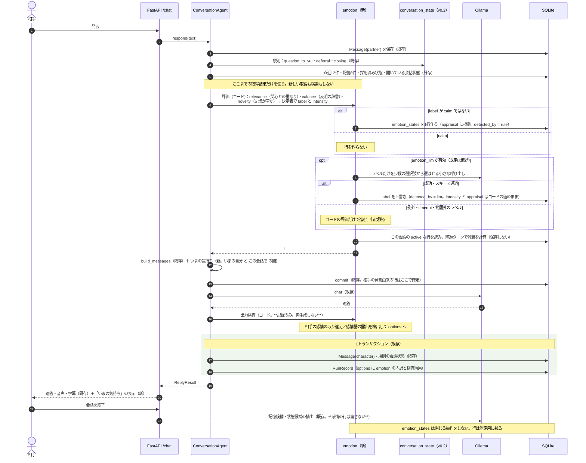

# v0.3「感情の推移」の詳細設計と PR 計画

最終更新：2026-09-17

本書は [設計書](../design/ai_vtuber_architecture.md) §8.3 の v0.3 を、既存のコードにどう写すかを決め、PR に割り当てる。何を作るかは設計書が正で、本書はそれを変えない。

**表記**：「確認済み」は 2026-09-15 にコードで確認した事実。「提案」は本書で新しく決めるもので、未確認の関数名・スキーマ・挙動は書かない。

**着手前の前提**：設計書 §2.4 の判断点「v0.2 → v0.3」は 2026-09-15 に実施し、**縮小版（`conversation_state_llm = False`）のまま v0.3 へ進む**と決めた。**ただし 2026-09-16 に `conversation_state_llm` の既定を `True`・timeout 30 秒へ変更した**（[result/v0.2.md](../result/v0.2.md) の「既定を有効に変更した」）。下の取り決めのうち「既定は `False` のまま」だけが取り消しで、**§0 の制約（感情を解釈由来の状態に依存させない）はそのまま維持する**——解釈でしか作られない4種類は [ISSUE-049](../issues/issues.md#issue-049) の残件があり、まだ依存先にできない（照合と理由は [result/v0.2.md](../result/v0.2.md) の「v0.2 → v0.3 の判断点」）。あわせて次を取り決めており、本書はそれに従う。

- v0.2 の未達（成功条件 (3)(4)(6)）は **v0.2 の残件**として残し、v0.3 の成功条件に混ぜない。v0.3 の到達は設計書 §8.3 の (1)〜(5) だけで判定する
- ~~`conversation_state_llm` の既定は **`False` のまま**。v0.3 の実装中に有効化せず、測定も既定構成を基準に行う~~ → **2026-09-16 に取り消し。** 既定は `True`。測定は解釈ありの構成が基準になる（解釈ありで測るときは他の評価を同じ Ollama で並行させない。[ISSUE-047](../issues/issues.md#issue-047)）
- 解釈の精度の改善（`interpretation.py` の `_INSTRUCTION`）は**着手時期未定**とし、v0.3 の完了条件に含めない

---

## 0. v0.2 の実測から、本書が先に決めていること

v0.2 の測定（[result/v0.2.md](../result/v0.2.md)）で分かった2点は、v0.3 の設計をそのまま縛る。**これは制約であって、後から調整できる余地ではない。**

| v0.2 の実測 | v0.3 での帰結 |
| --- | --- |
| 解釈の LLM 呼び出しを足すと、1ターンの待ち時間が **+77%〜+184%**（平均 4.2 秒 → 11.9 秒）増える | **感情の評価に、毎ターンの LLM 呼び出しを既定で置かない。** 評価はコードで計算する（§3・§4）。LLM によるラベル付けは任意の追加とし、既定は無効（§9） |
| 9B（qwen3.5:9b）は、1回の呼び出しに複数の判断を同時に求めると精度が落ちる。**2026-09-15 更新**：根拠にしていた「食い違いの検出・連続する訂正は 0/3」は再測定で覆った——連続する訂正は状態管理側の欠陥（[ISSUE-044](../issues/issues.md#issue-044)）、食い違いは検出自体は 5/5 成功で `correction` との分類の誤り（[ISSUE-048](../issues/issues.md#issue-048)）。ただし**分類の誤りは「複数の判断を同時に求める」ことの表れ**であり、前提そのものは弱いまま成り立つ | **感情の評価に、複数の判断を同時に求める呼び出しを置かない。** 相手の感情は**表明に限る**（辞書で拾える範囲）。内面の推論はしない |
| ~~`conversation_state_llm` は既定で無効。したがって~~ **2026-09-16 に既定は `True` になったが**、`request`・`confirmed`・`correction`・`discrepancy` は精度が不十分（[ISSUE-049](../issues/issues.md#issue-049)）で、依存先にできない | **v0.3 の感情は、解釈でしか作られない会話状態に依存しない。** 評価の入力に使うのは、規則だけで作られる `question_to_yui`・`deferral`・`closing`・`presented` に限る（§4）。依存させると、縮小版の上に縮小版を積むことになる |
| 評価器を同時に2つ走らせると、解釈を使う機能の数字だけが不当に低く出る | v0.3 の測定も**単独実行**で行う。測定手順に明記する（§7） |
| 中国語の混入（ISSUE-029）で、機能と無関係なシナリオが落ちる | 不通過をログで読み、混入由来のものを分けて数える（§7） |

**レイテンシ予算**（[ISSUE-054](../issues/issues.md#issue-054)、設計書 §9）：ローカルの1対1テキスト会話は p50 ≤ 10秒・p95 ≤ 15秒を目標値とする。v0.3 は感情の評価にLLM呼び出しを既定で追加しない（上表）ため、この予算に新たな圧力を加えない。PR5 の測定（§7・§11）はこの予算を基準に読む——単発の超過だけでは判断せず、継続的な超過なら [ISSUE-058](../issues/issues.md#issue-058) の着手を検討する。

**検索の再現率のリスク**（[ISSUE-056](../issues/issues.md#issue-056)）：§3.3 の `novelty` は `search_memories` の結果が空かどうかで決める。**新しい検索を呼ばない**という制約（§2）は変えないが、表記のまったく異なる語（「ラーメン」↔「中華そば」等）では検索が繋がらない既知の限界（2-gramの限界。ISSUE-056）があり、検索漏れは「知っているはずの話題を初めて聞いた」という誤った `novelty=1` として表に出る。これは v0.3 が新しく生む問題ではなく、既存の検索精度の限界が感情という新しい経路で初めて可視化されるだけである。**v0.3 ではこの限界を受け入れる**——`novelty` の誤判定は `interested` の強度を過大評価する方向にしか働かず（既知の話題を新しいと誤認するだけで、その逆は起きない）、設計書 §8.3 の成功条件 (2)「新しい理解があれば育ちうる」の判定を安全側に歪めるだけで、対になる失敗（(1) の反復・圧力だけでは育たない）を隠す方向には働かない。改修（ハイブリッド検索化）は [ISSUE-055](../issues/issues.md#issue-055) の実測後、v0.4 の着手判断時に行う。

加えて設計書 §8.3 が禁じていること：**表情ラベルだけの実装にしない。LLM に感情を自己申告させて行動を選ばせない。0〜10 の強度を直接訊かない。**

なお、**表情差分の画像素材は存在しない**（確認済み：[AvatarPanel.tsx](../../frontend/src/components/AvatarPanel.tsx) が持つのは口の開閉×目の開閉の4枚だけ）。v0.3 で表情を作らないのは設計方針であると同時に、素材の前提も無い。

---

## 1. v0.3 で達成すること

出来事を YUI なりに受け取り、それが**次の数ターンの返答の違いとして現れる**。**感情の正しさは目標にしない。** 目標は、同じ出来事でも関心の有無で反応が違い、その違いが減衰して消えることである。

| 扱うもの | 会話での違い |
| --- | --- |
| 出来事の受け止め（appraisal） | 関心のある話題を聞いたときと、そうでないときで、返答の着眼点と熱量が違う |
| 一時的な感情 | 受け止めが数ターン残り、**理由なく増幅せず減衰して消える**。5ターン後には返答に出ない |
| 3層の区別 | 固定人格（口調・価値観）は感情で変わらない。持続する気分（会話の調子）は感情の履歴から導く派生値で、長期の関心へ昇格しない |
| 相手の感情の推定 | 相手が「疲れた」と**言った**ときに、深掘りをやめて共感するか待つ。**YUI 自身が疲れたとは言わない** |

**原則：感情は評価の入力であって、行動の決定者ではない。**

- **感情は返答の材料としてプロンプトに渡すだけで、話すか待つかを決めない。** 発話機会の選択は v0.5〜v0.6 の担当で、v0.3 は「YUI から話し始めない」を変えない
- **所有者を分ける。** YUI の感情と、相手についての推定は別の行で持ち、混ぜない
- **受け止めの根拠を残す。** どの関心・どの記憶・どの語に当たって生まれたかを行に持つ。根拠の無い感情を作らない
- **長期へ昇格させない。** 感情の行は振り返り（`/end`）へ渡さない。構造として昇格経路を作らない

**対象外**：期待・目標との照合（目標の器は v0.5。v0.3 の評価軸は関心・相手の表明・既知かどうかに限る）、セッションをまたぐ気分の持続（会話の中で閉じる）、相手の内面の推論（表明に限る）、表情ラベルと表情差分、ランダムな気分変動、感情による発話機会の選択（v0.6）、感情から長期の好みへの反映（v0.4）。**検証は1対1の会話に限る**（`target_speaker_id` は列として持つが、配信での動作は確かめない）。

---

## 2. 既存コードで前提にするもの（確認済み）

| 既存 | 場所 | v0.3 での使い方 |
| --- | --- | --- |
| `respond()`：相手の `Message` を保存 → **規則の会話状態** → `_recent_history`（12件）→ `search_memories`（8件）→ `active_states` → `get_open_states` →（任意の解釈）→ `build_messages` → `commit` → `llm.chat` → 出力検査 → 返答と `RunRecord` | [conversation.py](../../backend/app/agent/conversation.py) | 取得（履歴・記憶・状態・会話状態）が**すべて終わった後**、`build_messages` の**直前**に感情の評価を1か所入れる。**新しい取得を足さない**——評価の入力は、すでにその場にある `memories`・`states`・`conversation_states`・`user_message` だけ（§4） |
| `search_memories` の戻り値 `RetrievedMemory(memory, score, reason)` | [memory_store.py:123](../../backend/app/agent/memory_store.py) | 「この話題に思い出せることがあるか」＝既知かどうかの判定に使う。**新しい検索を呼ばない** |
| `active_states`：`kind=interest` は相手が誰でも渡す。`relationship` はその相手のもの。`needs_review` は渡さない | [character_state.py](../../backend/app/agent/character_state.py) | 採用済みの `interest` の `topic`・`content` が、関連度の評価の**唯一の根拠**。候補（`pending`）は使わない——会話に使わないという v0.1 の境目を変えない |
| `get_open_states`：その会話・その相手の `open` な会話状態 | [conversation_state.py](../../backend/app/agent/conversation_state.py) | 規則で作られる `question_to_yui`・`deferral`・`closing` だけを評価の入力に使う。解釈でしか作られない種類は使わない（§0） |
| `build_system_prompt`：固定人格 →「# いまの状況」→「# いまの自分」→「# この会話で」→「# 思い出せること」 | [prompt.py](../../backend/app/agent/prompt.py) | 「# いまの気持ち」を**「いまの自分」と「この会話で」の間**に足す。長期→短期→会話の事実→記憶、の順を保つ |
| `RunRecord`：`options`（JSON）、`referenced_state_ids`、`system_prompt`、`retrieval_ms`、`latency_ms` | [models.py](../../backend/app/models.py) | 渡した感情は `system_prompt` に残る。評価の内訳と検査結果は `options` に鍵を足して残す。**列は足さない**（v0.2 と同じ） |
| `Message`：`speaker_kind`、`speaker_id`、`delivery_state` | 同上 | 感情の根拠は `messages.id` で指す。経過ターン数も会話内の発言から数える |
| `CharacterState` と `StateStatus`（`pending` → `active` を開発者が判断） | 同上 | **感情をここに入れない。** 理由は §3 |
| `POST /conversations/{id}/end`：抽出（記憶候補・状態候補の別々の LLM 呼び出し）→ 全部成功で1トランザクション | [conversations.py](../../backend/app/api/conversations.py)、[state_reflection.py](../../backend/app/agent/state_reflection.py) | **変えない。感情の行を渡さない**（§5） |
| `ChatResponse.conversation_states`：`DISPLAYED_STATE_KINDS` で絞って同梱（全件だと40ターンで44KBになった実測がある） | [chat.py](../../backend/app/api/chat.py) | 感情も同じ扱い：**有効なものだけ・件数上限つき**で同梱する（§6） |
| 評価器：`[[scenario.states]]`（`StateSpec`）で会話の前に関心を採用しておける。`expect_conversation_states` は種類ごとの条件表 | [scenario.py](../../backend/app/evaluation/scenario.py) | **対のシナリオ**（関心あり／なし）は既存の `states` の事前投入で作れる。期待の形は `expect_conversation_states` と同型にする（§7） |
| `measure_turn_latency.py`：固定会話を構成ごとに流し、`logs/evals/<時刻>-turn-latency.txt` に残す | [measure_turn_latency.py](../../backend/app/evaluation/measure_turn_latency.py) | 待ち時間の測定に**そのまま再利用**する。構成の軸を `emotion_enabled` に差し替える |
| `report.py`：レポートに `conversation_state_llm` の有効・無効を残す | [report.py](../../backend/app/evaluation/report.py) | `emotion_enabled`・`emotion_llm` も同じ形で残す。**レポート単体で構成が分かる**ようにする（v0.2 PR5 のレビュー指摘） |

---

## 3. データ（提案）

### 3.1 なぜ `character_states` に入れないか

設計書 §8.3 は「**新しいテーブルは作らず、一時的な状態の区分として持つ**（物理スキーマは実装時に決める）」と書く。括弧が委ねている物理スキーマの決定として、**新しい表 `emotion_states` を作る**。既存の `character_states` に `kind` を足す形は採らない。理由は3つで、いずれも確認済みの既存の挙動に基づく。

1. `character_states` は **`pending` → 開発者が採用 → `active`** の器である（確認済み）。感情は毎ターン自動で生まれ、採用の判断を求めない。同じ表に入れると、採用待ちの候補一覧が感情で埋まる
2. `CharacterStateRevision` が全変更に履歴を残す（確認済み）。毎ターン生成・減衰するものを入れると履歴が肥大する。**感情の減衰は履歴ではなく計算**である
3. `mark_for_review` は記憶の訂正で `character_states` 全件を走査する（確認済み）。感情行が混ざると、訂正のたびの走査対象が会話の長さに比例して増える

**「一時的な状態の区分として持つ」という設計の意図（＝長期人格と混ぜない、昇格経路を作らない）は、表を分けることでより強く満たされる。** 到達目標は変えていない。

### 3.2 `emotion_states`（新規。Alembic のマイグレーション1本）

| 列 | 型 | 決め方 |
| --- | --- | --- |
| `id` | int PK | |
| `conversation_id` | FK `conversations.id`、非 NULL | **会話の中で閉じる**（v0.2 の会話状態と同じ） |
| `owner` | `yui ／ partner` | **誰の感情か。** `partner` は推定であって事実ではない |
| `subject_speaker_id` | FK `speakers.id`、NULL 可 | `owner = partner` のときその相手。`owner = yui` のとき NULL |
| `target_speaker_id` | FK `speakers.id`、非 NULL | **誰との会話での感情か。** 別の相手の発言では読まない・作らない（v0.2 と同型） |
| `source_message_id` | FK `messages.id`、非 NULL | **根拠の発言。** どの出来事への受け止めか。経過ターン数もここから数える |
| `label` | §3.3 の5種 | コードが決定表で選ぶ。**LLM に自己申告させない** |
| `intensity` | int（0〜3） | **4段階。** 0〜10 の連続値にしない（設計書 §8.3） |
| `appraisal` | JSON | **根拠。** `relevance`・`valence`・`novelty` の値と、当たった関心の `state_id`・記憶の `memory_id`・辞書の語。空にしない |
| `status` | `active ／ withdrawn` | 解決は無い。**取消は誤検出の是正だけ** |
| `withdraw_reason` | `misdetected`、NULL 可 | |
| `detected_by` | `rule ／ llm` | 作成の経路。更新しても変えない（v0.2 と同じ） |
| `decided_by` | `operator`、NULL 可 | 取消の経路。取消は開発者の操作でしか起きない |
| `created_at` | datetime | |

索引：`(conversation_id, status, owner)`、`(conversation_id, source_message_id)`。**変更履歴の表は作らない**——遷移は `active` → `withdrawn` の1段だけで、根拠は `appraisal` と `source_message_id` が持つ。

**持たない列**：`decayed_at`・`current_intensity`・`expires_at`。**減衰は保存しない。** 設計書 §5 の分類でいう「無状態な射影」——有効な行の集合と現在のターン位置から毎回計算できる（§3.4）。保存すると、更新漏れが「減衰しない感情」として残る。

**`mood`（気分）の行も作らない。** 会話の調子は、その会話の有効な感情から導く派生値（§3.4）。設計書 §4.4 の「持続する気分・会話の調子」を**保存された状態として持たない**のが v0.3 の範囲であり、セッションをまたぐ気分は対象外（§1）。

### 3.3 ラベルと強度（提案）

ラベルは**5種**。少ないほうを選ぶ——多くしても、コードが決定表で選ぶ以上、区別できる根拠が無いため。

| label | 意味 | 返答に期待する違い |
| --- | --- | --- |
| `calm` | 平静（既定） | 違いを出さない。**節に渡さない** |
| `interested` | 関心が動いた | 着眼点がその話題へ寄る。相手の体験の側を聞く |
| `glad` | 相手の良い出来事を受け取った | 受け止めを短く言う。質問を重ねない |
| `concerned` | 相手のつらさ・疲れの表明を受け取った | 深掘りをやめる。共感するか待つ |
| `unsettled` | 戸惑い（会話が想定と合わない） | 断定しない。確かめる言い方になる |

**評価軸は3つ。** すべて、その場にある取得結果からコードで計算する（§4）。

| 軸 | 値 | 根拠（確認済みの既存データ） |
| --- | --- | --- |
| `relevance` | 0／1／2 | 採用済みの `interest`（`active_states` の結果）の `topic`・`content` と、相手の発言の語の重なり。2 は `topic` そのものの一致 |
| `valence` | −1／0／+1 | 相手の**表明**の辞書（§9）に当たった語。当たらなければ 0 |
| `novelty` | 0／1 | `search_memories` の結果がこの話題について空か。1（初めての話題）で `interested` を上げる |

決定表（`emotion.py` の定数。設定にしない）：

| 条件 | label | intensity |
| --- | --- | --- |
| `valence = −1` | `concerned` | 2＋（`relevance ≥ 1` で 3） |
| `valence = +1` かつ `relevance ≥ 1` | `glad` | 2 |
| `valence = +1` | `glad` | 1 |
| `relevance = 2` | `interested` | 2＋（`novelty = 1` で 3） |
| `relevance = 1` かつ `novelty = 1` | `interested` | 1 |
| `open` の `question_to_yui` が2件以上、または `deferral` と同じ話題を相手が出した | `unsettled` | 1 |
| 上記以外 | `calm` | 0 |

**`concerned` を最優先に置く**理由：相手のつらさの表明を、関心の一致より優先して受け取る。これは固定人格の `curiosity`「相手が疲れているときや、話したくなさそうなときは、共感するか、待つ」（確認済み：[personas/2026-09-07.1.toml](../../backend/personas/2026-09-07.1.toml)）と同じ優先順位である。

**`intensity = 0`（`calm`）の行は作らない。** 作ると、会話の長さに比例して意味の無い行が積み上がる。

### 3.4 減衰と気分（提案。保存しない）

- **経過ターン** `n` ＝ その会話で `source_message_id` より後に来た**相手の発言**の件数（`messages` を数える。新しい列を持たない）
- **有効な強度** `effective = intensity × decay^n`（`decay` の既定候補 **0.5**。§9。PR5 で確定）
- `effective < 1.0` の行は**節に渡さない**。`intensity = 3` でも n = 2 で 0.75 となり渡らなくなる——**理由なく持続しないことが、式の上で保証される**
- **気分（会話の調子）** ＝ その会話の有効な行（`owner = yui`）の `effective` の合計を3段階に丸めたもの（`落ち着いている ／ 会話が続いている ／ 気持ちが動いている`）。行にしない
- 節に渡す感情は**最大2件**（`owner = yui` の最新1件と、`owner = partner` の有効な最新1件）。上限を置く理由は v0.2 と同じ——上限の無い節は会話の長さに比例して肥大する（`presented` で実測済み）

---

## 4. 1ターンの処理（提案）

`respond()` に足すのは **1か所だけ**（取得の後・`build_messages` の前）と、**返答の後の検査**である。**LLM の呼び出しは既定で増えない。**



**取得の後（プロンプト構築の前）**

1. 評価（コードのみ）。入力は**その場にあるものだけ**：`user_message.content`、`memories`（`search_memories` の結果）、`states`（`active_states` の結果）、`conversation_states`（`get_open_states` の結果のうち**規則で作られる種類だけ**）。
   - `relevance`：`states` のうち `kind = interest` のものの `topic`・`content` と発言の語の重なりを見る。**当たった `state_id` を `appraisal` に残す**
   - `valence`：表明の辞書（§9）に当たるかを見る。**当たった語を `appraisal` に残す**。当たらなければ 0。**推論しない**
   - `novelty`：`memories` が空、または上位の記憶がこの話題と重ならないなら 1。**当たった `memory_id` を `appraisal` に残す**
   - 決定表（§3.3）で `label` と `intensity` を決める。`calm` なら**行を作らない**
   - `valence = −1` のときは、`owner = partner` の行も作る（`label = concerned`、`subject_speaker_id` = 今の相手）。**これが「相手の感情の推定」の全体**であり、表明の言い換え以上のことはしない
2. （任意）`emotion_llm` が有効なとき、**ラベルだけ**を5つの選択肢から選ばせる小さな呼び出しを1回行う。**強度は訊かない。行動は訊かない。理由も訊かない。** 返ってきた値が5種のいずれでもなければ捨て、コードのラベルを使う。失敗（例外・timeout・範囲外）はコードの評価だけで進み、行は残る。`detected_by` だけが `llm` になる
3. この会話の `active` な行を読み、§3.4 の式で有効なものを選ぶ（**最大2件**）。有効な行が無ければ節は空文字で、プロンプトは v0.2 と同一になる
4. 「# いまの気持ち」の節を作る。**数値・ラベル名・評価軸をそのまま出さない**：

   ```
   # いまの気持ち
   - いまの受け止め：写真の話に心が動いています（強め）
   - 会話の調子：気持ちが動いています
   - 相手は「疲れた」と言っています。深く聞き込まず、共感するか待ってください
   これは一時的なものです。口調や価値観を変える理由にはしません。
   気持ちそのものを説明せず、話し方と、何に目を向けるかに表してください。
   ```

   置き場所は「# いまの自分」の直後、「# この会話で」の前（§2）。**ここで既存の `commit` に乗る。** 相手の発言由来の行はこの時点で確定する

**返答を生成した直後（保存の前）**

5. 出力検査（コード）。**3件すべて記録のみで、再生成しない。**
   - `owner = partner` の `concerned` が有効なのに、返答が**自分の疲れ・つらさ**を語っている（自己申告の語の辞書）→ `checks.partner_emotion_misattributed`。**設計書 §8.3 の失敗例「相手の疲れを自分の感情として語る」を数えるための記録**であって、語の一致では正しさを判定できない（v0.2 の `deferral` と同じ扱い）
   - 返答に評価軸・ラベルの語（「強度」「関心度」「ラベル」等）や、節に渡した数値表現が出ている → `checks.emotion_vocabulary_leaked`
   - 有効な感情が無いのに返答が強い感情表現を含む → `checks.unbacked_emotion_expression`。**根拠の無い感情表現**を数える
   - 結果は `RunRecord.options` の `emotion` の鍵に、評価の内訳（`label`・`intensity`・`appraisal`・渡した行の id）と一緒に残す

**再生成を入れない理由**：v0.2 の `closing` は「終了の合図の後に新しい質問がある」という**機械で判定できる違反**があったので再生成に意味があった。感情には、機械で判定できる違反が無い——上の3件はいずれも語の一致でしかなく、再生成の根拠にならない。**再生成を入れないので、v0.3 は待ち時間を増やさない**（§8）。

---

## 5. 会話の終了（提案）

**`/end` を変えない。** 感情に「閉じる」操作を作らない。

- `emotion_states` は `conversation_id` で閉じており、会話が終われば読まれない。`expired` に相当する状態を作らない（v0.2 の会話状態と違い、未解決のまま残ることに意味が無い）
- **抽出（`reflection.py`・`state_reflection.py`）へ感情の行を渡さない。** 記憶候補・状態候補の指示文を変えない。これが「一時的な感情を長期の好みへ昇格させない」（設計書 §4.8）の**構造的な保証**であり、指示文でのお願いにしない
- 行は削除せず残す。**測定のためだけに残す**——どの評価軸がどのラベルを何回作ったかを PR5 で数える（§7）

---

## 6. API と画面（提案）

| 変更 | 内容 |
| --- | --- |
| `GET /conversations/{id}/emotions` | 一覧。`owner`・`status` で絞れる。`appraisal` をそのまま返す（根拠を画面で読めるようにする） |
| `POST /conversations/{id}/emotions/{emotion_id}/decide` | 開発者が `withdrawn`（`misdetected`）にする。`decided_by = operator`。`detected_by` は変えない。**誤検出の是正だけ**で、採用の操作は作らない |
| `ChatResponse` | `emotions` を**任意項目**として足す。**有効な行だけ・最大2件**（§3.4 と同じ選び方）。v0.2 の `conversation_states` が全件同梱で 44KB になった実測があるため、最初から上限を付ける |
| `ChatPanel.tsx` | 返答の下に小さく「いまの気持ち」を出す。**ラベル名・数値は出さない**（節と同じ日本語の言い回しにする）。相手についての行は「相手は疲れていると言っている」の形で、YUI 自身の行と**見た目で区別する** |
| `StatePanel.tsx` | **変えない。** 長期の関心・関係性と同じ場所に感情を出さない。3層の区別が画面の上でも保たれる |

---

## 7. 評価器（提案）

### 7.1 期待の追加

| 期待 | 意味 |
| --- | --- |
| `expect_emotions: {owner: [条件]}` | その say の後の感情。条件は `label`・`min_intensity`・`max_effective`（減衰後の有効な強度の上限。**消えたことを見る**）・`subject`（`owner = partner` のとき）・`status` の組。`{"yui": [{"label": "interested", "min_intensity": 2}]}`、`{"yui": []}` なら YUI の感情の行が無い。`expect_conversation_states` と同型で、指定した項目だけを見る |
| `expect_emotion_absent_in_reply: bool` | 返答に、有効な感情が無いのに強い感情表現が出ていない（§4 の `unbacked_emotion_expression` を評価器から見る） |

### 7.2 新しいシナリオ `emotion.toml`（観点 `emotion`。16本。値は測ってから増やす）

**対になる失敗を両方測る。** 「PR」列は、そのシナリオを必須にする PR。

| # | 場面 | 期待 | PR |
| --- | --- | --- | --- |
| 1 | 関心（写真）を**事前投入**して、写真の話を聞く | `interested`、`intensity ≥ 2`。返答が相手の体験の側を聞く（人手） | PR1・PR2 |
| 2 | **1 と同じ発言**を、関心を投入せずに流す | `interested` が作られない（`{"yui": []}`）。返答の熱量が 1 と違う（人手） | PR1・PR2 |
| 3 | 関心のある話の3ターン後 | 同じ感情が節に渡らない（`max_effective` で見る）。**減衰の側** | PR1 |
| 4 | 関心のある話題が5ターン続く | 強度が積み上がらない。`intensity` が 3 を超えない（**理由なく増幅しない**側） | PR1 |
| 5 | 相手が「今日は疲れた」と言う | `owner = partner` の `concerned` が作られる。返答が深掘りせず共感か待つ（人手） | PR2 |
| 6 | **5 の次のターン** | 返答が「私も疲れました」の形にならない（人手＋`partner_emotion_misattributed` の記録） | PR2 |
| 7 | 相手が疲れを表明した話題が、YUI の関心と重なる | `concerned` が `interested` より優先される（決定表の順序） | PR1 |
| 8 | 相手が「楽しかった」と言う | `glad`。受け止めを短く言い、質問を重ねない（人手） | PR2 |
| 9 | 感情を持たない事務的なやりとり5ターン | 行が1つも作られない。返答が感情語を使わない（**過剰生成**の側） | PR1・PR2 |
| 10 | 「疲れた人の話」を第三者について話す（「弟が疲れているらしい」） | `owner = partner` の `concerned` を作らない（**誤検出**の側。表明と伝聞を混ぜない） | PR1 |
| 11 | 感情がある状態で終了の合図 | v0.2 の `closing` の動作が退行しない。新しい質問を出さない | PR2 |
| 12 | 感情がある状態で延期 | v0.2 の `deferral` の動作が退行しない | PR2 |
| 13 | 関心のある話題で、口調が崩れないか | 固定人格の口調を保つ（人手。設計書 §8.3 の成功条件(4)） | PR2 |
| 14 | 強い感情の直後に、相手が別の話題へ移る | 前の感情を引きずった返答にならない（人手） | PR3 |
| 15 | `emotion_llm` を有効にして 1・5 を流す | ラベルがコードの結果と一致するか。**一致率を数える**（既定を決める材料） | PR3 |
| 16 | `emotion_llm` の呼び出しを失敗させる（モック） | 返答が返り、コードの評価だけで行が作られる | PR3（pytest） |

**測定の手順**（v0.2 PR5 の申し送りをそのまま守る）：

- **単独実行**で流す。Ollama を叩く他のプロセスが無いことを確認してから始める
- 各3回。**合否の正しさと、試行間の安定性（3回とも同じ合否）を別に数える。3回とも失敗を「安定」と数えない**
- 不通過はログを読み、**中国語の混入（ISSUE-029）由来のものを分けて数える**
- 待ち時間は `measure_turn_latency.py` を `emotion_enabled` の有効／無効で流し、`logs/evals/<時刻>-turn-latency.txt` を根拠として引く
- レポートに `emotion_enabled`・`emotion_llm` を残し、**レポート単体で構成が分かる**ようにする

加えて、**v0.1 の回帰33本（`conversation_state` 以外）と `conversation_state` の24本、backend の pytest が退行しないこと**を確かめる。

---

## 8. 失敗時の扱いと、簡略化して v0.4 へ進む判断（提案）

| 失敗 | 扱い |
| --- | --- |
| 評価（コード）で例外 | **感情を作らず、節を空にして返答を生成する。** v0.2 以前と同じプロンプトになる。返答は必ず返る。ログに残す |
| `emotion_llm` の例外・timeout・範囲外のラベル | コードの評価だけで進む。行は残る（`detected_by = rule` のまま）。返答は返る |
| 感情の行の保存に失敗（DB） | 相手の発言由来なので、既存の `commit` に乗る。失敗すればそのターンは既存の `/chat` の失敗と同じ扱い |
| 別の相手の発言 | `target_speaker_id` が違う行は読まない・作らない（v0.2 と同型） |
| 誤検出（表明でないものを `concerned` にした等） | 開発者が `decide` で `withdrawn(misdetected)` にする。自動では消さない |
| 感情が返答に出ない | **失敗として扱う。** 設計書 §8.3 の成功条件(3)。PR5 で人手判定し、下の「簡略化」の判断に使う |

**簡略化の形を、測る前に決めておく。** 設計書 §2.4 は「効果が薄ければ簡略化して v0.4 へ進める。その判断を記録する」と定めている。PR5 で選ぶ選択肢を先に用意し、**測ってから設計を作り直す事態を避ける**。

| 形 | 内容 | 選ぶ条件 |
| --- | --- | --- |
| **A：そのまま採用** | `emotion_enabled = True` を既定にする | 対のシナリオ（1・2）で反応の違いが人手で読み取れ、減衰（3・4）が機械判定で通り、口調（13）が崩れない |
| **B：関連度だけに縮める** | ラベルと `valence` を落とし、`relevance` だけを「いまの話題への興味」として節に渡す | 違いは出るが、`glad`／`concerned` の区別が返答に現れない。**v0.4 の興味の appraisal は `relevance` を引き継ぐので、この形でも前へ進める** |
| **C：記録だけ残す** | `emotion_enabled = False` を既定にし、行の生成と測定だけ続ける | 節を渡しても返答が変わらない。**行は v0.4 の関心の形成の材料として残す**。v0.2 の縮小版と同じ扱いで記録する |

**どの形を選んでも v0.4 へ進む。** 設計書 §2.2 が定めるとおり、v0.4 の関心の形成は v0.3 の特定のスコアの完成を前提にしない。判断と根拠は `docs/result/v0.3.md` に残す。

**待ち時間の見込み**：既定構成（`emotion_llm = False`）で増えるのは、DB の読み書き1〜2回と語の照合だけで、**LLM の呼び出しは増えない**。v0.2 の解釈（+7.7秒）のような増加は構造的に起きない。`turn_time_budget_seconds`（45.0）は変えず、実測で確かめる。

---

## 9. 設定と定数

| 名前 | 既定 | 場所 |
| --- | --- | --- |
| `emotion_enabled` | `True`（PR5 で確定。§8 の形 C を選ぶなら `False`） | `Settings` |
| `emotion_llm` | `False`（PR3 で作り、PR5 で判断。v0.2 の `conversation_state_llm` と同じ構え） | `Settings` |
| `emotion_llm_timeout_seconds` | `10.0`（**呼び出し単体の所要時間を必ずログに残す**。v0.2 PR5 でこれを測っていなかったことが申し送りになっている） | `Settings` |
| `emotion_decay_per_turn` | `0.5`（PR5 で確定。シナリオ3・4 が根拠） | `Settings` |
| `emotion_prompt_limit` | `2`（節に渡す件数上限） | `Settings` |
| ラベルの5種と決定表 | 固定 | `emotion.py` の定数。**設定にしない**（変えたら測る対象。v0.2 の辞書と同じ方針） |
| 表明の辞書（`valence`） | 固定 | 同上。`−1`：疲れた・つかれた・しんどい・つらい・大変だった・眠い。`+1`：楽しかった・うれしい・よかった・面白かった。**相手が自分について言った場合だけ**拾う（第三者についての言及は拾わない。シナリオ10） |
| 自己申告の語の辞書（出力検査） | 固定 | 同上 |
| `intensity` の段階 | 0〜3 の4段階 | 同上。**0〜10 にしない**（設計書 §8.3） |

---

## 10. 変えないもの

- **`/end` の抽出と、`reflection.py`・`state_reflection.py` の指示文。** 感情の行を渡さない（§5）。**例外は PR0 の刻印**——使った指示文のハッシュとモデル名を候補に記録するだけで、**指示文の中身は変えない**（§11）
- **`character_states`（関心・関係性）と `memories` の行。** 感情から長期の状態・記憶を書き換えない
- **`conversation_states` の遷移と v0.2 の出力検査。** v0.3 は会話状態を読むだけで、更新しない
- **`respond()` の記憶検索・会話ロックの範囲・既存の `commit` の位置。** 取得を増やさない
- **固定人格（`personas/<版>.toml`）。** 感情で口調・価値観を変えない。**人格の版は v0.2 と同じものを使う**——感情の効果と人格の変更を同時に動かすと、どちらが効いたか分からなくなる
- **YUI から話し始めない**（v0.5）。感情は返答の質を変えるもので、発話の機会を増やさない
- **表情・アバター。** 表情差分を作らない（§0）
- 検証は1対1。`target_speaker_id` は列として持つが、配信での動作は確かめない

---

## 11. PR 分割

| PR | 作業 | 確認 |
| --- | --- | --- |
| **PR0 ラベルの収集**<br>（並行。v0.3 の機能ではない） | 抽出器の刻印（モデル名・指示文のハッシュ）を `memory_candidates` に残す。判断の記録（判断時刻・一言メモ・評価用の取り置き印）を `decide` に足す。`memory_candidates` への列追加とマイグレーション1本。`CandidateDecision` に `note` を追加。画面にメモ欄。取り置きは**会話単位**で 5 件に1件。**指示文そのものは変えない**——ハッシュを取るだけ。**却下理由のコード（enum）は作らない**（メモを30件読んでから決める。設計書 §10） | pytest：刻印が候補に残る、`decide` でメモと判断時刻が残る、取り置きが会話単位で分かれる（同じ会話の候補が評価用と学習用に割れない）、**既存の採用・却下の挙動と `accepted_memory_id` が変わらない**、マイグレーションの前後で既存行が読める。画面を人手で確認 |
| **PR1 感情の器と評価（規則）** | `emotion_states` とマイグレーション。`emotion.py`（評価の3軸・決定表・行の作成・減衰の計算・有効な行の選択。`target_speaker_id` の一致を全経路で検査）。`respond()` の1か所への接続。**LLM は呼ばない。節はまだ渡さない** | pytest：決定表の全分岐、`calm` で行を作らない、`concerned` の優先、減衰の式（n ターン後に渡らない）、強度が積み上がらない、別の相手の発言で作らない・読まない、`appraisal` に根拠が入る。シナリオ 1〜4・7・9・10（状態の検査のみ）。既存の pytest と回帰33本 |
| **PR2 生成への反映と出力検査** | 「# いまの気持ち」の節（`build_system_prompt` への追加）。出力検査3件（**記録のみ。再生成しない**）。検査結果と評価の内訳を `RunRecord.options` へ。シナリオ 1・2・5・6・8・9・11〜13 | 評価器で 1・2・5・6・8・9・11〜13 を3回。**反応の違い**（1と2の対）と**過剰生成**（9）の両側。v0.2 の `closing`・`deferral` が退行しないこと（11・12）。口調（13）は人手 |
| **PR3 相手の感情の分離と、任意の LLM ラベル付け** | `owner = partner` の行を、表明の辞書に当たったときだけ作る（第三者への言及を除く）。`emotion_llm`（ラベルだけを5択で1回。強度・行動・理由は訊かない）、範囲外・失敗はコードの評価へ。シナリオ 10・14〜16。**既定は無効のまま** | 評価器で 10・14・15。`emotion_llm` のラベル一致率を数える。失敗時の pytest（16）。**呼び出し単体の所要時間をログに残す** |
| **PR4 API と画面** | `GET /conversations/{id}/emotions`、`decide`（`misdetected`。`decided_by = operator`）、`ChatResponse` の任意項目（有効な行・上限2件）、`ChatPanel` の表示（ラベル名・数値を出さない。相手の行と区別する） | frontend のテスト。人手で画面を確認。応答の大きさが会話の長さに比例しないことを確かめる |
| **PR5 測定と判断** | 待ち時間（`emotion_enabled` の有／無、`emotion_llm` の有／無）。ラベル・評価軸の内訳を数える。`emotion_decay_per_turn` と `emotion_enabled`・`emotion_llm` の既定を決める。人手で 1・2・5・6・13 を読む。§8 の形 A／B／C を選び、`docs/result/v0.3.md` に記録 | 設計書 §8.3 の成功条件 (1)〜(5) を測る。**単独実行**。合否の正しさと安定性を分けて数える。中国語の混入由来の不通過を分ける。回帰33本・`conversation_state` 24本・pytest が退行しないこと |

**順序の理由**：まず状態が正しく生まれて正しく消えることを、返答を見ずに固定し（PR1）、次にそれが返答の違いとして現れるかを見る（PR2）——**保存されたことと、返答が変わったことを別に確かめる**（設計書 §8.2 の成功条件(6)と同じ考え方）。相手の感情の分離と LLM の任意経路は、コードの評価が動いてから足す（PR3）。API・画面を接続し（PR4）、利用者から見た振る舞いを統合評価して簡略化を判断する（PR5）。**PR1〜PR2 の結果は LLM の揺れを含まない**——この版の中核は追加の LLM 呼び出しを持たないので、v0.2 のように「解釈ありでしか測れない」成功条件が生まれない。

**PR0 を本書に置く理由**：これは感情の機能ではなく、設計書 §10 の品質改善項目「ラベルの収集」である。**v0.6 の完了後に最初の YouTube Live 配信を行う**到達目標（設計書 §1.1、2026-09-16 決定）により、配信前必須項目に期限（**v0.6 完了後・初配信前**）が付いた。そのうち**ラベルの収集だけは後から取り返せない**——抽出器の刻印は後から復元できず、収集していない期間の採用・却下の判断は永久に失われる。他の配信前必須項目（自動採用のゲート・配信前の防御）は v0.6 完了後に着手しても費用が変わらないが、これだけは **v0.3 の期間に判断した分がそのまま失われる**。したがって PR1 より先、または並行で着手する。

**期限が v1.0 から初配信へ前倒しになった影響**：自動採用のゲートに使えるラベルを貯められる期間は、当初の想定（v1.0 着手前）より **v0.6 〜 v1.0 の分だけ短くなった**。分類器はラベル数が要る（設計書 §10 の根拠：1変数あたり少数クラス10件）ため、**収集開始を v0.3 より後ろへずらす余地はない**。

**PR0 の扱い**：v0.3 の成功条件・測定・判断（§7・§8）には**含めない**。感情の評価と経路が交わらないため、PR1〜PR5 との順序の制約も持たない。ここに書くのは着手時期を落とさないためであり、v0.3 の到達目標（§1）を広げるものではない。

**各 PR に共通すること**：3ファイル以上に触るので reviewer サブエージェントを起動する（`AGENTS.md`）。指示文の変更は1回に1つだけ変えて前後を測る。DB の定義変更は Alembic に従う。`backend/data/yui.db` を変更しない。評価器は他に Ollama を叩くプロセスが無い状態で単独実行する。
