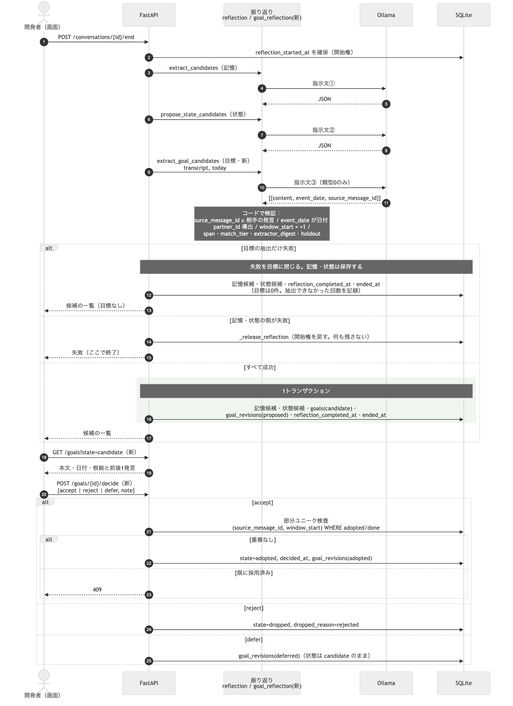
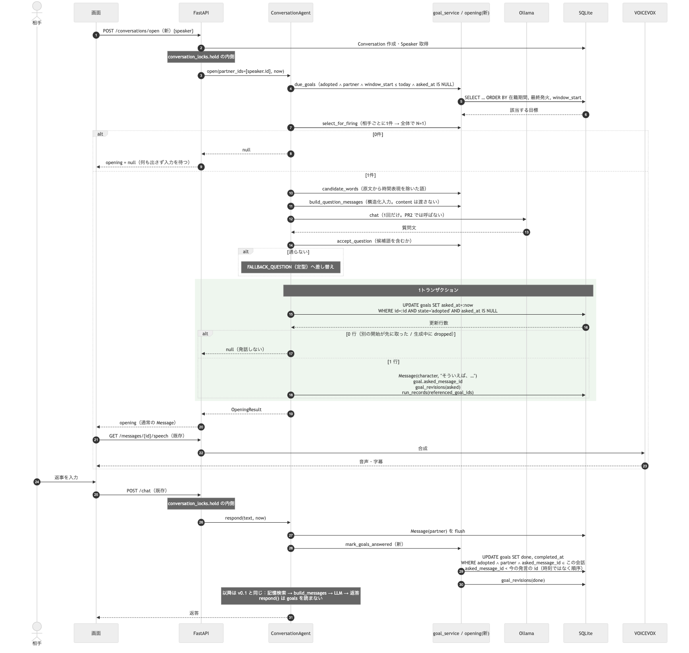
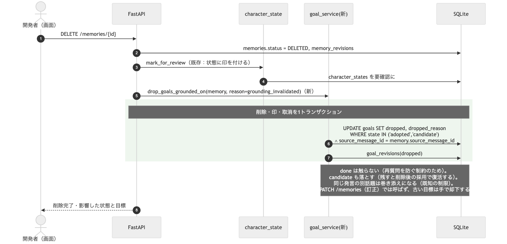

# v1.0：最小の自発性 設計（PR 分割）

対象：[設計](../design/ai_vtuber_architecture.md) の「10. v1.0：最小の自発性」

**状態：未着手（2026-09-10 作成）。**

本書は2つを持つ。**技術設計**（設計 §10.1 の仕様を、既存のコードにどう写すか）と、
**PR への割り当て**（§10.4 の作業 ①〜⑬ の順序と、各 PR で何が確かめられるか）。
何を作るかは設計 §10.1 が正で、本書はそれを変えない。

前提は済んでいる。フェーズ4のコードは削除し（設計 §9.5）、作業ツリーは
フェーズ3完了時点、DB は `f76fb885504f`。pytest 203件・frontend 18件が通り、
v0.1 の回帰は 71/84（2026-09-10、ログ `20260910T141904`。過去4回は 73〜78 で
幅の中）。判断点 0.1 → 1.0 は満たしている。

## 技術設計

設計 §10.1 の仕様を、v0.1 のコードにどう写すかを決める。**方針は「記憶の候補と同じ形を
そのまま目標へ写す」**。`memory_candidates` → `goals`、`/candidates/{id}/decide` →
`/goals/{id}/decide`、`CandidatePanel` → `GoalPanel`。新しい形を発明しない。

### 0. 既存コードで前提にするもの

| 既存 | 使い方 |
| --- | --- |
| `memory_candidates` と `decide_candidate`（[conversations.py](../../backend/app/api/conversations.py)） | 候補 → 採用の形。目標も同じ状態機械で持つ |
| `/end` の同期の振り返り（同上）。記憶と状態を**別々の LLM 呼び出し**で抽出し、全部成功してから1トランザクションで保存 | 目標の抽出も別呼び出しで足し、同じトランザクションに乗せる。**同じ指示文へ項目を足すと記憶の抽出が落ちる**（ISSUE-017 の実測）ので、指示文は分ける |
| `conversation_locks.hold`（[turn_lock.py](../../backend/app/agent/turn_lock.py)） | 発火と完了はこの内側で行う。生成中に相手の発言が割り込んで順序が崩れるのを防ぐ |
| `RunRecord.referenced_memory_ids`（[models.py](../../backend/app/models.py)） | `referenced_goal_ids` を隣に足す。発火したターンの根拠を残す |
| `mark_for_review`（[character_state.py](../../backend/app/agent/character_state.py)） | 記憶削除の波及の形。目標は印ではなく `dropped` にするが、呼び出し位置は同じ（`delete_memory` の直後） |
| `search_memories(now=)`、`build_messages(now=)` の `now` 引数 | 評価で時間を進めるための注入点。発火・完了・抽出にも同じ形で `now` を通す |
| `format_transcript`（[reflection.py](../../backend/app/agent/reflection.py)） | 目標抽出の入力。会話ログを `[#番号／日付] 話者: 本文` で渡す既存の形 |
| `Message.delivery_state` と `/messages/{id}/speech` | 開始の発話も通常の `Message` として保存すれば、音声・字幕・再生状態の経路がそのまま使える |

### 1. データ

**`goals`**（新規。Alembic のマイグレーション1本、`down_revision = f76fb885504f`）

| 列 | 型 | 決め方 |
| --- | --- | --- |
| `id` | int PK | |
| `partner_id` | FK `speakers.id`、非 NULL | `source_message_id` が指す発言の `speaker_id` から**コードが導出**。モデルには訊かない |
| `source_message_id` | FK `messages.id`、非 NULL | モデルが返す整数。会話の**相手の発言 ID の集合に含まれるか**を検証 |
| `span_start`, `span_end` | int、NULL 可 | 根拠の発言の本文中で、時間表現の正規表現が当たった範囲。当たらなければ NULL（発言全体） |
| `event_date` | date | モデルが返す。`YYYY-MM-DD` として解釈できなければその候補を捨てる |
| `window_start` | date | `event_date + 1`。**足し算はコードで**（§9.4：+1 をコードへ移して 3/3 → 0/6） |
| `content` | text | 開発者向けのラベル。**生成には渡さない** |
| `state` | `candidate ／ adopted ／ done ／ dropped` | |
| `asked_at`, `asked_message_id` | datetime／FK `messages.id`、NULL 可 | 発火時に埋める |
| `completed_at` | datetime、NULL 可 | `done` にした相手の発言の時刻 |
| `dropped_reason` | `rejected ／ grounding_invalidated`、NULL 可 | v1.1 で `expired` が増える |
| `match_tier` | `exact ／ normalized ／ lcs ／ none` | 本文と根拠の発言の一致段階（§10.7 の記録。判定には使わない） |
| `extractor_digest` | text | 抽出の指示文のハッシュ＋モデル名＋`model_digest`。`RunRecord.model_digest` と同じ考え方 |
| `holdout` | bool | 5件に1件。**乱数ではなく `conversation_id`（評価では シナリオ名）のハッシュで決め、同じ会話の候補は必ず同じ側へ入れる。** 候補単位で振ると、同じ会話から出た似た候補が学習と評価の両方に入る。評価用で、学習にも閾値決めにも使わない |
| `note` | text、NULL 可 | 採用・却下・保留のときの一言メモ |
| `decided_at` | datetime、NULL 可 | |

**部分ユニーク**：`UNIQUE (source_message_id, window_start) WHERE state IN ('adopted','done')`。SQLite の部分インデックスで作る（`sqlite_where=`）。将来の PostgreSQL 移行に備えて `postgresql_where=` も併記（ISSUE-036）。

**`goal_revisions`**（新規）：`memory_revisions` と同型。`goal_id, action, before, after, reason, created_at`。`action ∈ {proposed, adopted, rejected, deferred, asked, done, dropped}`。`before`／`after` は状態と日時のスナップショット JSON。**ラベルの素性はここに載せる**（`after` に `match_tier`・`event_date` からの経過・`holdout` を含める）ので、ラベル用の表は作らない。

**`memory_candidates` への追加列**：`note`、`decided_at`、`extractor_digest`、`holdout`。記憶の候補も同じ形でラベルを取る（v1.1 の自動採用は記憶が主対象）。`decide_candidate` に `defer` を足す。

**`run_records.referenced_goal_ids`**（JSON、NULL 可）：発火したターンだけ入る。

**`conversations.opened_by_goal_id`** は持たない。開始の発話は `Message` で、目標側の `asked_message_id` から引ける。

### 2. 抽出（会話終了後）— 作業 ②⑪

新規 `backend/app/agent/goal_reflection.py`。

```
extract_goal_candidates(session, *, llm, conversation, character_name, now) -> list[Goal]
```

- 入力：`format_transcript(messages, character_name)`（既存）と、今日の日付（`now` を JST に直したもの）
- 指示文：「**日付が明示された予定**（類型0）だけを拾う。1件につき本文・出来事の日付・根拠の発言番号を返す」。引用文字列は求めない
- 出力 JSON：`[{"content": str, "event_date": "YYYY-MM-DD", "source_message_id": int}]`
- **検証（すべてコード）**：
  1. `source_message_id ∈ {会話内の相手の発言 ID}`。外れたらその候補を捨てる（記憶候補の `_parse_item` と同じ扱い）
  2. `event_date` を日付として解釈。できなければ捨てる（「それらしい日付へ寄せない」は記憶候補と同じ）
  3. `partner_id ← messages[source_message_id].speaker_id`
  4. `window_start ← event_date + 1`
  5. `span` ← 根拠の発言の本文に時間表現の正規表現（下記 §4）を当てて最初に当たった範囲。無ければ NULL
  6. `match_tier` ← `content` と根拠の発言の本文を、厳密一致 → NFKC 正規化して空白・句読点を除いた一致 → 最長共通部分文字列が N 文字以上、の順で試す
  7. `extractor_digest` ← 指示文の SHA-256 の先頭12桁 ＋ モデル名 ＋ `response.model_digest`
- **失敗の影響は目標だけに閉じる。** LLM エラーや JSON の解析失敗が起きても、**記憶と状態の候補は保存し、`/end` は成功させる**。目標だけを「抽出できなかった」として記録し、件数を §10.7 の記録に残す。
  v0.1 の `/end` は全部成功してから1トランザクションで保存する方針だが、**そこに3つ目を足して全体を巻き込むと、v1.0 の追加機能で v0.1 の記憶保存が落ちる。**記憶の抽出は既に不安定（直近0/3、設計 §9.4）で、目標の抽出も同じ前提に置く以上、既存機能の継続を優先する。記憶・状態の側の失敗は従来どおり `/end` 全体を失敗させ、`_release_reflection` で開始権を戻す
- `/end` への組み込み：`extract_candidates` → `propose_state_candidates` の後に3つ目の呼び出しとして足し、`session.add_all(goals)` を同じトランザクションに乗せる。`GoalRevision(action="proposed")` も同時に

抽出は**目標の材料を作るだけ**で、採用は人が行う（v1.0）。

### 3. 採用・却下・保留 — 作業 ⑫（API）

新規 `backend/app/api/goals.py`（`memories.py` の形を写す）。

| エンドポイント | 内容 |
| --- | --- |
| `GET /goals?state=candidate` | 一覧。`partner_id` で絞れる |
| `GET /goals/{id}` | 1件。根拠の発言（`source_message_id`）と、その**前後1発言**を同梱して返す（レビュー画面に出すため。§10.7） |
| `POST /goals/{id}/decide` | `{"decision": "accept" ｜ "reject" ｜ "defer", "note": str?, "content": str?}` |
| `GET /goals/{id}/revisions` | 遷移ログ |

`decide` の遷移。**遷移先だけでなく、許可する遷移元を決める。**

| 操作 | 許可する遷移元 | 結果 |
| --- | --- | --- |
| `accept` | `candidate` のみ | `adopted`、`decided_at`、`GoalRevision(adopted)`。`content` を直せる。**部分ユニークに当たれば 409** |
| `reject` | `candidate` のみ | `dropped`、`dropped_reason = rejected`、`GoalRevision(rejected)` |
| `defer` | `candidate` のみ | 状態は `candidate` のまま、`GoalRevision(deferred)` |

**`done` と、根拠の無効化による `dropped` からは戻せない。** `done` に `reject` を通すと `dropped` になり、
部分ユニーク `WHERE state IN ('adopted','done')` の対象から外れる。すると**同じ発言の兄弟候補を採用でき、
同じ出来事をもう一度聞ける。**「この出来事はもう聞いた」を守るための制約（設計 §10.1 条件3）が外れるので、
一般の却下操作では通さない。聞き直しは v1.2 で `done → adopted` として設計する。

**それ以外の遷移元は 409** とし、同じ操作の再送も 409 にする（冪等にしない。
二重クリックを成功と誤解させないため）。**状態の変更と `GoalRevision` は同一トランザクション。**

**`defer` は学習から外す印だが、永久ではない。** 保留したあとに `accept` / `reject` した候補は、
**最終的な判断をラベルとして使う**。学習から外すのは `candidate` のまま保留で終わったものだけ。

`memory_candidates` の `decide_candidate` にも `defer` と `note` を足す。

### 4. 発火と切り出し — 作業 ③④⑤⑥⑦⑩

**API**：`POST /conversations/open`（新規、[conversations.py](../../backend/app/api/conversations.py)）

```
request:  {"speaker": SpeakerRef, "persona_version": str?}
response: {"conversation_id": int, "opening": MessageOut | null, "run": RunRecordOut | null}
```

- `Conversation` を作って `commit`、`get_or_create_speaker`、`conversation_locks.hold` の内側で `agent.open(...)`
- **相手の第一声を待たない**：フロントは会話を開くときにこれを呼ぶ。`opening` が `null` なら何も出さず、相手の入力を待つ
- 初回の `/chat` は変えない。**`respond()` は目標を読まない**——これが「発火時以外は目標を渡さない」の実装上の保証

**発火判定**（新規 `backend/app/agent/goal_service.py`）

```python
async def due_goals(session, *, partner_ids: list[int], today: date) -> list[Goal]:
    # state = adopted AND partner_id IN partner_ids AND window_start <= today AND asked_at IS NULL
    # ORDER BY 在籍期間（speakers.created_at ASC）, 最終発火からの経過（MAX(asked_at) ASC NULLS FIRST）, window_start ASC

def select_for_firing(goals: list[Goal], *, limit: int) -> list[Goal]:
    # 相手ごとに1件、全体で limit 件
```

- `settings.goal_fire_limit: int = 1`（v1.0 の N）。`select_for_firing` は「相手ごとに1件」を先に適用してから `limit` で切る
- セッション開始時の `partner_ids` は、ローカルでは `[speaker.id]` の1件。**関数は複数を受ける形にしておく**（配信でトリガだけ差し替えるため。設計 §10.1）

**切り出し**（新規 `backend/app/agent/opening.py`）

```python
OPENING_TEMPLATE = "そういえば、{question}"          # ⑤ 1パターン固定
FALLBACK_QUESTION = "{word}の話、どうでしたか？"     # ⑦ 定型。候補語が無ければ「この前の予定、どうでしたか？」

def candidate_words(source_text: str) -> list[str]:
    # 漢字・カタカナ・英数字の連続（2文字以上）を取り、
    # TIME_EXPRESSION_RE に重なる範囲を除く。長い順

TIME_EXPRESSION_RE = ...  # 曜日／今週・来週・明日・昨日・今日／M月D日／D日／午前・午後・N時

def build_question_messages(*, persona, goal, source_text, today) -> list[ChatMessage]:
    # ⑥ 構造化した入力。content は渡さない。
    # system: persona.to_prompt() + 「相手の予定の日は過ぎている。実施されたとは限らない。
    #         その後どうなったかを1文で聞く。済んだことと決めつけない。
    #         指定した語を含める。日本語で。1文だけ」
    #         （予定日の通過は実施の証拠ではなく、v1.0 は会話からの取消を持たない。
    #          設計 §10.1「質問文の生成の入力」）
    # user:   原文／出来事の日付／聞いてよくなる日／今日／出来事からの日数／発言からの日数／
    #         含める語（候補語の最長）

def accept_question(question: str, words: list[str]) -> bool:
    # ⑦ 受け皿。候補語のどれかを含めば通す
```

**`ConversationAgent.open()`**（[conversation.py](../../backend/app/agent/conversation.py) に追加）

1. `due_goals` → `select_for_firing`。0件なら `None` を返す（発話しない）
2. PR2 では `question = FALLBACK_QUESTION`（LLM を呼ばない）。PR3 で `build_question_messages` → `llm.chat` → `accept_question`。
   **定型へ落とすのは4つ**：候補語をどれも含まない／`llm.chat` が例外・タイムアウト／空または空白だけの出力／候補語が空。
   **生成の失敗で発火そのものを取り消さない**（目標は残り、次の機会に回る形にはしない。1回だけ切り出す仕様のため）
3. `text = OPENING_TEMPLATE.format(question=question)`
4. **ここから1トランザクション。** 先に**条件付き更新**で目標を押さえる：

   ```sql
   UPDATE goals SET asked_at = :now
   WHERE id = :goal_id AND state = 'adopted' AND asked_at IS NULL
   ```

   **更新行数が 0 なら発話せず `None` を返す。** 会話ロックは会話 ID ごとで、
   `/conversations/open` は呼ばれるたびに別の会話を作るため**開始どうしは排他されない**
   （[turn_lock.py](../../backend/app/agent/turn_lock.py)）。二重クリックや複数タブで
   同じ目標が2回発火しうる。部分ユニークは「同じ発言・同じ window の採用は1件」を守るだけで、
   **同じ目標の二重発火は防がない。** この条件付き更新が唯一の関門になる。
   生成中に根拠の記憶が消えて `dropped` になった場合も、ここで弾かれて発話されない
5. 同じトランザクションで `Message(speaker_kind=CHARACTER, content=text, delivery_state=...)` を保存し、
   `goal.asked_message_id = message.id`、`GoalRevision(asked)` を残す。
   発言は `respond()` の返答と同じ作り（`speech_enabled` で `generated`／`completed`）
6. `RunRecord(message_id=..., referenced_goal_ids=[goal.id], referenced_memory_ids=[], system_prompt=...)`。**記憶は検索しない**（相手の発言が無いので検索の入力が無い。目標の構造化入力だけを渡す）。ここまでで commit
7. `ReplyResult` と同型の `OpeningResult(message, run, goal)` を返す

**生成を1回に絞る**：`open()` の LLM 呼び出しは⑥の1回だけ。PR2 の時点では0回。

### 5. 完了（＝追跡の終了） — 作業 ⑧

`done` が意味するのは**この目標の追跡を終えること**だけで、「感想を聞けた」でも「用件が済んだ」でもない。「後で」「聞こえなかった」も `done` になる（設計 §10.1）。画面とログの表記も目的の達成として書かない。

`respond()` の中、相手の発言を `flush` した直後に1行足す。

```python
await mark_goals_answered(session, conversation_id=conversation.id,
                          partner_id=speaker.id, answered_at=now)
```

```sql
UPDATE goals SET state='done', completed_at=:now
WHERE state='adopted' AND partner_id=:partner_id
  AND asked_message_id IN (SELECT id FROM messages WHERE conversation_id=:cid)
  AND asked_at < :now
```

**「`asked_at` を過ぎた後、同じセッション内で相手から1件でもメッセージが来たら」**をそのまま SQL にする。返答の内容は見ない。`GoalRevision(done)` を対象ごとに残す。

**時計に注意する。** 判定が `asked_at < :now` なので、**発火と返答が同じ時刻だと `done` にならない**。
評価器は `advance_time` でしか時計を進めないため、そのままでは開始直後の返答で完了しない（§7）。
**出来事の経過（日単位）と、操作の順序（発火 → 返答）は別物として扱う。**
実装は2つのどちらでもよい：各操作で時計を最小単位だけ進めるか、`asked_message_id` より後の
`messages.id` を条件にして順序で判定するか。**後者の方が時計に依存しないので望ましい。**

### 6. 取消 — 作業 ⑨

[memories.py](../../backend/app/api/memories.py) の `delete_memory` で、`mark_for_review` の直後に足す。

```python
await drop_goals_grounded_on(session, memory=memory, reason="grounding_invalidated")
```

**根拠の対応は `source_message_id` で取る**：削除された記憶と同じ `source_message_id` を持つ目標のうち、
**`state IN ('adopted', 'candidate')` を `dropped` にする**。目標は記憶から作るのではなく会話から作るので、
記憶 ID への外部キーは持たない。同じ発言から出た記憶と目標が「同じ根拠」である、という定義。
`done` は触らない（設計 §10.1）。

**`candidate` も落とすのは穴を塞ぐため。** `adopted` だけにすると、削除後に同じ根拠の候補を採用でき、
**無効化した内容から発火できてしまう。**

**巻き添えは既知の制限。** 同じ `source_message_id` を持つことは、同じ情報に依存することを意味しない。
「土曜は映画を見る。最近コーヒーも好きになった」の1発言から記憶と目標が出た場合、
コーヒーの記憶を消すと映画の目標も落ちる。v1.0 は意味解析を持たないので、
**発言単位でまとめて止める方を選び、この巻き添えを受け入れる**（設計 §10.1）。
採用の画面では、根拠の発言に別の話題が混ざっていないかを見てから押す。

**訂正（`PATCH /memories/{id}`）では自動で落とさない。** ただし「内容が直っても出来事は消えていない」は
常には成り立たず、**「土曜ではなく日曜」「映画ではなく食事」は目標の日付や対象を古くする。**
v1.0 は追従を作らないので、**訂正したら古い目標を画面から手で却下する**運用にする。
自動追従は v1.1 の会話からの取消と同じ場所で扱う。

### 7. 評価器 — 作業 ⑬a

[scenario.py](../../backend/app/evaluation/scenario.py) と [runner.py](../../backend/app/evaluation/runner.py) に手順を足す。既存の6種類（say／reflect／new_conversation／restart／correct_memory／delete_memory）と同じ形で `kind` を増やす。

| 手順 | 指定 | 動作 |
| --- | --- | --- |
| `[[scenario.goals]]`（事前投入） | `key, partner, content, event_date_offset`（シナリオ開始日からの日数）、**`source_text`**（根拠の発言の本文） | **根拠の発言を先に作る**——`source_text` を `partner` の発言として `messages` に入れ、その ID を `source_message_id` に使う。`goals.source_message_id` は非 NULL の外部キーなので、根拠なしでは投入できない。そのうえで `state = adopted` で直接 DB に入れる。`accept_goal` を経ない |
| `advance_time` | `days` | runner が持つ `clock` を進める。以後の `open`／`respond`／`extract` に `now=clock` を渡す。**日単位の経過だけを表し、操作の前後関係は表さない**（完了の判定は順序で見る。§5） |
| `start_conversation` | `speaker`（省略時は最初の相手）、**`speakers`**（複数。上限の検証用） | `agent.open()` を呼ぶ。`speakers` を渡した場合は `partner_ids` に全員を入れる。`opening` を返答としてターンに記録し、`expect_any`／`expect_none`／`expect_fired: [key]`／`expect_not_fired: [key]` を判定 |
| `accept_goal` | `match`（本文の語）、`goal_key` | `decide(accept)` を通す。後の `expect_fired` から `goal_key` で指せる |
| `expect_goal_state` | `{key: "done"}` 等 | say の後に目標の状態を見る |

`now` の注入：`ConversationAgent.open(..., now=)` と `respond(..., now=)`、`extract_goal_candidates(..., now=)` に引数を足す。`build_messages(now=)`・`search_memories(now=)` には既にある。

**完了条件 4'** は `[[scenario.speakers]]` を2人置き、A の目標を `event_date_offset=-2` で事前投入し、`advance_time` 後に B で `start_conversation` → `expect_not_fired`、A で `start_conversation` → `expect_fired`。

**完了条件 4''（上限）は、相手を1人ずつ渡すと検証にならない。** `start_conversation` が `speaker` を1人しか取らないと `partner_ids` に1人しか入らず、**候補集合が1件なので1件しか発火しないのは当然**で、N=1 の上限を確かめたことにならない。**`speakers` に A・B 両方を渡し、両方に発火可能な目標がある状態で1件だけ選ばれることを見る。** 公開 API は1人のままでよく、評価器と `select_for_firing` の単体テストから複数を渡す。**これは候補選択の上限の検証であって、配信での会話進行の適切さの検証ではない**（設計 §10.1 の責務 (3)）。

**ISSUE-035**（`_find_memory` の非決定性）はこの PR で `ORDER BY id` を入れて直す。完了条件4の判定が同じ穴を踏むため。

### 8. フロント — 作業 ⑫

| 変更 | 内容 |
| --- | --- |
| `api.ts` | `openConversation(speaker)`、`goals(state)`、`goal(id)`（前後1発言つき）、`decideGoal(id, body)` |
| `ChatPanel.tsx` | 「会話を始める」で `openConversation` を呼び、`opening` があればキャラクターの発言として会話欄に出す。音声は既存の `/messages/{id}/speech` で鳴らす（`asked_message_id` は通常の `Message`） |
| `GoalPanel.tsx`（新規） | `CandidatePanel` を写す。本文・出来事の日付・聞いてよくなる日・根拠の発言と**前後1発言**・採用／却下／保留＋一言メモ。`done`／`dropped` は畳んで表示。**`content` の編集欄には「管理用のラベル。質問の生成には使われない」と明記する**——生成に渡るのは根拠の発言の原文と日付で、本文を直しても質問は変わらない（§1・§4）。**根拠や日付が誤っている候補は、ラベルを直して採用せず却下する。** 実際に生成へ渡る原文と日付を、編集欄の隣に読み取り専用で並べる |
| `CandidatePanel.tsx` | 保留と一言メモを足す（記憶の候補も同じラベルを取る） |

**ISSUE-027**（非同期処理の所有者）は、`openConversation` を足すと非同期が3つに戻る。PR5 の最初に「要求の所有者を持つフック」を先に入れるか判断する。

### 9. 設定と定数

| 名前 | 既定 | 場所 |
| --- | --- | --- |
| `goal_fire_limit` | `1` | `Settings`。N |
| `goal_window_offset_days` | `1` | `Settings`。`window_start = event_date + これ` |
| `OPENING_TEMPLATE` | 「そういえば、{question}」 | `opening.py` の定数。設定にしない（1パターン固定が仕様） |
| `TIME_EXPRESSION_RE` | 曜日・相対日・月日・時刻 | `opening.py`。抽出のスパン切り出しと受け皿の両方で使う |

### 10. 変えないもの（保証として）

- **`respond()` は `goals` を読まない。** 発火時以外に目標が生成へ渡る経路は存在しない
- **`/end` は同期のまま。** 目標の抽出を足しても構造は変えない。非同期化は v1.1 以降（設計 §10.4 ⑪）
- 記憶の検索・`build_messages` の構造・`RunRecord` の既存列は触らない
- 目標は**相手の発言からしか作らない**（`source_message_id` の検証で保証）。YUI 自身の発言を根拠にしない

### 11. シーケンス図

§2〜§6 の流れを3本にまとめる。実線は v0.1 にある経路、`(新)` は v1.0 で足すもの。
図は `docs/plan/*.mmd` から生成した画像を `images/` から参照する
（`docs/design/architecture.mmd` と同じ方式）。

**(a) 会話の終了 → 抽出 → 採用（§2・§3）**



（元データ：[v1-sequence-extraction.mmd](v1-sequence-extraction.mmd)）

**(b) 会話の開始 → 発火 → 完了（§4・§5）**



（元データ：[v1-sequence-firing.mmd](v1-sequence-firing.mmd)）

**(c) 記憶の削除 → 目標の取消（§6）**



（元データ：[v1-sequence-revocation.mmd](v1-sequence-revocation.mmd)）

## 分割の方針

**1. LLM を後から足す。** PR2 までは LLM 呼び出しを1つも増やさず、前置き＋定型の
質問だけで発火を通す。質問文の生成（⑥）は PR3 で差し込む。こうすると「発火
しない」と「質問文がおかしい」を切り分けられる。まとめて作ると、落ちたときに
どちらが原因か分からない（[ISSUE-030](../issues/issues.md#issue-030) が
「抽出の揺れ」とまとめられて取り落とされたのと同じ形）。

**2. 評価器の手順を前倒しする。** §10.4 ⑬ を2つに分ける。

- **⑬a：評価器に足りない手順を入れる**（`accept_goal`、`advance_time`、
  相手の発言を伴わない `start_conversation`、目標に関する判定）→ **PR2 に含める**
- **⑬b：シナリオ10件を書いて3回流す。人手5シナリオを読む** → PR6

v0.1 の評価器は手順が6種類しかなく、**このままでは完了条件1〜4 を実モデルで
測れない**（設計 §10.1 の「評価」）。PR2 の時点で測れるようにしておくと、
PR3 で LLM を足した前後を比較できる。後ろに置くと、PR2〜PR5 の4つ分の変更を
まとめて1回で測ることになり、[ISSUE-032](../issues/issues.md#issue-032)
（3試行では効果と揺れを分離できない）にそのまま当たる。

**3. 画面は最後の手前。** 目標の採用は評価器（⑬a の `accept_goal`）から行えるので、
画面が無くても完了条件1〜4 は測れる。画面（⑫）は人が触るために要るもので、
測定の前提ではない。

## PR 一覧

| PR | 名前 | 作業 | 何が確かめられるようになるか | LLM |
| --- | --- | --- | --- | --- |
| **PR1** | 目標の器 | ① ⑨ | 目標を保存でき、同じ（発言, window）を二重に採用できない。元の記憶を消すと `dropped` になる | 増やさない |
| **PR2** | 発火と切り出し（定型） | ③ ④ ⑤ ⑧ ⑩ ⑬a | **事前投入した目標で、セッション開始時に定型の質問が出る。** 予定日前は出ない。返答があれば二度と出ない | 増やさない |
| **PR3** | 質問文の生成 | ⑥ ⑦ | 定型ではなく、原文に沿った1文が出る。落ちたら定型へ戻る | **ここだけ** |
| **PR4** | 抽出 | ② ⑪ | 会話を終えると、目標の候補が根拠つきで出る | 既存の振り返りに1つ足す |
| **PR5** | API と画面 | ⑫ | 開発者が画面で候補を採用・却下でき、開始の発話が会話欄に出る | 増やさない |
| **PR6** | 測定 | ⑬b | 完了条件5〜9。v1.0 の完了判断 | — |

依存は上から順。PR5 は PR2 の API に依存するが、PR3・PR4 とは独立に進められる。

---

## PR1：目標の器

**作業**：① 目標テーブル、⑨ 記憶削除 → `dropped` の連動

- `goals` / `goal_revisions` と alembic のマイグレーション
- 列は設計 §10.1 のとおり。`state ∈ {candidate, adopted, done, dropped}`。
  **`partner_id`（誰についての目標か。`source_message_id` の話者から導出）と
  `dropped_reason` を持つ**
- **部分ユニーク** `UNIQUE (source_message_id, window_start) WHERE state IN ('adopted','done')`
- 記憶を削除したら、それを根拠にした **`adopted` と `candidate` の目標**を `dropped` にする（深さ1）。
  **`done` は触らない**（「すでに聞いた」は消えない事実）。`dropped_reason = grounding_invalidated`。
  `candidate` も落とすのは、削除後にそれを採用して無効化した内容から発火できるため（§6）
- **採用・却下・保留を「サービス関数」として先に作る**（`goal_service.decide_goal`）。
  遷移元の制限（`candidate` のみ）と `GoalRevision` の記録はここに置く。
  **API と画面は PR5** だが、PR2 の評価器（⑬a の `accept_goal`）がこの関数を呼ぶので、
  器と同じ PR に入れておく

**確認**：pytest。二重採用が制約で落ちること、却下（`dropped`）した後に
別の候補を採用できること、記憶削除で `adopted` と `candidate` は `dropped` になり
`done` は残ること、**`done` への `reject` が 409 で拒まれること**（通すと部分ユニークから
外れて同じ出来事を再質問できる）を、それぞれ書く。

**注意**：`dropped` を部分ユニークに含めない理由（却下も `dropped` に落ちるので、
含めると「B を却下して A を採用」で衝突する）を、マイグレーションかモデルの
コメントに残す。**制約は後から理由が読めないと直せない。**

---

## PR2：発火と切り出し（定型）

**この PR が v1.0 の核。** 完了条件1〜4 がここで立つ。

**作業**：③ 発火判定、④ セッション開始のフック、⑤ 前置きテンプレート、
⑧ 返答で `done`、⑩ `run_records.referenced_goal_ids`、⑬a 評価器の手順

- ③ `state = adopted AND partner_id = 現在の相手 AND window_start <= today AND asked_at IS NULL`
  の SQL 1本。**セッション開始時に現れた全 `partner_id` を評価し、優先度順に N 件まで。
  v1.0 は N=1 をコードの定数として持つ**（設計 §10.1 頻度）。
  **相手の条件を落とさない**——v0.1 の複数話者会話で A の目標が B に向いて発火する
- ④ **セッション開始の API を新設する。** v0.1 に開始の経路は無く、会話は初回の
  `/api/chat` で暗黙に作られる（設計 §10.4 ④）。会話を作り、③ を回し、
  発火すれば YUI の発話を返す
- ④ のトリガは「相手が現れたとき」の v1.0 の形（ローカル＝会話開始）。判定側は
  相手の現れ方に依存しない形で書き、配信ではトリガだけ差し替えられるようにする
- ⑤ 前置きは**1パターン固定**。質問はこの PR では定型（「〜はいかがでしたか」）
- ⑧ **`asked_at` の後、同じセッション内で相手から1件でもメッセージが来たら `done`。`completed_at` はその時刻。** 内容は解釈しない
- ⑩ 発火時に渡した目標を `run_records` に残す

**やってはいけないこと**（設計 §10.1・§10.3）

- **初回メッセージへの返答に混ぜない。** 混ぜると相手の発言を見てから話すことに
  なり、「相手の第一声を待たない」前提と §10.3 が崩れる
- **発火時以外は目標を渡さない。** 発火しないターンで「聞いてよい目標」を渡すと、
  行動選択が無くても返答が目標に触れる経路が残る

**確認**：pytest（発火する・しないの分岐、`done` の遷移、`referenced_goal_ids`）。
⑬a を入れた評価器で、事前投入した目標のシナリオを実モデルで流す。**この時点は
質問文も発火判定もコードなので、固定入力なら揺れは出ないはずである。**
揺れたら指示文の問題ではなく、**時計・操作の順序・DB の状態**のいずれかを疑う
（返答の本文は実モデルなので揺れるが、`done` は内容を見ないので判定には効かない）。

**⑬a に足すもの**：`start_conversation` に相手を指定できるようにする。**完了条件 4'
（A の目標は B との会話で発火しない）と **4''（同時に複数現れても上限まで）**を
v0.1 の複数話者イベント（3C）の形で書く。

**あわせて直す**：[ISSUE-035](../issues/issues.md#issue-035)（評価の
`correct_memory` / `delete_memory` が対象を一意に選べない）。⑬a で評価器を触る
ついでに直す。直さないと、完了条件4（記憶を削除すると質問が出ない）の判定が
同じ非決定性を踏む。

---

## PR3：質問文の生成

**作業**：⑥ 生成プロンプト、⑦ 生成文の受け皿

- ⑥ 入力は構造化する。原文、`event_date`、`window_start`、today、経過日数、
  「この語を含めて聞く」指定。**`content` は渡さない**（本文の時制が漏れる）
- ⑦ 原文の候補語（漢字・カタカナ・英数字の2文字以上、時間表現の範囲を除く）を
  1つも含まなければ、PR2 の定型へ落とす。**時間表現の範囲は正規表現で決める**

**確認**：pytest（受け皿が定型へ落とすこと、候補語が空なら定型になること）。
実モデルで PR2 と同じシナリオを流し、**前後を比較する**。完了条件6（質問文に
人格判定が通る、3/3）はここで見る。

**関わる課題**：[ISSUE-030](../issues/issues.md#issue-030) の受け皿がこれ。
[ISSUE-029](../issues/issues.md#issue-029)（日本語以外の混入）の判定は v0.1 に
あるので、生成文にもそのまま掛かる。

**判断点**：PR2 と PR3 で発火率が変わらないこと。変わるなら、原因は生成側に
あるので ⑦ の閾値を見る。**⑥ の指示文は1回に1つだけ変えて前後を測る**
（[ISSUE-021](../issues/issues.md#issue-021)・[ISSUE-032](../issues/issues.md#issue-032)）。

---

## PR4：抽出

**作業**：② 目標の抽出、⑪ 振り返りへの接続

- ② `event_date` に加えて `source_message_id` を返させ、実在する ID か検証する。
  **引用文字列は返させない。** 本文と当該発言の一致度はコードが測る。
  **v1.0 では棄却しない**——一致率を記録するだけ（設計 §10.7）
- 抽出器の**刻印**（プロンプトのハッシュ、モデル名、量子化）を全候補に残す（設計 §10.7）。
  これが無いとモデルを差し替えたときラベルの帰属が失われる
- 検索ログ `(memory_id, クエリ, 上位K件に入ったか)`（設計 §10.7）。v0.1 の記憶検索は
  既に動いているので行は初日から生まれる
- ⑪ v0.1 の同期の振り返り（`/end`）に足す。非同期化は v1.1

**確認**：pytest（ID の検証、一致度の3段階）。実モデルで、抽出から通しで質問が
出た回数を**記録する**。


**完了条件にしない**：「抽出から通しで出る」は v1.0 の条件ではない
（設計 §10.5）。抽出は v1.0 で直さず、v1.1 の条件にする。**ここで
抽出の指示文を触りたくなるが、触らない。**

---

## PR5：API と画面

**作業**：⑫ 目標の API と画面、開始の発話の表示、採用・却下のラベルの記録

- 候補の一覧、採用・却下、`done` / `dropped` の表示
- **採用・却下・保留のときに、判断と素性を記録する**（設計 §10.7）。v1.1 の分類器の
  重みと閾値は、プロンプトではなくこのラベルから決める。**採用・却下ができるのは
  この PR からなので、記録の仕組みもここで入れる。** 残すのは：判断、日付、**一言メモ**
  （自由記述。却下理由のコードはメモを30件読んでから決める）、素性、抽出器の刻印
- **5件に1件を乱数で評価用に回す**（初日から）。学習にも閾値決めにも使わない
- レビュー画面に根拠の発言の**前後1発言**を出す。出さずに付けたラベルは後の分類器の入力と食い違う
- **採用基準の文書**を最初の30件で書く。「知っているから採用」を禁じ、発言が支持しているかで付ける
- フロントが会話を開くときに PR2 の API を呼び、返ってきた開始の発話を会話欄に
  出す。音声・字幕は v0.1 の再生経路に乗せる

**確認**：frontend のテスト。手で触って、採用した目標が翌日に出ることを見る。

**先に考えること**：[ISSUE-027](../issues/issues.md#issue-027)（画面の非同期処理が
要求の所有者を持たない）はクローズしたが、**理由は「監視処理を削除して非同期が
2つに戻ったから」**である。この PR で開始の API 呼び出しを足すと3つに戻る。
ISSUE-027 の修正方針（要求の所有者を持つフック）を先に入れるかどうかを、
この PR の最初に判断する。

---

## PR6：測定

**作業**：⑬b シナリオ10件（陰性3件を含む）を3回。人手5シナリオを読む

**完了条件**（設計 §10.5）

| # | 条件 | どの PR で立つか |
| --- | --- | --- |
| 1 | 事前投入した目標で発火する | PR2（定型）→ PR3（生成文） |
| 2 | 返答後、再度質問が出ない | PR2（⑧） |
| 3 | 予定日前のセッションでは質問が出ない | PR2（③） |
| 4 | 元の記憶を削除すると質問が出ない | PR1（⑨）＋ PR2 |
| 5 | 陰性シナリオの記録 | PR6 |
| 6 | 質問文に人格判定が通る（3/3） | PR3 |
| 7 | 人手5シナリオを読んで記録する | PR6 |
| 8 | 3回実行して10件中9件以上が3回とも同じ合否 | PR6 |
| 9 | v0.1 の回帰33本と pytest が通る | 各 PR で pytest、PR6 で回帰 |

**記録だけしておくもの**（設計 §10.7）：本文と根拠の発言の一致度（3段階）、検索ログ、
抽出から通しで出た回数、陰性3件で候補が出た回数。**v1.1 の判断に使う。**

**決着させる課題**：[ISSUE-031](../issues/issues.md#issue-031)。設計では構造的に
起きないはずだが未実測で、一部対応のまま開いている。完了条件1〜3 が検証実験を
兼ねる。**発火が出れば完了、出なければ原因は待機バイアスではないので別の課題を
立てる。**

---

## 最初の1週間

「動くものが早く見える」を優先する（2026-09-11 の外部レビュー）。

| 日 | 作る | 確かめる |
| --- | --- | --- |
| 1〜3 | `goals` と `goal_revisions`、発火の SQL、最小のレビュー画面（本文と根拠発言、採用ボタン） | 手で DB に目標を1件入れ、会話が始まったら質問が出て、返事で完了になる。完了条件 1〜4 の単体テスト |
| 4〜5 | 抽出（LLM 1回＋後処理）→ 候補が DB に入る。レビュー画面に前後1発言 | 完了条件 4'（相手の分離）と 4''（N=1 の上限） |
| 後回し | 素性の記録、完了条件 5〜9、回帰33本 | 発火ループが安定してから |
| **後回しにしない** | **抽出器の刻印と `holdout`**。刻印は**後から復元できない**（生成時のプロンプトとモデルが残っていないため。「列を持てば後からバッチで埋め直せる」は誤り）。`holdout` も遡って振ると評価用の標本が偏る | **初日から**（設計 §10.7） |

## 各 PR に共通すること

- **レビュー**：どの PR も3ファイル以上に触る。実装とテストが通った後に
  reviewer サブエージェントを起動する（`AGENTS.md` の「レビュー」節）
- **測定の読み方**：3試行では効果と揺れを分離できない
  （[ISSUE-032](../issues/issues.md#issue-032)）。合計点の数点差を根拠にしない。
  何が入ったか（挿入された内容）と、落ちた理由の種類を見る
- **指示文の変更**：1回に1つだけ変えて前後を測る。効果を示せない追加は残さない
  （[ISSUE-021](../issues/issues.md#issue-021)）
- **DB**：定義の変更は alembic に従う（`AGENTS.md`）

## 更新履歴

### 2026-09-13 — v1.0 の外部レビューの反映（2回目）

- **二重発火を塞いだ**（§4）。会話ロックは会話 ID ごとで、`/conversations/open` は毎回別の会話を
  作るため開始どうしは排他されない。発話の保存前に `state='adopted' AND asked_at IS NULL` の
  条件付き更新を置き、更新できた場合だけ確定する。生成中に根拠が消えた場合もここで弾かれる
- **完了の判定を順序ベースにした**（§5）。`asked_at < now` は、評価器が `advance_time` でしか
  時計を進めないため発火と返答が同時刻になり `done` が立たない。日単位の経過と操作の前後を分けた
- **取消を直した**（§6・§1・PR1）。`candidate` も落とす（残すと削除後の採用で無効化した内容から
  発火できる）。発言単位の巻き添えは既知の制限として明記。訂正で目標が古くなる場合の手順も書いた
- **完了条件 4'' が空振りだった**（§7）。`start_conversation` が相手を1人しか取らないと候補集合が
  1件で、1件しか発火しないのは上限のおかげではない。`speakers` で複数を渡す形にした。
  事前投入に根拠の発言の指定（`source_text`）を足した（`source_message_id` は非 NULL の外部キー）
- **採用 API に遷移元の制限を入れた**（§3）。`done` への `reject` を通すと部分ユニークから外れ、
  兄弟候補を採用して同じ出来事を再質問できる。`defer` 後に判断した候補は学習に使う、も明記
- **抽出の失敗を目標に閉じた**（§2）。3つ目の抽出の失敗で v0.1 の記憶保存まで落ちる形をやめた
- **記録**：刻印と `holdout` は初日から（刻印は後から復元できない）。`holdout` は候補単位の乱数を
  やめ、会話単位のハッシュで分ける
- **PR 順序**：採用・却下・保留をサービス関数として PR1 に置いた（PR2 の評価器が呼ぶため）。
  API と画面は PR5 のまま
- 生成失敗（例外・タイムアウト・空出力）は定型へ戻す。画面では `content` が生成に渡らないことを明示。
  PR2 の「揺れるのは発火判定だけ」を訂正（どちらもコードなので、揺れたら時計・順序・DB を疑う）
- 図3本を更新（失敗分岐で候補一覧を返さない、トランザクション境界、条件付き更新）

### 2026-09-13 — 外部レビューの反映

- 質問文の指示を「済んだこととして聞く」から「**実施されたとは限らない。その後どうなったかを聞く**」へ
  変えた。予定日の通過は実施の証拠ではなく、v1.0 は会話からの取消を持たないため
  （設計 §10.1。定型文 `FALLBACK_QUESTION` は元から実施を断定していないので変えない）

### 2026-09-11 — 技術設計を追加

- 設計 §10.1 の仕様を既存コードへどう写すかを、データ・抽出・採用・発火・完了・取消・
  評価器・フロント・設定の9節で書いた。方針は「記憶の候補と同じ形を目標へ写す」
- 決めたこと：根拠の記憶と目標の対応は `source_message_id` で取る（目標は記憶ではなく
  会話から作るので記憶 ID への外部キーは持たない）。ラベルの素性は `goal_revisions` に
  載せて別表を作らない。開始の発話は通常の `Message` として保存し、音声・字幕の経路を
  そのまま使う。`respond()` は目標を読まない、を「発火時以外は目標を渡さない」の保証にする
- シーケンス図を3本追加（抽出→採用、開始→発火→完了、記憶削除→取消）

### 2026-09-11 — v1.0 を仕様に絞り、記録系を縮めた

- 5往復の外部レビューで足したもののうち、**観測に裏付けが無いもの**を v1.0 から外した
  （感度クラス列、hard gate の記録、却下理由コード7種、FTS5 索引）。却下理由は
  一言メモで始め、30件読んでからコードを決める
- 決めた3点：N=1 を定数として持つ／セッション開始時に全 `partner_id` を評価して
  優先度順に N 件／完了は `asked_at` 後の同セッション内の相手の1件目
- 最初の1週間の順序を足した

### 2026-09-11 — 相手を複数にした前提を反映

- PR1：`partner_id`・`dropped_reason`・感度クラス列（NULL）。記憶削除で落とすのは `adopted` だけ
- PR2：発火判定に相手の条件とセッション上限。トリガは「相手が現れたとき」の抽象で書く。⑬a で
  `start_conversation` に相手を指定し、完了条件 4'・4'' を 3C の形で測る
- PR4：抽出器の刻印。⑭ FTS5 索引（生成には使わない）
- PR5：保留、却下理由コード、hard gate の3値記録、ホールドアウト、前後1発言、採用基準の文書
- **PR3・PR6 の中身は変わらない**

### 2026-09-11 — 抽出の返し方を変え、検索ログを PR4 に足した

- PR4：抽出に**引用文字列を返させない**方針に変更（設計 §10.1）。返すのは発言 ID だけで、
  本文と根拠の一致度はコードが測る。検証が整数の集合包含という決定的なチェックになる
- PR4：**検索ログ**の記録を追加。v1.4 の忘却と v1.1 の評価器の蒸留の両方の材料になる
- **PR1・PR2・PR3・PR5・PR6 の中身は変わらない**（PR5 のラベル記録は前回追加済み）

### 2026-09-11 — PR5 に採用・却下のラベルの記録を追加

- v1.1 の採用ゲートの重みと閾値を、プロンプトではなくラベルから決める方針にしたため
  （設計 §10.7・§11）。採用・却下ができるのは PR5 からなので、記録もそこで入れる。
  **PR1〜PR4・PR6 の中身は変わらない。**

### 2026-09-10 — 新規作成

- 設計 §10.4 の作業 ①〜⑬ を6つの PR に割り当てた。
- ⑬ を ⑬a（評価器の手順）と ⑬b（シナリオと測定）に分け、⑬a を PR2 へ前倒しした。
  v0.1 の評価器では完了条件1〜4 を実モデルで測れないため。
